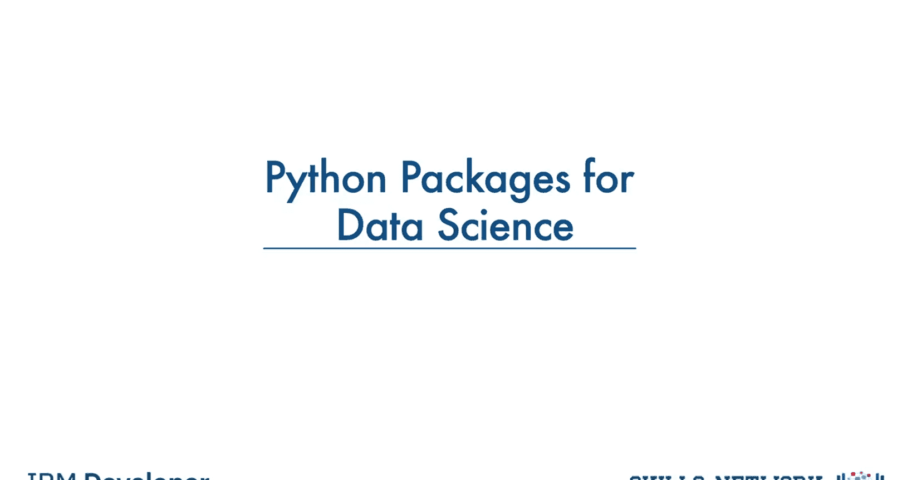
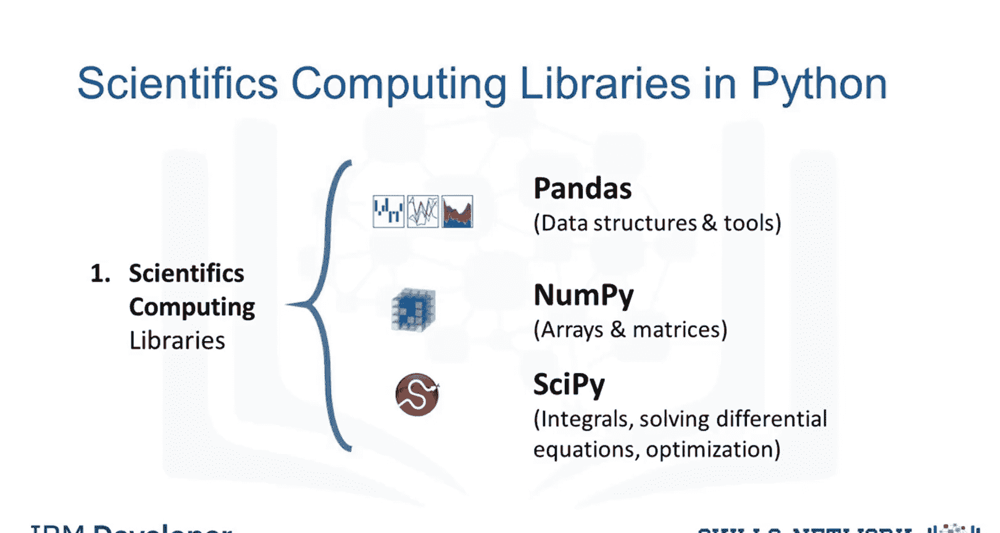
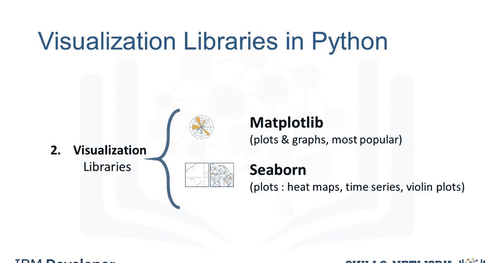
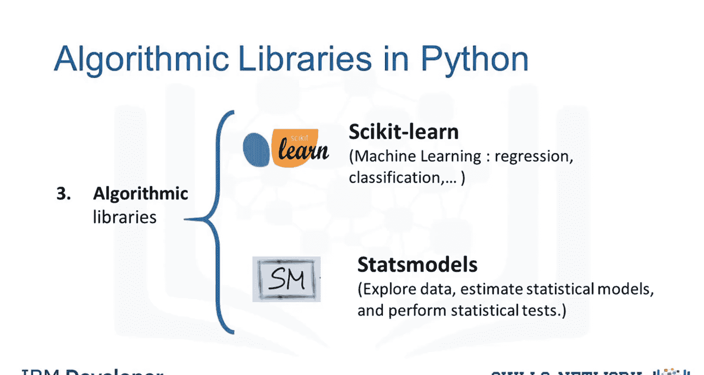

# 生成式人工智能工程：032：数据科学的Python包

在本节课中，我们将要学习在Python中进行数据分析所需的核心软件包。理解这些工具是构建数据科学和机器学习项目的基础。

## 概述：Python库简介

为了在Python中进行数据分析，我们首先需要了解与数据分析相关的主要软件包。

一个Python库是一个函数和方法的集合，它允许你执行大量操作而无需编写任何代码。这些库通常包含内置模块，提供不同的功能，你可以直接使用。有大量的库提供了广泛的功能。

我们将Python数据分析库分为三组。

## 科学计算库

上一节我们介绍了Python库的基本概念，本节中我们来看看第一组：科学计算库。这些库提供了处理数值数据和执行数学运算的核心功能。

以下是三个主要的科学计算库：

*   **Pandas**：提供用于高效数据操作和分析的数据结构和工具。它提供对结构化数据的访问。Pandas的主要工具是一个由列和行标签组成的二维表，称为**DataFrame**。它旨在提供简单的索引功能。
*   **NumPy**：使用数组作为其输入和输出。它可以扩展到矩阵对象，通过少量代码更改，开发人员就可以执行快速的数组处理。
*   **SciPy**：包含用于解决本幻灯片上列出的一些高级数学问题的函数，以及数据可视化功能。

## 数据可视化库

掌握了数据处理工具后，我们需要将分析结果有效地展示出来。使用数据可视化方法是与他人交流、展示有意义分析结果的最佳方式。这些库使你能够创建图形、图表和地图。

以下是两个核心的数据可视化库：

*   **Matplotlib**：是最著名的数据可视化库包。它非常适合制作图形和绘图。其图形也具有高度可定制性。
*   **Seaborn**：另一个高级可视化库，它基于Matplotlib。它可以非常轻松地生成各种图形，例如热图、时间序列图和小提琴图。

## 机器学习算法库

在能够处理和可视化数据之后，我们可以利用这些数据构建预测模型。通过机器学习算法，我们能够使用数据集开发模型并获得预测结果。算法库处理从基础到复杂的各种机器学习任务。

以下是两个重要的机器学习库：

*   **Scikit-learn**：包含用于统计建模的工具，包括回归、分类、聚类等。该库构建于NumPy、SciPy和Matplotlib之上。
*   **Statsmodels**：也是一个Python模块，允许用户探索数据、估计统计模型和执行统计检验。

## 总结

本节课中我们一起学习了在Python数据科学领域中至关重要的三组核心库。我们首先介绍了用于数据操作和数值计算的**科学计算库**，如Pandas、NumPy和SciPy。接着，我们探讨了用于将分析结果图形化的**数据可视化库**，包括Matplotlib和Seaborn。最后，我们了解了用于构建预测模型的**机器学习算法库**，主要是Scikit-learn和Statsmodels。掌握这些工具是进行有效数据分析和机器学习项目开发的第一步。