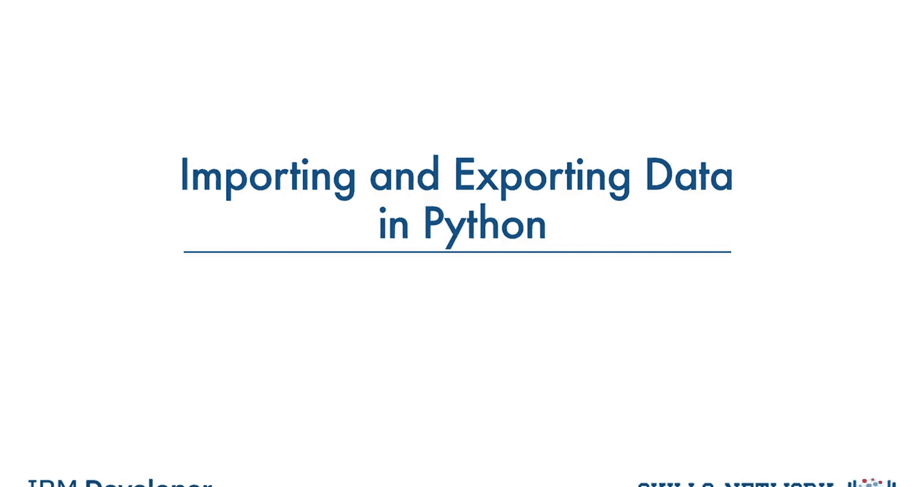
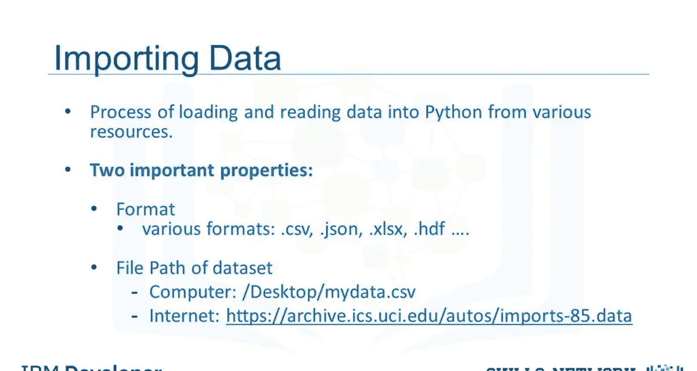
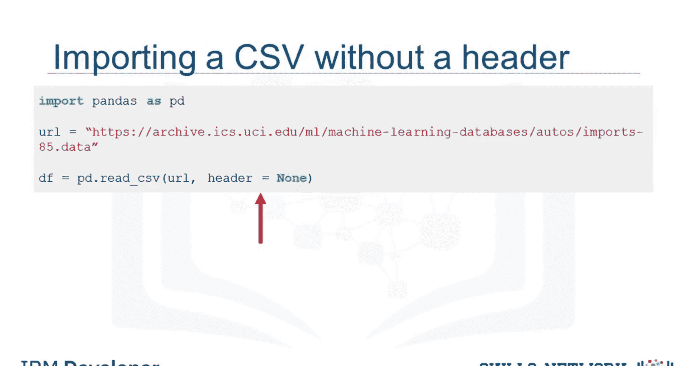
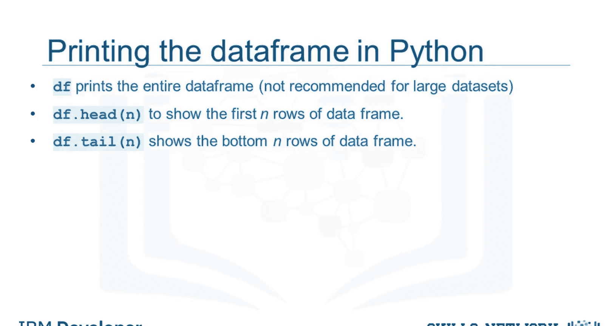
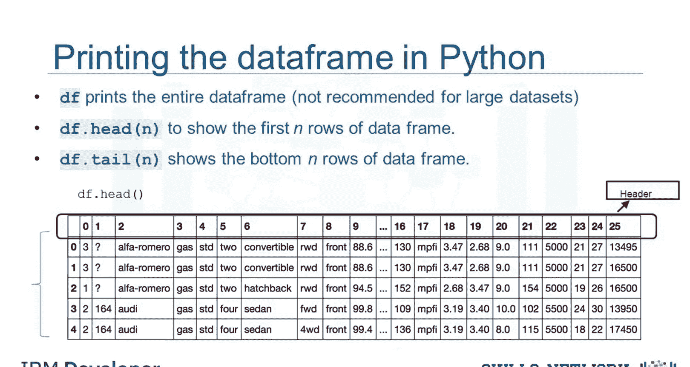
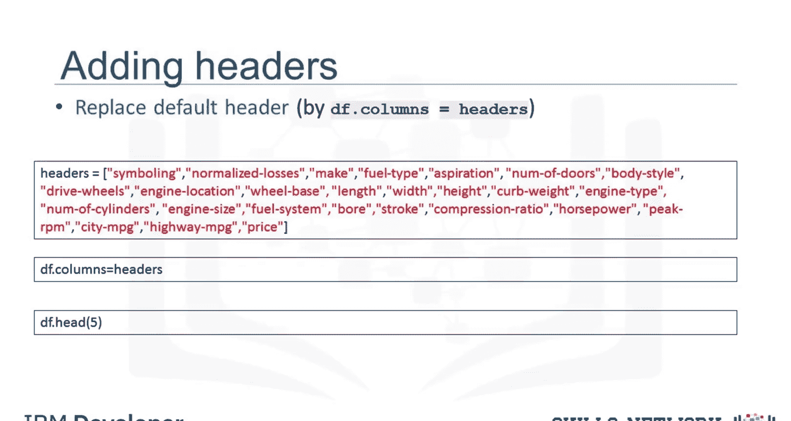
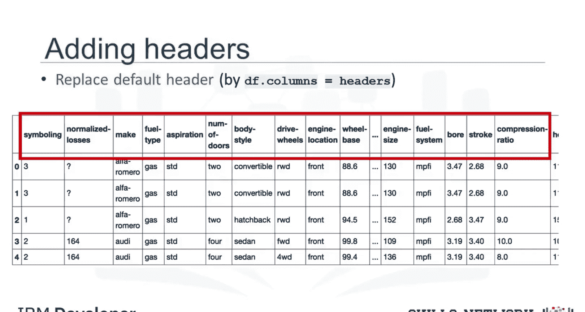
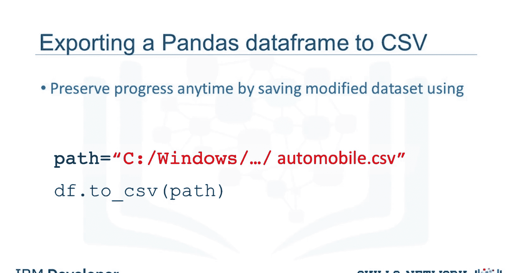
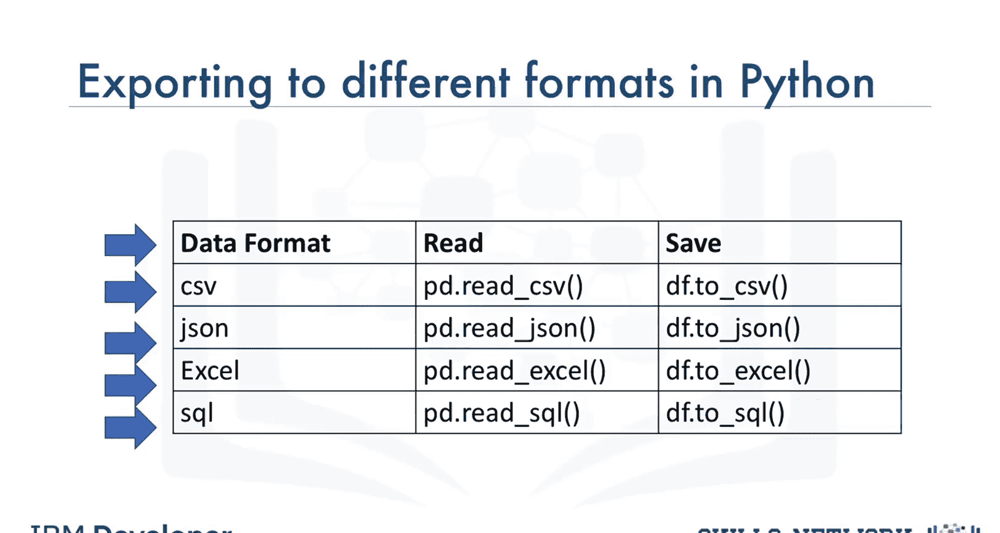

生成式人工智能工程：033：在Python中导入和导出数据 📊

在本节课中，我们将学习如何使用Python的Pandas包来读取数据。一旦数据被导入Python，我们就能执行所有后续需要的数据分析流程。

数据获取是一个从各种来源加载和读取数据到笔记本的过程。使用Python的Pandas包读取数据时，需要考虑两个重要因素：**格式**和**文件路径**。

*   **格式**指的是数据的编码方式。我们通常可以通过查看文件名的后缀来识别不同的编码方案。一些常见的格式包括CSV、JSON、XLSX、HDF等。
*   **路径**告诉我们数据存储的位置。数据通常存储在我们正在使用的计算机上，或者存储在互联网上。

在我们的案例中，我们从幻灯片上显示的网址获取了一个二手车数据集。当Jerry在网页浏览器中输入该网址时，他看到了类似下图的内容。

每一行代表一个数据点，每个数据点关联着大量属性。由于属性之间用逗号分隔，我们可以推测数据格式是**CSV**，即逗号分隔值。目前，这些只是数字，对人类来说意义不大。但一旦我们读入这些数据，就可以尝试理解它。

在Pandas中，`read_csv`方法可以将以逗号分隔列的文件读入一个Pandas数据框。

使用Pandas读取数据可以快速通过三行代码完成：
1.  导入pandas库。
2.  定义一个包含文件路径的变量。
3.  使用`read_csv`方法导入数据。

然而，`read_csv`默认假设数据包含表头。我们的二手车数据没有列标题，因此需要通过设置`header=None`来指定`read_csv`不分配表头。

读取数据集后，最好查看一下数据框，以获得更好的直观感受，并确保一切按预期进行。由于打印整个数据集可能耗时耗资源，为了节省时间，我们可以使用`dataframe.head()`来显示数据框的前N行。类似地，`dataframe.tail()`显示数据框的底部N行。

这里我们打印出了前五行数据。看起来数据集读取成功。我们可以看到，由于我们在读取数据时设置了`header=None`，Pandas自动将列标题设置为整数列表。

😊

然而，没有有意义的列名，处理数据框会很困难。我们可以在Pandas中分配列名。在我们当前的案例中，我们发现列名存储在一个单独的在线文件中。

我们首先将列名放入一个名为`headers`的列表中。然后，我们设置`df.columns = headers`，用这个列表替换默认的整数标题。如果我们使用上一张幻灯片介绍的`head`方法来检查数据集，会看到正确的标题已插入每列的顶部。

在某个时间点，当你对数据框进行操作后，你可能希望将Pandas数据框导出到一个新的CSV文件。

你可以使用`to_csv`方法来实现。为此，需要指定文件路径，其中包含你想要写入的文件名。例如，如果你想将数据框`df`保存为`automobile.csv`到你的计算机，可以使用语法`df.to_csv()`。

对于本课程，我们只读取和保存CSV文件。然而，Pandas也支持导入和导出大多数具有不同数据集格式的数据文件类型。读取和保存其他数据格式的代码语法与读取或保存CSV文件非常相似。下表显示了读取和保存不同格式文件的不同方法。

本节课中，我们一起学习了如何使用Pandas库在Python中导入和导出数据。我们了解了数据格式和路径的重要性，掌握了使用`read_csv`读取CSV文件（包括处理无表头数据）以及使用`head`/`tail`预览数据的基本方法。我们还学习了如何为数据框分配有意义的列名，以及如何使用`to_csv`方法将处理后的数据导出为新文件。最后，我们了解到Pandas支持多种数据格式，其操作方法类似，为后续的数据分析工作奠定了坚实的基础。