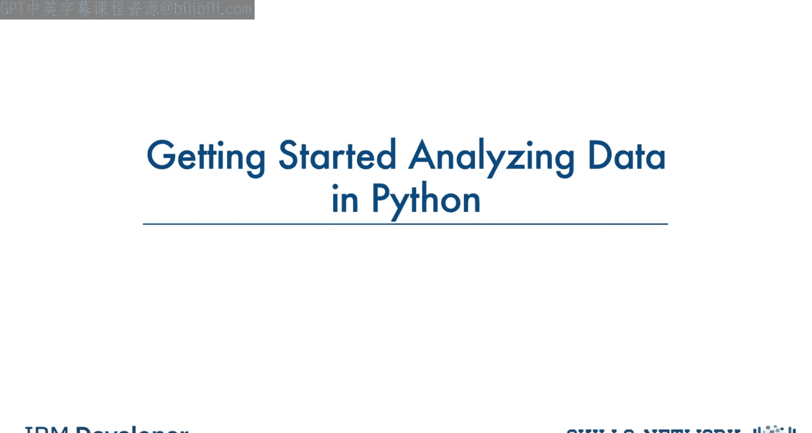
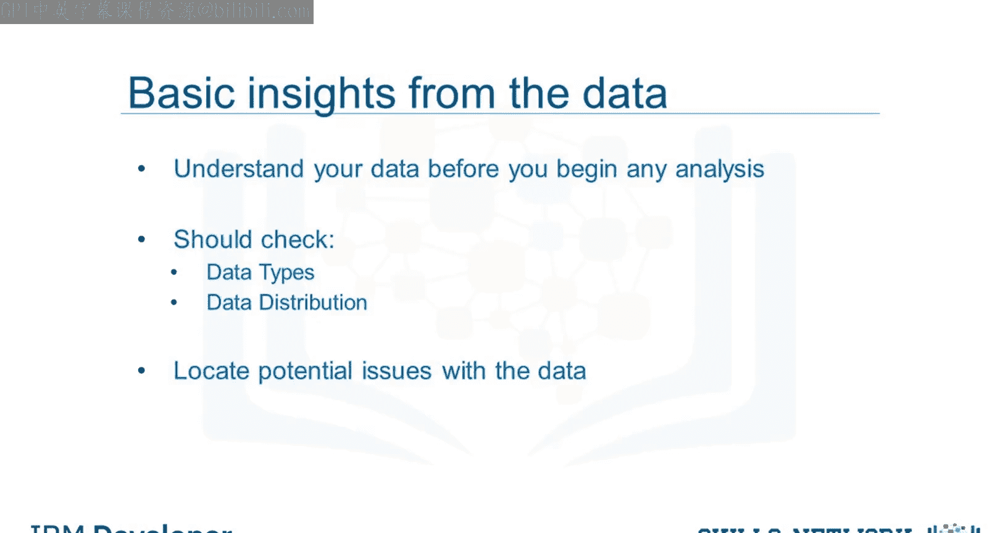
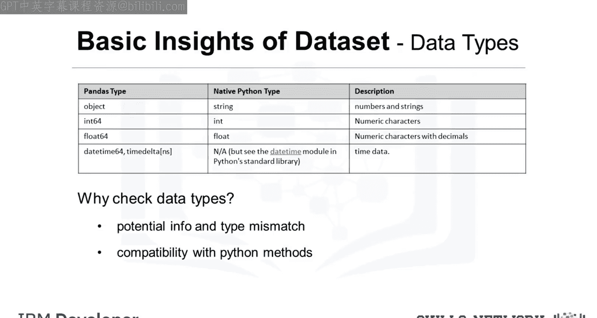
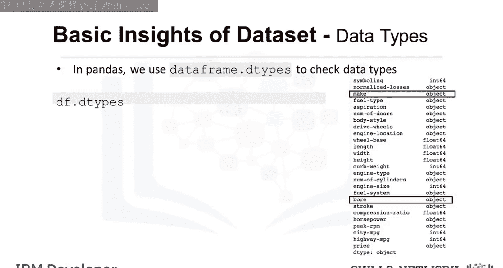
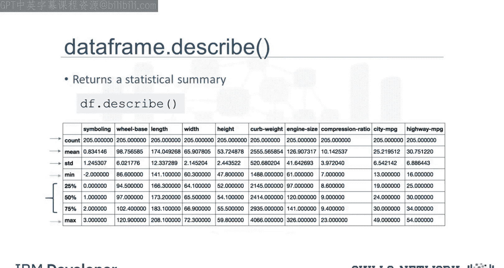
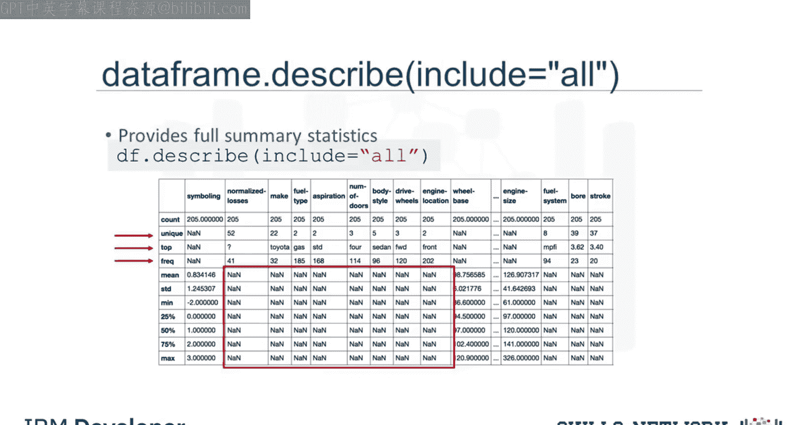
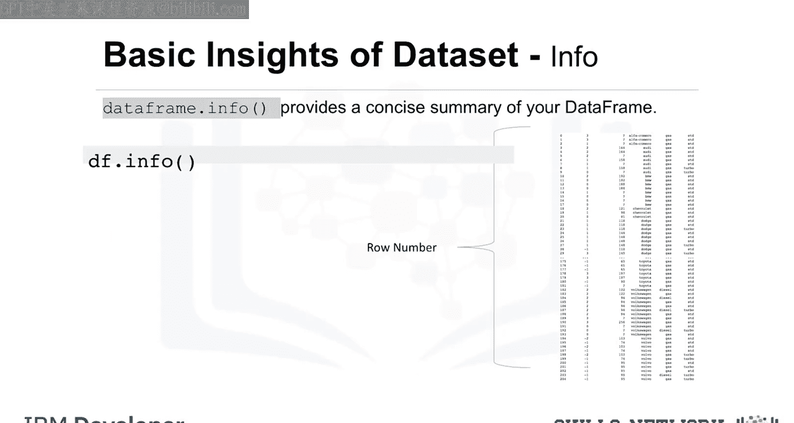

生成式人工智能工程：034：开始在Python中分析数据

在本节课中，我们将学习使用Python的Pandas库进行数据分析时，数据科学家和分析师必须掌握的一些基础方法。我们将重点介绍如何检查数据类型、获取数据集的统计摘要以及查看数据概览。

上一节我们介绍了数据加载，本节中我们来看看如何探索已加载的数据集。

Pandas内置了多种方法，可用于理解特征的数据类型或查看数据在数据集中的分布情况。使用这些方法可以获得数据集的概览，并指出潜在问题，例如特征的数据类型错误，这些问题可能需要在后续步骤中解决。

### 数据类型概述

数据有多种类型。Pandas中存储的主要类型是`object`、`float`、`int`和`datetime`。这些数据类型名称与原生Python中的名称略有不同。

以下是它们之间的差异和相似之处对比表：

*   一些类型非常相似，例如数值数据类型`int`和`float`。
*   Pandas的`object`类型功能类似于Python中的`string`，只是名称不同。
*   Pandas的`datetime`类型对于处理时间序列数据非常有用。

检查数据集中的数据类型主要有两个原因：

1.  Pandas会根据从原始数据表读取的文本自动分配类型。由于各种原因，这种分配可能不正确。例如，如果本应包含连续数值的汽车价格列被分配了`object`数据类型，这就会很棘手。将其更改为`float`类型会更自然。因此，Jerry可能需要手动将数据类型更改为`float`。
2.  它让有经验的数据科学家能够了解哪些Python函数可以应用于特定列。例如，某些数学函数只能应用于数值数据。如果将这些函数应用于非数值数据，可能会导致错误。

### 应用`.dtypes`方法

将`.dtypes`方法应用于数据集时，会返回一个Series，其中包含每列的数据类型。

一位优秀的数据科学家的直觉告诉我们，大多数数据类型是合理的。例如，汽车的品牌是名称，因此此信息应为`object`类型。但列表中的最后一个（bore）可能存在问题。由于bore是发动机的一个尺寸维度，我们应期望使用数值数据类型。然而，此处却使用了`object`类型。在后面的章节中，Jerry将必须纠正这些类型不匹配的问题。

### 使用`.describe()`方法获取统计摘要

现在，我们希望检查每列的统计摘要，以了解每列中数据的分布情况。

统计指标可以告诉数据科学家是否存在潜在的数学问题，例如极端异常值和大的偏差。数据科学家可能需要在后续处理这些问题。

要获取快速统计数据，我们使用`.describe()`方法。它返回列中的条目数（`count`）、列值的平均值（`mean`）、列标准偏差（`std`）、最大值和最小值，以及每个四分位数的边界。

默认情况下，`DataFrame.describe()`函数会跳过不包含数字的行和列。也可以让`describe`方法适用于`object`类型的列。

### 启用所有列的摘要

要启用所有列的摘要，我们可以在`describe()`函数括号内添加参数`include='all'`。

现在，结果显示所有26列的摘要，包括`object`类型的属性。我们看到，对于`object`类型的列，计算了一组不同的统计信息，例如`unique`、`top`和`freq`。

*   `unique`是列中不同对象的数量。
*   `top`是最常出现的对象。
*   `freq`是`top`对象在列中出现的次数。

表中的某些值显示为`NaN`，代表“Not a Number”。这是因为无法针对该特定列的数据类型计算该特定统计指标。

### 使用`.info()`方法检查数据集

您可以使用的另一个检查数据集的方法是`DataFrame.info()`函数。此函数显示数据框的前30行和后30行。

本节课中我们一起学习了使用Pandas进行初步数据分析的核心方法。我们了解了如何检查并理解数据集中的数据类型，如何使用`.describe()`方法获取数值和对象型数据的统计摘要，以及如何使用`.info()`方法快速查看数据框的概览。掌握这些方法是进行有效数据清洗和探索性分析的基础。