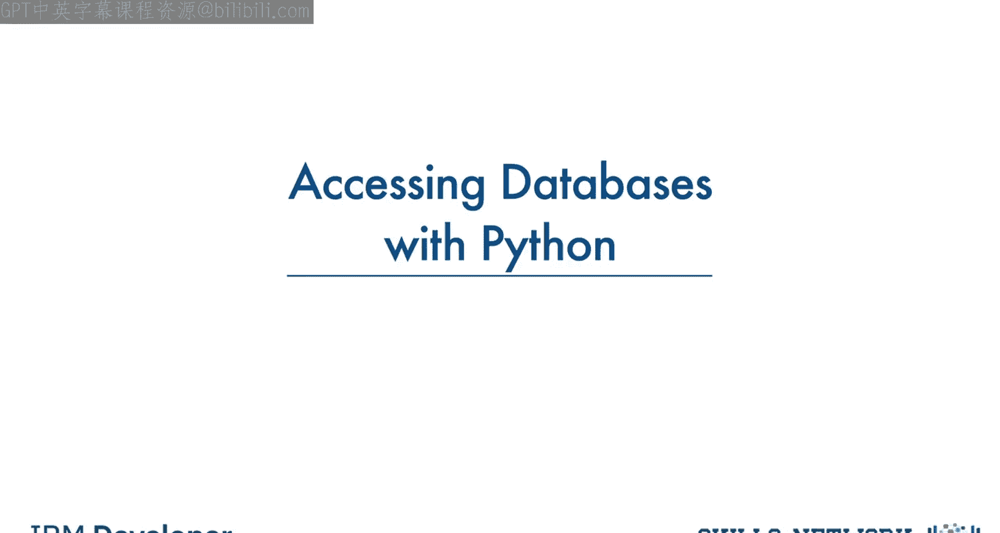
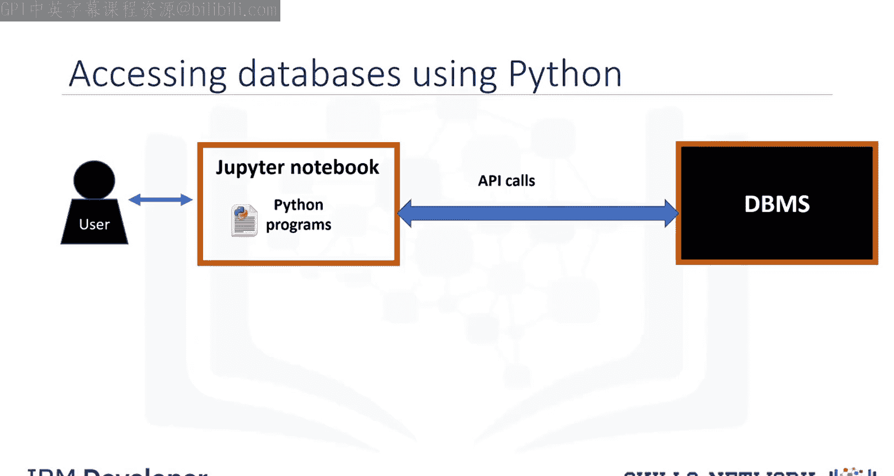
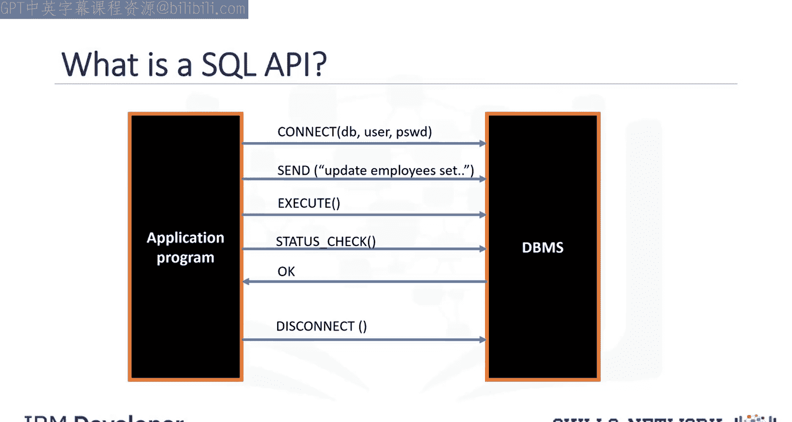
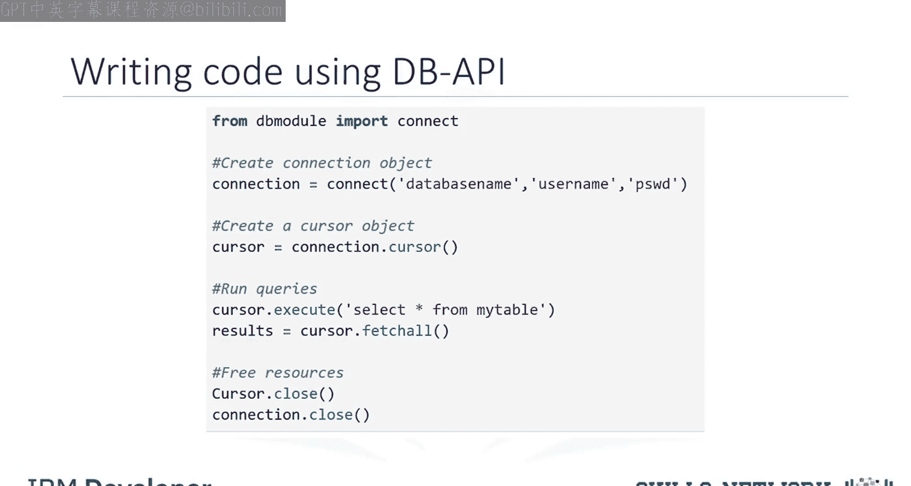

生成式人工智能工程：035：使用Python访问数据库

在本节课中，我们将学习如何使用Python编程语言来连接和操作数据库。数据库是数据科学家的重要工具，掌握Python访问数据库的技能对于处理和分析数据至关重要。

---



### 数据库访问的基本概念

上一节我们介绍了数据库的重要性，本节中我们来看看一个典型的用户如何通过Python代码访问数据库。

用户通常在基于Web的编辑器（如Jupyter Notebook）中编写Python代码。Python程序通过一种机制与数据库管理系统（DBMS）进行通信，这种机制就是调用应用程序编程接口（API）。




### 理解SQL API

SQL API是一组库函数调用，作为DBMS的应用程序编程接口。其基本工作原理如下图所示。

为了将SQL语句传递给DBMS，应用程序会调用API中的函数，并通过调用其他函数从DBMS检索查询结果和状态信息。


以下是SQL API的典型操作流程：
1.  应用程序通过一个或多个API调用开始数据库访问，这些调用将程序连接到DBMS。
2.  为了发送SQL语句，程序在缓冲区中将语句构建为文本字符串，然后进行API调用以将缓冲区内容传递给DBMS。
3.  应用程序进行API调用来检查其DBMS请求的状态并处理错误。
4.  应用程序通过一个API调用结束数据库访问，该调用会断开与数据库的连接。

### Python DB API简介



上一节我们了解了通用的SQL API，本节中我们来看看Python中专门的标准——DB API。

DB API是Python用于访问关系型数据库的标准API。它是一个**标准**，允许你编写一个能与多种关系型数据库协同工作的单一程序，而无需为每种数据库编写独立的程序。因此，如果你学会了DB API函数，就可以将这些知识应用于使用Python连接任何数据库。

Python DB API的两个核心概念是**连接对象**和**游标对象**。
*   **连接对象**用于连接到数据库并管理事务。
*   **游标对象**用于运行查询。你打开一个游标对象，然后运行查询。游标的工作方式类似于文本处理系统中的光标，你可以在结果集中向下滚动，并将数据获取到应用程序中。游标用于遍历数据库的查询结果。


以下是连接对象常用的方法：
*   `cursor()`: 返回一个使用该连接的新游标对象。
*   `commit()`: 用于将任何待处理的事务提交到数据库。
*   `rollback()`: 使数据库回滚到任何待处理事务的开始状态。
*   `close()`: 用于关闭数据库连接。

### 实践：使用DB API查询数据库

了解了核心概念后，让我们通过一个Python应用程序示例，一步步学习如何使用DB API来查询数据库。

1.  **导入数据库模块并建立连接**
    首先，从相应的数据库模块（如`sqlite3`、`pymysql`等）导入`connect`函数，并使用它来打开一个到数据库的连接。你需要向`connect()`函数传入数据库名称、用户名和密码等参数。该函数会返回一个**连接对象**。

    ```python
    import sqlite3  # 示例使用sqlite3模块
    connection = sqlite3.connect(‘example.db’)  # 连接到SQLite数据库文件
    ```

2.  **创建游标对象**
    接着，在连接对象上创建一个**游标对象**。这个游标将用于执行查询和获取结果。

    ```python
    cursor = connection.cursor()
    ```

3.  **执行查询并获取结果**
    使用游标对象的`execute()`方法来运行SQL查询语句。然后，可以使用如`fetchone()`、`fetchall()`等方法来获取查询结果。

    ```python
    cursor.execute(‘SELECT * FROM some_table’)
    results = cursor.fetchall()
    for row in results:
        print(row)
    ```

4.  **关闭连接**
    最后，当所有查询操作完成后，务必通过关闭连接来释放所有占用的资源。这是一个重要的好习惯，可以避免未使用的连接占用系统资源。

    ```python
    connection.close()
    ```

记住，始终关闭数据库连接非常重要，这可以避免未使用的连接占用资源。

---

### 总结

本节课中我们一起学习了如何使用Python访问数据库。我们首先了解了通过API连接数据库的基本概念，然后深入探讨了Python DB API标准及其两个核心对象：**连接对象**和**游标对象**。最后，我们通过一个简单的代码示例，实践了连接数据库、执行查询和关闭连接的完整流程。掌握这些基础知识是进行后续数据操作和分析的关键第一步。



