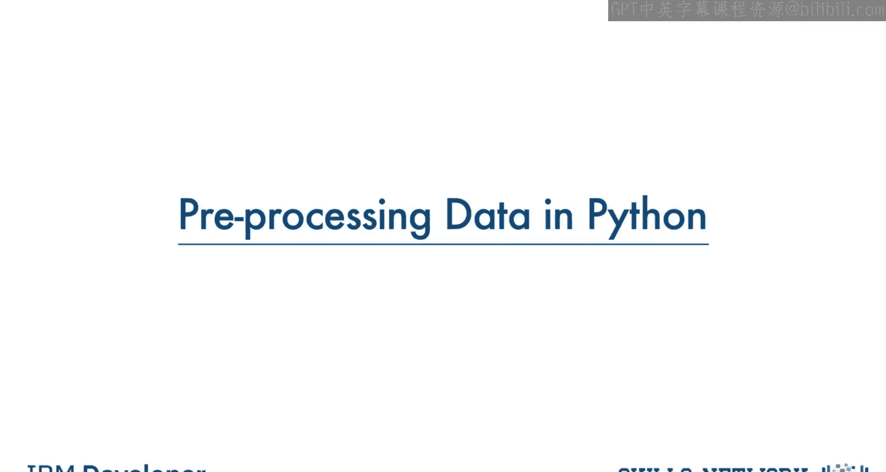
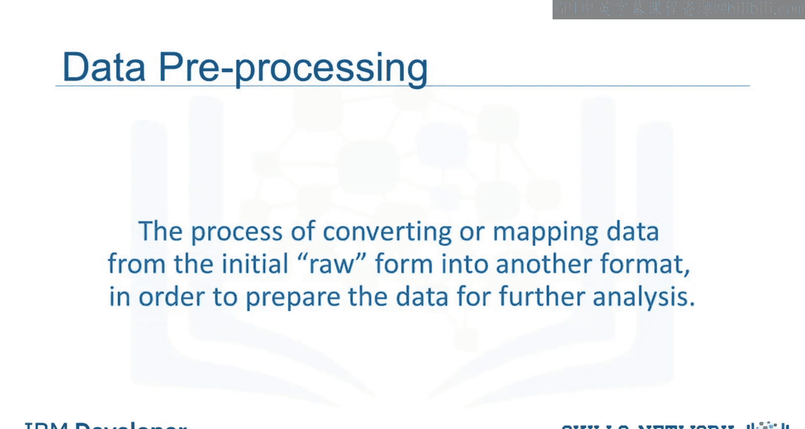
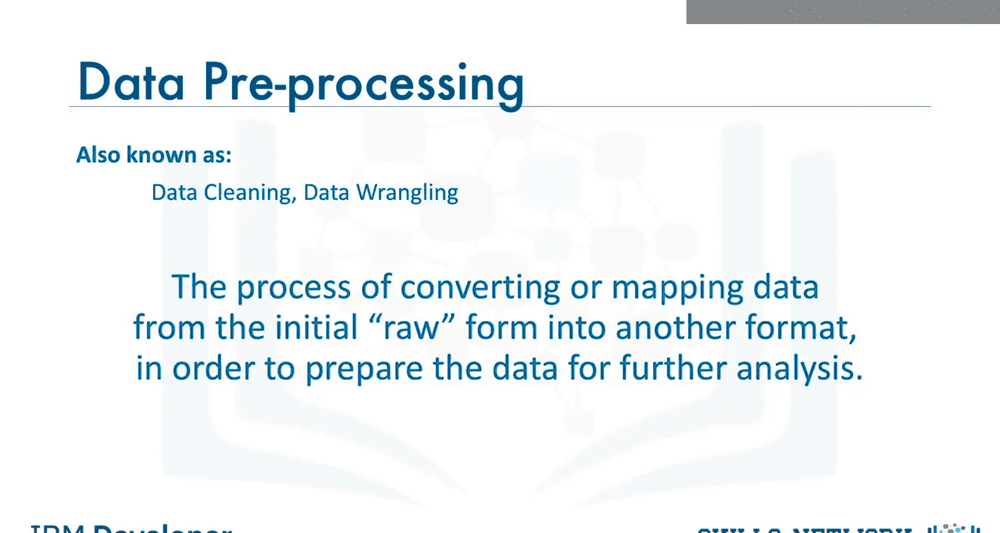
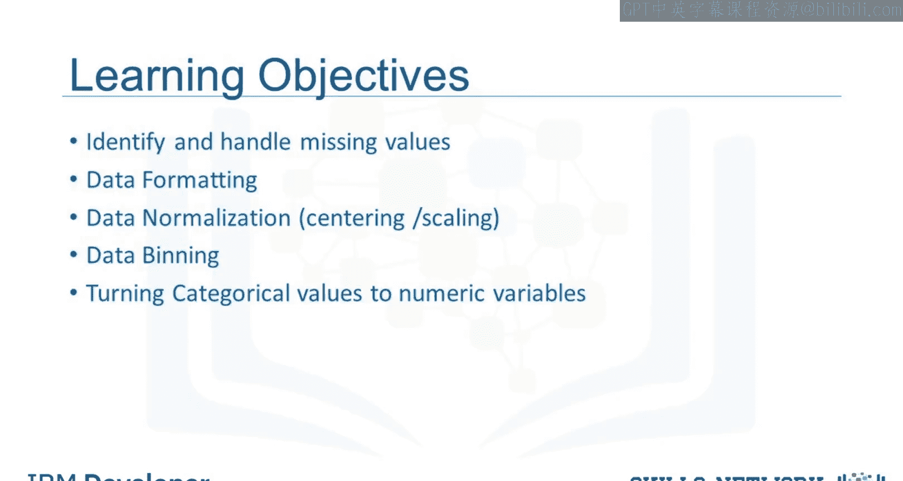
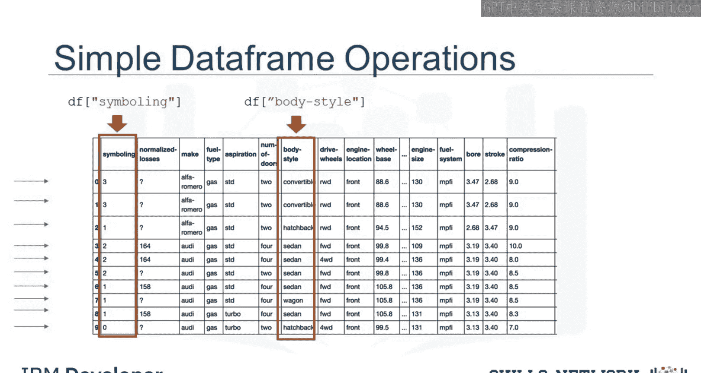
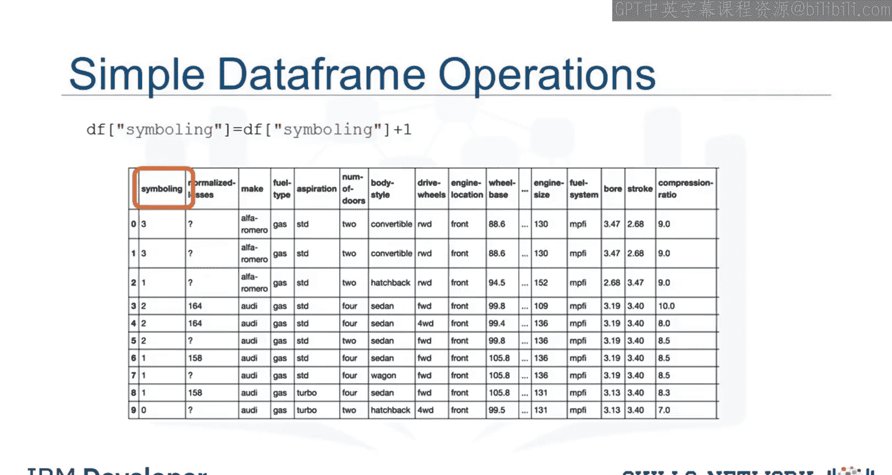

生成式人工智能工程：036：在Python中预处理数据 📊

在本节课中，我们将学习数据预处理技术。数据预处理是数据分析中必不可少的一步，它涉及将原始数据转换或映射为另一种格式，以便进行后续分析。这个过程也常被称为数据清洗或数据整理。

我们将涵盖以下主题：识别和处理缺失值、统一数据格式、数据归一化、数据分箱，以及将分类变量转换为数值变量。掌握这些技术能帮助你为机器学习模型准备更高质量的数据。

---

### 识别与处理缺失值 🧹

上一节我们介绍了数据预处理的基本概念。本节中，我们来看看如何处理数据中的缺失值。缺失值是指数据条目为空的情况，它会影响分析的准确性。

在Python的pandas库中，我们可以使用以下方法来处理缺失值：

*   **检测缺失值**：使用 `df.isnull()` 或 `df.isna()` 来识别数据框中的缺失值。
*   **删除缺失值**：使用 `df.dropna()` 删除包含缺失值的行或列。
*   **填充缺失值**：使用 `df.fillna()` 用特定值（如均值、中位数或众数）填充缺失值。

处理缺失值是数据清洗的第一步，为后续的统一格式工作打下基础。

---

### 统一数据格式 🔄

数据可能来自不同源头，因此格式、单位或惯例往往不统一。为了使数据具有可比性，我们需要将其标准化。

pandas提供了多种方法来统一数据格式：

*   **数据类型转换**：使用 `df[‘column’].astype(‘type’)` 转换列的数据类型，例如将字符串转换为数值。
*   **字符串操作**：使用 `.str` 访问器进行大小写转换、去除空格等操作，例如 `df[‘column’].str.lower()`。
*   **单位转换**：通过数学运算将数据列转换为统一的单位。

将数据格式标准化后，不同来源的数据才能被放在一起进行有效的比较和分析。

---

### 数据归一化：中心化与缩放 📏

不同数值型数据列的范围可能差异巨大，直接比较通常没有意义。归一化是一种将数据转换到相似范围的方法，以便进行更有意义的比较。

我们主要关注两种技术：

1.  **中心化**：使数据以零为中心。这通常通过减去均值来实现。
    *   **公式**：`X_centered = X - mean(X)`
2.  **缩放**：改变数据的范围。最常用的是**最小-最大缩放**和**标准化**。
    *   **最小-最大缩放公式**：`X_scaled = (X - min(X)) / (max(X) - min(X))`
    *   **标准化公式**：`X_standardized = (X - mean(X)) / std(X)`



在Python中，可以使用 `sklearn.preprocessing` 模块中的 `StandardScaler` 或 `MinMaxScaler` 轻松实现这些操作。



归一化处理后的数据，更适合许多机器学习算法的输入要求。



---

### 数据分箱 📦

数据分箱是将一组连续数值划分为更大范畴（即“箱”）的过程。它对于数据分组比较特别有用，也能在一定程度上平滑噪声。

以下是分箱的基本步骤：

*   **定义箱的边界**：可以等宽分箱（按值范围），也可以等频分箱（按样本数量）。
*   **对值进行分箱**：使用 `pandas.cut`（基于值范围）或 `pandas.qcut`（基于分位数）函数。
*   **使用箱标签**：可以用箱的序号或自定义的类别标签来代表原始值。

分箱可以将连续数据离散化，有时能揭示不同的数据分布模式。

---

### 转换分类变量为数值变量 🔢

许多统计模型要求输入是数值。因此，我们需要将分类变量（如“颜色”：红、蓝、绿）转换为数值形式。

常用的转换方法包括：

*   **标签编码**：为每个类别分配一个唯一的整数，例如 {‘红’:0， ‘蓝’:1， ‘绿’:2}。可使用 `sklearn.preprocessing.LabelEncoder`。
*   **独热编码**：为每个类别创建一个新的二进制列（0或1）。可使用 `pandas.get_dummies()` 或 `sklearn.preprocessing.OneHotEncoder`。

> **注意**：独热编码能避免模型误认为类别之间有顺序关系，但会增加数据维度。

完成分类变量的转换后，数据集就基本完成了数值化预处理，可以输入给模型进行训练了。



---

### Python pandas 数据框操作示例 💻

在Python中，我们通常按列进行操作。数据框的每一行代表一个样本（例如，数据库中的一辆二手车）。

你可以通过指定列名来访问某一列，例如访问 `symboling` 和 `body-style` 列。这些列都是pandas序列。



```python
# 访问列
symboling_column = df[‘symboling’]
body_style_column = df[‘body-style’]
```

Python中有许多操作数据框的方法。例如，要给某一列的每个条目都加上一个值（比如给所有 `symboling` 值加1），可以使用以下命令：

```python
# 修改列的值
df[‘symboling’] = df[‘symboling’] + 1
```

这个操作会将该数据框列中的每个当前值都增加1。

---

### 总结 🎯



本节课中，我们一起学习了数据预处理的核心技术。我们从**识别和处理缺失值**开始，确保了数据的完整性。接着，我们探讨了如何**统一不同来源的数据格式**，使其具有可比性。然后，我们深入讲解了**数据归一化**（包括中心化和缩放），使数值数据处于相似范围以便分析。此外，我们还介绍了**数据分箱**技术，用于将连续数据分组。最后，我们学习了如何将**分类变量转换为数值变量**，以满足统计模型的要求。这些步骤是构建高质量数据集、进行有效数据分析和机器学习建模的重要基础。