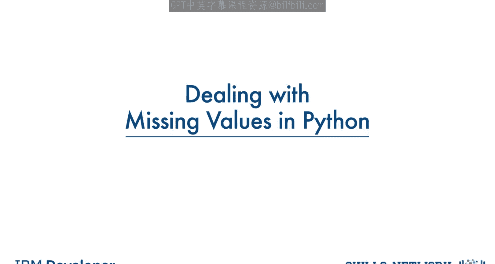
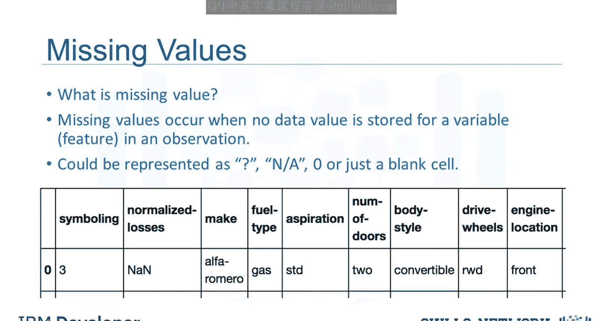
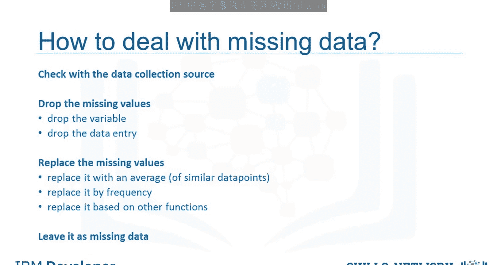
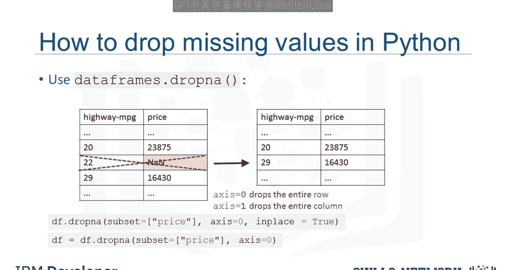
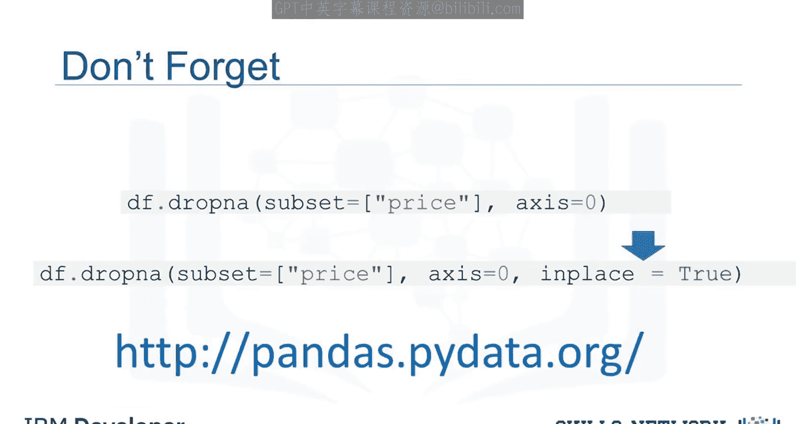
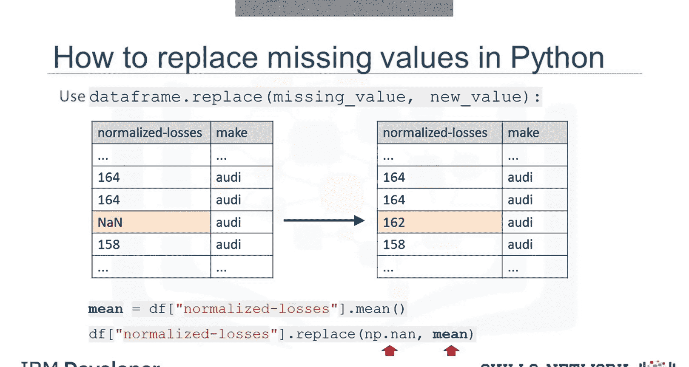
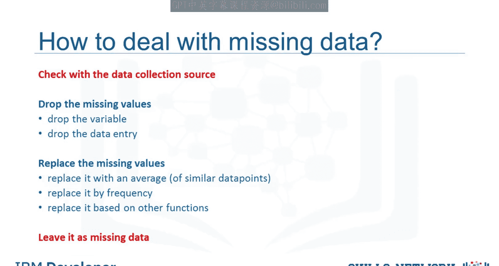

# 生成式人工智能工程：037：在Python中处理缺失值 📊

在本节课中，我们将介绍数据中普遍存在的缺失值问题，并学习当你在数据中遇到缺失值时可以采取的处理策略。



## 概述

缺失值是指针对某个特定观测样本，其某个特征没有存储数据值的情况。这通常会导致数据分析或机器学习模型训练出现问题。因此，正确处理缺失值是数据预处理的关键步骤。



## 什么是缺失值？

当某个观测样本的某个特征没有存储数据值时，我们就说这个特征存在缺失值。在数据集中，缺失值通常以问号、`NaN`（Not a Number）或空白单元格的形式出现。

例如，在下图所示的数据中，“normalized-losses”（标准化损失）特征就存在一个缺失值，它被表示为 `NaN`。


## 如何处理缺失数据？

处理缺失值的方法有很多，这与使用Python、R或其他工具无关。当然，每种情况都不同，应具体分析。以下是几种典型的处理选项：

以下是几种处理缺失数据的常见策略：

1.  **追溯原始数据**：联系数据收集者，尝试找回缺失的实际值。
2.  **删除数据**：直接移除包含缺失值的数据。删除时可以选择：
    *   删除整个变量（列）。
    *   仅删除包含缺失值的单个数据条目（行）。
    *   如果缺失数据的观测样本不多，通常删除特定条目是最佳选择。删除数据时，应选择对整体数据影响最小的方式。
3.  **替换数据**：用估算值填充缺失值。这种方法不会浪费数据，但由于是猜测，准确性较低。
    *   **平均值替换**：一种标准技术是用整个变量的平均值来替换缺失值。
        *   **公式**：`缺失值 ≈ 变量平均值`
        *   例如，假设“normalized-losses”列中部分条目缺失，而该列有数据的条目的平均值为4500。我们可以用4500来近似填充这些缺失值。
    *   **众数替换**：对于分类变量（如“fuel-type”燃油类型），由于值不是数字，无法计算平均值。此时，可以使用众数（即最常见的类别，如“gasoline”汽油）进行替换。
4.  **基于知识的估算**：有时数据收集者可能对缺失数据有额外了解，可以利用这些信息进行更合理的猜测。例如，他知道缺失值往往对应旧车，而旧车的标准化损失远高于平均水平。
5.  **保留缺失值**：在某些情况下，你可能选择简单地保留缺失值。出于某些原因，即使某些特征缺失，保留该观测样本也可能有用。


## 在Python中处理缺失值

上一节我们介绍了处理缺失值的通用策略，本节中我们来看看如何在Python中具体实现删除和替换操作。我们将使用Pandas库。

### 删除缺失值

要删除包含缺失值的数据，Pandas库提供了一个内置方法 `dropna()`。使用这个方法，你可以选择删除包含缺失值（如`NaN`）的行或列。

你需要指定参数：
*   `axis=0`：删除包含缺失值的**行**。
*   `axis=1`：删除包含缺失值的**列**。

**示例**：假设“price”（价格）列存在缺失值。由于在后续分析中，二手车价格是我们试图预测的目标，我们必须删除那些没有标价的行（即“price”为缺失值的行）。

这可以通过一行代码完成：



```python
dataframe.dropna(subset=[“price”], axis=0, inplace=True)
```

*   `subset=[“price”]`：指定只在“price”列检查缺失值。
*   `axis=0`：删除行。
*   `inplace=True`：这个参数非常重要，它允许修改直接作用于原数据集。将其设为`True`等同于将结果写回原DataFrame。

**重要提示**：如果不设置 `inplace=True`，原DataFrame不会被改变。例如 `dataframe.dropna()` 只会返回一个删除了缺失值的新DataFrame，而不改变原始数据。这是一种检查操作是否正确的好方法，但要实际修改数据，必须设置 `inplace=True`。



### 替换缺失值

要用实际值替换缺失值（如`NaN`），Pandas库提供了 `replace()` 方法，也可以用更专门的 `fillna()` 方法。它们可以用来用新计算的值填充缺失值。




**示例**：假设我们想用变量的**平均值**来替换“normalized-losses”变量的缺失值。

在Python中，步骤如下：

1.  首先计算该列的平均值。
2.  然后使用 `replace()` 或 `fillna()` 方法进行替换。

使用 `fillna()` 的代码示例：
```python
# 计算“normalized-losses”列的平均值（自动忽略NaN）
mean_value = dataframe[“normalized-losses”].mean()


# 用平均值填充该列的缺失值
dataframe[“normalized-losses”].fillna(mean_value, inplace=True)
```

使用 `replace()` 的代码示例（功能更通用，但用于填充NaN时 `fillna()` 更直观）：
```python
mean_value = dataframe[“normalized-losses”].mean()
dataframe.replace({“normalized-losses”: np.nan}, mean_value, inplace=True)
# 注意：此方法需要导入numpy (import numpy as np)
```

这是一种相对简化的替换方法。当然，还有其他技术，例如用**分组平均值**（而**非**整个数据集）来替换缺失值。



## 总结


本节课中，我们一起学习了在Python中处理缺失数据的两种主要方法：

1.  **删除**：使用 `dropna()` 方法删除包含缺失值的行或列。
2.  **替换**：使用 `fillna()` 或 `replace()` 方法，用平均值、众数或其他估算值来填充缺失值。

但请不要忘记处理缺失数据的其他途径。你始终可以尝试寻找更高质量的数据集或数据源。在某些情况下，保留缺失值本身也可能是合理的选择。选择哪种方法取决于你的具体数据、分析目标和领域知识。



