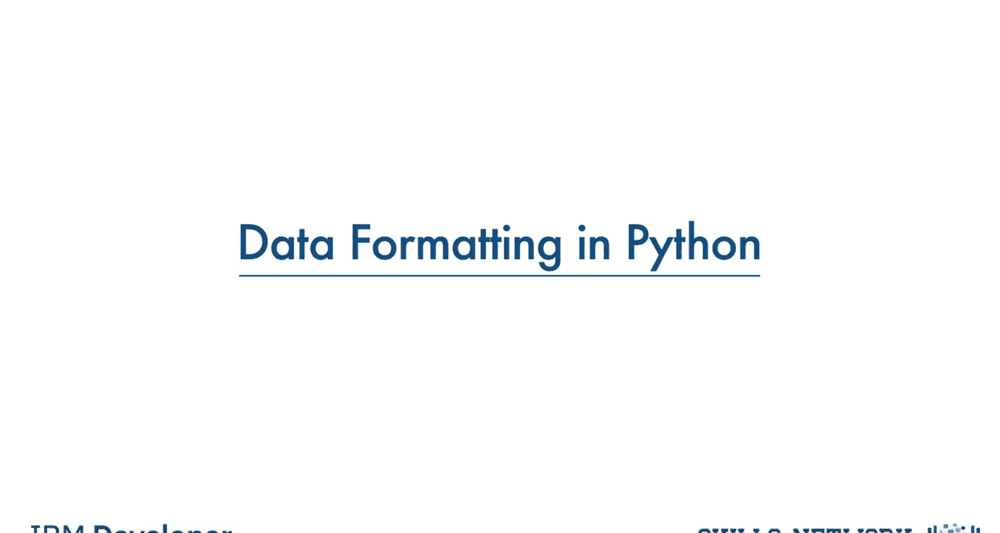
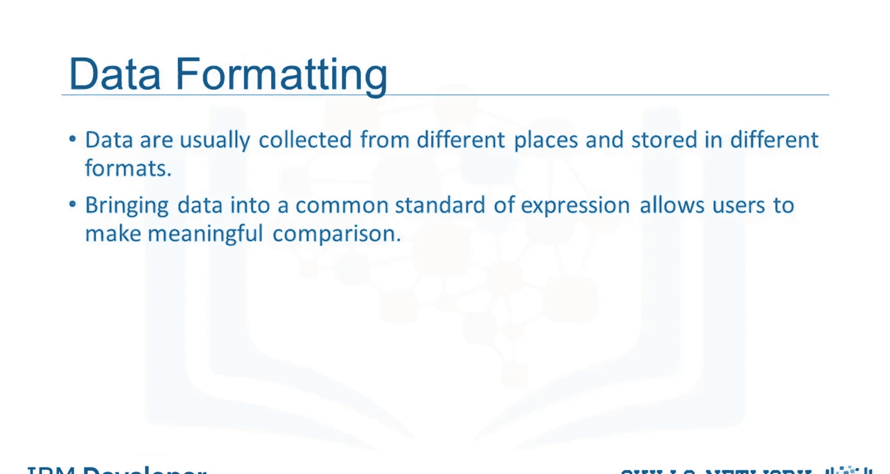
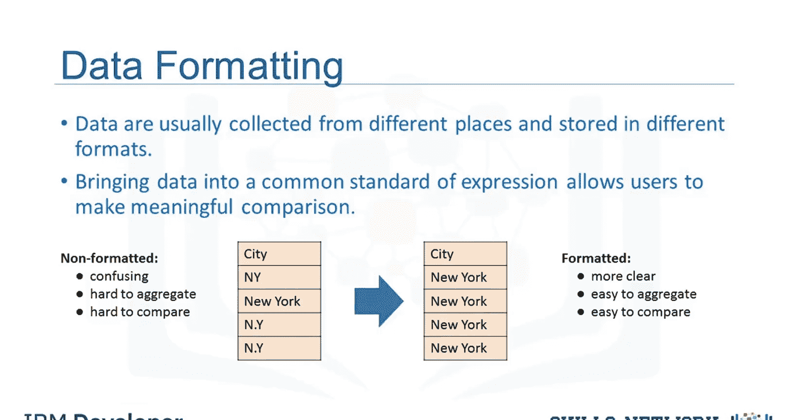
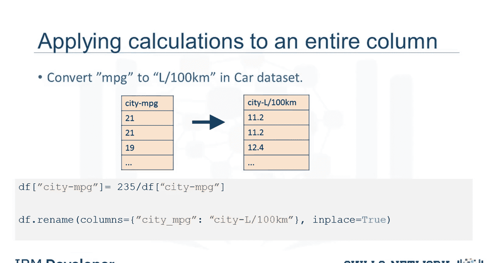
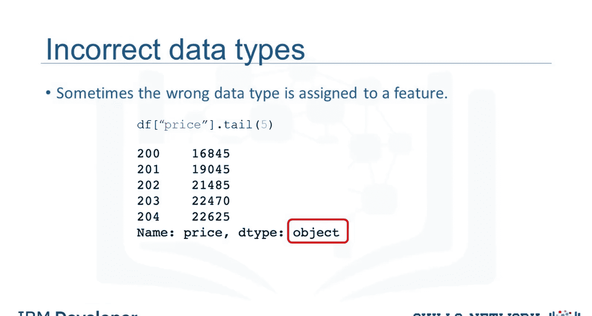
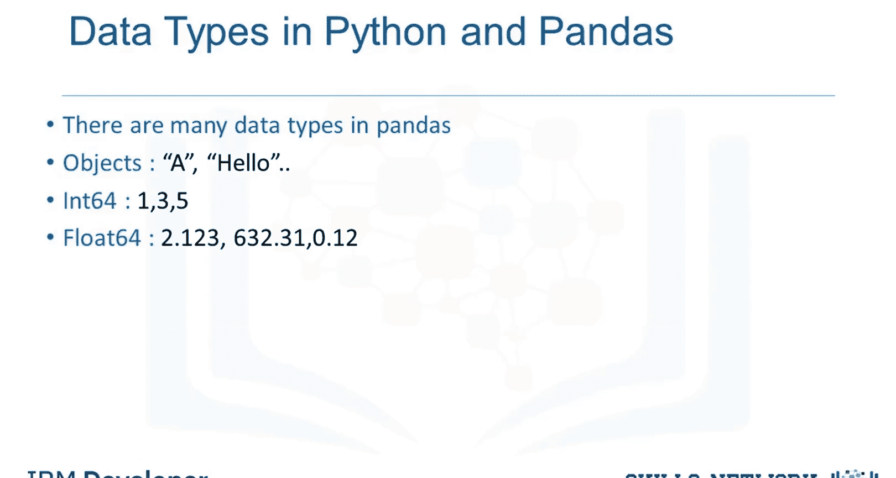
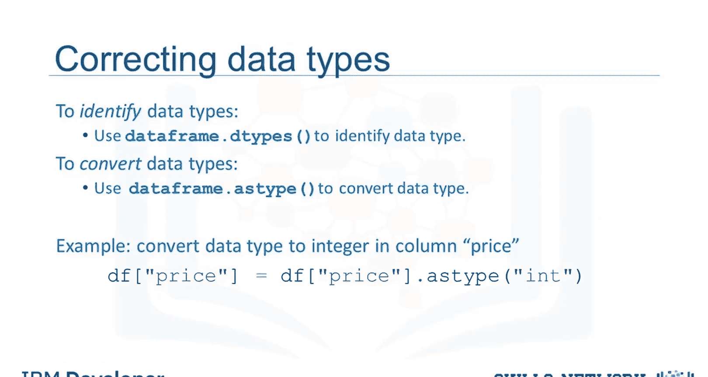

# 生成式人工智能工程：038：在Python中数据格式化 📊

在本节课中，我们将要学习如何处理不同格式、单位和约定的数据，并介绍Pandas库中帮助我们解决这些问题的相关方法。



数据通常由不同的人从不同的地方收集，可能以不同的格式存储。数据格式化意味着将数据带入一个通用的表达标准，使用户能够进行有意义的比较。作为数据集清洗的一部分，数据格式化确保数据一致且易于理解。

## 数据格式不一致的问题



上一节我们介绍了数据格式化的基本概念，本节中我们来看看一个具体的例子。

例如，人们可能使用不同的表达方式来代表纽约市，例如：`NEW YORK`、`New York`、`N.Y.`。有时，这种不干净的数据有其价值。例如，如果你想分析人们倾向于如何书写“纽约”，那么这正是你想要的数据。或者，如果你在寻找发现欺诈的方法，也许书写`N.Y.`比完整写出`New York`更可能预示着异常。但更多时候，我们只是希望将它们全部视为相同的实体或格式，以便于后续进行统计分析。

## 数据单位的转换

了解了数据表达不一致的问题后，我们来看看另一个常见问题：数据单位的转换。

以我们的二手车数据集为例，其中有一个名为“城市每加仑英里数”的特征，指的是汽车以每加仑英里为单位的油耗。然而，你可能生活在使用公制单位的国家，因此会希望将这些值转换为公制版本“升每100公里”。



要将“每加仑英里数”转换为“升每100公里”，我们需要用235除以“城市每加仑英里数”列中的每个值。

在Python中，这可以轻松地用一行代码完成。你取该列并将其设置为等于235除以整个列。在第二行代码中，使用数据框的`rename`方法将列名从“城市每加仑英里数”重命名为“城市升每100公里”。

以下是转换和重命名的代码示例：
```python
# 转换单位：从 MPG 到 L/100km
df['city-mpg'] = 235 / df['city-mpg']

# 重命名列
df.rename(columns={'city-mpg': 'city-L/100km'}, inplace=True)
```

## 数据类型的识别与转换

处理完单位问题，我们接下来探讨数据类型的处理。由于多种原因，包括将数据集导入Python时，数据类型可能会被错误地设置。

例如，这里我们注意到“价格”特征被分配的数据类型是`object`，尽管预期的数据类型应该是整数或浮点类型。

为了后续分析，探索特征的数据类型并将其转换为正确的类型非常重要。否则，后续开发的模型可能会表现异常，完全有效的数据最终可能被当作缺失数据处理。



Pandas中有许多数据类型。`object`可以是字母或单词，`int64`是整数，`float64`是实数。还有许多其他类型，我们在此不讨论。

以下是识别和转换数据类型的方法：
要识别Python中某个特征的数据类型，我们可以使用`DataFrame.dtypes`方法检查数据框中每个变量的数据类型。



如果数据类型错误，可以使用`DataFrame.astype`方法将数据类型从一种格式转换为另一种格式。例如，对“价格”列使用`astype('int')`，可以将`object`列转换为整数类型变量。



代码示例如下：
```python
# 检查数据类型
print(df.dtypes)

# 转换数据类型
df['price'] = df['price'].astype('int')
```

## 总结



本节课中我们一起学习了数据格式化的核心概念。我们探讨了数据表达不一致的问题，学习了如何使用Pandas进行数据单位的转换，并掌握了识别与修正错误数据类型的方法。这些步骤是数据清洗和预处理的关键环节，能确保数据质量，为后续的建模和分析打下坚实基础。