生成式人工智能工程：039：在Python中实现数据归一化 📊

在本节课中，我们将要学习数据预处理中的一项重要技术——数据归一化。我们将了解其重要性、常见方法，并通过Python代码示例展示如何实现。

## 概述

数据归一化是数据预处理的关键步骤，旨在将不同特征（变量）的数值范围调整到一致的尺度。这有助于确保在后续的统计分析和机器学习建模中，所有特征具有可比的影响力，避免因数值量级差异而引入的偏差。

## 为什么需要数据归一化？🤔

观察一个二手车数据集，我们发现特征“长度”的取值范围在150到250之间，而特征“宽度”和“高度”的取值范围则在50到100之间。为了让这些变量的取值范围保持一致，我们可能需要进行归一化。

这种归一化处理通过统一变量间的数值范围，可以使后续的统计分析更为简便。它确保了不同特征之间能够进行更公平的比较。

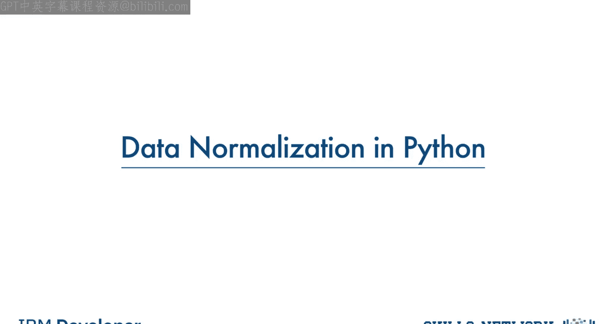

确保所有特征具有相同的影响力，这对于计算过程也至关重要。


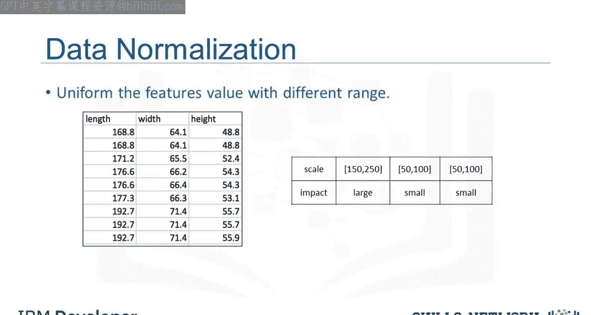

另一个例子能帮助你更好地理解归一化的重要性。考虑一个包含“年龄”和“收入”两个特征的数据集，其中年龄范围是0到100岁，而收入范围则是0到20，000及以上。


收入的值大约是年龄的1000倍，其范围可能在20，000到500，000之间。因此，这两个特征处于完全不同的数值量级。当我们进行进一步分析（例如线性回归）时，由于“收入”特征的数值更大，它本质上会对结果产生更大的影响。但这并不一定意味着它作为一个预测因子就更重要。

数据的这种特性会使线性回归模型偏向于更重视“收入”而非“年龄”。

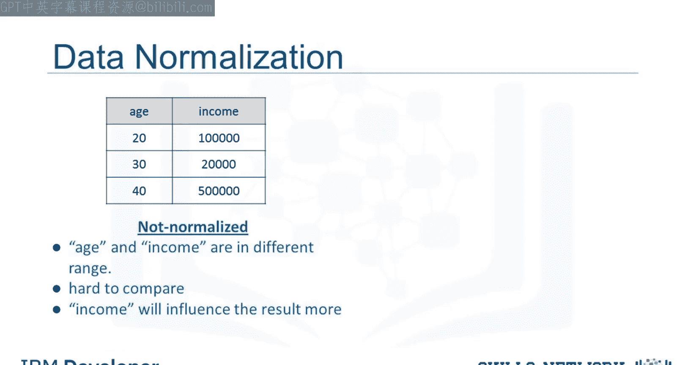

为了避免这种情况，我们可以将这两个变量归一化到0到1的范围内。比较右侧归一化后的两个表格，现在两个变量对我们后续要构建的模型具有相似的影响力。

## 数据归一化的主要方法 📝

有多种方法可以对数据进行归一化。以下将概述三种常用技术。

### 1. 简单特征缩放

第一种方法称为简单特征缩放，它将每个值除以该特征的最大值。

**公式：**
`X_new = X_old / X_max`

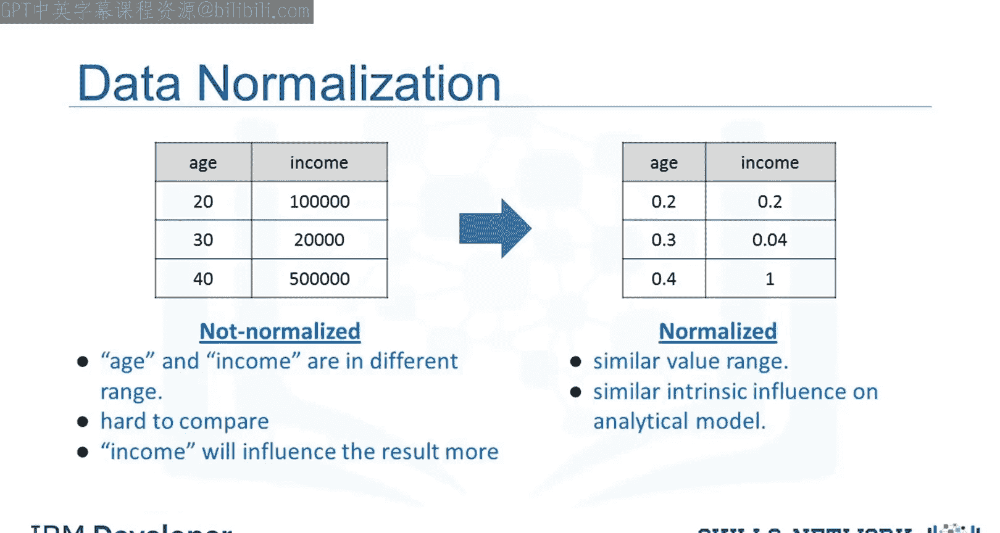


这使得新值的范围介于0和1之间。

### 2. 最小-最大归一化

第二种方法称为最小-最大归一化。对于每个原始值 `X_old`，减去该特征的最小值，然后除以该特征的范围（最大值减最小值）。

**公式：**
`X_new = (X_old - X_min) / (X_max - X_min)`

同样，得到的新值范围在0到1之间。

### 3. Z分数标准化


第三种方法是Z分数标准化（或标准分数）。在这个公式中，对于每个值，你减去该特征的平均值 `μ`，然后除以该特征的标准差 `σ`。

**公式：**
`X_new = (X_old - μ) / σ`

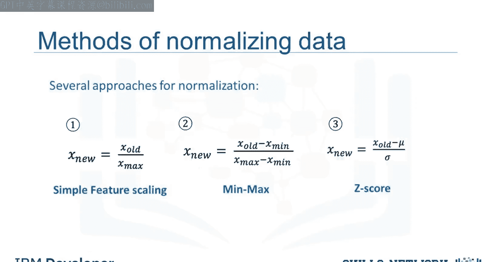

得到的值围绕0分布，通常范围在-3到+3之间，但也可能更高或更低。

## 在Python中实现归一化 💻

承接之前的例子，我们可以对“长度”特征应用归一化方法。

### 应用简单特征缩放

我们使用简单特征缩放方法，用pandas的 `.max()` 方法获取特征最大值，然后将每个值除以该最大值。


**代码示例：**
```python
df[‘length_normalized_simple‘] = df[‘length‘] / df[‘length‘].max()
```

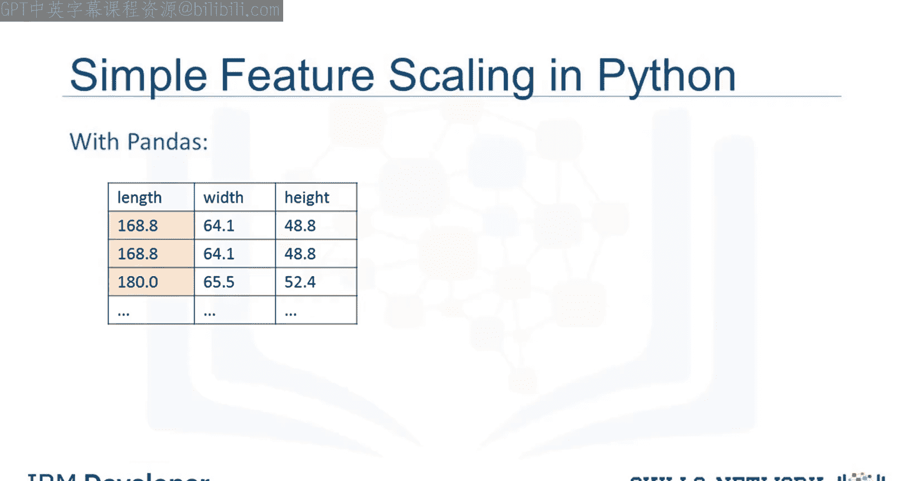
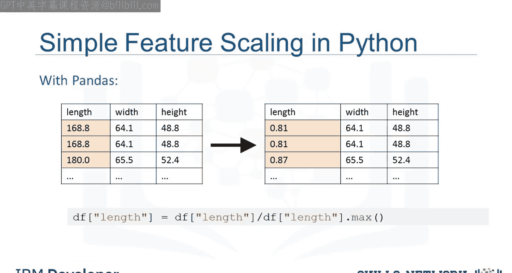

这只需一行代码即可完成。

### 应用最小-最大归一化


以下是对“长度”特征应用最小-最大方法。我们减去该列的最小值，然后除以其范围（最大值减最小值）。


**代码示例：**
```python
df[‘length_normalized_minmax‘] = (df[‘length‘] - df[‘length‘].min()) / (df[‘length‘].max() - df[‘length‘].min())
```

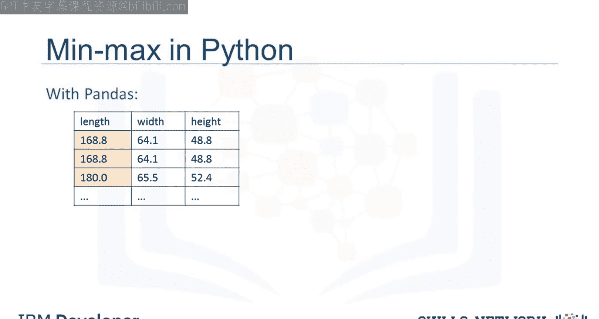
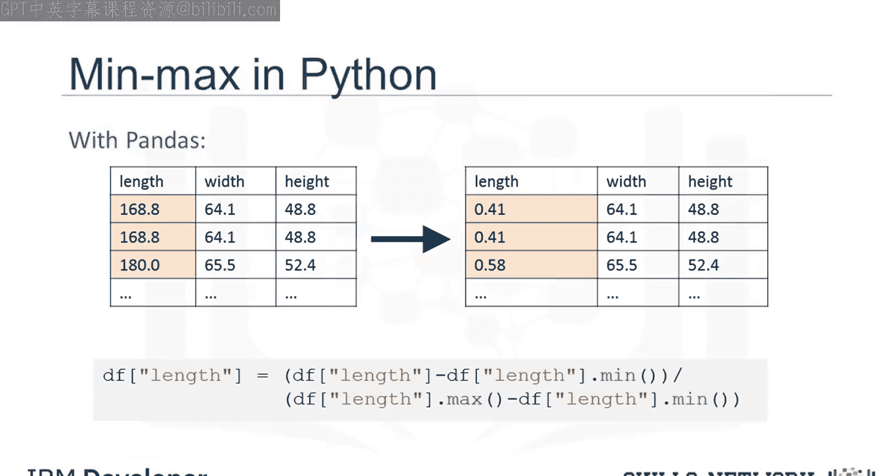

### 应用Z分数标准化


最后，我们对“长度”特征应用Z分数方法来归一化数值。这里，我们对长度特征应用 `.mean()` 和 `.std()` 方法。


**代码示例：**
```python
df[‘length_normalized_zscore‘] = (df[‘length‘] - df[‘length‘].mean()) / df[‘length‘].std()
```

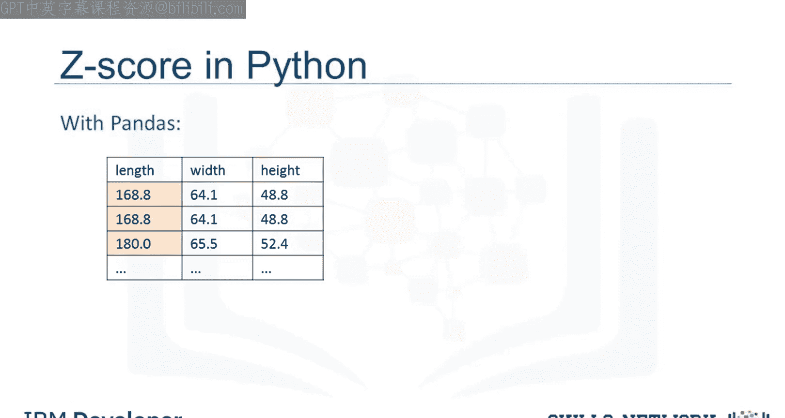


`.mean()` 方法将返回数据集中该特征的平均值，而 `.std()` 方法将返回数据集中该特征的标准差。

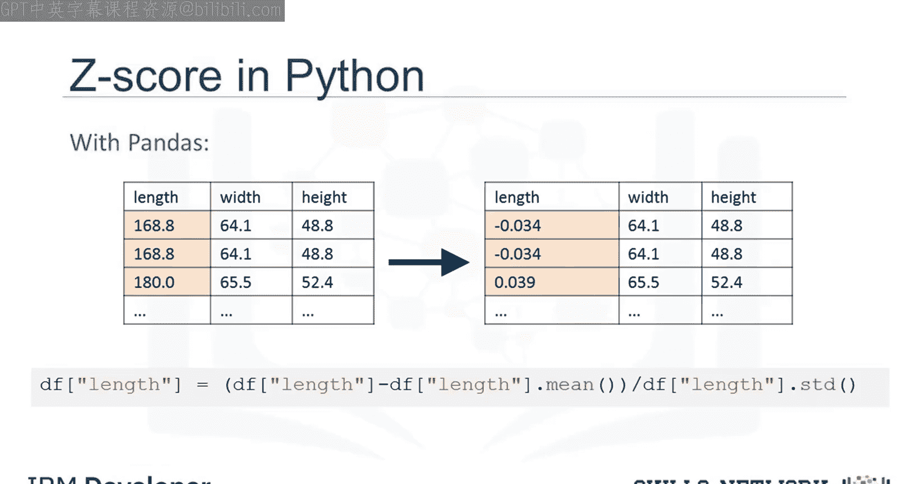

## 总结


本节课中，我们一起学习了数据归一化的核心概念。我们了解到，归一化通过将不同量级的特征调整到相近的尺度，可以消除因数值范围差异带来的模型偏差，确保特征间的公平比较。我们介绍了三种主要的归一化方法：**简单特征缩放**、**最小-最大归一化**和**Z分数标准化**，并分别给出了它们的数学公式。最后，我们使用Python的pandas库，通过具体的代码示例演示了如何对数据集中的“长度”特征应用这三种方法。掌握数据归一化是构建高效、准确机器学习模型的重要预处理步骤。