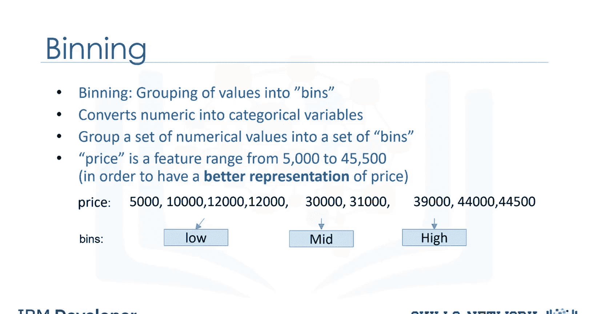
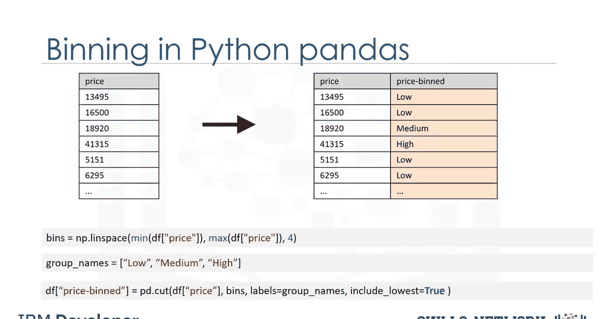
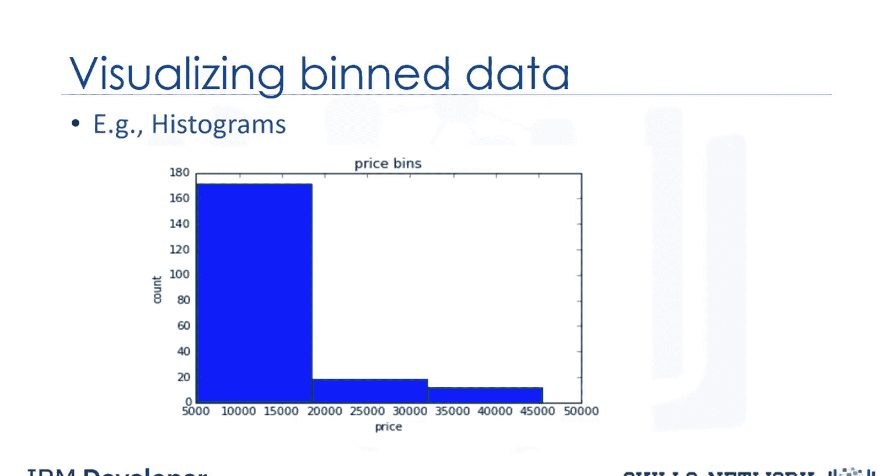

生成式人工智能工程：040：在Python中实现数据分箱

在本节课中，我们将学习数据预处理中的一种重要方法——分箱。我们将探讨分箱的概念、作用，并学习如何在Python中实现等宽分箱，最后通过可视化来观察分箱后的数据分布。

---

### 什么是分箱？

分箱是指将一系列数值分组到不同的“箱子”中的过程。例如，可以将年龄分为0-5岁、6-10岁、11-15岁等区间。

分箱有时能提高预测模型的准确性。此外，我们使用数据分箱将一组数值归入数量更少的箱子中，以便更好地理解数据分布。

---

### 分箱示例

以一个价格属性为例，其范围从5000到45500。通过分箱，我们将价格分为三个类别：低价、中价和高价。



在实际的汽车数据集中，价格是一个数值变量，范围从5188到45400，共有201个不同的值。我们可以将它们分为三个箱子：低价车、中价车和高价车。


---

### 在Python中实现分箱

在Python中，我们可以轻松实现分箱。我们希望创建三个等宽的箱子，因此需要四个等间距的数字作为分隔点。

首先，我们使用NumPy的`linspace`函数来生成一个数组`bins`，该数组包含在指定价格区间内均匀分布的四个数字。

```python
import numpy as np
import pandas as pd

# 假设 price_data 是包含价格的数据列
max_price = price_data.max()
min_price = price_data.min()
bins = np.linspace(min_price, max_price, 4)
```

接着，我们创建一个列表`group_names`，其中包含不同箱子的名称。

```python
group_names = [‘Low‘, ‘Medium‘, ‘High‘]
```

然后，我们使用Pandas的`cut`函数将数据值分段并排序到各个箱子中。

```python
price_data_binned = pd.cut(price_data, bins, labels=group_names, include_lowest=True)
```



---


### 可视化分箱结果

分箱完成后，你可以使用直方图来可视化数据在分箱后的分布情况。

以下是我们根据应用于价格特征的分箱结果绘制的直方图。从图中可以清楚地看出，大多数汽车属于低价类别，只有极少数汽车属于高价类别。



---

### 总结


本节课中，我们一起学习了数据分箱的概念及其在数据预处理中的作用。我们通过一个具体的价格分箱示例，演示了如何在Python中使用NumPy和Pandas库实现等宽分箱，并利用直方图对分箱结果进行了可视化分析。掌握分箱技术有助于你更好地理解和处理连续型数据。