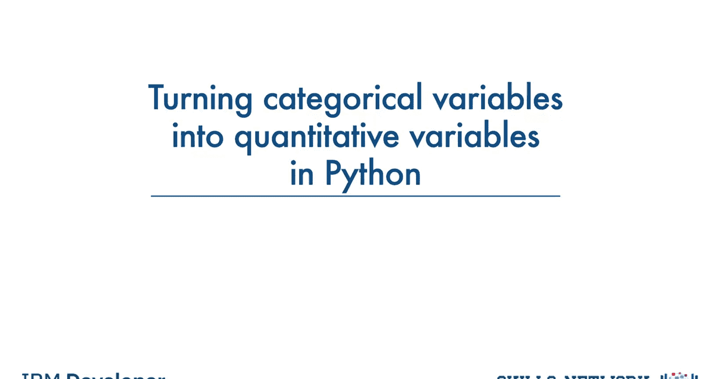
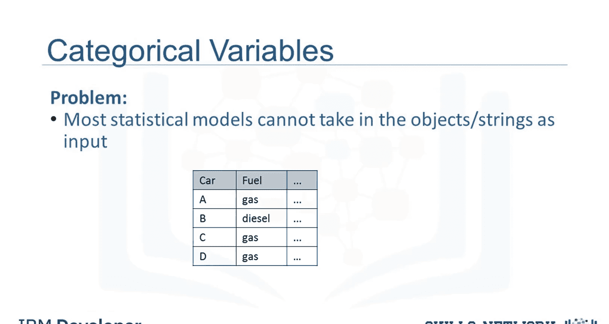
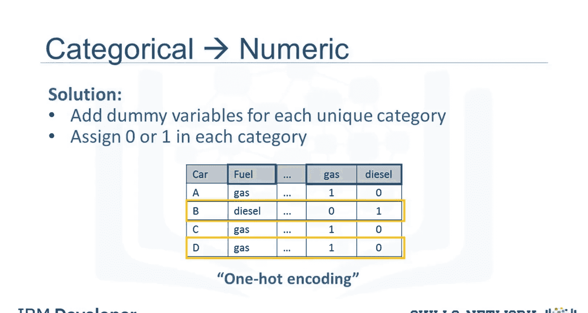
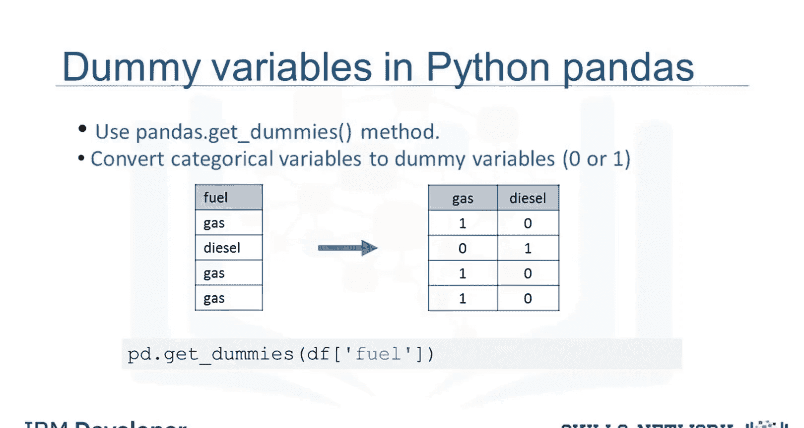

生成式人工智能工程：041：在Python中将分类变量转换为定量变量 🧮

在本节课中，我们将学习如何在Python中将分类变量转换为定量变量。这是数据预处理中的一个关键步骤，因为大多数统计模型和机器学习算法只能处理数值型数据。



## 为什么需要转换？

上一节我们介绍了数据预处理的重要性，本节中我们来看看一个具体问题：分类变量的处理。

大多数统计模型无法将对象或字符串作为输入进行模型训练，它们只能接受数字作为输入。在汽车数据集中，“燃料类型”这个特征是一个分类变量，它有两个值：“汽油”或“柴油”，它们都是字符串格式。为了进行进一步的分析，Jerry必须将这些变量转换为某种数字格式。



## 什么是独热编码？

为了解决上述问题，我们引入一种称为“独热编码”的技术。

我们通过为原始特征中每个唯一的元素添加新的特征来进行编码。在“燃料类型”这个特征有两个唯一值（“汽油”和“柴油”）的情况下，我们创建两个新特征：“汽油”和“柴油”。当某个值在原始特征中出现时，我们在新特征中将对应的值设为1，其余特征则设为0。

以下是具体示例：
*   对于汽车B，燃料值是“柴油”。因此，我们将“柴油”特征设为1，“汽油”特征设为0。
*   对于汽车D，燃料值是“汽油”。因此，我们将“汽油”特征设为1，“柴油”特征设为0。

## 在Pandas中实现转换

在Python中，使用Pandas库将分类变量转换为虚拟变量非常简单。

我们可以使用 `get_dummies()` 方法。该方法会自动生成一组数字，每个数字对应变量的一个特定类别。



以下是具体操作步骤：
1.  导入Pandas库。
2.  加载包含分类变量的数据集。
3.  对目标列（例如“燃料类型”）应用 `pd.get_dummies()` 方法。

示例代码如下：
```python
import pandas as pd

# 假设 df 是包含‘fuel_type’列的DataFrame
dummy_variables_df = pd.get_dummies(df['fuel_type'])
```
执行上述代码后，`dummy_variables_df` 将是一个新的DataFrame，其中包含像“fuel_type_gas”和“fuel_type_diesel”这样的列，每列的值由0和1组成。

## 总结



本节课中我们一起学习了数据预处理的关键一步：将分类变量转换为定量变量。我们了解到，由于机器学习模型需要数值输入，因此必须进行这种转换。我们重点介绍了“独热编码”的原理，并演示了如何使用Pandas的 `get_dummies()` 方法在Python中轻松实现这一转换。掌握这项技能是构建有效AI模型的重要基础。