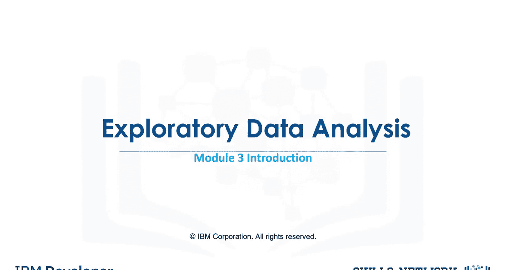
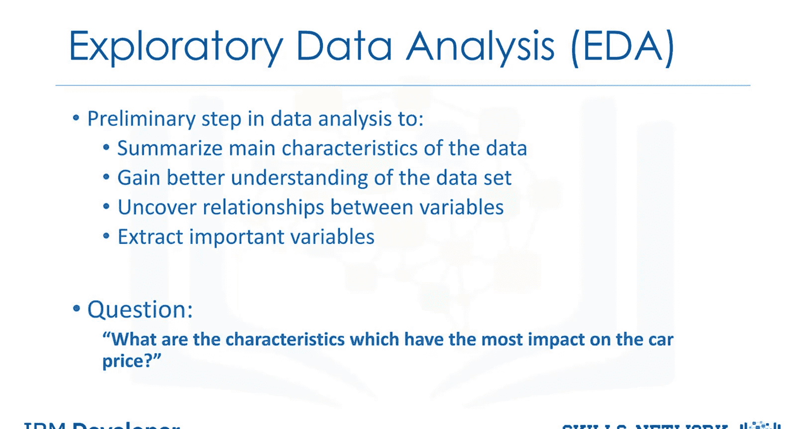
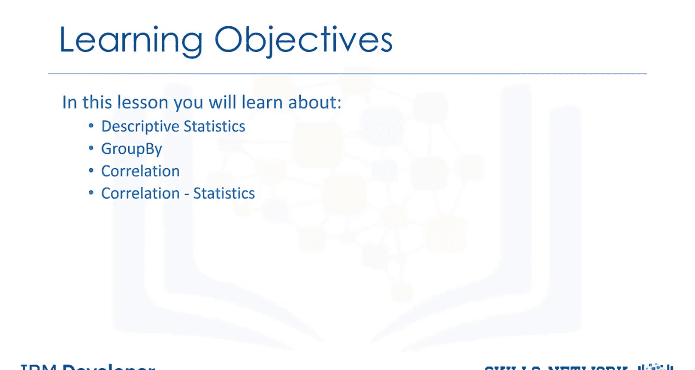

# 生成式人工智能工程：042：探索性数据分析

在本节课中，我们将学习如何使用Python进行探索性数据分析的基础知识。

探索性数据分析，简称EDA，是一种分析数据的方法，旨在总结数据的主要特征、更好地理解数据集、揭示不同变量之间的关系，并为我们试图解决的问题提取重要变量。

本模块试图回答的核心问题是：哪些特征对汽车价格的影响最大？我们将通过几种不同的、有用的探索性数据分析技术来回答这个问题。

在本模块中，你将学习描述性统计，它描述数据集的基本特征，并获取样本和数据的简要摘要。你将学习使用`group by`进行数据分组的基础知识，以及这如何帮助转换我们的数据集。你将学习不同变量之间的相关性。最后，你将学习高级相关性分析，我们将向你介绍各种相关性统计方法，即皮尔逊相关性和相关性热图。



---

## 描述性统计 📊

上一节我们介绍了EDA的目标，本节中我们来看看描述性统计。描述性统计用于总结和描述数据集的基本特征，它提供关于数据集中趋势、离散度和分布的快速概览。

以下是常用的描述性统计方法：

*   **均值**：所有数据点的平均值。公式为：`mean = sum(x) / n`
*   **中位数**：将数据集按大小排序后位于中间的值。
*   **众数**：数据集中出现频率最高的值。
*   **标准差**：衡量数据点相对于均值的离散程度。公式为：`std = sqrt( sum( (x - mean)^2 ) / (n-1) )`
*   **分位数**：将数据划分为相等部分的值，例如四分位数。

在Python中，我们可以使用Pandas库轻松计算这些统计量。

```python
import pandas as pd
# 假设df是一个Pandas DataFrame
summary = df.describe()
print(summary)
```

---

## 数据分组 🔍

了解了数据的整体特征后，我们常常需要按特定类别对数据进行分组分析。`group by`操作是数据分析中一个强大的工具，它允许我们根据一个或多个键将数据拆分成组，然后对每个组应用聚合函数。

以下是`group by`的常见用途：

*   按类别计算汇总统计量（如不同品牌汽车的平均价格）。
*   执行组内转换或过滤。
*   将数据重塑为更易于分析的格式。

在Pandas中，`groupby()`方法结合聚合函数（如`mean()`、`sum()`、`count()`）可以实现此功能。

```python
# 按‘brand’列分组，并计算‘price’列的平均值
grouped_data = df.groupby(['brand'])['price'].mean()
print(grouped_data)
```

---

## 变量相关性分析 🔗



上一节我们学会了如何分组观察数据，本节中我们来看看变量之间的关系。相关性分析用于衡量两个变量之间线性关系的强度和方向。理解相关性有助于我们识别哪些特征可能与目标变量（如汽车价格）密切相关。

相关性系数通常在-1到1之间：
*   **1** 表示完全正相关。
*   **-1** 表示完全负相关。
*   **0** 表示没有线性相关性。

在Python中，我们可以使用Pandas计算数据框中所有数值列之间的相关性矩阵。

```python
# 计算相关性矩阵
correlation_matrix = df.corr()
print(correlation_matrix)
```

---

## 高级相关性分析：方法与可视化 🧮

基础的相关系数矩阵提供了大量信息，但通过统计方法和可视化技术可以更深入地理解相关性。我们将介绍皮尔逊相关系数和相关性热图。

皮尔逊相关系数衡量两个连续变量之间的线性相关性。其公式为：
`r = cov(X, Y) / (σ_X * σ_Y)`
其中，`cov`是协方差，`σ`是标准差。

相关性热图是一种使用颜色编码矩阵来可视化相关性矩阵的有效方法，可以快速识别强相关或弱相关的变量对。

以下是创建相关性热图的步骤：

1.  使用`df.corr()`计算皮尔逊相关性矩阵。
2.  使用`seaborn`库的`heatmap()`函数进行可视化。
3.  通过颜色深浅直观判断相关性强度。

```python
import seaborn as sns
import matplotlib.pyplot as plt

# 计算相关性矩阵
corr = df.corr()
# 绘制热图
plt.figure(figsize=(10, 8))
sns.heatmap(corr, annot=True, cmap='coolwarm', center=0)
plt.title('Correlation Heatmap')
plt.show()
```

---



## 总结

本节课中我们一起学习了探索性数据分析的基础知识。我们首先了解了EDA的目标是理解数据、发现关系和提取重要特征。接着，我们学习了使用描述性统计来概括数据的基本特征。然后，我们探讨了如何使用`group by`对数据进行分类汇总。最后，我们深入研究了变量间的相关性，从基础的相关性矩阵计算到高级的皮尔逊相关系数和可视化热图。掌握这些技术，将帮助你有效地分析数据，并为后续的建模工作打下坚实基础。