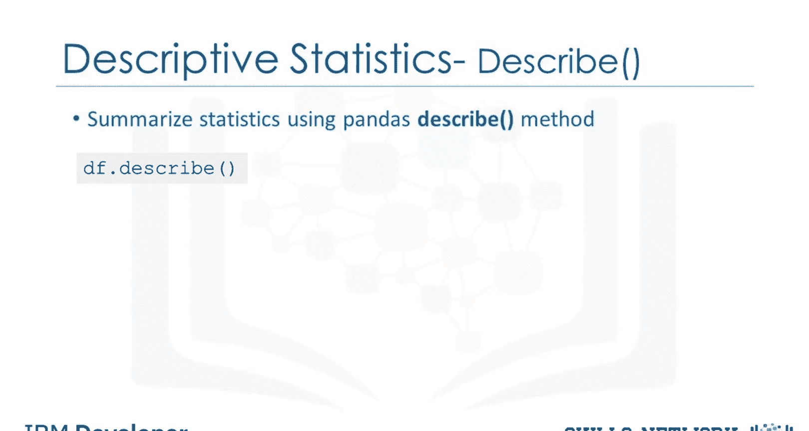
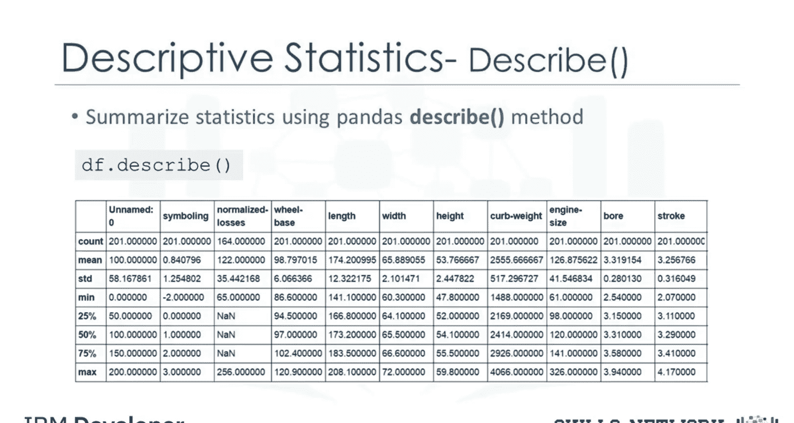
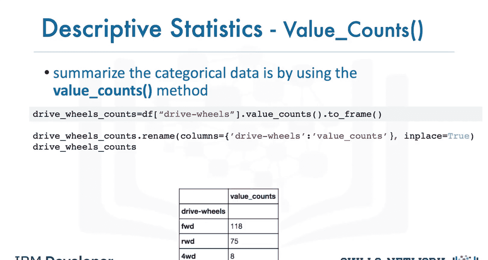
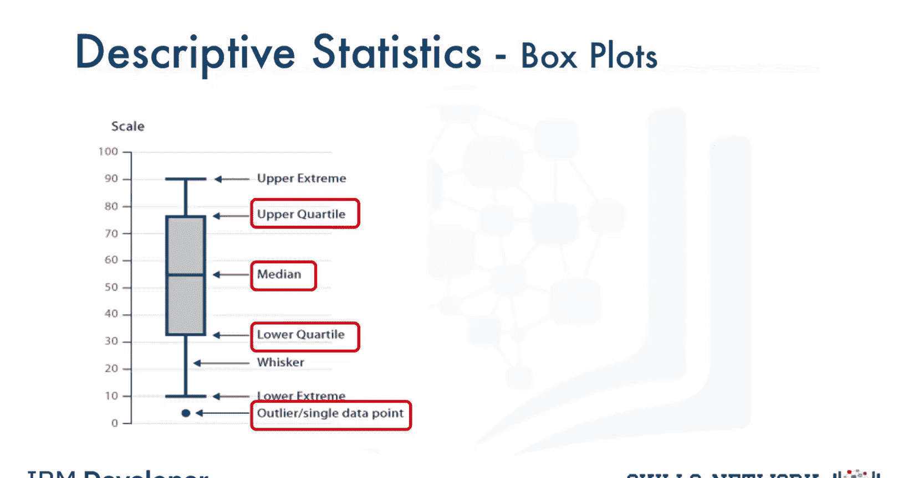
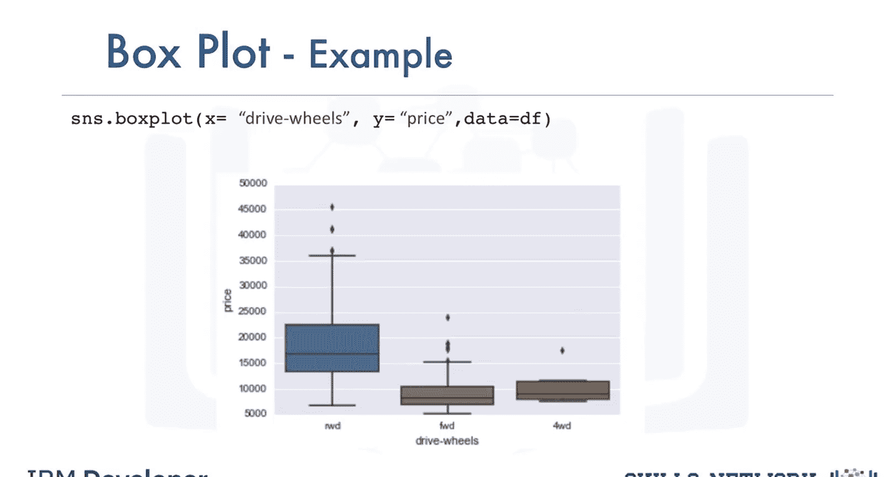
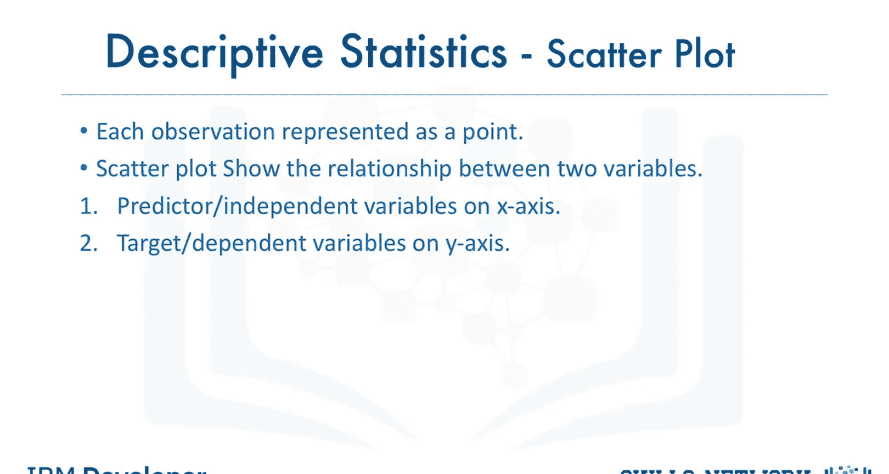
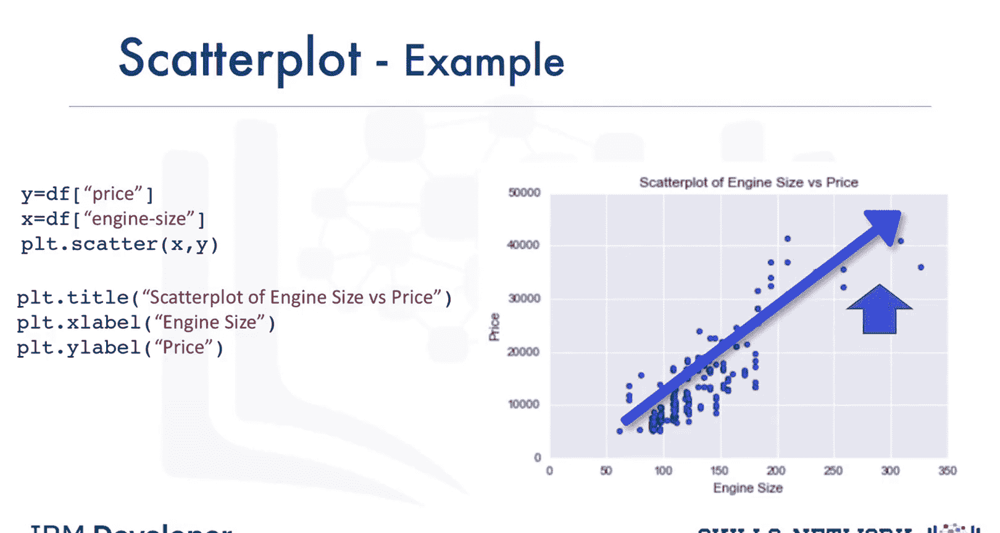

# 生成式人工智能工程：043：描述性统计 📊

在本节课中，我们将学习描述性统计。在开始分析数据时，首先探索数据非常重要，这有助于在构建复杂模型之前理解数据的基本特征。描述性统计分析旨在描述数据集的基本特征，获取样本的简要概括和数据度量。

## 探索数值变量

上一节我们介绍了描述性统计的重要性，本节中我们来看看如何使用具体方法探索数据。一种简单的方法是使用 pandas 库中的 `describe` 函数。

以下是使用 `describe` 函数的基本步骤：



1.  将 `describe` 函数应用于你的数据框（DataFrame）。
2.  该函数会自动计算所有数值变量的基本统计量。

```python
import pandas as pd
# 假设 df 是你的数据框
df.describe()
```



`describe` 函数会显示以下统计信息：**均值**、**数据点总数**、**标准差**、**四分位数**以及**极值**。在这些统计计算中，任何 `NaN` 值都会被自动跳过。这个函数能让你更清晰地了解不同变量的分布情况。

## 探索分类变量

除了数值变量，数据集中也可能包含分类变量。这些变量可以被划分为不同的类别或组，并具有离散值。例如，在我们的数据集中，“驱动系统”就是一个分类变量，包含“前轮驱动”、“后轮驱动”和“四轮驱动”等类别。

以下是总结分类数据的一种方法：



1.  使用 `value_counts` 函数。
2.  可以更改列名以便于阅读。

```python
# 统计‘drive_system’列中各类别的数量
drive_counts = df['drive_system'].value_counts()
drive_counts.name = ‘车辆数量’ # 重命名以便阅读
print(drive_counts)
```

通过这种方式，我们可以看到前轮驱动类别有118辆车，后轮驱动有75辆，四轮驱动有8辆。

## 使用箱线图可视化数据分布

箱线图是可视化数值数据的绝佳方式，因为它可以展示数据的各种分布特征。箱线图显示的主要特征包括：



*   **中位数**：代表中间数据点的位置。
*   **上四分位数**：显示第75百分位数的位置。
*   **下四分位数**：显示第25百分位数的位置。
*   **四分位距**：上四分位数与下四分位数之间的数据范围。
*   **上下极端值**：分别计算为第75百分位数以上1.5倍IQR和第25百分位数以下1.5倍IQR的范围。
*   **异常值**：出现在上下极端值之外的单个点。

通过箱线图，可以轻松识别异常值，并观察数据的分布和偏度。

## 比较组间差异



箱线图使得组间比较变得容易。例如，我们可以使用箱线图查看“驱动车轮”特征的不同类别在“价格”特征上的分布。通过图表，我们可以发现后轮驱动与其他类别的价格分布有明显区别，而前轮驱动和四轮驱动的价格分布几乎无法区分。

## 分析连续变量之间的关系

数据中经常出现连续变量，这些数据点是某个范围内的数字。例如，在我们的数据集中，“价格”和“发动机排量”就是连续变量。如果我们想理解发动机排量与价格之间的关系呢？发动机排量能否预测汽车的价格？

一个好的可视化方法是使用散点图。散点图中的每个观测值都表示为一个点，用于展示两个变量之间的关系。

*   **预测变量**：用于预测结果的变量。在本例中，我们的预测变量是发动机排量。
*   **目标变量**：你试图预测的变量。在本例中，我们的目标变量是价格。

在散点图中，通常将预测变量设置在X轴（水平轴），将目标变量设置在Y轴（垂直轴）。



```python
import matplotlib.pyplot as plt

plt.scatter(x=df['engine_size'], y=df['price'])
plt.xlabel(‘发动机排量’) # 标注X轴
plt.ylabel(‘价格’) # 标注Y轴
plt.title(‘发动机排量与价格关系散点图’) # 添加图表标题
plt.show()
```

因此，我们将发动机排量绘制在X轴，价格绘制在Y轴。从散点图中，我们可以看到随着发动机排量增大，汽车价格也趋于上升。这初步表明这两个变量之间存在**正线性关系**。

## 总结



本节课中我们一起学习了描述性统计的核心概念和方法。我们介绍了如何使用 `describe` 函数快速获取数值变量的统计摘要，如何使用 `value_counts` 总结分类变量，以及如何利用箱线图可视化数据分布、识别异常值和比较组间差异。最后，我们探讨了如何使用散点图来探索和可视化两个连续变量（如发动机排量与价格）之间的潜在关系，从而为后续的建模分析奠定基础。