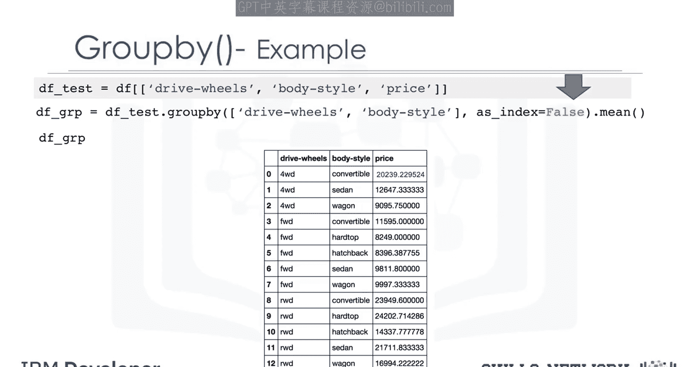
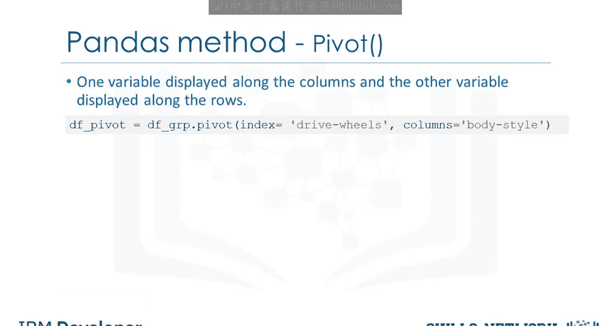
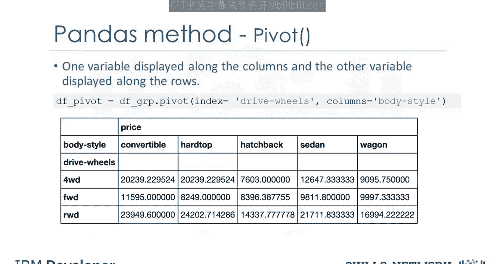
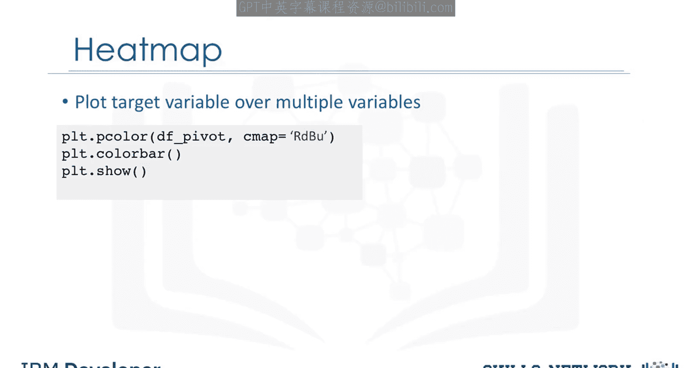
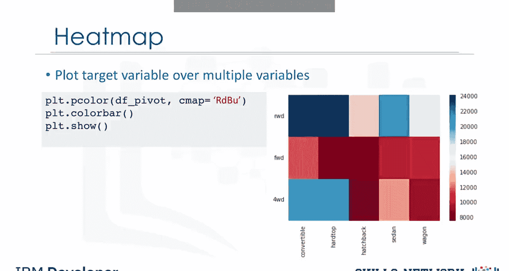

# 生成式人工智能工程：044：Python中的Groupby操作 🧮

在本节课中，我们将要学习如何使用Pandas库中的`groupby`方法对数据进行分组，以及如何通过数据透视表和热力图来更直观地分析和展示分组结果。这些操作是数据分析和预处理中的基础技能。

## 概述

假设我们想探究不同类型的驱动系统（如前驱、后驱、四驱）与车辆价格之间是否存在关系。如果存在，哪种驱动系统能为车辆带来最高的价值。为了解答这个问题，我们需要将数据按照驱动系统的不同类型进行分组，并比较各组的结果。

## 使用Groupby方法分组数据

在Pandas中，这可以通过`groupby`方法实现。`groupby`方法作用于分类变量，它能将数据根据该变量的不同类别划分成多个子集。你可以按单个变量分组，也可以通过传入多个变量名来按多个变量分组。

例如，我们想找出车辆的平均价格，并观察它们在不同车身样式和驱动系统类型之间的差异。以下是实现步骤：

首先，我们选取感兴趣的三个数据列，这由第一行代码完成。接着，在第二行代码中，我们根据“驱动系统”和“车身样式”对筛选后的数据进行分组。

由于我们关注的是平均价格在不同类别间的差异，我们可以在代码行的末尾追加`.mean()`方法来计算每个分组的平均值。

```python
# 示例代码
grouped_data = df[['drive-wheels', 'body-style', 'price']].groupby(['drive-wheels', 'body-style']).mean()
```

现在，数据被分组到各个子类别中，并且只显示每个子类别的平均价格。根据我们的数据，后轮驱动的敞篷车和硬顶车价值最高，而四轮驱动的掀背车价值最低。

## 创建数据透视表



上述形式的表格并不易于阅读和可视化。为了更容易理解，我们可以使用`pivot`方法将此表格转换为数据透视表。

在之前的表格中，“驱动系统”和“车身样式”都列在列中。数据透视表则将一个变量沿列显示，另一个变量沿行显示。只需一行代码，并使用Pandas的`pivot`方法，我们就可以将“车身样式”变量设置为沿列显示，而“驱动系统”沿行显示。



```python
# 示例代码
pivot_table = grouped_data.pivot(index='drive-wheels', columns='body-style')
```



价格数据现在变成了一个矩形网格，更易于可视化。这类似于在Excel电子表格中通常进行的操作。

## 使用热力图进行可视化

另一种表示数据透视表的方法是使用热力图。热力图接收一个矩形数据网格，并根据网格点上的数据值为其分配颜色强度。这是一种在多个变量上绘制目标变量的绝佳方式，通过它可以获得这些变量与目标变量之间关系的视觉线索。

在本例中，我们使用Matplotlib的`pcolor`方法来绘制热力图，并将之前的数据透视表转换为图形形式。我们指定了红-蓝配色方案。

在输出图中，每种车身样式类型沿X轴编号，每种驱动系统类型沿Y轴编号。平均价格根据其值以不同颜色绘制。根据颜色条，我们看到热力图的上半部分似乎价格较高，而下半部分价格较低。

## 总结





本节课中，我们一起学习了如何使用Pandas的`groupby`方法对数据进行分组分析，如何将分组结果转换为更清晰的数据透视表，以及如何利用热力图进行直观的可视化。这些技能对于探索数据中的模式和关系至关重要。