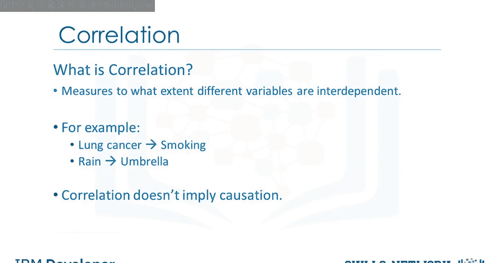
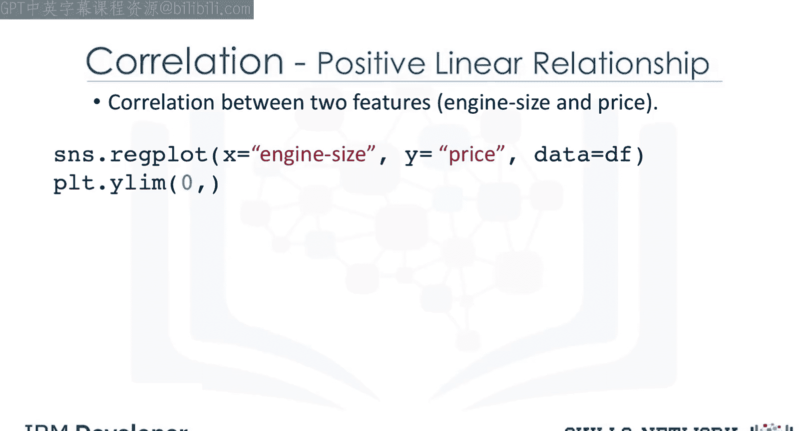
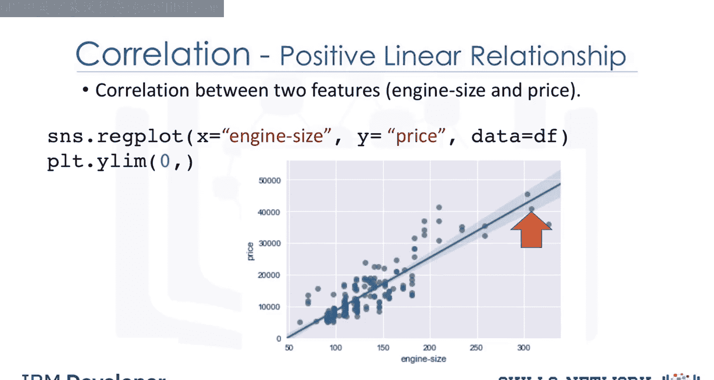
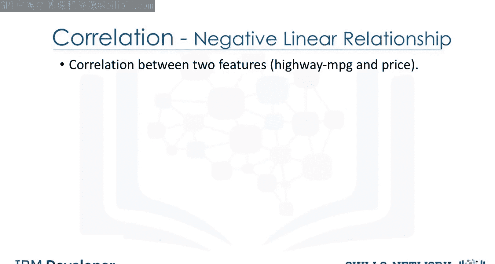
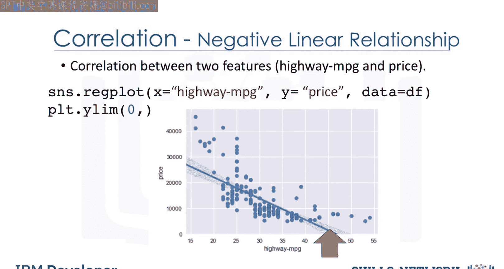
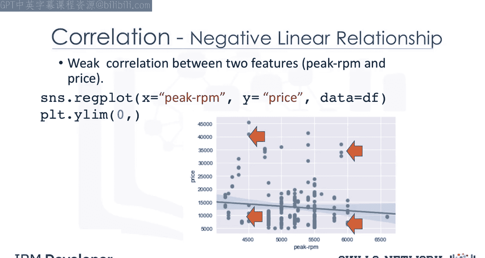

生成式人工智能工程：045：相关性分析 📊

在本节课中，我们将学习相关性分析。相关性是统计学中用于衡量不同变量之间相互依赖程度的指标。理解相关性有助于我们分析数据中变量之间的关系，为后续的建模和预测打下基础。

---

### 什么是相关性？

相关性是一种统计度量，用于衡量不同变量在多大程度上相互依赖。换句话说，当我们观察两个变量随时间的变化时，如果一个变量发生变化，另一个变量会如何随之变化。

例如，吸烟与肺癌之间存在相关性，因为吸烟会增加患肺癌的几率。另一个例子是雨伞和降雨量之间的相关性：降雨量越大，使用雨伞的人就越多；反之，如果不下雨，人们就不会携带雨伞。因此，我们可以说雨伞和降雨量是相互依赖的，根据定义，它们是相关的。

需要明确的是，相关性并不意味着因果关系。例如，虽然雨伞和降雨量相关，但我们没有足够的信息断定是雨伞导致了降雨，还是降雨导致了雨伞的使用。在数据科学中，我们通常更多地处理相关性。

---

### 相关性分析示例

上一节我们介绍了相关性的基本概念，本节中我们来看看如何通过具体示例分析变量间的相关性。

以下是使用散点图和回归线分析变量间关系的示例。

#### 发动机排量与价格的相关性

我们首先分析发动机排量与汽车价格之间的关系。通过散点图并添加一条称为回归线的直线，可以直观展示两者间的关系。







该图的主要目的是观察发动机排量是否对价格有影响。在此示例中，穿过数据点的直线非常陡峭，这表明两个变量之间存在正的线性关系：随着发动机排量值的增加，价格值也随之上升，且直线的斜率为正。因此，发动机排量与价格之间存在**正相关**。

我们可以使用 Seaborn 库的 `regplot` 函数创建此类散点图。

```python
import seaborn as sns
sns.regplot(x='engine-size', y='price', data=df)
```



#### 高速公路油耗与价格的相关性


接下来，我们分析高速公路每加仑英里数与汽车价格的关系，以观察其对价格的影响。



从图中可以看出，当高速公路每加仑英里数值上升时，价格值下降。因此，高速公路每加仑英里数与价格之间存在**负的线性关系**。尽管这种关系是负相关的，但直线的斜率仍然较陡，这意味着高速公路每加仑英里数仍然是预测价格的良好指标。这两个变量被称为具有**负相关**。

#### 弱相关性示例

最后，我们来看一个弱相关性的例子。例如，峰值转速与价格之间的关系。





从图中可见，无论是低峰值转速还是高峰值转速，都对应着低价格和高价格。因此，我们无法使用峰值转速来有效预测价格值。这表明两者之间存在**弱相关性**或几乎不相关。

---

### 总结


本节课中我们一起学习了相关性分析。我们了解到相关性是衡量变量间相互依赖程度的统计指标，但需注意它不意味着因果关系。通过具体示例，我们观察了正相关、负相关以及弱相关的不同表现形式，并学会了如何使用散点图和回归线来可视化这些关系。掌握相关性分析是理解数据、构建有效预测模型的重要基础。