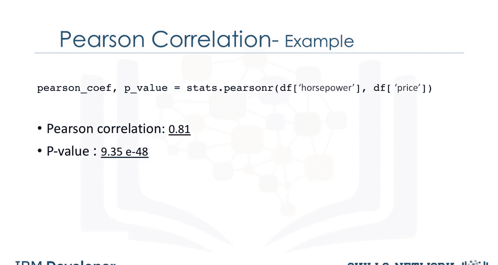
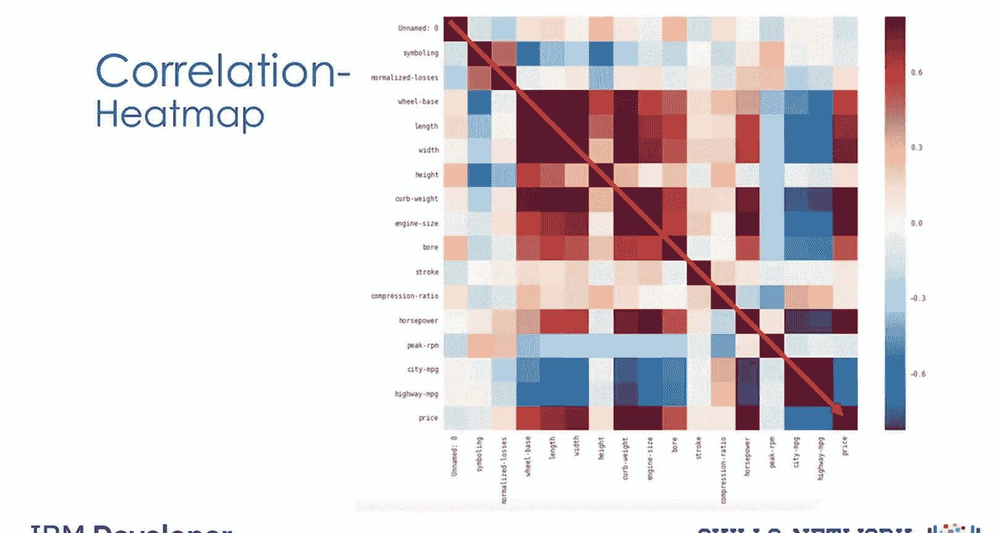

生成式人工智能工程：046：相关性统计方法

在本节课中，我们将学习几种用于衡量变量之间关联性的相关性统计方法。

### 概述
相关性统计用于量化两个或多个变量之间的关系强度和方向。理解相关性是数据分析与机器学习中的重要步骤，它能帮助我们识别特征之间的关联，并为模型构建提供依据。

### 皮尔逊相关系数
上一节我们介绍了相关性统计的概念，本节中我们来看看最常用的方法之一：皮尔逊相关系数。皮尔逊相关系数用于衡量两个连续数值变量之间的线性相关程度。

计算皮尔逊相关系数会得到两个主要数值：**相关系数** 和 **P值**。

以下是这两个数值的解释方法：

**相关系数**：
*   值接近 **+1** 表示存在**强正相关**。
*   值接近 **-1** 表示存在**强负相关**。
*   值接近 **0** 表示变量之间**无线性相关**。

**P值**：
P值用于评估我们计算出的相关系数的可靠性（确定性）。
*   **P值 < 0.001**：对计算出的相关系数有**强确定性**。
*   **0.001 ≤ P值 < 0.05**：有**中等确定性**。
*   **0.05 ≤ P值 < 0.1**：有**弱确定性**。
*   **P值 ≥ 0.1**：**无法确定**存在相关性。

综合来看，当**相关系数接近1或-1**，并且**P值小于0.001**时，我们可以说变量之间存在强相关性。

### 实例分析
理解了基本概念后，我们通过一个具体例子来看如何应用。以下图表展示了具有不同相关系数值的数据分布。



假设我们想分析汽车“马力”与“价格”两个变量之间的相关性。使用Python的`scipy.stats`包可以轻松计算皮尔逊相关系数。

```python
# 示例代码：使用scipy.stats计算皮尔逊相关系数和P值
from scipy import stats
correlation_coefficient, p_value = stats.pearsonr(horsepower, car_price)
```


计算结果显示，相关系数约为**0.8**（接近1），表明存在**强正相关**。同时，P值非常小（远小于0.001），因此我们可以确信这种强正相关关系是 statistically significant 的。

### 相关性热力图
在分析多个变量时，逐一查看两两关系效率较低。此时，相关性热力图能提供一个全局视角。

以下是综合考虑所有变量后生成的热力图，它展示了每对变量之间的皮尔逊相关系数。颜色深浅代表相关性的强弱。



我们可以观察到一条深红色的对角线。这条线上的值均为1，代表每个变量与自身的完全相关，这符合逻辑。这张热力图清晰地概括了不同变量之间的相互关系，最重要的是，它直观地展示了各个变量与目标变量（如“价格”）的相关性。


### 总结
本节课中我们一起学习了相关性统计的核心方法。我们重点介绍了**皮尔逊相关系数**，它通过**相关系数**（表示关系强度和方向）和**P值**（表示关系的确定性）来描述两个连续变量间的线性关系。最后，我们探讨了使用**相关性热力图**来可视化多个变量间复杂关系的有效方法。掌握这些工具对于后续的数据分析、特征工程和模型理解至关重要。