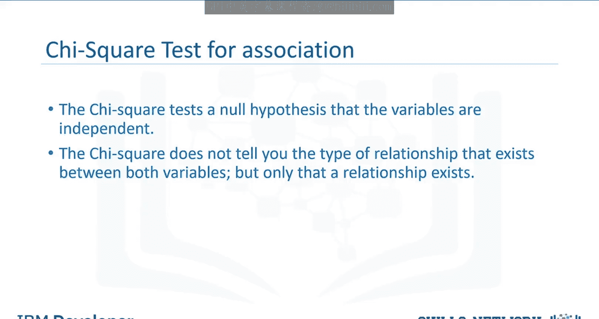
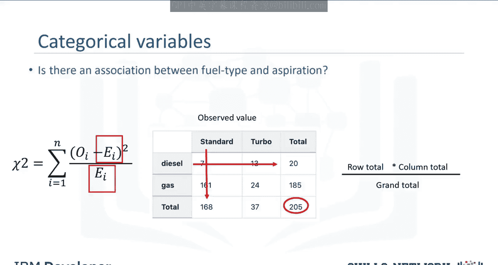
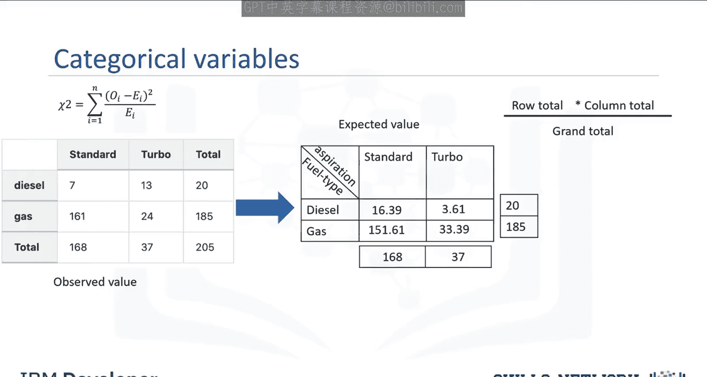
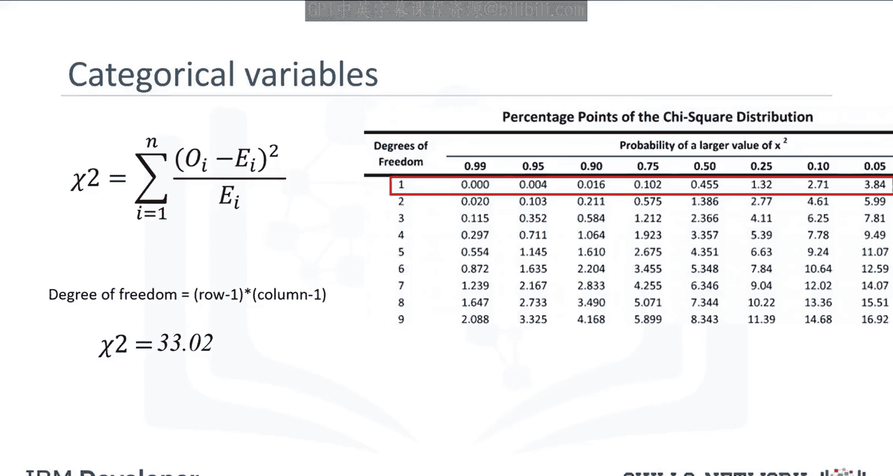
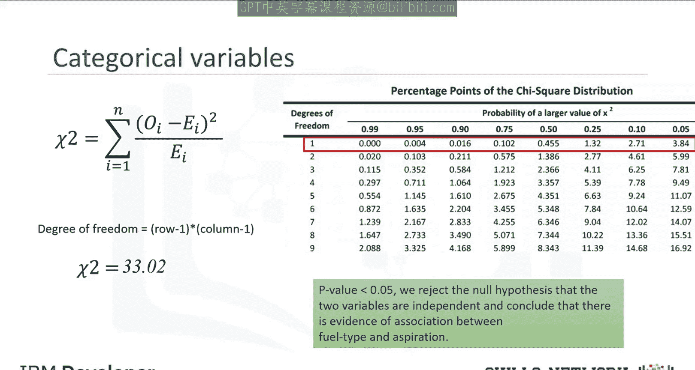
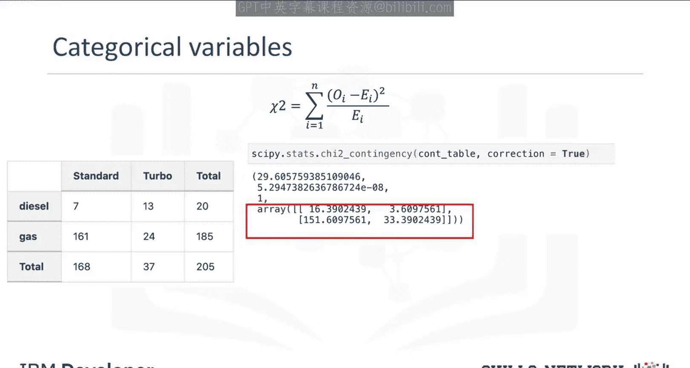
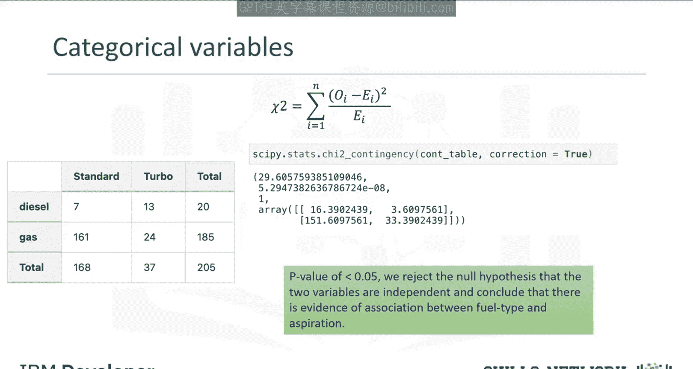

**统计学：047：卡方检验** 🧮

在本节课中，我们将学习如何判断两个分类变量之间是否存在关联关系。

当处理两个分类变量之间的关系时，我们不能使用连续变量那样的相关性分析方法。我们需要使用**卡方检验**来检验关联性。

卡方检验旨在检验观察到的分布是否可能由随机因素导致。它衡量观察到的数据分布与变量独立时的预期分布的拟合程度。

在进入具体例子之前，我们先了解一些重要概念。

---

### **核心概念**

卡方检验的原假设是变量之间相互独立。该检验将观察到的数据与变量独立时模型预期的数值进行比较。每当观察数据与预期值模型不符时，变量之间存在依赖关系的可能性就越大，从而证明原假设不成立。

卡方检验**不**能告诉你变量之间存在何种类型的关系，只能告诉你是否存在关系。

---

### **示例：汽车燃料类型与吸气方式**



我们将使用一个汽车数据集，假设我们想检验燃料类型与吸气方式之间的关系。这两个都是分类变量：燃料类型是汽油或柴油；吸气方式是标准或涡轮增压。

以下是分析步骤：

**第一步：创建列联表**

首先，我们需要获取每个类别中汽车的观察计数。这可以通过使用pandas库创建交叉表（列联表）来实现。列联表是展示两个或多个变量之间关系的表格。

```python
import pandas as pd

# 假设df是包含'fuel_type'和'aspiration'列的DataFrame
contingency_table = pd.crosstab(df['fuel_type'], df['aspiration'])
print(contingency_table)
```

这将生成一个表格，显示四个类别的计数：标准柴油车、标准汽油车、涡轮柴油车、涡轮汽油车。

**第二步：计算卡方统计量**

卡方统计量的计算公式如下：

**χ² = Σ [ (观测值 - 期望值)² / 期望值 ]**

其中：
*   **观测值**：列联表中每个单元格的实际计数。
*   **期望值**：在变量独立的假设下，每个单元格的理论预期计数。

期望值的计算基于行总计和列总计。例如，对于“标准柴油车”单元格，其期望值计算公式为：

**期望值 = (该行总计 × 该列总计) / 总计**

在我们的例子中，计算过程如下：
*   标准柴油车期望值 = (20 × 168) / 205 ≈ 16.39
*   涡轮汽油车期望值 = (185 × 37) / 205 ≈ 33.39



对所有单元格重复此计算，得到完整的期望值表。

**第三步：进行假设检验**

将观测值和计算出的期望值代入卡方公式，求和后得到卡方统计量（本例中计算值为29.6）。

然后，我们需要确定这个统计量对应的**P值**。这需要用到**自由度**，对于列联表，自由度的计算公式为：



**自由度 = (行数 - 1) × (列数 - 1)**

在我们的2x2表格中，自由度为1。

我们可以查阅卡方分布表，找到自由度为1时，统计量29.6对应的P值范围。29.6远大于临界值，对应的P值远小于0.05。



**决策规则**：如果P值小于显著性水平（通常为0.05），我们**拒绝原假设**，认为变量间存在关联。

---

### **使用Python实现**

上一节我们手动计算了卡方统计量，本节中我们来看看如何使用Python快速完成整个检验。

我们可以使用`scipy.stats`包中的`chi2_contingency`函数。

```python
from scipy.stats import chi2_contingency

# 使用前面创建的列联表 contingency_table
chi2, p_value, dof, expected = chi2_contingency(contingency_table)

print(f"卡方统计量: {chi2}")
print(f"P值: {p_value}")
print(f"自由度: {dof}")
print("期望频数表:")
print(expected)
```



该函数会输出：
1.  卡方检验值（与我们手动计算的29.6一致）。
2.  P值（一个非常接近0的精确值，而查表只能得到范围）。
3.  自由度（为1）。
4.  期望频数表（与我们手动计算的结果一致）。

由于P值接近0（<0.05），我们拒绝“燃料类型与吸气方式独立”的原假设，得出结论：有证据表明汽车的燃料类型与吸气方式之间存在关联。



---

### **总结**



本节课中我们一起学习了卡方检验。我们了解到卡方检验是用于分析两个分类变量之间是否关联的统计方法。其核心步骤包括：建立列联表、计算期望频数、套用公式计算卡方统计量、根据自由度和P值做出统计决策。最后，我们还掌握了如何使用Python的`scipy.stats.chi2_contingency`函数来高效、精确地执行整个检验流程。记住，卡方检验只能判断关联是否存在，而不能说明关联的强度或方向。