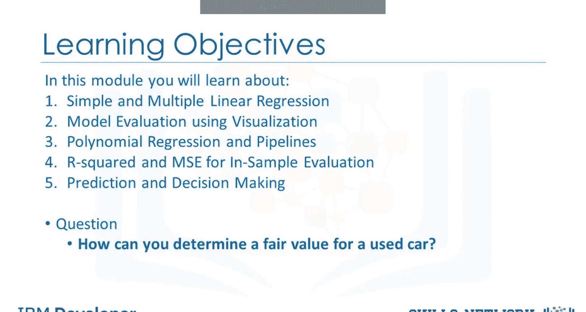
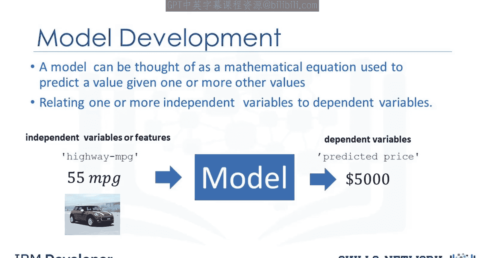
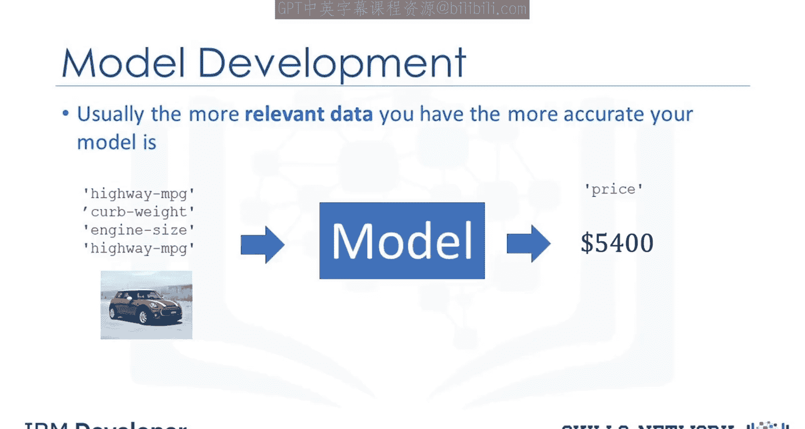
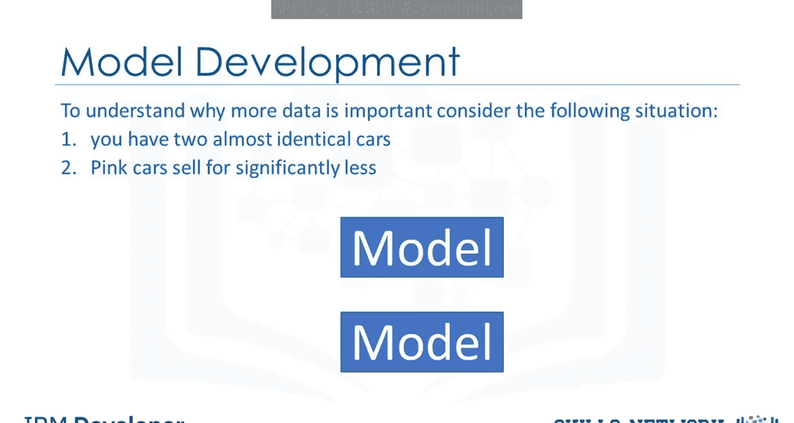
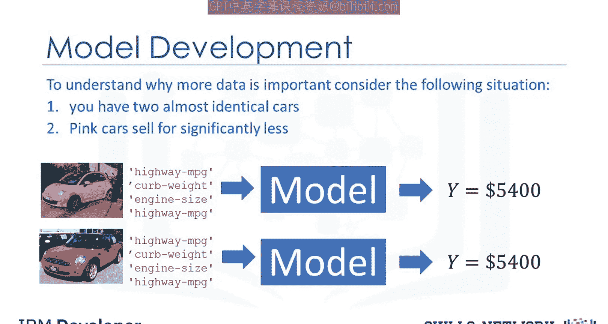
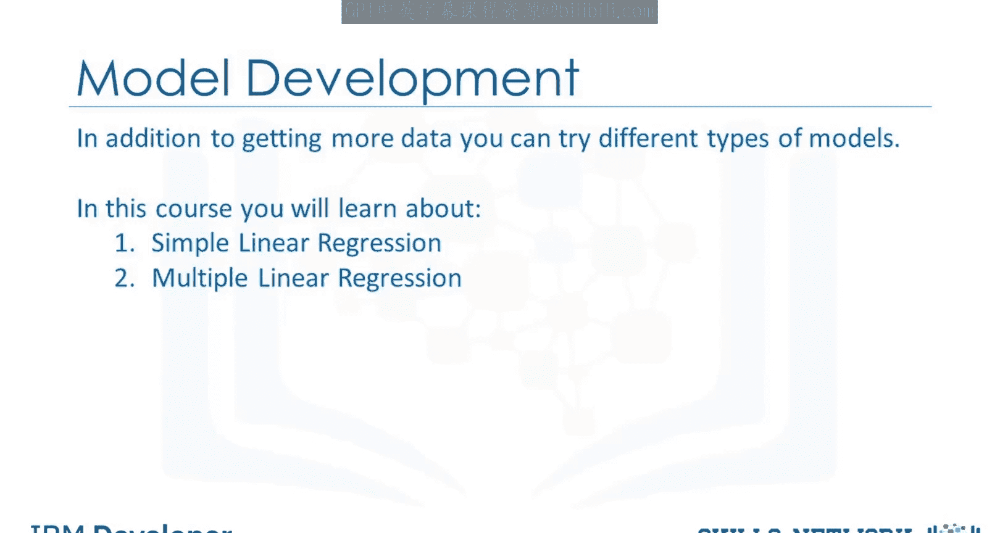

# 生成式人工智能工程：048：模型开发 🚗

在本节课中，我们将通过尝试使用数据集预测汽车价格，来深入探讨模型开发。你将学习简单线性回归、多元线性回归、使用可视化进行模型评估、多项式回归和用于样本内评估的均方误差（MSE）管道、预测与决策制定，以及如何为一辆二手车确定一个公平的价值。

## 什么是模型？🧮

上一节我们介绍了课程概述，本节中我们来看看模型的基本概念。

模型或估计器可以被视为一个数学方程，用于在给定一个或多个其他值的情况下预测一个值。它将一个或多个自变量（或特征）与因变量关联起来。例如，你输入一个汽车型号的高速公路每加仑英里数作为自变量或特征，模型的输出（即因变量）就是价格。

**公式表示**：`价格 = f(高速公路MPG)`

## 更多数据的重要性 📊

通常，你拥有的相关数据越多，你的模型就越准确。例如，你可以向模型输入多个自变量或特征。因此，你的模型可能会更准确地预测汽车的价格。

**公式表示**：`价格 = f(特征1, 特征2, ..., 特征n)`

为了理解为什么更多数据很重要，请考虑以下情况：你有两辆几乎完全相同的汽车，但粉色汽车的售价明显更低。

## 特征选择的影响 🎨

假设你想使用你的模型来确定两辆汽车（一辆粉色，一辆红色）的价格。如果你的模型的自变量或特征中不包含颜色，那么你的模型将为这两辆可能售价差异很大的汽车预测相同的价格。

这个例子说明，遗漏关键特征会导致模型预测不准确。

## 模型的类型 🔄

除了获取更多数据，你还可以尝试不同类型的模型。在本课程中，你将学习以下内容：

以下是本课程将涵盖的几种回归模型：
*   **简单线性回归**：使用一个特征来预测目标。
*   **多元线性回归**：使用多个特征来预测目标。
*   **多项式回归**：用于捕捉特征与目标之间的非线性关系。

## 总结 📝

本节课中我们一起学习了模型开发的基础。我们了解到，模型是一个用于预测的数学方程，其准确性依赖于充足且相关的特征数据。特征的选择至关重要，遗漏重要信息（如汽车颜色）会导致预测偏差。最后，我们介绍了几种将在后续深入学习的回归模型类型，为接下来的具体技术学习奠定了基础。