# 生成式人工智能工程：049：线性回归与多元线性回归 📈

在本节课中，我们将学习线性回归与多元线性回归的基本概念。这两种方法是理解变量间关系并进行预测的基础工具。我们将探讨它们的定义、应用场景、数学模型以及在Python中的实现方法。

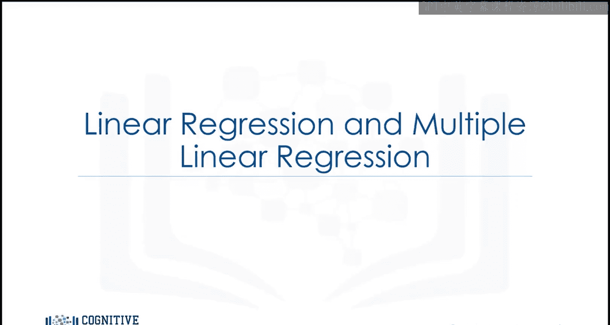

## 概述

线性回归用于分析一个自变量与一个因变量之间的线性关系。多元线性回归则扩展了这一概念，用于分析多个自变量与一个因变量之间的关系。本节将详细介绍这两种方法的核心思想、公式表示及实践步骤。

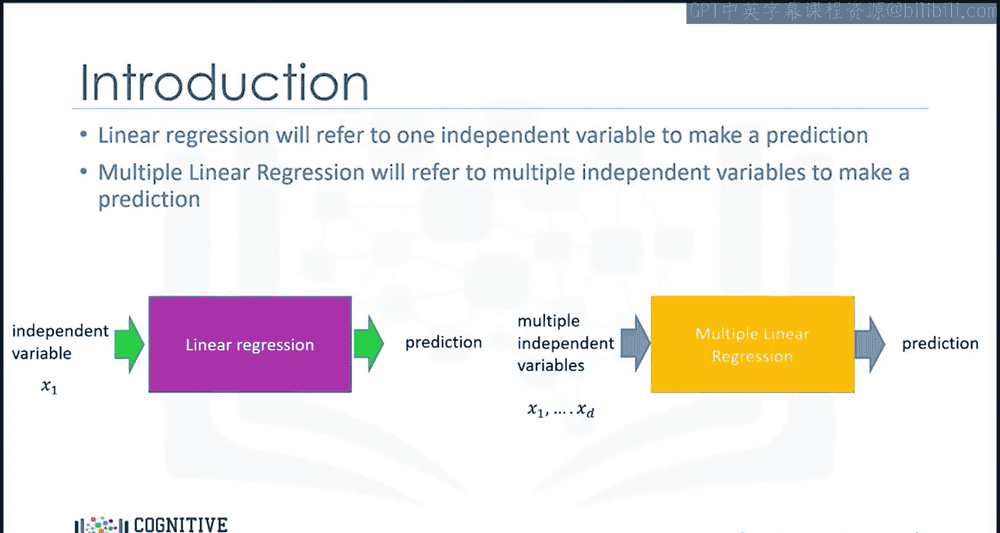

---

## 简单线性回归

简单线性回归（Simple Linear Regression, SLR）是一种帮助我们理解两个变量之间关系的方法。这两个变量分别是预测变量（自变量X）和目标变量（因变量Y）。我们的目标是找到这两个变量之间的线性关系。

线性关系的数学表达式为：

**Y = B₀ + B₁X**

其中，参数 **B₀** 是截距，参数 **B₁** 是斜率。当我们拟合或训练模型时，会计算出这些参数。这一步涉及大量数学运算，因此我们在此不深入讨论。让我们重点理解预测步骤。

### 预测步骤示例

确定一辆汽车的价格很困难，但高速公路每加仑英里数（highway miles per gallon）可以在车主手册中找到。如果我们假设这两个变量之间存在线性关系，就可以利用这种关系建立一个模型来预测汽车价格。

例如，如果高速公路每加仑英里数为20，我们可以将这个值输入模型，得到预测价格为22000美元。

### 模型拟合过程

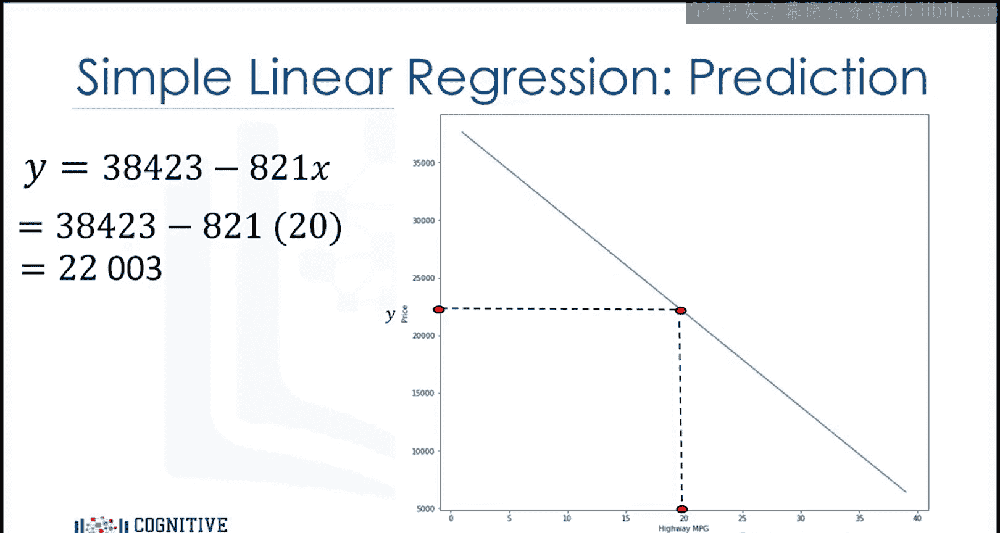

为了确定最佳拟合线，我们从数据集中选取数据点（图中用红色标出）。然后，我们使用这些训练点来拟合模型。拟合训练点的结果就是模型的参数。

### 数据结构

我们通常将数据点存储在DataFrame或NumPy数组中。要预测的值称为目标，存储在数组 **Y** 中。自变量存储在DataFrame或数组 **X** 中。每个样本对应每个DataFrame或数组中的不同行。

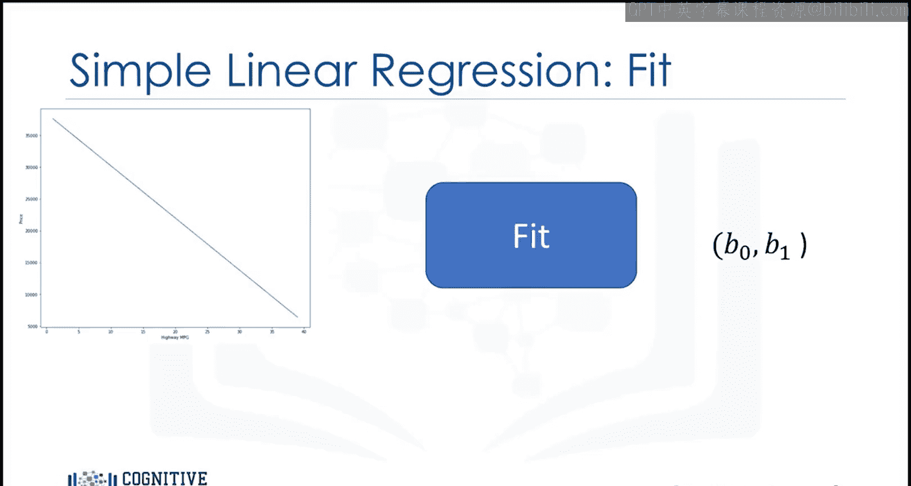

在许多情况下，多个因素会影响人们为汽车支付的价格，例如品牌或车龄。在这种模型中，通过假设在直线上的点添加一个小的随机值来考虑这种不确定性，这个随机值称为**噪声**。

左图显示了噪声的分布。纵轴表示添加的值，横轴表示添加该值的概率。通常，会添加一个小的正值或小的负值。有时也会添加较大的值，但在大多数情况下，添加的值接近0。

### 过程总结

我们可以将整个过程总结如下：我们有一组训练点，使用这些训练点来拟合或训练模型，并得到参数。然后，我们在模型中使用这些参数。现在，我们有了一个模型。我们用 **Ŷ** 表示模型是一个估计值。

我们可以使用这个模型来预测未见过的值。例如，我们没有高速公路每加仑英里数为20的汽车数据，但可以使用模型来预测这辆汽车的价格。但请注意，我们的模型并不总是正确的。

通过比较预测值与实际值，我们可以看到这一点。例如，我们有一个高速公路每加仑英里数为10的样本，但预测值与实际值不匹配。如果线性假设正确，这种误差是由于噪声引起的，但也可能有其他原因。

---

## 在Python中实现简单线性回归

上一节我们介绍了简单线性回归的理论基础，本节中我们来看看如何在Python中实现它。

### 实现步骤

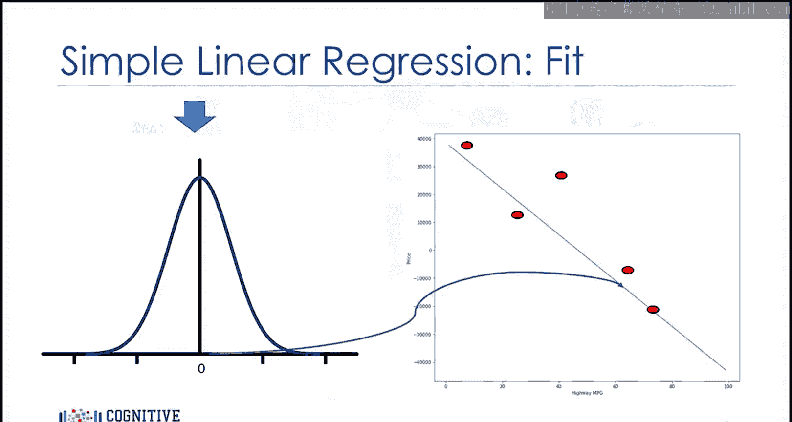

以下是使用Python和scikit-learn库拟合简单线性回归模型的步骤。

首先，从scikit-learn导入线性模型模块：

```python
from sklearn import linear_model
```

然后，使用构造函数创建一个线性回归对象：

```python
lm = linear_model.LinearRegression()
```

接着，定义预测变量和目标变量，并使用`fit`方法拟合模型以找到参数B₀和B₁。输入是特征和目标：

```python
lm.fit(X, Y)
```

我们可以使用`predict`方法获得预测值，输出是一个数组，其样本数量与输入X相同：

```python
yhat = lm.predict(X)
```

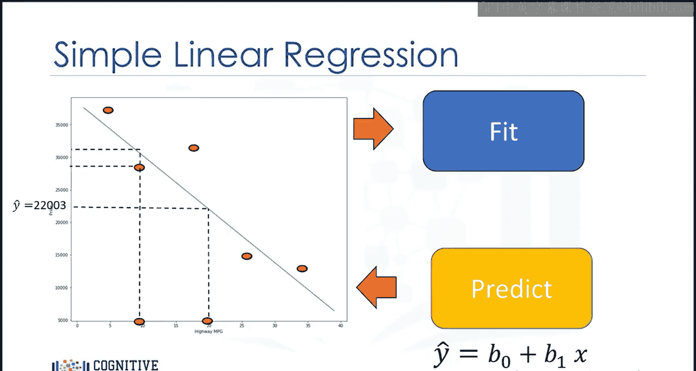

### 获取模型参数

截距B₀是对象`lm`的一个属性，斜率B₁也是对象`lm`的一个属性：

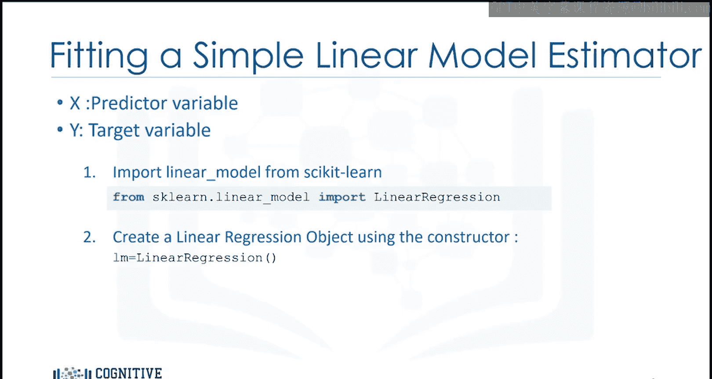

```python
B0 = lm.intercept_
B1 = lm.coef_
```

价格与高速公路每加仑英里数之间的关系由以下方程给出：

**价格 = 38423.31 - 821.73 × 高速公路每加仑英里数**

这个方程与我们之前讨论的形式相同。

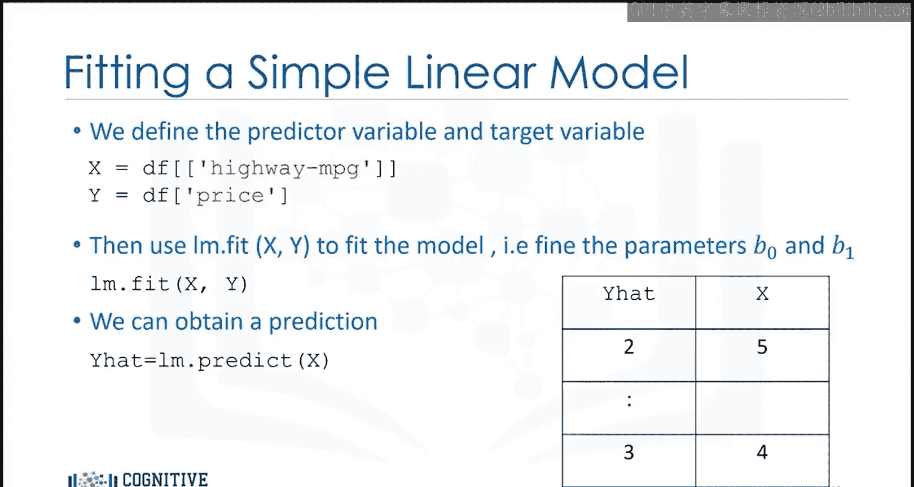

---

## 多元线性回归

在理解了简单线性回归之后，本节我们将探讨多元线性回归。多元线性回归用于解释一个连续目标变量Y与两个或更多预测变量X之间的关系。

### 数学模型

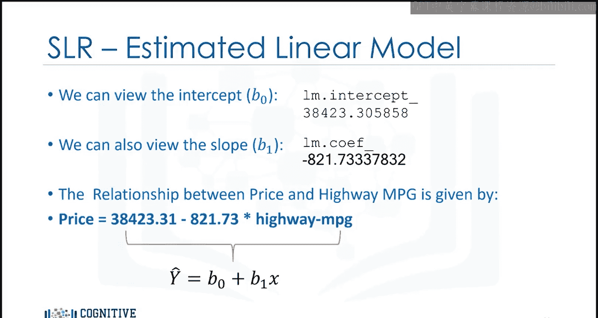

如果我们有四个预测变量，那么方程如下：

**Y = B₀ + B₁X₁ + B₂X₂ + B₃X₃ + B₄X₄**

其中，**B₀** 是截距（当X等于0时），**B₁** 是变量X₁的系数或参数，**B₂** 是变量X₂的系数，依此类推。

如果只有两个变量，我们可以将数值可视化。考虑以下函数，变量X₁和X₂可以在二维平面上可视化。让我们在下一张幻灯片中看一个例子。

### 数据可视化示例

表格包含预测变量X₁和X₂的不同值。每个点的位置放置在二维平面上，并根据数值进行颜色编码。

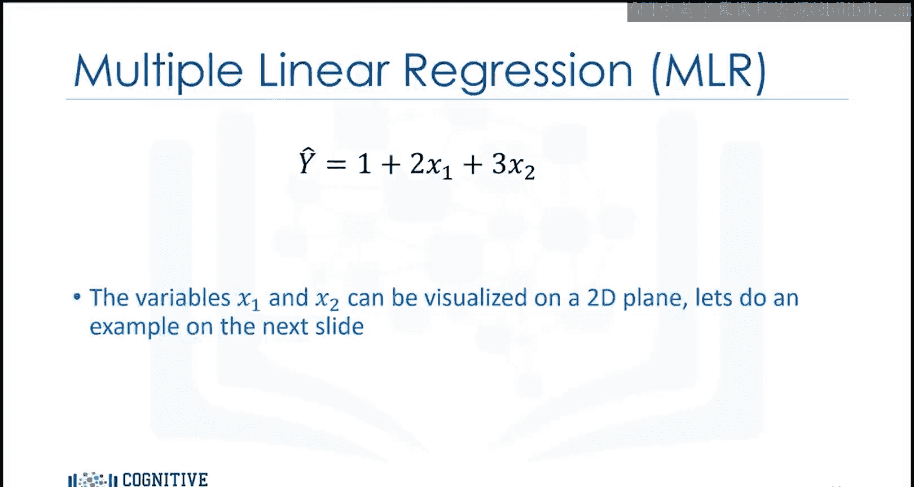

每个预测变量X₁和X₂的值将被映射到一个新值Ŷ。Ŷ的新值在垂直方向上映射，高度与Ŷ的值成比例。

### 在Python中实现多元线性回归

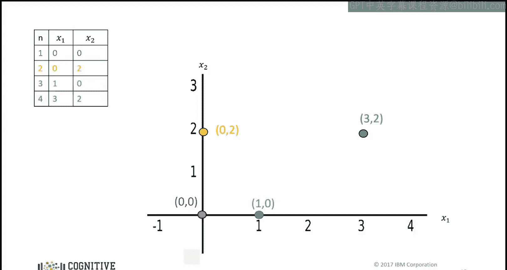

我们可以按以下步骤拟合多元线性回归模型。首先，提取四个预测变量并将它们存储在变量Z中：

```python
Z = df[['x1', 'x2', 'x3', 'x4']]
```

然后，像之前一样使用`fit`方法训练模型，输入是特征（因变量）和目标：

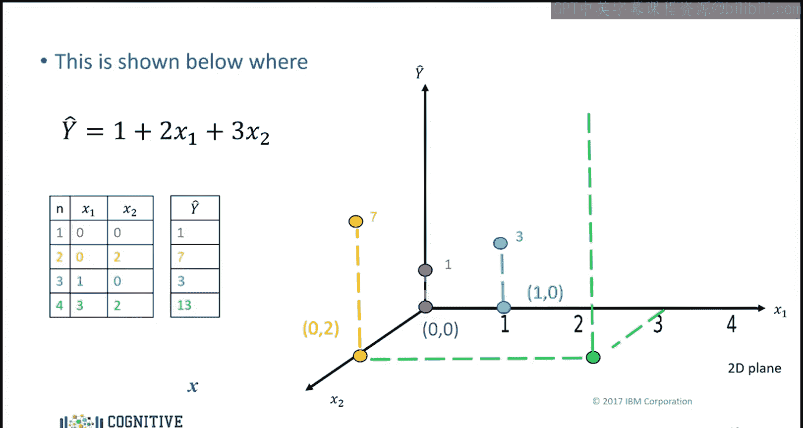

```python
lm.fit(Z, Y)
```

我们也可以使用`predict`方法获得预测值。在这种情况下，输入是一个具有四列的数组或DataFrame，行数对应样本数量。输出是一个数组，其元素数量与样本数量相同：

```python
yhat = lm.predict(Z)
```

### 获取模型参数

截距是对象的一个属性，系数也是对象的属性：

```python
B0 = lm.intercept_
Coefficients = lm.coef_
```

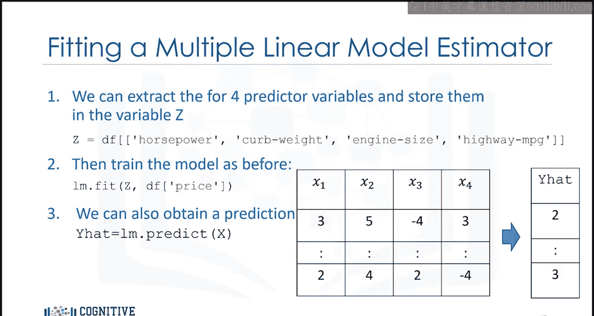

将因变量名称替换为实际名称来可视化方程是有帮助的。这与我们之前讨论的形式相同。

---

## 总结

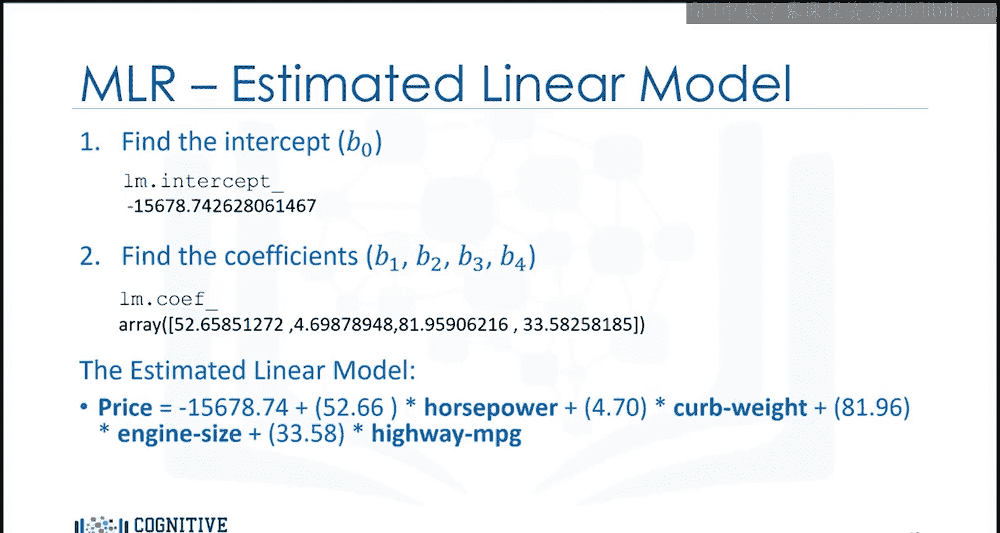

在本节课中，我们一起学习了线性回归与多元线性回归的核心概念。我们了解了简单线性回归用于分析两个变量之间的关系，而多元线性回归用于分析多个变量与一个目标变量之间的关系。我们探讨了它们的数学模型、预测过程、噪声的影响，并学习了如何在Python中使用scikit-learn库实现这两种回归方法。通过具体的例子和代码，我们掌握了从数据准备、模型训练到预测和参数获取的完整流程。这些基础知识是进一步学习更复杂机器学习模型的重要基石。