# 生成式人工智能工程：050：使用可视化进行模型评估 📊

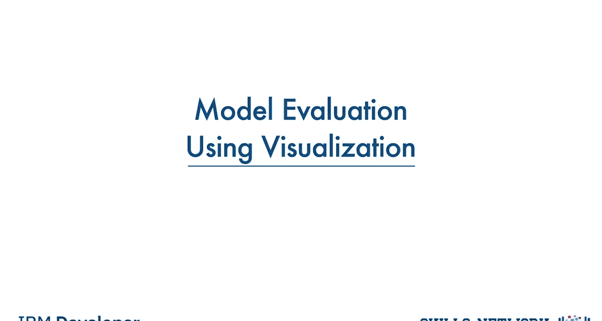

在本节课中，我们将学习如何利用可视化工具来评估模型。可视化是理解模型性能、数据关系及误差模式的关键手段。我们将重点介绍三种核心的可视化方法：回归图、残差图和分布图。

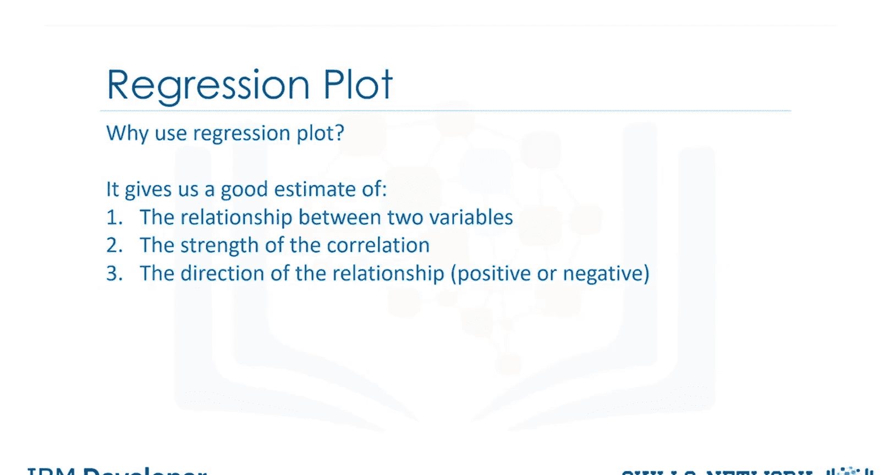

## 回归图：理解变量关系 📈

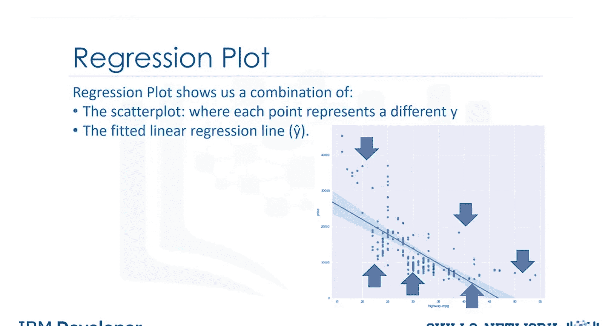

上一节我们介绍了模型评估的重要性，本节中我们来看看如何通过回归图直观地理解两个变量之间的关系。回归图可以很好地估计两个变量之间的关系强度以及关系的方向（正相关或负相关）。

在回归图中，横轴代表自变量，纵轴代表因变量。图中的每个点代表一个不同的数据点，而拟合线则代表模型的预测值。

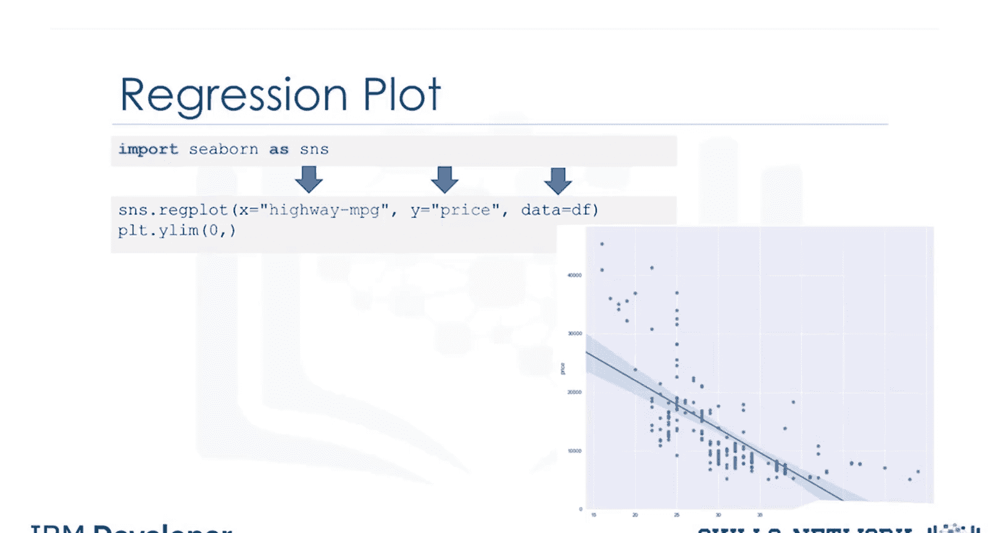

以下是使用Seaborn库绘制回归图的步骤：

1.  首先，导入Seaborn库。
2.  使用 `regplot` 函数。
    *   参数 `x` 指定包含自变量（特征）的列名。
    *   参数 `y` 指定包含因变量（目标）的列名。
    *   参数 `data` 指定数据框的名称。

```python
import seaborn as sns
sns.regplot(x='feature_column', y='target_column', data=df)
```

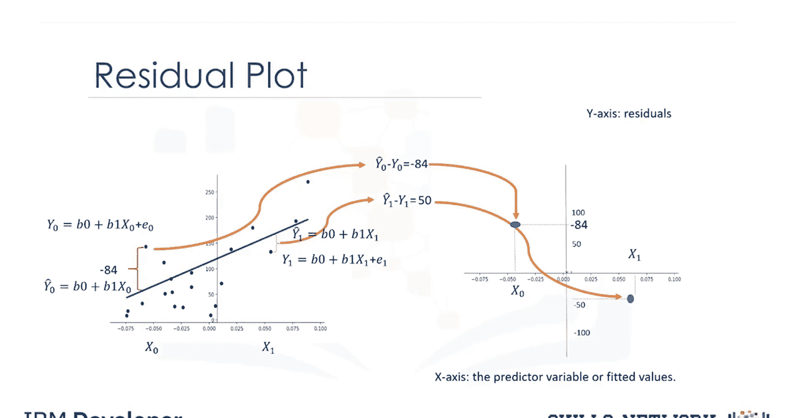

## 残差图：分析预测误差 🔍

了解了变量间的整体关系后，我们需要深入分析模型的预测误差。残差图正是用于表示预测值与实际值之间的误差。

我们通过从预测值中减去实际目标值来得到残差。在残差图中，我们将残差值绘制在纵轴上，自变量绘制在横轴上。通过观察残差图，我们可以获得关于数据的重要洞察。

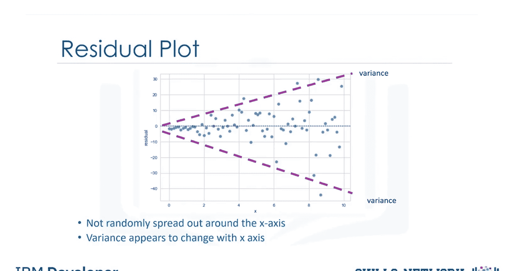

我们期望看到的结果是：残差均值为0，围绕X轴均匀分布，且方差相似，没有明显的曲线模式。

*   **理想的残差图**：表明线性模型是合适的。
*   **存在曲线的残差图**：表明误差值随X变化。例如，在某些区域所有残差都为正，而在另一些区域则为负。这提示线性假设可能不正确，需要考虑非线性函数。
*   **方差变化的残差图**：如果残差的方差随X增加而增大，则表明我们的模型存在问题。

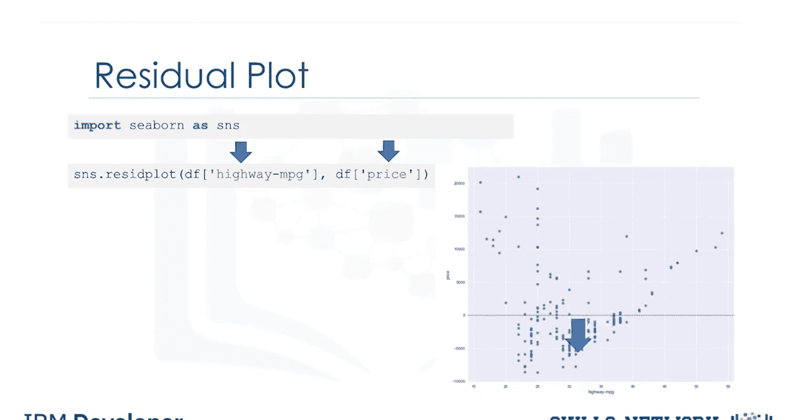

我们可以使用Seaborn来创建残差图。首先导入Seaborn，然后使用 `residplot` 函数。第一个参数是自变量序列，第二个参数是因变量序列。

```python
import seaborn as sns
sns.residplot(x=feature_series, y=target_series)
```

## 分布图：比较预测值与实际值 📊

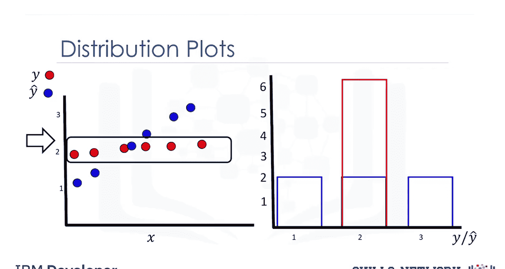

当我们处理具有多个自变量或特征的模型时，回归图和残差图可能不够直观。此时，分布图就变得极为有用。分布图用于比较预测值的分布与实际目标值的分布。

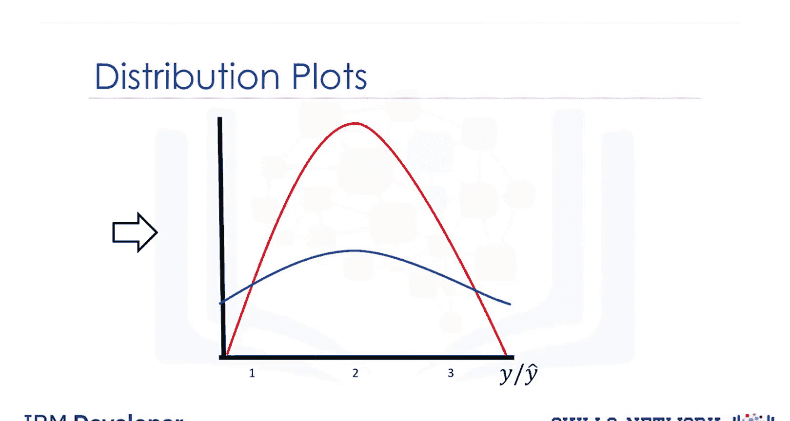

让我们看一个简化的例子：我们统计并绘制预测值大约等于1、2、3的数据点数量，同时对实际目标值（假设都约等于2）进行同样的操作。由于目标和预测值是连续值，而直方图适用于离散值，因此Pandas会将其转换为分布图，并将纵轴缩放以使分布下的面积总和为1。

这是一个使用分布图的示例：自变量是“价格”，模型得出的拟合值用蓝色表示，实际值用红色表示。通过对比，我们可以发现模型在价格区间40,000到50,000的预测不准确，而在10,000到20,000区间的预测则更接近目标值。

以下是创建分布图的代码。我们分别绘制实际值和预测值的分布，通过设置参数 `hist=False` 来获得平滑的分布曲线而非直方图，并为其指定颜色和标签。

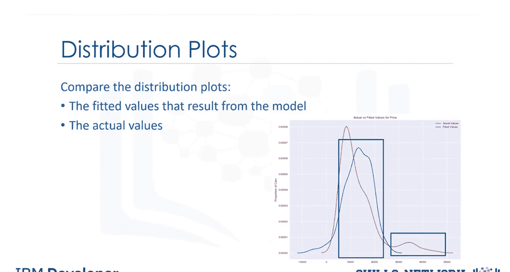

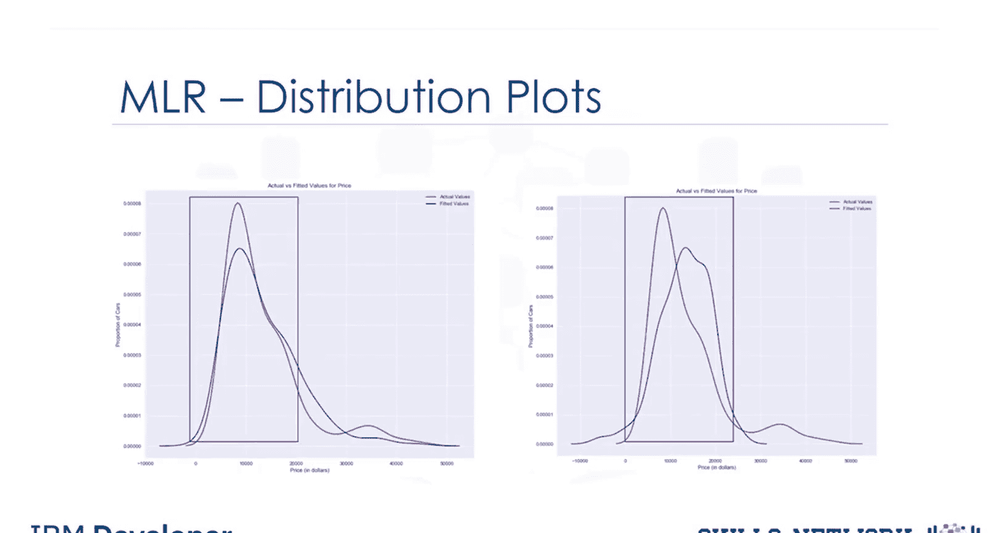

```python
import seaborn as sns
# 绘制实际值分布
sns.distplot(actual_values, hist=False, color='red', label='Actual')
# 绘制预测值分布
sns.distplot(predicted_values, hist=False, color='blue', label='Predicted')
```

## 总结

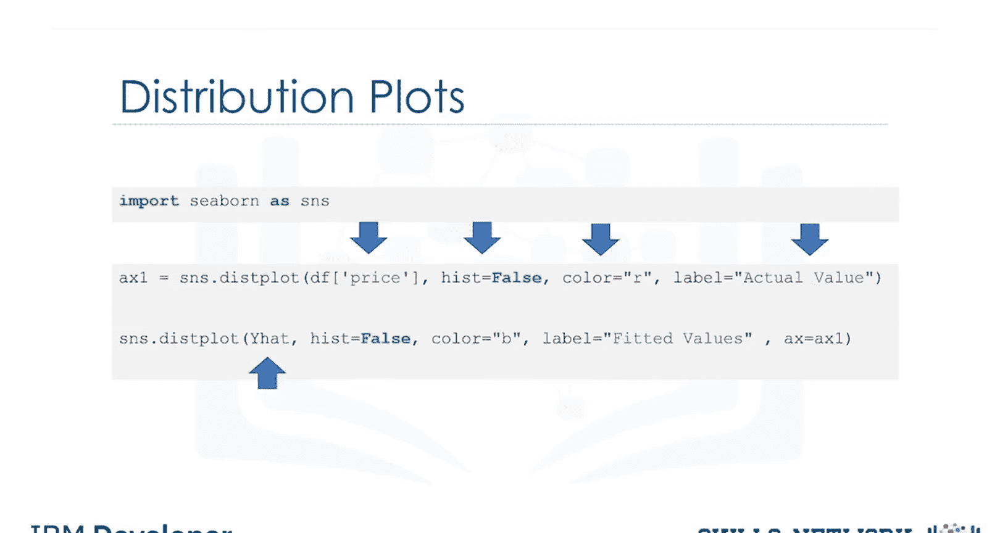

本节课中，我们一起学习了三种用于模型评估的核心可视化方法。**回归图**帮助我们理解特征与目标变量之间的整体关系；**残差图**让我们能够深入诊断预测误差的模式，判断模型假设是否合理；而**分布图**则是在多特征模型中直观比较预测分布与实际分布的强大工具。掌握这些可视化技术，将极大地提升你理解、诊断和改进模型的能力。