# 生成式人工智能工程：051：多项式回归与管道 📊

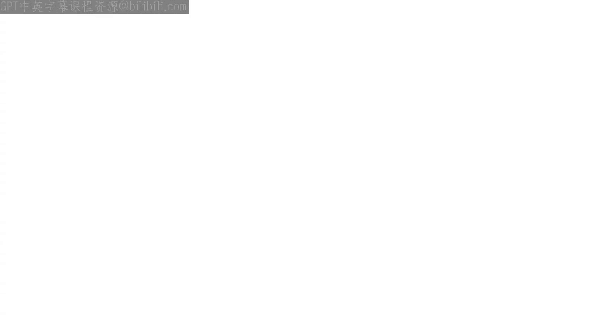

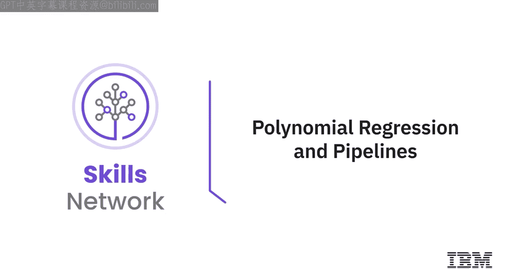

在本节课中，我们将学习多项式回归模型以及如何使用管道（Pipeline）来简化机器学习工作流程。当线性模型无法很好地拟合数据时，多项式回归提供了一种有效的解决方案。同时，管道能够将数据预处理和模型训练的多个步骤封装起来，使代码更简洁、更易维护。

---

## 多项式回归简介 🔍

上一节我们介绍了线性回归。当线性模型不是数据的最佳拟合时，我们可以探索另一种回归模型：多项式回归。

多项式回归通过将数据转换为多项式形式，然后使用线性回归来拟合参数。接下来，我们将讨论管道。管道是一种简化代码的方法。

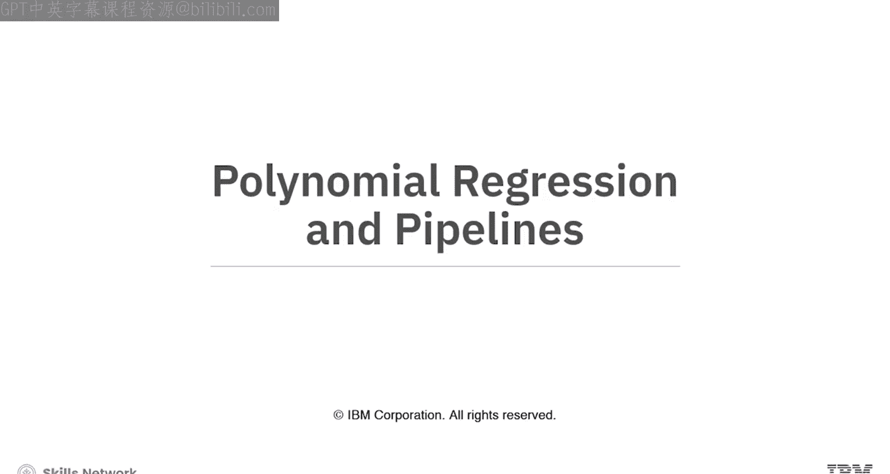

---

## 什么是多项式回归？ 📈

多项式回归是广义线性回归的一个特例。这种方法对于描述曲线关系非常有益。

什么是曲线关系？它通过将预测变量平方或设置为更高阶项来获得，即对数据进行变换。

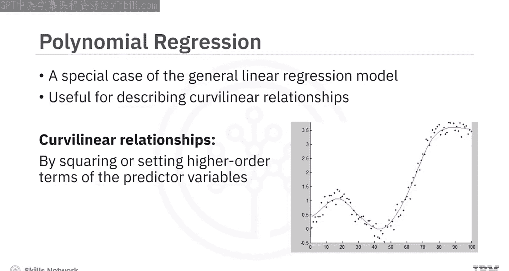

---

## 多项式回归的阶数

模型可以是二次的，这意味着模型中的预测变量被平方。我们使用括号表示指数。这是一个二阶多项式回归，图示代表了该函数。

模型也可以是三次的，这意味着预测变量被立方。这是一个三阶多项式回归。通过观察图示，我们可以看到函数有更多的变化。

当二阶或三阶多项式未能达到良好拟合时，还存在更高阶的多项式回归。我们可以通过图示看到，当改变多项式回归的阶数时，图形变化有多大。

回归的阶数影响显著，如果选择正确的值，可以获得更好的拟合效果。在所有情况下，变量与参数之间的关系始终是线性的。

---

## 多项式回归示例 🐍

让我们看一个数据示例，我们在Python中生成一个多项式回归模型。

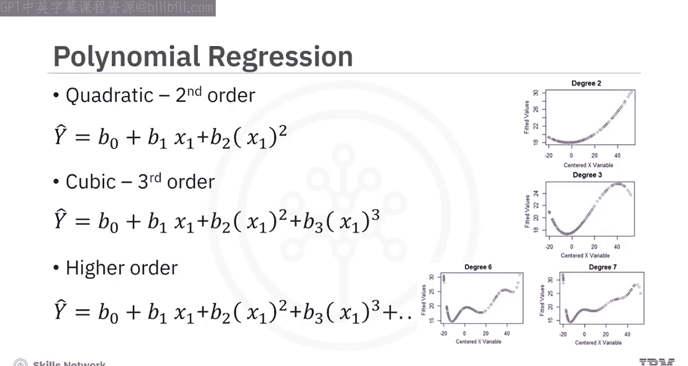

我们使用 `polyfit` 函数来实现。在这个例子中，我们建立了一个三阶多项式回归模型。我们可以打印出模型。

模型的符号形式由以下表达式给出：**-1.557 x₁³ + 204.8 x₁² + 8965 x₁ + 1.37 × 10⁵**。

---

## 多维多项式线性回归

我们也可以有多维多项式线性回归。表达式可能会变得复杂。

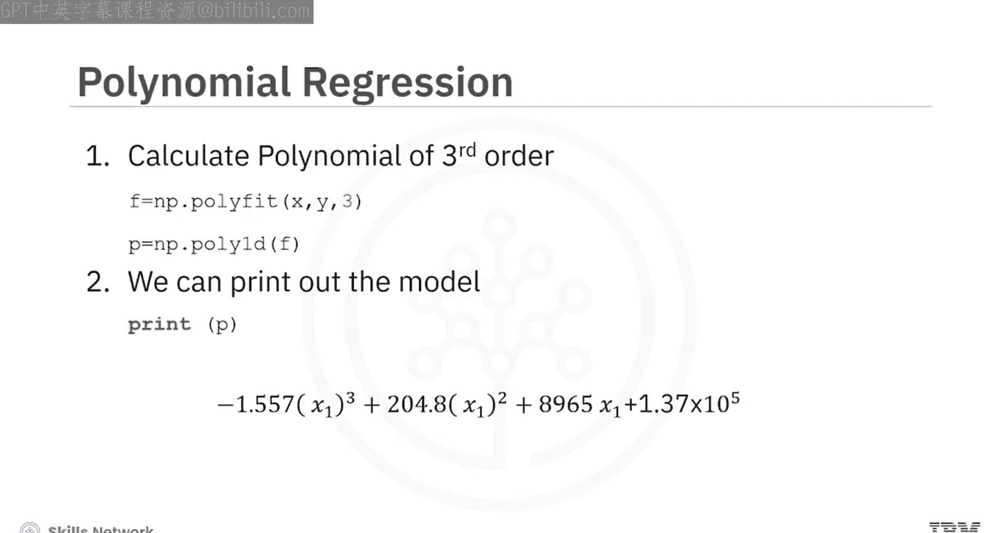

以下是二维二阶多项式的一些项。NumPy的 `polyfit` 函数无法执行这种类型的回归。

---

## 使用Scikit-Learn进行多项式特征变换

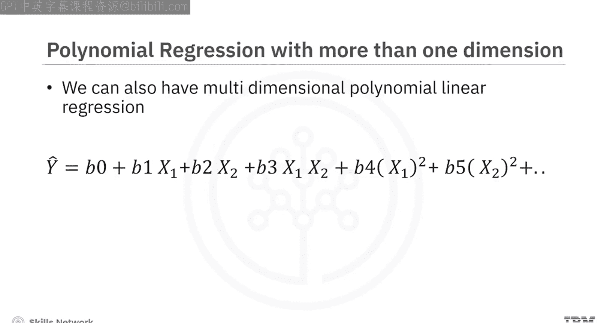

我们使用Scikit-Learn中的预处理库来创建一个多项式特征对象。构造函数将多项式的阶数作为参数。

然后，我们使用 `fit_transform` 方法将特征转换为多项式特征。

让我们做一个更直观的例子。考虑这里显示的特征。应用该方法，我们转换数据。现在我们得到了一组新的特征，它们是原始特征的转换版本。

随着数据维度的增加，我们可能需要在Scikit-Learn中标准化多个特征。相反，我们可以使用预处理模块来简化许多任务。例如，我们可以同时标准化每个特征。

我们导入 `StandardScaler`。我们训练对象并拟合缩放器对象。

---

## 数据标准化

然后将数据转换为新的数据框或数组 `X_scaled`。预处理库中还有更多可用的标准化方法，以及其他变换。

---

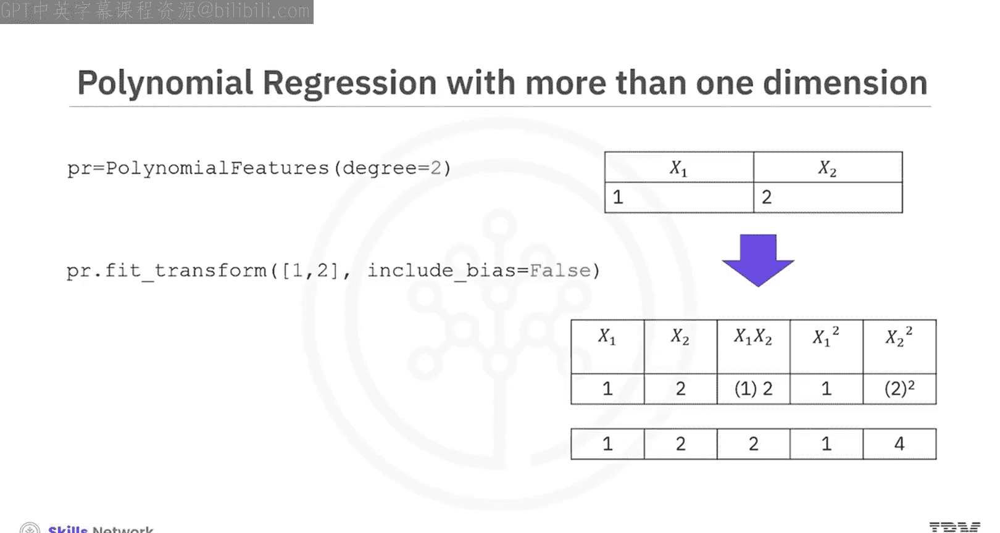

## 使用管道简化代码 🔄

我们可以使用管道库来简化代码。获得预测需要许多步骤，例如多项式变换、标准化和线性回归。

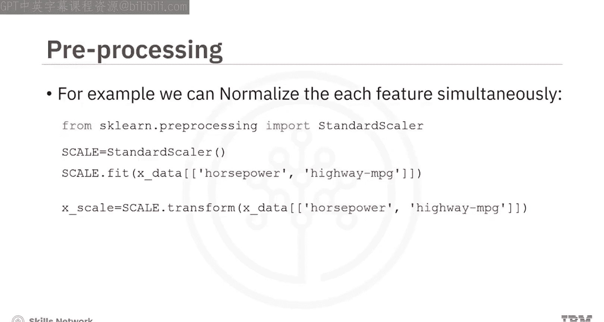

我们使用管道简化这个过程。管道按顺序执行一系列变换。最后一步进行预测。

---

## 创建管道

首先，我们导入所有需要的模块。

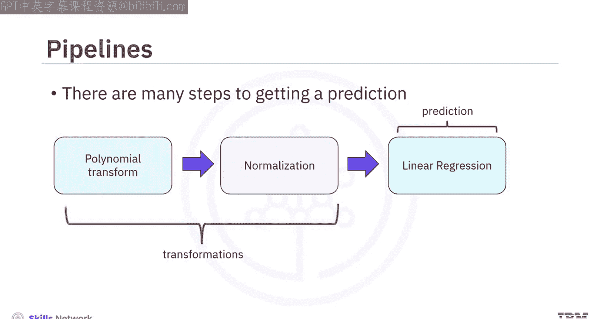

然后我们导入管道库。我们创建一个元组列表。元组中的第一个元素包含估计器模型的名称。第二个元素包含模型构造函数。我们将列表输入管道构造函数。

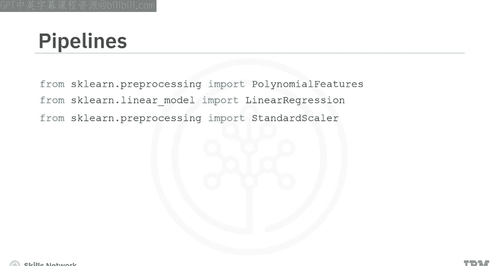

现在我们有了一个管道对象。

---

## 训练与预测

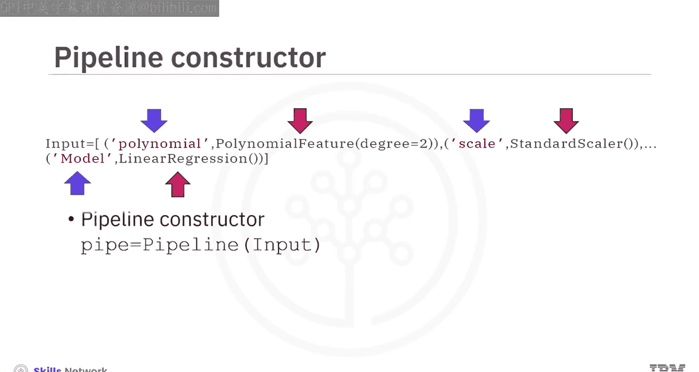

我们可以通过对管道对象应用训练方法来训练管道。我们也可以进行预测。该方法标准化数据，执行多项式变换，然后输出预测。

---

## 总结 🎯

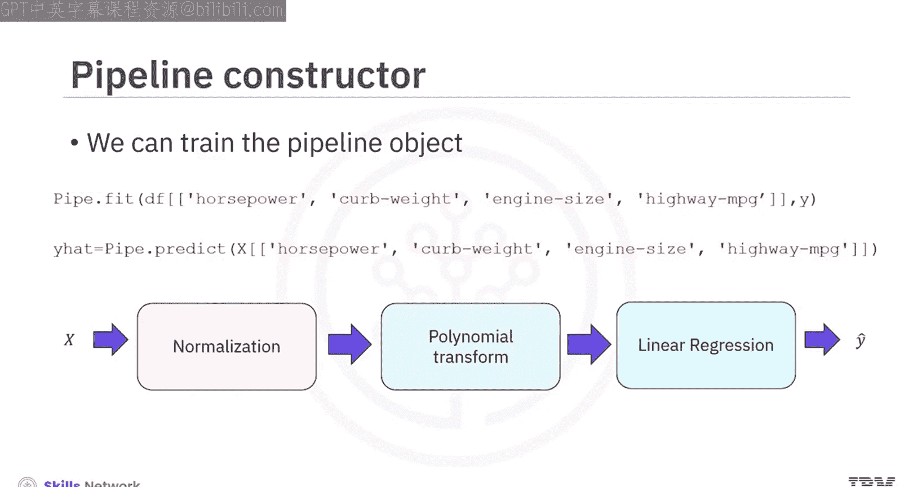

本节课中，我们一起学习了多项式回归模型及其应用。我们了解到，当数据关系非线性时，多项式回归通过引入高阶项可以提供更好的拟合。同时，我们掌握了如何使用Scikit-Learn的管道功能，将数据预处理、特征变换和模型训练等多个步骤高效地组合在一起，从而简化代码并提高工作流程的可维护性。