# 生成式人工智能工程：052：样本内评估的度量 📊

在本节课中，我们将学习如何对模型进行数值化评估。我们将介绍两种重要的样本内评估指标：均方误差（MSE）和决定系数（R²）。这些指标帮助我们量化模型对数据的拟合程度。

上一节我们介绍了通过可视化方法评估模型。本节中，我们来看看如何用数值指标进行更精确的评估。

这些指标是数值化确定模型对数据拟合好坏的方法。

以下是两种我们常用的、用于确定模型拟合度的重要指标。

*   **均方误差（MSE）**：衡量预测值与实际值之间的平均平方差。
*   **决定系数（R²）**：衡量数据点与拟合回归线的接近程度。

## 均方误差（MSE）📏

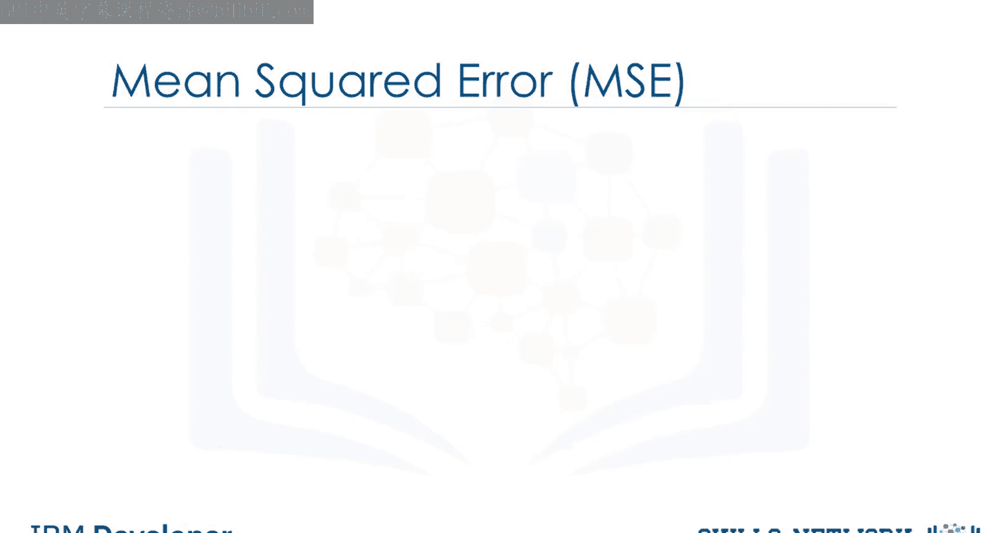

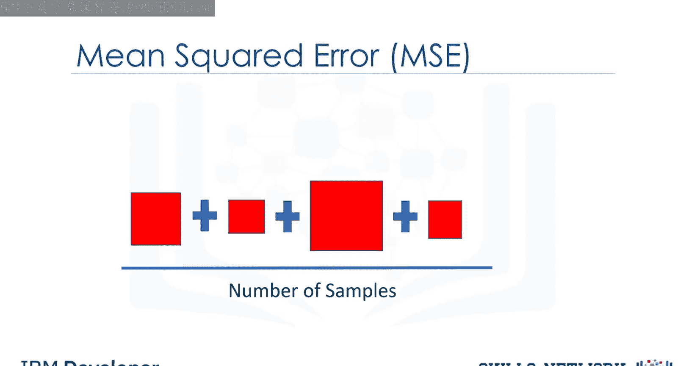

要计算MSE，我们需要求出实际值 **Y** 与预测值 **Ŷ** 之间的差值，然后将其平方。

例如，实际值为150，预测值为50。两者相减得到100。然后将这个数平方。

接着，将所有样本的误差平方相加，再除以样本数量，取其平均值，即可得到MSE。

在Python中，我们可以从`sklearn.metrics`导入`mean_squared_error`函数。

```python
from sklearn.metrics import mean_squared_error
```

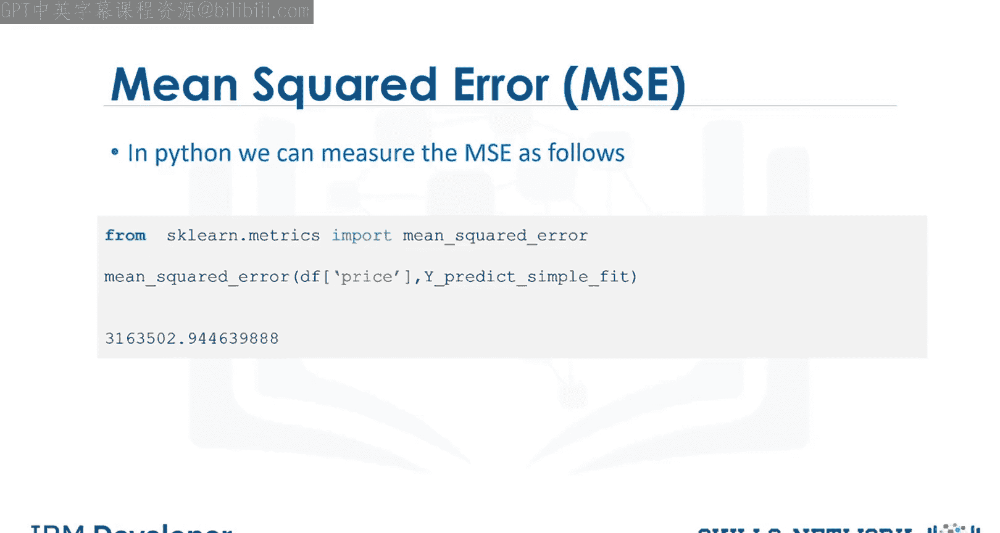

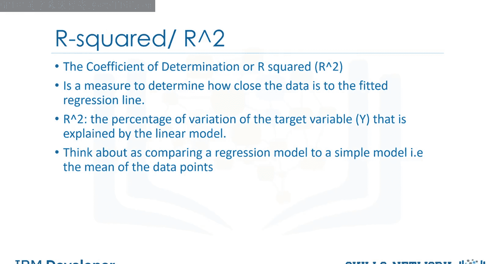

`mean_squared_error`函数接收两个输入：目标变量的实际值和目标变量的预测值。

## 决定系数（R²）🎯

R²也称为**判定系数**。它是一个衡量数据与拟合回归线接近程度的指标，即我们的实际数据与估计模型的接近程度。

可以将其理解为将回归模型与一个简单模型（即数据点的平均值）进行比较。如果变量 **X** 是一个好的预测因子，我们的模型性能应该远优于仅使用平均值。

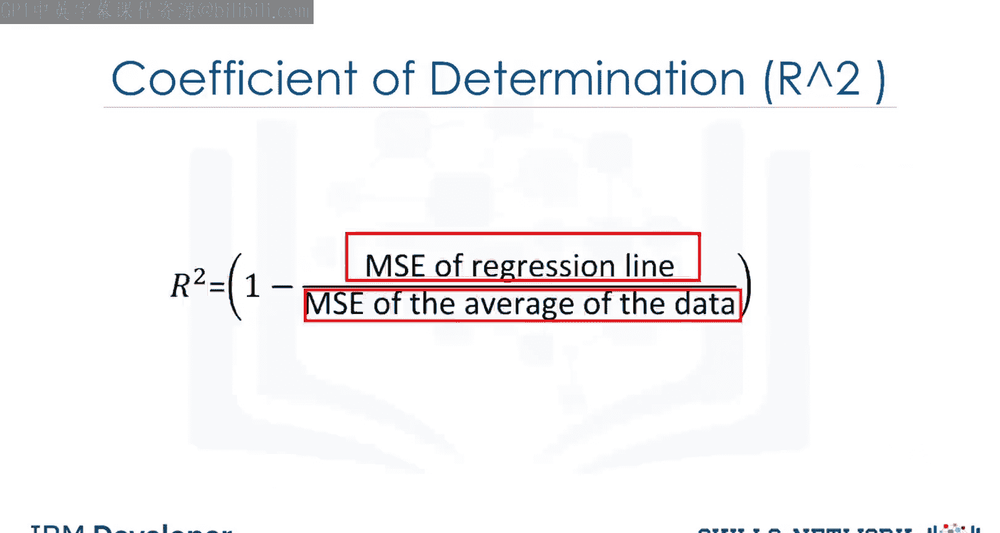

在这个例子中，数据点的平均值 **Ȳ** 是6。

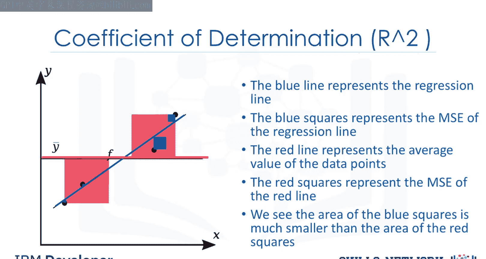

决定系数 **R²** 的计算公式为：**1 - （回归线的MSE / 数据点平均值的MSE）**。

在大多数情况下，其值介于0和1之间。

让我们看一个回归线拟合相对较好的情况。蓝线代表回归线，蓝色方块代表回归线的MSE。红线代表数据点的平均值，红色方块代表红线的MSE。我们可以看到蓝色方块的面积远小于红色方块的面积。

在这种情况下，因为回归线拟合得好，其均方误差较小（分子小）。而平均线的均方误差相对较大（分母大）。一个较小的数除以一个较大的数，结果会更小。极端情况下，这个比值趋近于0。将上一张幻灯片中的这个值代入R²公式，我们得到的值接近1。这意味着回归线对数据的拟合很好。

这里是一个回归线未能很好拟合数据的例子。如果我们仅比较红色方块与蓝色方块的面积，会发现两者面积几乎相同。面积比值接近1。

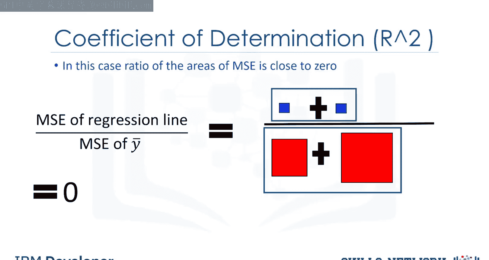

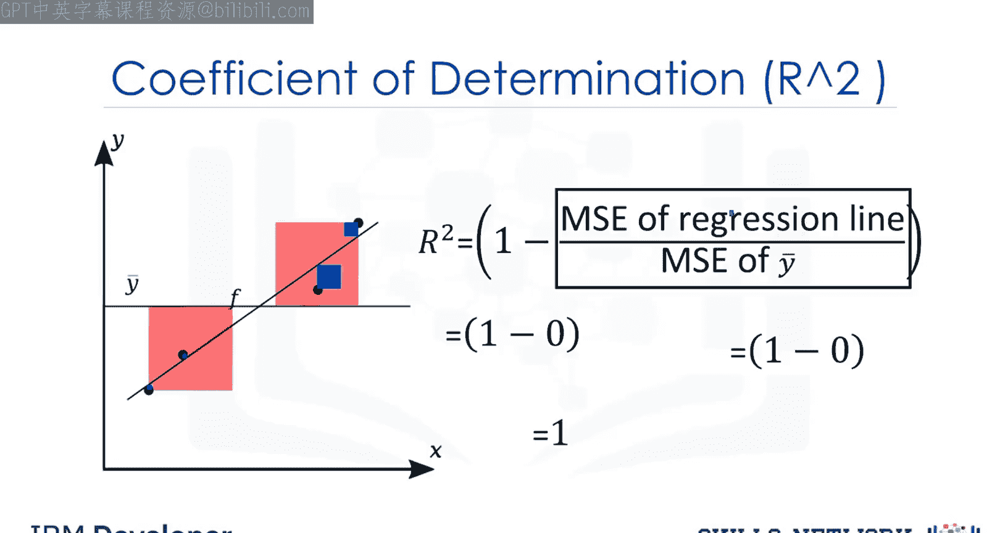

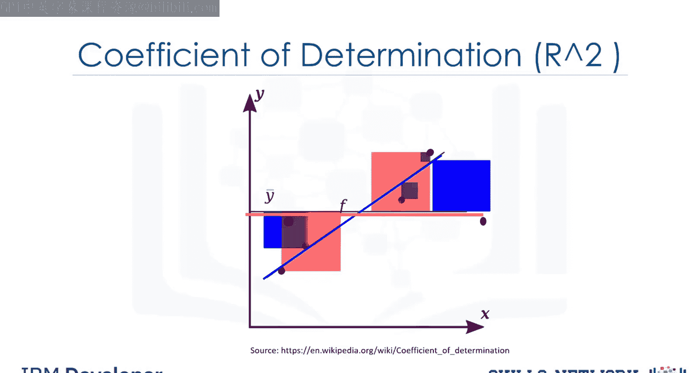

在这种情况下，R²值接近0。这条线的表现与仅使用数据点平均值的效果差不多。因此，这条线的表现不佳。

在Python中，我们使用线性回归对象中的`score`方法来获取R²值。

根据从这个例子中得到的结果，我们可以说，大约**49.695%** 的价格变化可以由这个简单线性模型解释。

你的R²值通常介于0和1之间。如果你的R²值为负数，可能是由于**过拟合**造成的，我们将在下一个模块中讨论。

---

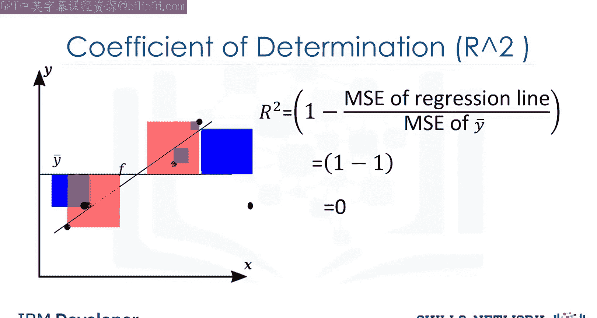

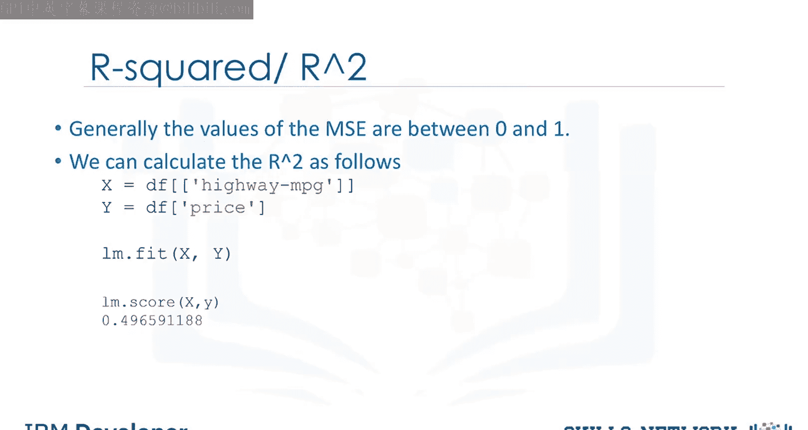

本节课中，我们一起学习了两种关键的样本内评估指标：**均方误差（MSE）** 和 **决定系数（R²）**。MSE衡量了预测误差的平均大小，而R²则解释了模型对数据变异的解释比例。理解这些指标对于判断回归模型的性能至关重要。