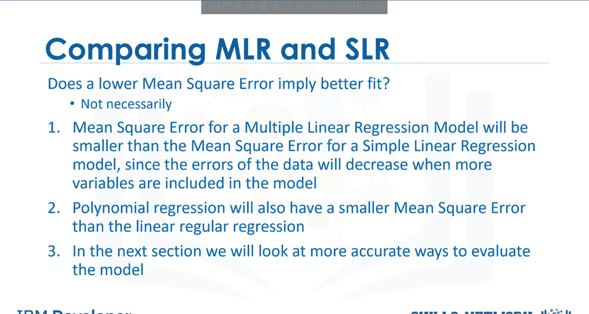

# 生成式人工智能工程：053：预测与决策


在本节课中，我们将学习如何评估模型的预测结果，并基于此做出决策。我们将探讨如何判断模型是否正确，以及使用哪些工具和方法来验证模型的合理性。

## 模型合理性的初步检查

上一节我们介绍了模型训练的基本方法，本节中我们来看看如何评估模型的预测结果。首先，你需要确保模型的输出结果是合理的。

以下是评估模型合理性的核心步骤：

1.  **可视化分析**：始终使用图表来直观展示数据和模型预测。
2.  **数值评估**：使用数值指标来量化模型的性能。
3.  **模型比较**：在不同模型之间进行比较，以选择最佳模型。

## 预测示例

让我们看一个具体的预测例子。回想一下，我们使用 `fit` 方法来训练模型。现在，我们想预测一辆高速公路油耗为每加仑30英里的汽车价格。

将数值代入 `predict` 方法，我们得到预测价格为 **$13771.30**。

这个结果看起来是合理的。例如，价格不是负数，也没有极高或极低。我们可以通过检查 `coef_` 属性来查看模型的系数。

回想一下用于根据高速公路油耗预测价格的简单线性模型表达式，该系数对应于高速公路油耗特征的倍数。因此，高速公路油耗每增加一个单位，汽车价格大约下降 **$821**。这个数值看起来也是合理的。

## 处理不合理的预测值

有时，你的模型会产生不合理的值。例如，如果我们为高速公路油耗在0到100的范围内绘制模型预测线，会得到负的汽车价格。

这可能是因为：
*   该范围内的数值不现实。
*   线性假设不正确。
*   我们没有该范围内汽车的数据。

在本例中，汽车不太可能有那么高的燃油里程，因此我们的模型看起来是有效的。

## 生成预测序列与可视化

为了在指定范围内生成一系列值进行预测，我们需要导入 `numpy`，然后使用 `numpy.arange` 函数生成序列。

```python
import numpy as np
# 生成从1到100（不包括101），步长为1的序列
sequence = np.arange(1, 101, 1)
```

我们可以使用这个序列的输出值来预测新值。输出是一个 `numpy` 数组，其中许多预测值是负数，这再次强调了在合理数据范围内评估模型的重要性。

**使用回归图可视化数据**是你应该尝试的首要方法。请参阅实验部分以了解如何绘制多项式回归图。

在这个例子中，自变量（高速公路油耗）的影响是明显的。数据趋势随着因变量（价格）的增加而下降。图表还显示了一些非线性行为。

**检查残差图**，在这种情况下，残差呈现出曲线形态，暗示了非线性关系。

**分布图**是评估多元线性回归的好方法。例如，我们看到价格在30000到50000范围内的预测值不准确。这表明非线性模型可能更合适，或者我们需要该范围内更多的数据。

## 数值评估指标

**均方误差**或许是判断模型好坏最直观的数值指标。让我们看看不同的均方误差值如何影响对模型的判断。

第一张图的均方误差为 **3495**。
第二张图的均方误差为 **3652**。
最后一张图的均方误差为 **12870**。

随着均方误差的增加，目标点离预测线越来越远。

## R平方评估法

正如我们讨论过的，**R平方**是另一个评估模型的流行方法。它告诉你模型拟合直线的效果如何。R平方值的范围从0到1。

**R平方**告诉我们因变量的变异中有多少百分比可以由自变量的回归来解释。

*   R平方等于 **1** 意味着因变量的所有变动都可以完全由自变量的变动来解释。
*   在第一个图中，我们看到红色目标点和蓝色预测线，R平方为 **0.9986**。模型看起来拟合得很好，这意味着超过99%的预测变量变异可以由自变量解释。
*   第二个模型的R平方为 **0.9226**。仍然存在很强的线性关系，模型拟合度良好。
*   第三个模型的R平方为 **0.8** 或 **0.6**。从视觉上我们可以看到数值分散在直线周围，但它们仍然接近直线。我们可以说，预测变量80%的变异可以由自变量解释。
*   R平方为 **0.61** 意味着大约61%的观测变异可以由自变量解释。

R平方的可接受值取决于你研究的领域和具体用例。Falcon & Miller (1992) 建议，可接受的R平方值应至少为 **0.1**。

## 关于模型比较的注意事项

更低的均方误差一定意味着更好的拟合吗？不一定。多元线性回归模型的均方误差会比简单线性回归模型的均方误差小，因为当模型中包含更多变量时，数据的误差会减小。同样，多项式回归的均方误差也会比常规线性回归小。

在下一节中，我们将探讨更准确的模型评估方法。

## 总结



本节课中，我们一起学习了如何对机器学习模型的预测结果进行评估和决策。我们介绍了通过可视化（如回归图、残差图、分布图）和数值指标（如均方误差和R平方）来检查模型合理性的方法。我们了解到，评估模型需要结合领域知识，并理解不同评估指标的局限性，为选择和改进模型提供了基础。