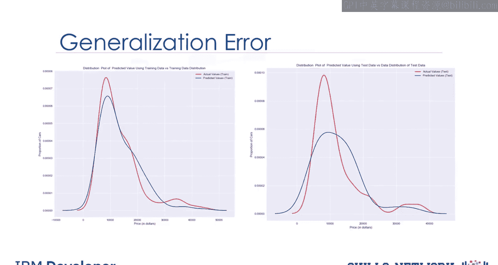
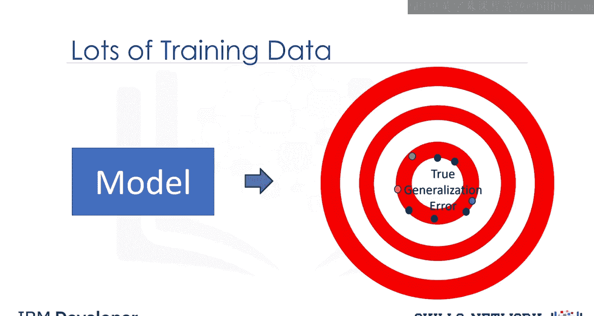
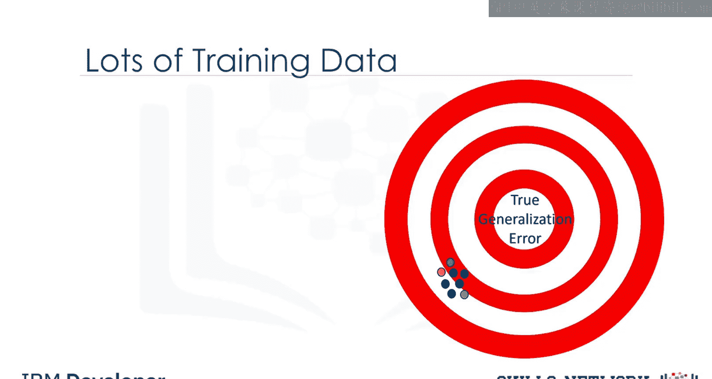
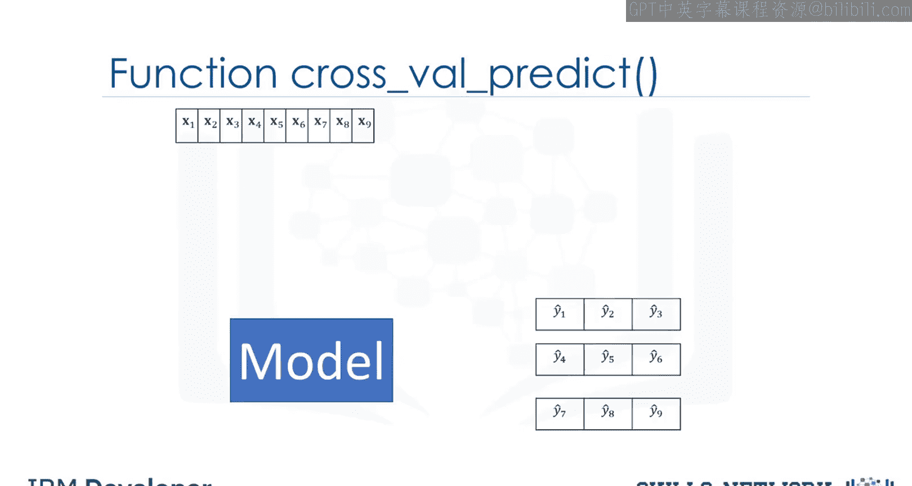

# 生成式人工智能工程：054：模型评估与优化

在本节课中，我们将要学习如何评估和优化机器学习模型。我们将了解为什么需要将数据划分为训练集和测试集，以及如何使用交叉验证来更可靠地估计模型在真实世界中的表现。

## 概述

模型评估告诉我们模型在真实世界中的表现如何。上一节我们介绍了样本内评估，它衡量的是模型对训练数据的拟合程度。然而，这并不能估计训练好的模型预测新数据的能力。本节中我们来看看如何通过样本外评估来解决这个问题。

## 数据划分：训练集与测试集

解决方案是将我们的数据拆分。一部分数据，称为训练数据，用于训练模型。其余的数据，称为测试数据，则作为样本外数据使用。这些数据随后被用来近似估计模型在真实世界中的表现。

将数据分离为训练集和测试集是模型评估的重要环节。我们使用测试数据来了解模型在真实世界中的表现。

当我们划分数据集时，通常大部分数据用于训练，较小部分用于测试。例如，我们可以使用70%的数据进行训练，然后使用30%的数据进行测试。

以下是数据划分的核心步骤：
*   我们使用训练集来构建模型并发现预测关系。
*   然后我们使用测试集来评估模型性能。
*   当我们完成模型测试后，应该使用全部数据重新训练最终模型。

Scikit-learn 包中一个用于拆分数据集的常用函数是 `train_test_split` 函数。该函数将数据集随机分割为训练和测试子集。

从示例代码片段中可以看到，该方法从 `sklearn.model_selection` 导入。输入参数 `y_data` 是目标变量（在汽车估价例子中就是价格），`x_data` 是预测变量列表（本例中是我们用来预测价格的所有其他汽车数据集变量）。输出是数组：`x_train` 和 `y_train`（用于训练的子集），以及 `x_test` 和 `y_test`（用于测试的子集）。在本例中，`test_size` 是分配给测试集的数据百分比，这里是30%。`random_state` 是用于随机数据集分割的随机种子。

```python
from sklearn.model_selection import train_test_split

x_train, x_test, y_train, y_test = train_test_split(x_data, y_data, test_size=0.3, random_state=42)
```

## 泛化误差



泛化误差是衡量我们的数据在预测先前未见数据时表现如何的指标。我们使用测试数据得到的误差就是这个误差的近似值。

此图显示了实际值（红色）的分布与线性回归预测值（蓝色）的分布。我们看到两者的分布有些相似。如果我们使用测试数据生成相同的图，会发现分布相对不同。这种差异是由于泛化误差造成的，它代表了我们在现实世界中看到的情况。


## 训练数据量与评估精度

使用大量数据进行训练，能为我们提供准确的方法来确定模型在真实世界中的表现。但性能估计的精度会较低。让我们用一个例子来阐明这一点。



这个靶心图的中心代表正确的泛化误差。假设我们随机抽取数据样本，使用90%的数据进行训练，10%进行测试。第一次实验时，我们得到了对训练数据的良好估计。如果我们再次实验，用不同的样本组合训练模型，也会得到不错的结果，但结果会与第一次运行实验时不同。用不同的训练和测试样本组合重复实验，结果相对接近泛化误差，但彼此之间仍有差异。重复这个过程，我们得到了泛化误差的良好近似，但精度很差，即所有结果彼此之间差异很大。




如果我们使用较少的数据点来训练模型，用更多的数据来测试模型，泛化性能估计的准确性会降低，但模型会有很好的精度。上图说明了这一点。我们所有的误差估计都相对接近，但它们离真实的泛化性能更远。


## 交叉验证

为了克服这个问题，我们使用交叉验证。最常见的样本外评估指标之一是交叉验证。

在这种方法中，数据集被分成K个相等的组。每个组被称为一个折叠，例如四个折叠。其中一些折叠可以用作训练集（我们用它来训练模型），其余部分用作测试集（我们用它来测试模型）。例如，我们可以使用三个折叠进行训练，然后使用一个折叠进行测试。这个过程不断重复，直到每个分区都既用于训练也用于测试。最后，我们使用平均结果作为样本外误差的估计。

评估指标取决于模型，例如R平方值。

应用交叉验证最简单的方法是调用 `cross_val_score` 函数，该函数执行多次样本外评估。此方法从Scikit-learn的模型选择包中导入。然后我们使用函数 `cross_val_score`。第一个输入参数是我们要用于进行交叉验证的模型类型。在本例中，我们初始化了一个线性回归模型对象 `lr`，并将其传递给 `cross_val_score` 函数。其他参数是 `x_data`（预测变量数据）和 `y_data`（目标变量数据）。我们可以通过 `cv` 参数管理分区数量。这里，`cv=3` 意味着数据集被分成三个相等的分区。该函数返回一个分数数组，每个被选为测试集的分区对应一个分数。我们可以使用NumPy中的 `mean` 函数将结果平均，以估计样本外R平方值。

```python
from sklearn.model_selection import cross_val_score
from sklearn.linear_model import LinearRegression
import numpy as np

lr = LinearRegression()
scores = cross_val_score(lr, x_data, y_data, cv=3)
out_of_sample_r2 = np.mean(scores)
```

让我们看一个动画演示。首先，我们将数据分成三个折叠。我们使用两个折叠进行训练，剩余的折叠进行测试。模型将产生一个输出。我们将使用该输出来计算一个分数（在R平方，即决定系数的情况下）。我们将该值存储在一个数组中。我们重复这个过程，使用两个折叠进行训练，一个折叠进行测试，保存分数。然后使用不同的组合进行训练，剩余的折叠进行测试。我们存储最终结果。`cross_val_score` 函数返回一个分数值，告诉我们交叉验证的结果。

## 获取预测值

如果我们想要更多信息呢？如果我们想知道在计算R平方值之前，模型提供的实际预测值呢？为此，我们使用 `cross_val_predict` 函数。输入参数与 `cross_val_score` 函数完全相同，但输出是预测值。

让我们说明这个过程。首先，我们将数据分成三个折叠。我们使用两个折叠进行训练，剩余的折叠进行测试。模型将产生一个输出，我们将其存储在数组中。我们重复这个过程，使用两个折叠进行训练，一个用于测试。模型再次产生输出。最后，我们使用最后两个折叠进行训练，然后使用测试数据。这最后的测试折叠产生一个输出。这些预测值被存储在一个数组中。



```python
from sklearn.model_selection import cross_val_predict

predictions = cross_val_predict(lr, x_data, y_data, cv=3)
```

## 总结


本节课中我们一起学习了模型评估与优化的核心概念。我们了解到，仅使用训练数据评估模型（样本内评估）不足以反映其在新数据上的表现。因此，我们需要将数据划分为训练集和测试集进行样本外评估。为了更稳定、可靠地估计模型的泛化误差，我们引入了交叉验证技术，它通过多次划分和平均结果，有效平衡了评估的准确性与精度。我们还学习了如何使用Scikit-learn库中的 `train_test_split`、`cross_val_score` 和 `cross_val_predict` 等工具来实现这些步骤。掌握这些方法是构建可靠机器学习模型的关键。