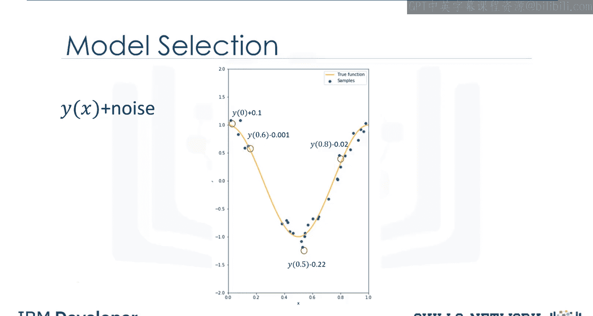
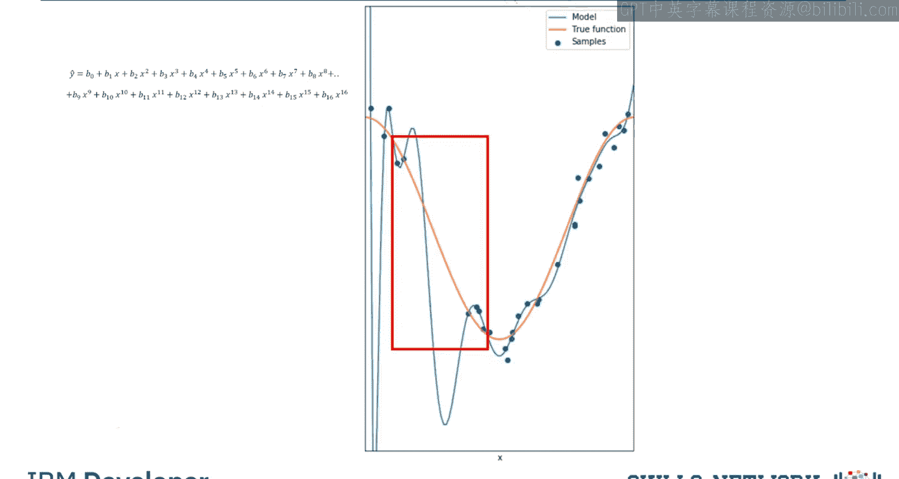
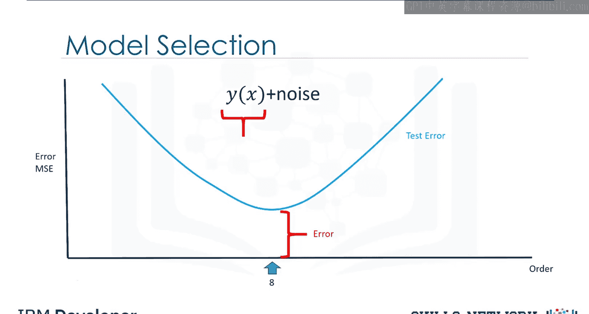
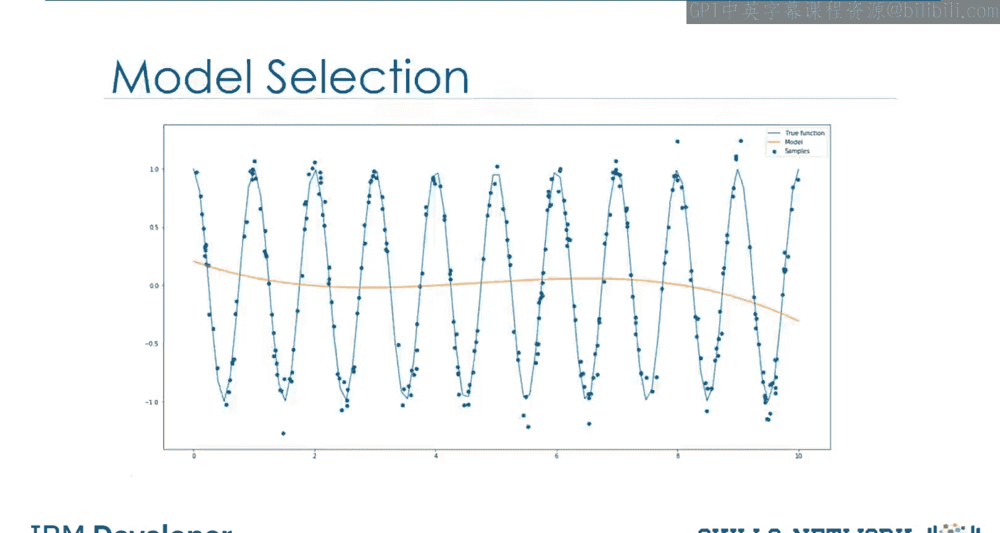
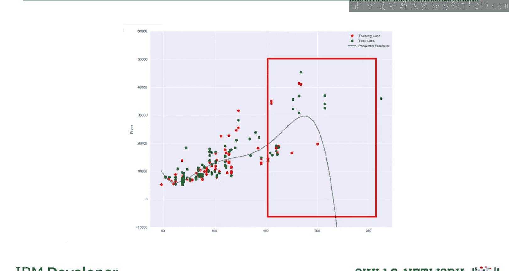
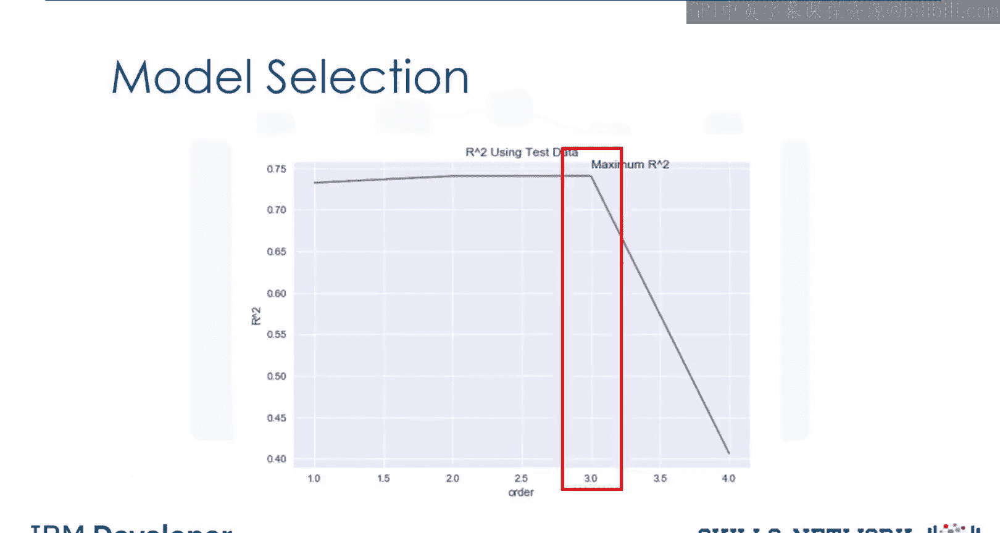
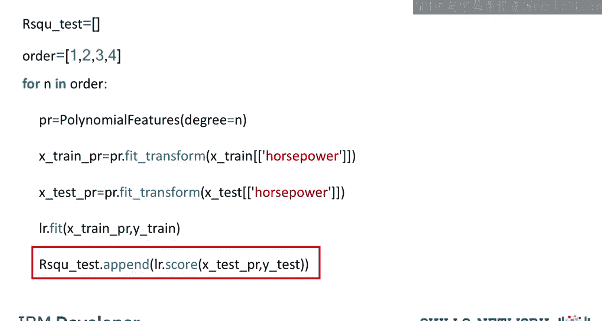

# 生成式人工智能工程：055：过拟合、欠拟合与模型选择 📊

在本节课中，我们将学习如何为多项式回归模型选择最佳的多项式阶数，并深入探讨选择错误阶数时会引发的问题——即过拟合与欠拟合。

上一节我们介绍了多项式回归。本节中，我们来看看如何选择最佳的多项式阶数，以及错误选择阶数时会出现的问题。

考虑以下函数。我们假设训练数据点来源于一个多项式函数，并附加了一些噪声。

模型选择的目标是确定多项式的最佳阶数，以提供对函数 `Y = f(X)` 的最佳估计。

## 欠拟合与过拟合

如果我们尝试用一个线性函数来拟合数据，会发现这条线不够复杂，无法很好地拟合数据点，导致许多误差。这种情况被称为**欠拟合**，即模型过于简单，无法捕捉数据中的规律。

当我们增加多项式的阶数时，模型拟合效果会变好。但如果阶数仍然不足，模型依然会表现出欠拟合。

下图展示了一个八阶多项式拟合数据的效果。可以看到，模型在拟合数据和估计函数方面表现良好，即使在拐点处也是如此。

然而，当我们将阶数增加到十六阶时，模型在追踪训练数据点上表现得极其出色，但在估计真实函数时却表现很差。这在训练数据稀少的区域尤为明显，估计出的函数会产生剧烈振荡，无法追踪真实函数。这种情况被称为**过拟合**，即模型过于灵活，以至于拟合了数据中的噪声而非潜在的函数规律。

## 误差分析

让我们观察不同阶数多项式在训练集和测试集上的均方误差（MSE）图。

*   **横轴**：多项式的阶数。
*   **纵轴**：均方误差。

训练误差随着多项式阶数的增加而持续下降。

测试误差是评估多项式性能的更好指标。误差会先下降，直到达到最佳多项式阶数，然后开始上升。我们选择使测试误差最小的阶数。在本例中，最佳阶数是8。

*   图中最佳阶数左侧的区域代表**欠拟合**。
*   图中最佳阶数右侧的区域代表**过拟合**。

## 误差来源

即使我们选择了最佳的多项式阶数，仍然会存在一些误差。回顾训练数据点的原始表达式，其中包含一个噪声项。这个噪声项是误差的来源之一。由于噪声是随机的，我们无法预测它，这有时被称为**不可约误差**。

此外，还存在其他误差来源。例如，我们的多项式假设本身可能是错误的。样本点可能来自一个完全不同的函数。在下图中，数据是由一个正弦波生成的。多项式函数在拟合正弦波时表现不佳。

对于真实数据，模型可能过于复杂难以拟合，或者我们可能没有正确的数据类型来准确估计函数。

## 实战：汽车数据案例

让我们在真实的汽车数据（以马力为特征）上尝试不同阶数的多项式。

*   红点代表训练数据。
*   绿点代表测试数据。

如果我们仅使用数据的平均值作为模型，其表现不佳。线性函数能更好地拟合数据。二阶模型看起来与线性函数相似。三阶函数也呈现出与前两阶类似的增长趋势。

然而，当我们观察四阶多项式时，发现在马力值约200处，预测价格突然下降。这看起来是错误的。

为了验证我们的直觉，让我们使用R平方值来评估模型。

下图是R平方值的曲线图。横轴代表多项式模型的阶数。R平方值越接近1，模型越准确。

我们可以看到，当多项式阶数为3时，R平方值达到最优。当阶数增加到4时，R平方值急剧下降，这验证了我们最初的假设。

## 计算R平方值

我们可以通过以下步骤计算不同阶数下的R平方值：

以下是计算流程：
1.  创建一个空列表来存储R平方值。
2.  创建一个包含不同多项式阶数的列表。
3.  使用循环遍历该列表。
4.  创建一个多项式特征对象，并将多项式阶数作为参数传入。
5.  使用 `fit_transform` 方法将训练数据和测试数据转换为多项式特征。
6.  使用转换后的数据拟合回归模型。
7.  使用测试数据计算R平方值，并将其存储在数组中。

## 总结

本节课中，我们一起学习了模型选择的核心概念。我们探讨了**欠拟合**（模型过于简单）和**过拟合**（模型过于复杂）的现象，并理解了使用测试误差来选择最佳模型阶数的重要性。我们还通过汽车数据的实际案例，演示了如何利用R平方指标来评估不同多项式模型的性能，从而避免选择导致性能下降的模型阶数。记住，一个好的模型需要在复杂度和泛化能力之间取得平衡。