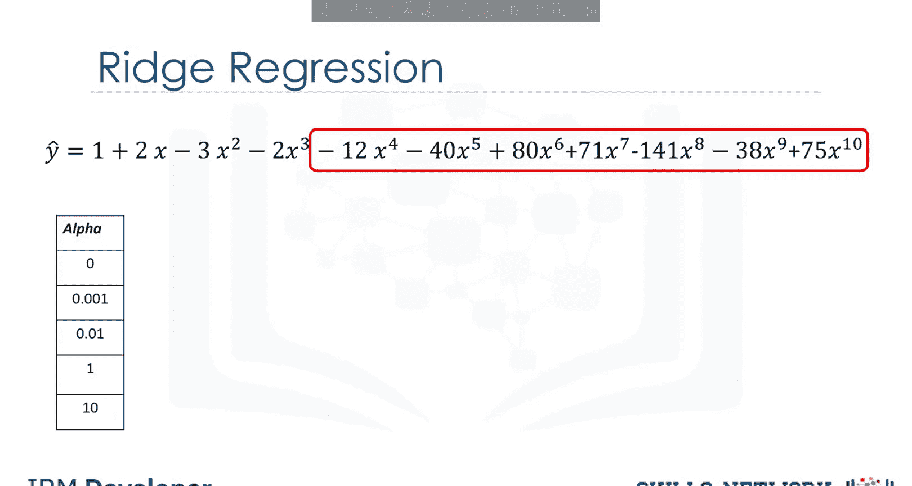
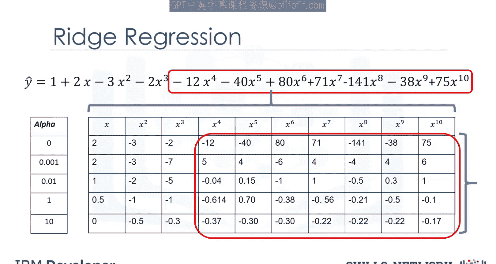
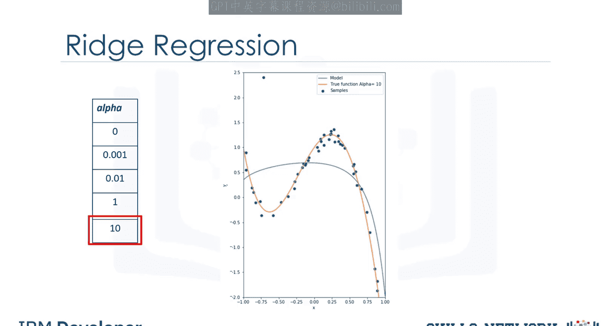
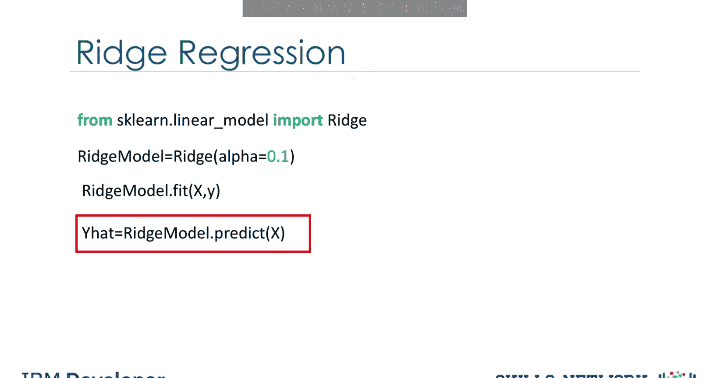
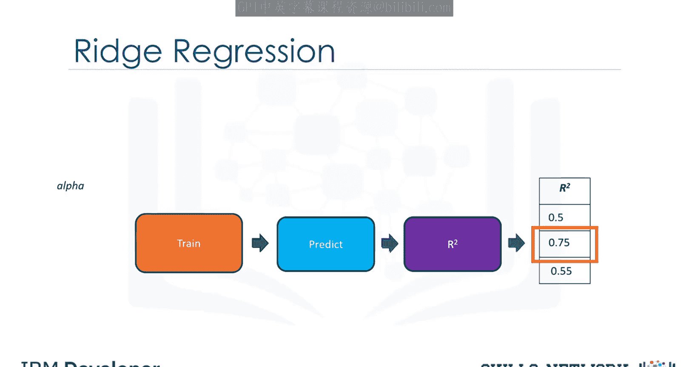
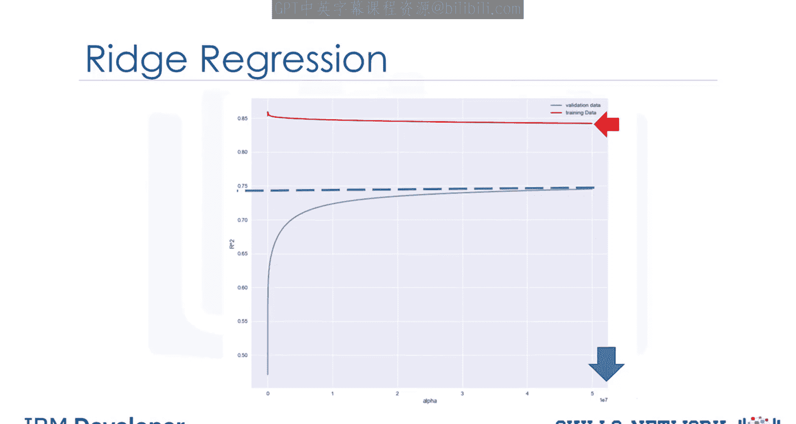

# 生成式人工智能工程：056：岭回归 🏔️

在本节课中，我们将要学习岭回归。岭回归是一种用于防止模型过拟合的技术。我们将通过多项式回归的例子来直观地理解过拟合问题，并学习如何使用岭回归中的 `alpha` 参数来控制模型复杂度。

## 过拟合问题

上一节我们介绍了回归的基本概念，本节中我们来看看一个常见的问题：过拟合。当模型过于复杂时，它可能会完美地拟合训练数据，包括其中的噪声和异常值，从而导致在新数据上表现不佳。

考虑以下由橙色线表示的四阶多项式函数。蓝色点是从这个函数中生成的样本数据。



我们可以使用一个十阶多项式来拟合这些数据。蓝色估计函数在近似真实函数方面做得很好。

## 异常值的影响

然而，真实数据常常包含异常值。例如，下图中的这个点似乎并非来自原始的橙色函数。



如果我们继续使用十阶多项式函数来拟合包含此异常值的数据，得到的蓝色估计函数将是错误的，并且不能很好地估计实际的橙色函数。如果我们检查估计函数的表达式，会发现估计出的多项式系数具有非常大的幅度，这对于高阶项尤为明显。


## 岭回归的原理

岭回归通过引入一个名为 `alpha` 的参数来控制这些多项式系数的大小，从而防止过拟合。`alpha` 是一个在拟合或训练模型之前需要选择的参数。

以下是不同 `alpha` 值对模型系数的影响。表格的每一行代表一个递增的 `alpha` 值。



让我们看看不同的 `alpha` 值如何改变模型。此表展示了不同 `alpha` 值下的多项式系数。列对应不同的多项式系数，行对应不同的 `alpha` 值。


随着 `alpha` 增加，参数值会变小。这对于高阶多项式特征最为明显。但 `alpha` 必须谨慎选择。

*   如果 `alpha` 太大，系数将趋近于0，导致模型欠拟合数据。
*   如果 `alpha` 为0，则等同于普通最小二乘回归，过拟合现象明显。
*   当 `alpha` 等于0.001时，过拟合开始减弱。
*   当 `alpha` 等于0.01时，估计函数能较好地跟踪实际函数。
*   当 `alpha` 等于1时，我们看到了欠拟合的初步迹象，估计函数灵活性不足。
*   当 `alpha` 等于10时，出现极端欠拟合，甚至无法跟踪两个数据点。

## 如何选择 Alpha 参数


为了选择最佳的 `alpha` 值，我们使用交叉验证技术。以下是使用岭回归进行预测和选择 `alpha` 的基本步骤。

首先，从 `scikit-learn` 导入岭回归并创建模型对象：

```python
from sklearn.linear_model import Ridge
ridge_model = Ridge(alpha=0.5) # alpha 是构造函数的参数之一
```

我们使用 `fit` 方法训练模型，使用 `predict` 方法进行预测。

为了确定参数 `alpha`，我们将数据分为两部分：一部分用于训练，另一部分称为验证集（类似于测试集，但专门用于选择像 `alpha` 这样的参数）。

以下是选择 `alpha` 的流程：



1.  从一个较小的 `alpha` 值开始。
2.  使用训练数据训练模型。
3.  使用验证数据进行预测。
4.  计算 R 平方分数并存储该值。
5.  重复以上步骤，换一个更大的 `alpha` 值。
6.  再次训练模型，使用验证数据预测，计算并存储 R 平方值。
7.  为不同的 `alpha` 值重复此过程。
8.  选择能够最大化 R 平方值的 `alpha`。

注意，我们也可以使用其他指标（如均方误差）来选择 `alpha` 值。


## 多特征场景下的应用

如果我们拥有大量特征，过拟合问题会更加严重。下图展示了在二手车数据集上，使用多个特征和二阶多项式函数时，不同 `alpha` 值对应的 R 平方分数变化。



纵轴表示 R 平方值，横轴表示不同的 `alpha` 值。红色曲线代表训练数据，蓝色曲线代表验证数据。


我们可以看到，随着 `alpha` 值增加，验证集上的 R 平方值增加，并在大约 0.75 处收敛。在这种情况下，我们选择最大的 `alpha` 值，因为继续增加 `alpha` 对结果影响甚微。

相反，随着 `alpha` 增加，训练集上的 R 平方值会下降。这是因为 `alpha` 项防止了过拟合，这可能会提升模型在未见数据上的表现，但会导致模型在训练数据上的性能变差。



## 总结


本节课中我们一起学习了岭回归。岭回归通过在损失函数中增加一个与系数平方和成正比的惩罚项（由 `alpha` 参数控制），来限制模型系数的大小，从而有效防止过拟合。我们了解了 `alpha` 参数如何影响模型复杂度，以及如何通过交叉验证来选择最优的 `alpha` 值。这对于处理具有多个特征或高阶项的数据集、构建泛化能力更强的模型至关重要。