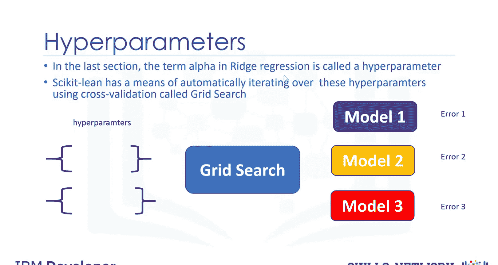
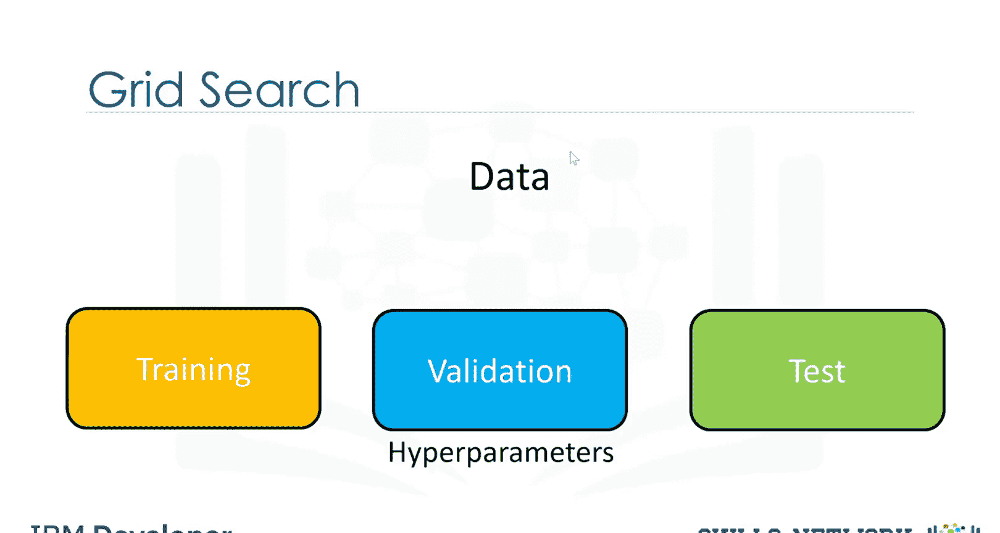
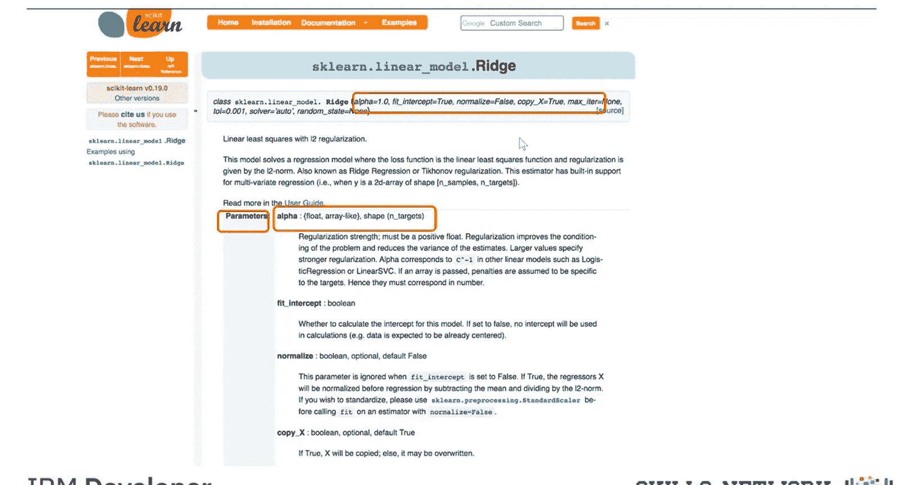
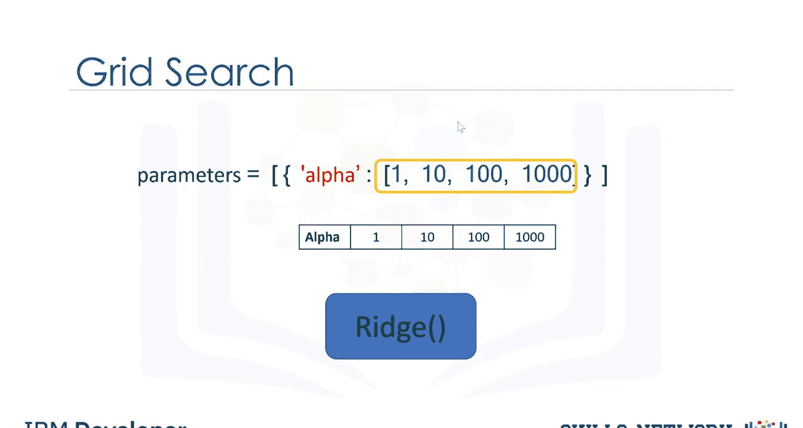
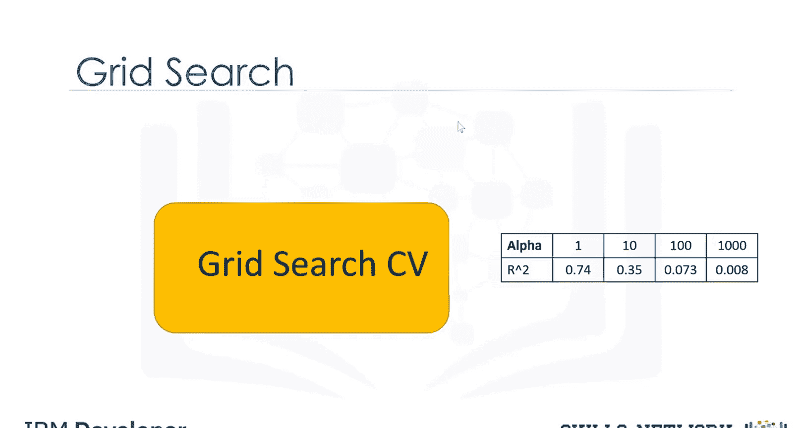
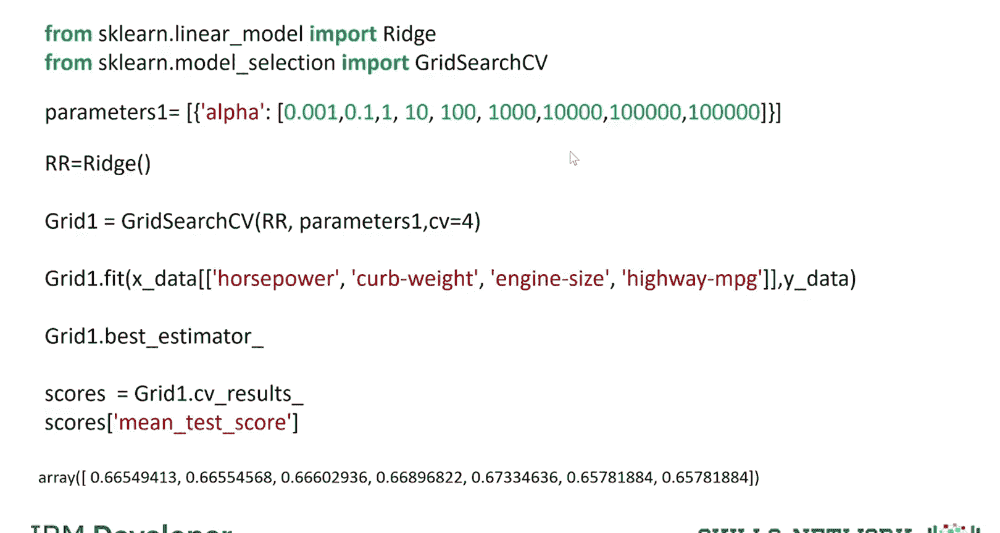
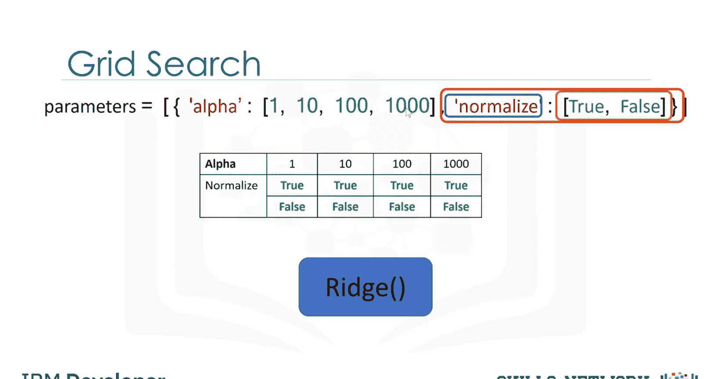
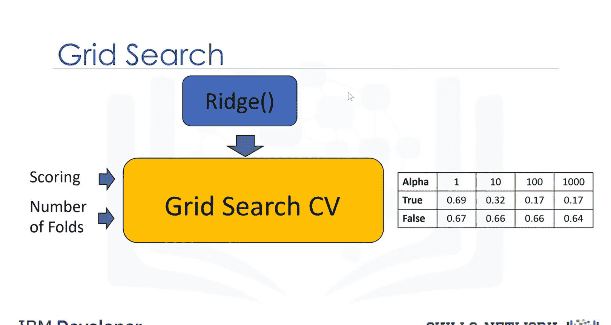
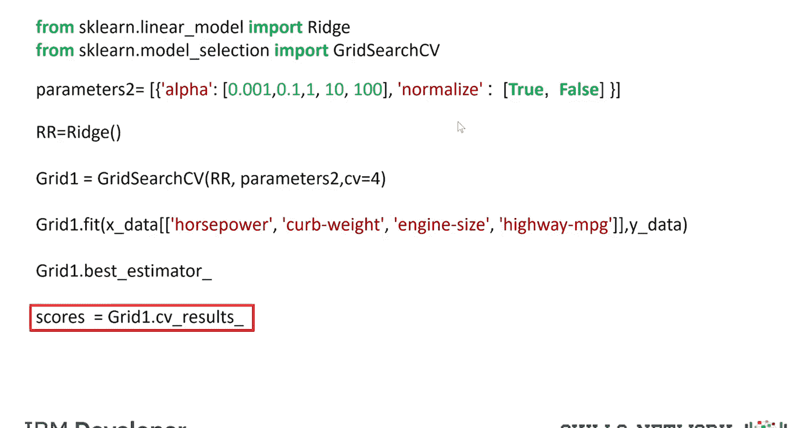

# 生成式人工智能工程：057：网格搜索 📊


在本节课中，我们将学习一种名为“网格搜索”的自动化超参数调优技术。网格搜索能够通过少量代码，系统地扫描多个超参数的不同取值组合，帮助我们找到使模型性能最优的参数配置。

## 概述

上一节我们介绍了岭回归及其正则化参数 `alpha`。像 `alpha` 这类参数并非通过模型拟合过程学习得到，而是在训练前预先设定，它们被称为**超参数**。Scikit-learn 库提供了一种基于交叉验证自动遍历这些超参数的方法，即**网格搜索**。

## 什么是网格搜索？🔍

网格搜索接收待训练的模型对象以及超参数的不同取值列表。它会为每一组超参数值训练模型，并计算评估指标（如均方误差或 R 平方），最终允许我们选择表现最佳的超参数值。

我们可以将不同的超参数值想象成许多小圆圈。网格搜索的过程是：从一个超参数值开始训练模型，然后更换不同的超参数值重复训练，直到遍历完所有预设的参数值组合。每个训练出的模型都会产生一个误差，我们选择使误差最小化的那组超参数。

## 网格搜索的工作流程

以下是网格搜索的典型工作流程：



1.  **数据划分**：将数据集分为三部分：训练集、验证集和测试集。
2.  **模型训练与验证**：针对不同的超参数组合，在训练集上训练模型，并在验证集上计算 R 平方或均方误差。
3.  **选择最优参数**：选择在验证集上能最小化均方误差或最大化 R 平方的超参数组合。
4.  **最终测试**：使用选出的最优超参数，在测试集上评估模型的最终性能。

## 在 Scikit-learn 中定义参数网格

在 Scikit-learn 中，对象的构造参数（包括超参数）通常被称为参数。在本模块中，我们将重点关注岭回归的超参数 `alpha` 和数据标准化参数 `normalize`。



网格搜索的核心是一个 Python 字典列表。字典的键是超参数的名称，值是该超参数待尝试的不同取值列表。这可以看作一个包含各种参数值的表格。

```python
# 示例：定义参数网格
param_grid = [
    {'alpha': [0.1, 1.0, 10.0], 'normalize': [True, False]}
]
```



## 创建与运行网格搜索

以下是使用 `GridSearchCV` 进行网格搜索的基本步骤：

首先，导入必要的库，包括 `GridSearchCV`。



```python
from sklearn.linear_model import Ridge
from sklearn.model_selection import GridSearchCV
import numpy as np
```

接着，创建岭回归模型对象和参数网格字典。

```python
# 创建模型对象
ridge = Ridge()



# 定义参数网格
parameters = {'alpha': [0.1, 1.0, 10.0]}
```

然后，创建 `GridSearchCV` 对象。其输入包括模型对象、参数网格和交叉验证的折数。我们将使用 R 平方作为评估指标（这是默认选项）。

```python
# 创建 GridSearchCV 对象，使用 5 折交叉验证
grid = GridSearchCV(ridge, parameters, cv=5)
grid.fit(X_train, y_train)  # 拟合数据
```

拟合完成后，我们可以通过 `best_estimator_` 属性找到最优的超参数值，也可以通过 `cv_results_` 属性获取验证集上的平均分数等信息。

```python
# 获取最佳参数
best_params = grid.best_params_
# 获取交叉验证结果详情
cv_results = grid.cv_results_
```



## 同时搜索多个参数

网格搜索的一个优势在于能快速测试多个参数的组合。例如，岭回归除了 `alpha`，还有是否标准化数据的 `normalize` 选项。

以下是包含两个参数的网格定义示例：

```python
# 定义包含两个参数的网格
parameters = {'alpha': [0.1, 1.0, 10.0], 'normalize': [True, False]}
```



创建和运行网格搜索的代码与之前类似，只是参数网格字典包含了更多维度的组合。输出结果将包含所有不同参数组合的得分。

```python
# 代码类似，但参数网格更复杂
grid = GridSearchCV(ridge, parameters, cv=5)
grid.fit(X_train, y_train)



# 找到最佳参数组合
best_combo = grid.best_params_
# 查看所有参数组合的详细结果
all_results = grid.cv_results_
```

我们可以打印出不同超参数值对应的分数。参数值会像课程示例中展示的那样存储。更多实践案例请参考课程实验部分。



## 总结

本节课我们一起学习了网格搜索技术。我们了解到，网格搜索是一种系统化的超参数调优方法，它通过遍历预定义的参数组合，并利用交叉验证进行评估，从而自动化地找到模型的最佳配置。我们掌握了在 Scikit-learn 中使用 `GridSearchCV` 来定义参数网格、执行搜索以及获取最优结果的基本流程。这项技术能显著提高我们寻找最优模型参数的效率和效果。