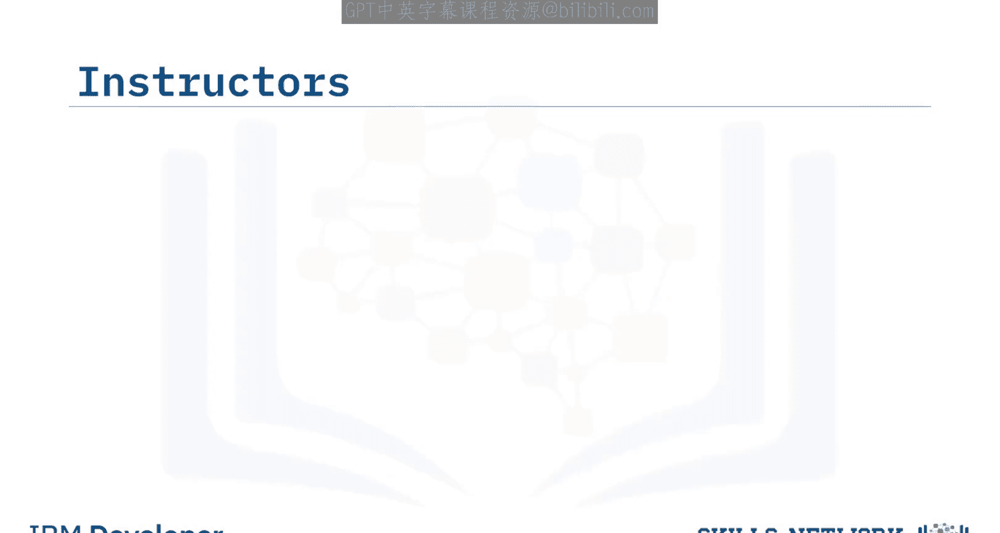
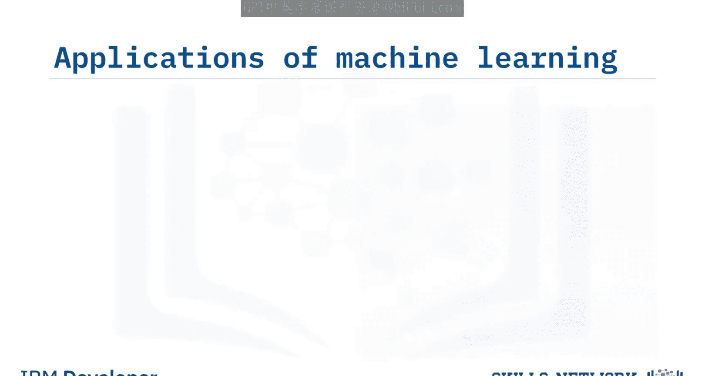
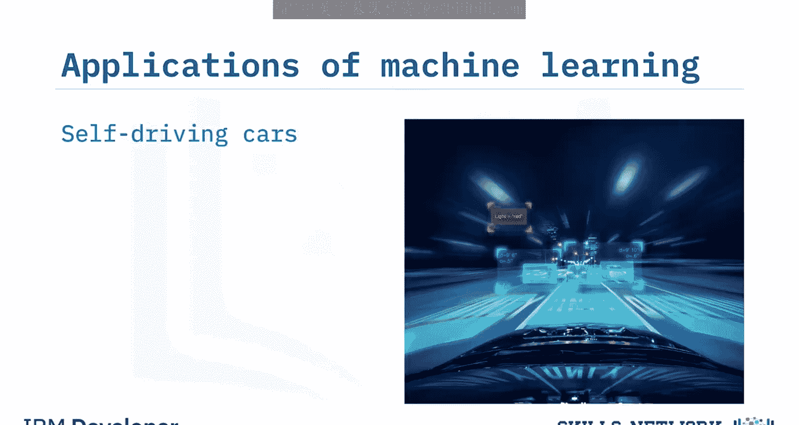
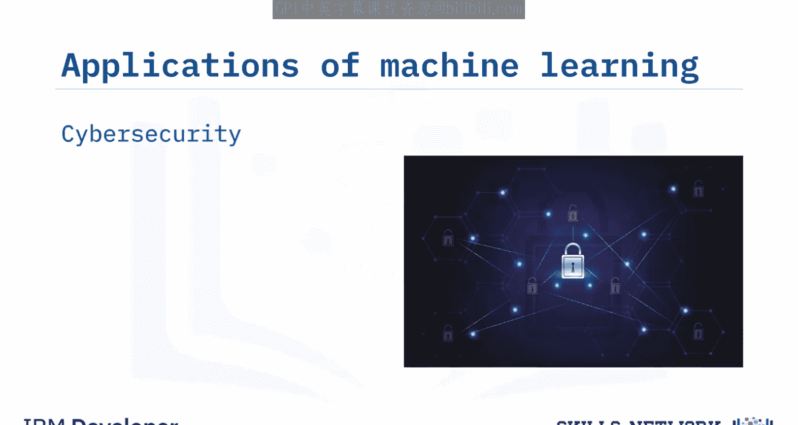
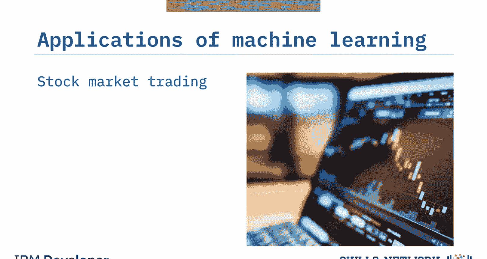
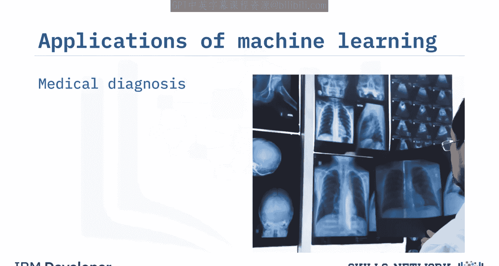
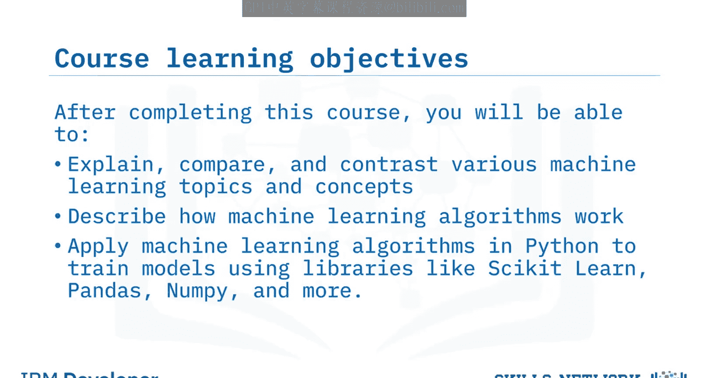

# 机器学习基础：058：课程介绍 🎯

在本节课中，我们将要学习《使用Python进行机器学习基础》课程的整体介绍。课程由三位经验丰富的讲师共同教授，内容涵盖机器学习的基本概念、多种算法及其在实际场景中的应用。通过本课程，你将能够理解并应用机器学习技术解决现实世界的问题。

## 讲师介绍 👨‍🏫

本课程由三位讲师共同指导。

以下是讲师的详细信息：

*   **Saed Abigaorbi 博士**：谷歌高级AIML客户工程师，拥有为企业级解决方案开发的经验，擅长帮助客户将数据转化为可操作的知识。曾在IBM和亚马逊网络服务公司工作，同时也是人工智能和机器学习领域的研究者。
*   **Joseph Saneg Gndrlo 博士**：拥有电气工程博士学位，研究方向是利用机器学习、信号处理和计算机视觉技术分析视频对人类认知的影响。自完成博士学位后，一直在IBM工作。
*   **Deim Hiirjani**：IBM数据科学家实习生，负责为IBM的多个数据科学课程创建内容。目前正在多伦多大学攻读计算机科学学士学位。

## 机器学习的应用领域 🌍

机器学习已广泛应用于众多行业和领域。

以下是几个具体的应用实例：

*   **自动驾驶**：在自动驾驶汽车行业中，机器学习被大量用于分类车辆在行驶中可能遇到的物体，例如行人、交通标志和其他车辆。
*   **网络安全**：许多云服务提供商（如IBM和亚马逊）利用机器学习来保护其服务，检测并防止分布式拒绝服务攻击或可疑恶意使用行为。
*   **金融交易**：机器学习用于发现股票数据中的趋势和模式，帮助决策交易哪些股票或在何种价格进行买卖。
*   **医疗诊断**：机器学习可用于帮助识别患者的癌症。通过目标区域的X光扫描，机器学习可以帮助检测潜在的肿瘤。

## 课程结构与内容 📚

本课程共包含四个模块，每个模块都包含视频讲解和动手实验，以帮助你应用所学知识。

以下是课程模块的详细内容：

1.  **模块一：简介与回归**
2.  **模块二：分类**
3.  **模块三：聚类**
4.  **模块四：最终项目**

动手实验将在Skills Network Labs上使用Jupyter Lab环境进行，主要使用Python编程语言及`pandas`、`NumPy`、`Scikit-learn`等Python库。

在课程中，你将探索不同的机器学习算法，并使用多种数据集进行实践。

以下是各章节你将完成的具体任务：

*   **线性回归**：使用汽车数据集，根据各种特征估算汽车的二氧化碳排放量，并预测尚未生产的汽车的排放量。
*   **回归树**：使用房地产数据预测房屋价格。
*   **逻辑回归**：使用电信公司的客户数据，了解机器学习如何用于预测客户忠诚度。
*   **K最近邻**：使用电信客户数据对客户进行分类。
*   **支持向量机**：将人类细胞样本分类为良性或恶性。
*   **多类别预测**：使用经典的鸢尾花数据集对花的种类进行分类。
*   **决策树**：构建一个模型来确定应为患者开具哪种药物。
*   **K均值聚类**：学习将客户数据集分割成具有相似特征的群体。

在最后一个模块中，你将完成最终项目，综合运用多种分类算法来预测澳大利亚是否会下雨。

## 学习目标 🎓

完成本课程后，你将能够达成以下目标：

*   **解释、比较和对比**各种机器学习主题和概念，例如**监督学习**、**无监督学习**、**分类**、**回归**和**聚类**。
*   **描述**各种机器学习算法的工作原理。
*   **应用**这些机器学习算法，并使用各种Python库在Python中实现它们。

本节课中，我们一起学习了《使用Python进行机器学习基础》课程的概览，包括讲师背景、机器学习的广泛应用、课程的具体模块内容以及最终的学习目标。准备好开始你的机器学习之旅吧！