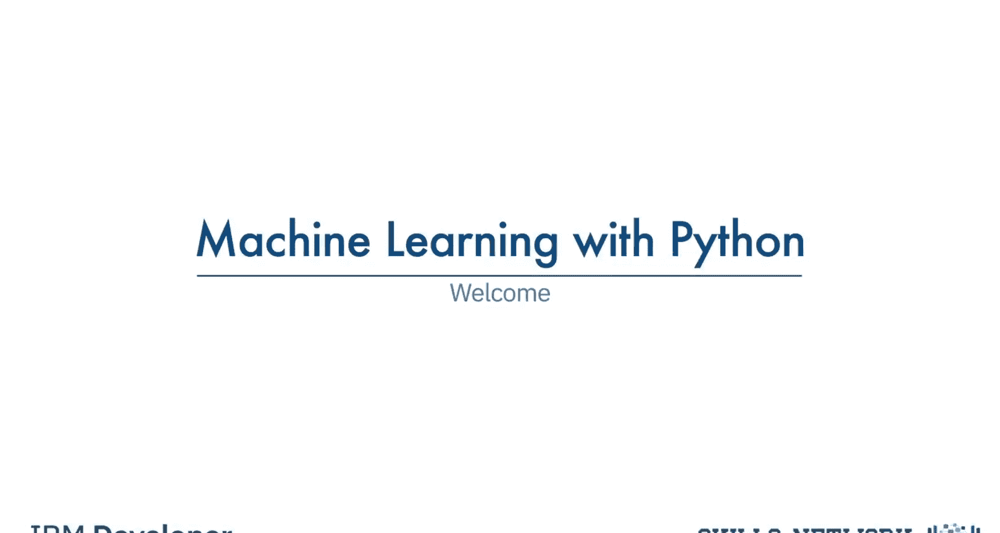
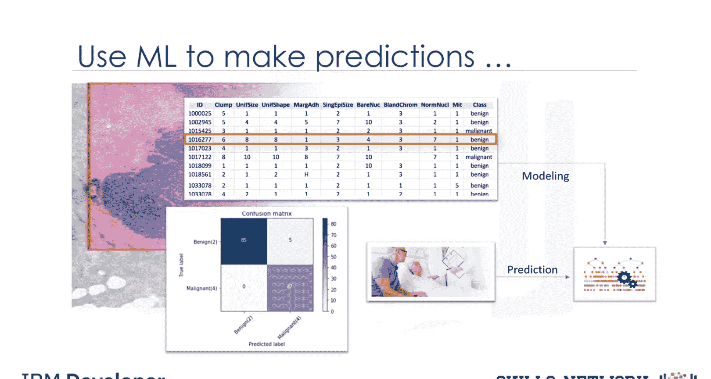
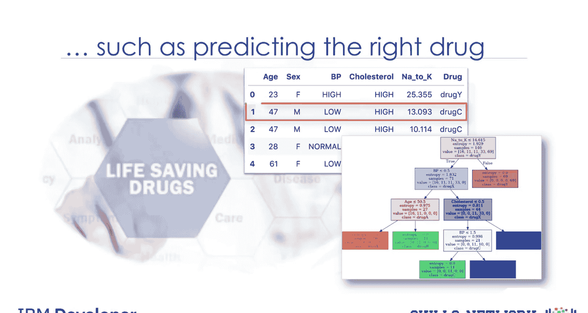
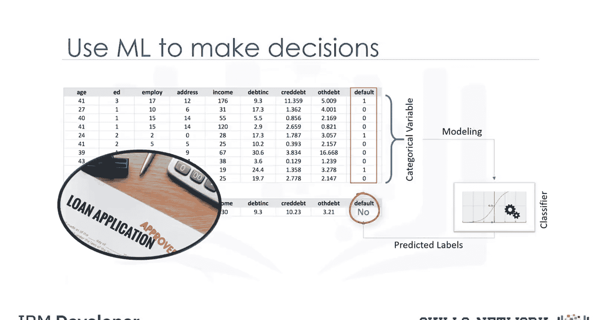
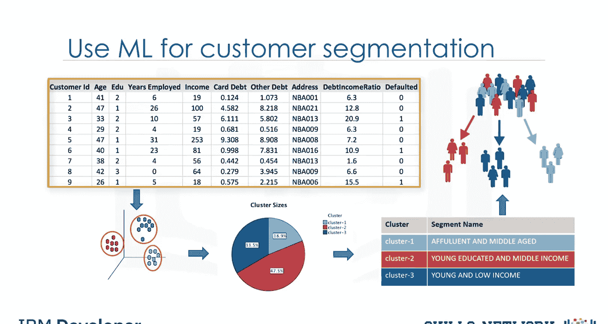
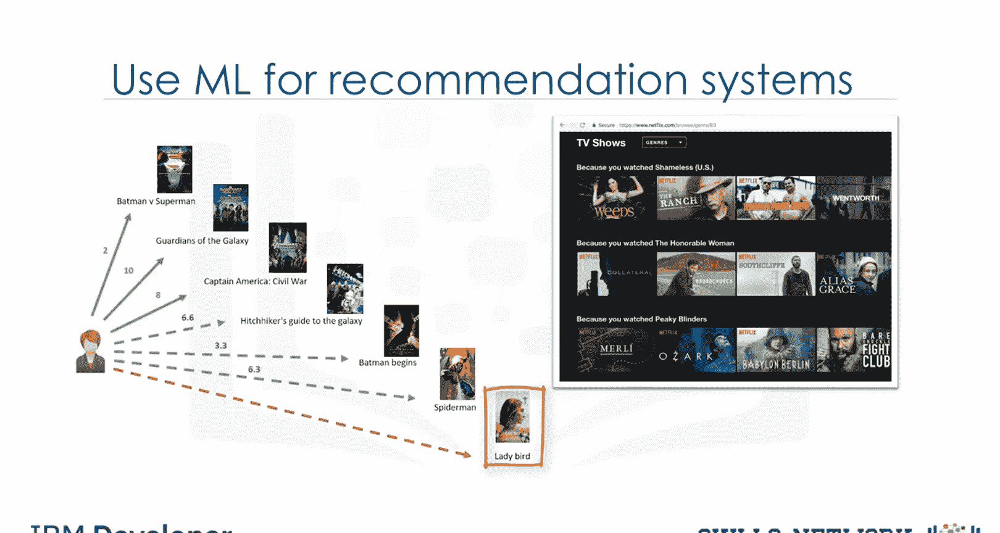
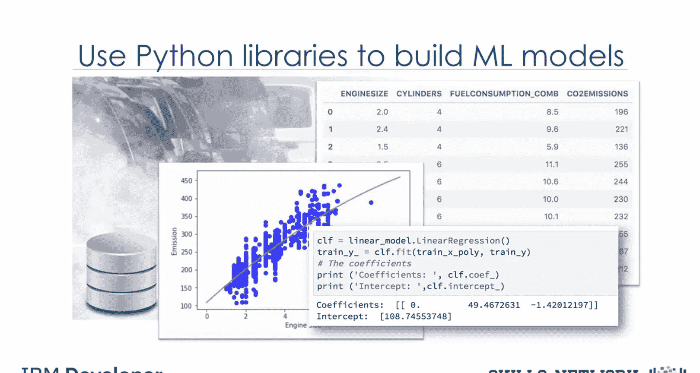
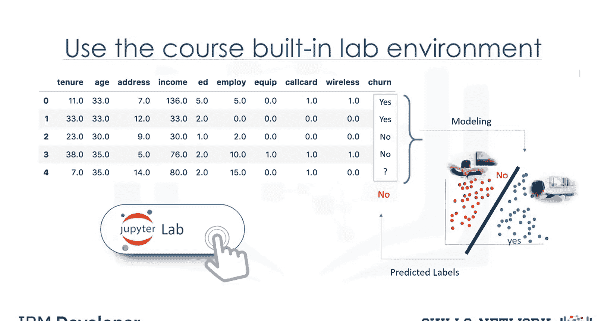
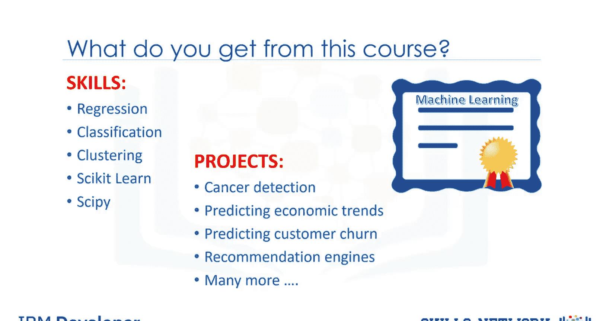

# 生成式人工智能工程：059：欢迎学习Python机器学习 🎉

在本课程中，我们将学习Python机器学习的基础知识及其在多个关键领域和行业中的应用。课程将涵盖从核心概念到实际项目构建的全过程，并提供内置的实验室环境供您实践所有示例代码。

## 概述

机器学习是人工智能的核心分支，它使计算机能够从数据中学习并做出预测或决策，而无需进行明确的编程。本课程旨在通过实际案例和项目，帮助您理解机器学习的基本原理，并掌握使用Python及其流行库（如Scikit-learn）构建模型的能力。

## 课程内容与应用领域

上一节我们介绍了课程的整体目标，本节中我们来看看机器学习具体在哪些领域发挥作用。

以下是机器学习在几个关键行业中的具体应用示例：

*   **医疗健康**：数据科学家使用机器学习来预测被认为有患癌风险的人类细胞是良性还是恶性。因此，机器学习在决定个人健康与福祉方面可以发挥关键作用。
*   **医疗决策**：您将了解决策树的价值，以及如何根据历史数据构建良好的决策树来帮助医生为每位患者开具合适的药物。
*   **金融服务**：您将学习银行家如何使用机器学习来决定是否批准贷款申请。
*   **客户分析**：您将学习如何使用机器学习进行银行客户细分，这对于处理海量且多样的数据通常并不容易。
*   **推荐系统**：在本课程中，您将看到机器学习如何帮助YouTube、亚马逊或Netflix等网站向客户推荐各种产品或服务，例如他们可能感兴趣的电影或书籍。机器学习的功能非常强大。

## 技术实践与工具

了解了机器学习的广泛应用后，本节我们将聚焦于实现这些应用的技术工具和实践方法。

您将学习如何使用流行的Python库来构建模型。例如，给定一个汽车数据集，我们可以使用Scikit-learn库，根据发动机尺寸或气缸数来估算汽车的二氧化碳排放量。我们甚至可以预测尚未生产的汽车的二氧化碳排放量。

我们将看到电信行业如何预测客户流失。您可以使用本课程内置的实验室环境来运行和练习所有这些示例的代码。您无需在计算机上安装任何软件或在云端进行任何操作。您只需点击一个按钮即可在浏览器中启动实验室环境。示例代码已使用Python语言在Jupyter Notebook中编写，您可以运行它以查看结果，或修改它以更好地理解算法。

## 学习成果

掌握了工具和方法，本节我们明确一下完成本课程后您将能获得的具体成果。

通过在未来几周内每周投入几个小时，您将为简历增添新的技能，例如**回归**、**分类**、**聚类**、**Scikit-learn**和**SciPy**。您还将获得可以添加到作品集中的新项目，包括癌症检测、预测经济趋势、预测客户流失、推荐引擎等。您还将获得机器学习证书，以证明您的能力，并可以在任何您喜欢的地方在线或离线分享，例如LinkedIn个人资料和社交媒体。

## 总结

本节课中我们一起学习了Python机器学习课程的概览。我们了解了机器学习在医疗、金融、客户分析和推荐系统等多个领域的关键应用，认识了将用于实践的核心Python工具库（如Scikit-learn），并明确了通过本课程学习可以获得的技能、项目成果及认证。现在，让我们开始学习之旅。