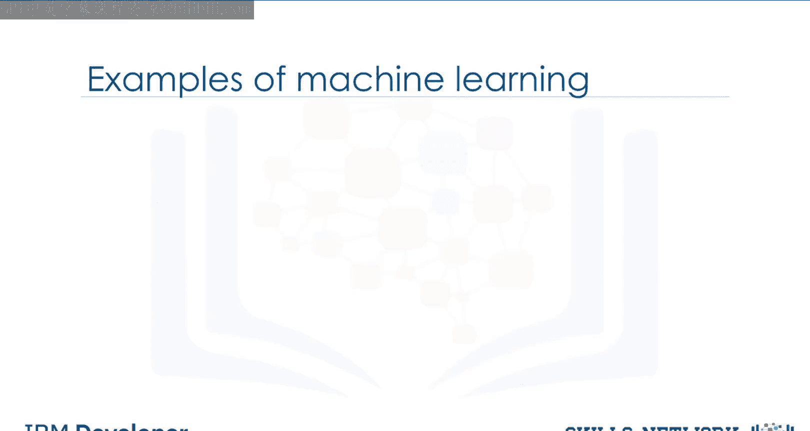
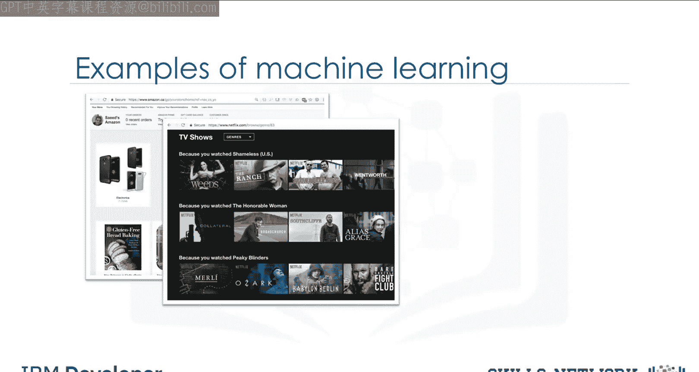
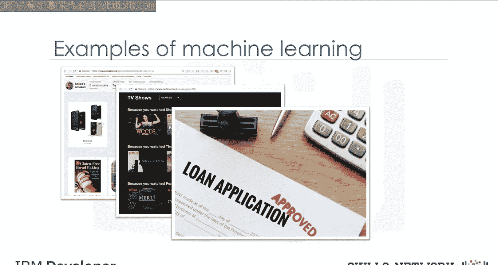
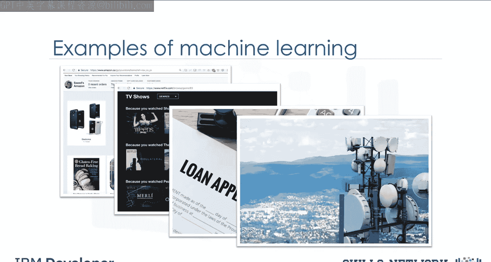
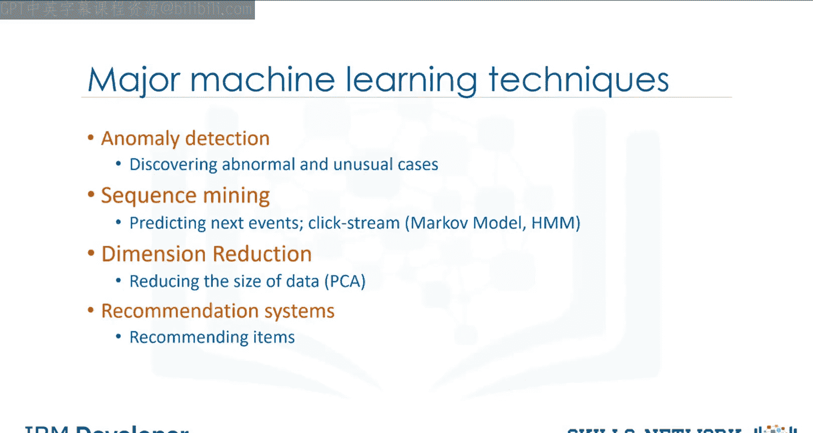
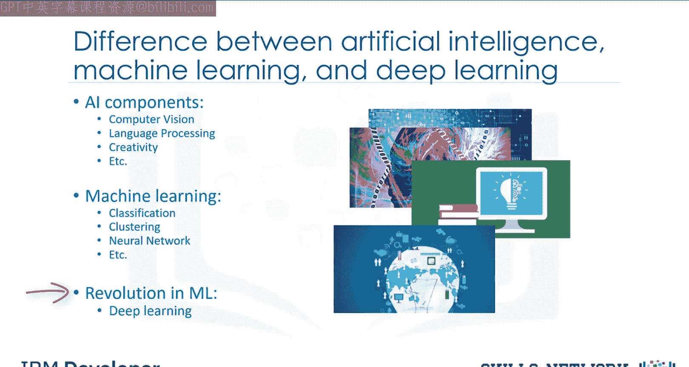
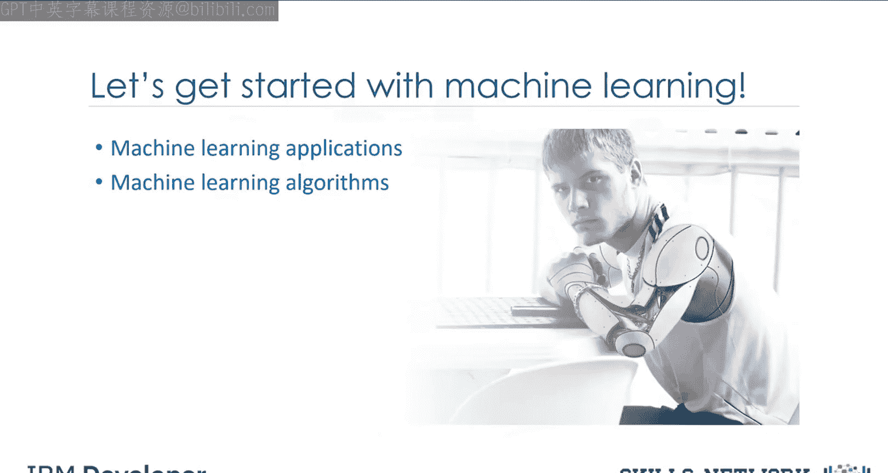

# 生成式人工智能工程：060：机器学习简介 🧠

在本节课中，我们将要学习机器学习的基本概念、定义、应用领域以及它与其他相关技术（如人工智能和深度学习）的区别。我们将通过一个医疗诊断的实例来理解机器学习如何工作，并介绍几种主流的机器学习技术。

---

## 什么是机器学习？🤔

想象一下，我们有一份从患者身上提取的人类细胞样本。这个细胞具有多种特征，例如：
*   团块厚度为 **6**
*   细胞大小均匀性为 **1**
*   边缘粘附性为 **1**

此时，一个关键的问题是：这是一个**良性**细胞还是**恶性**细胞？与良性肿瘤不同，恶性肿瘤可能侵入周围组织或扩散到全身，早期诊断可能是患者生存的关键。

人们可能认为只有经验丰富的医生才能诊断肿瘤。然而，如果我们获得了一个数据集，其中包含数千个被认为有患癌风险的患者细胞样本的特征，情况就不同了。原始数据分析显示，许多特征在良性和恶性样本之间存在显著差异。

我们可以利用这些细胞特征值，为其他患者的新样本提供早期诊断指示。这需要我们先**清洗数据**，然后**选择合适的算法**来构建预测模型，并**训练模型**以理解数据中良性与恶性细胞的模式。

模型经过迭代学习数据后，就可以用于以相当高的准确率预测新的或未知的细胞。**这就是机器学习**。它使得机器学习模型能够执行医生的任务，或至少帮助医生加快诊断过程。

---

## 机器学习的正式定义 📖

机器学习是计算机科学的一个子领域，它赋予计算机**无需明确编程**即可学习的能力。

为了解释“无需明确编程”的含义，我们假设有一个包含猫和狗等动物图像的数据集，我们希望开发一个能够识别和区分它们的软件。

传统方法是先将每张图像解释为一组特征集，例如：图像是否显示动物的眼睛？眼睛大小如何？是否有耳朵？是否有尾巴？有多少条腿？是否有翅膀？在机器学习出现之前，每张图像会被转换为特征向量，然后我们必须编写大量规则或方法，以使计算机变得“智能”并检测动物。

但这种方法常常失败。因为它需要海量规则，高度依赖当前数据集，并且不足以泛化到数据集之外的样本。

这时，机器学习登场了。使用机器学习，我们可以构建一个模型，让它查看所有特征集及其对应的动物类型，从而**学习每种动物的模式**。这是一个由机器学习算法构建的模型，它能够在**没有被明确编程**的情况下进行检测。

本质上，机器学习遵循了一个四岁儿童学习、理解和区分动物的相同过程。因此，受人类学习过程启发的机器学习算法，能够从数据中迭代学习，并让计算机发现隐藏的洞察。这些模型帮助我们在各种任务中发挥作用，例如物体识别、摘要生成、推荐等。

---

## 机器学习的现实应用 🌍

机器学习正以极具影响力的方式改变社会。以下是一些现实生活中的例子：

以下是几个关键应用领域的介绍：

*   **个性化推荐**：Netflix和Amazon等平台如何使用机器学习为用户推荐视频、电影和电视节目？它们利用机器学习来生成你可能喜欢的建议。这类似于你的朋友根据他们对你喜好的了解来向你推荐电视节目。
*   **金融风控**：银行如何在审批贷款申请时做出决策？它们使用机器学习来预测每位申请人的违约概率，然后基于该概率批准或拒绝贷款申请。
*   **客户分析**：电信公司利用客户的人口统计数据对其进行细分，或预测他们是否会在下个月取消订阅。

我们日常生活中还有许多其他机器学习应用，例如聊天机器人、手机人脸识别登录，甚至电脑游戏。这些应用各自使用了不同的机器学习技术和算法。

---

## 主流机器学习技术概览 🛠️

现在，让我们快速了解几种更流行的机器学习技术：

以下是几种核心的机器学习技术：

*   **回归分析**：用于预测连续值。例如，根据房屋特征预测其价格，或估算汽车发动机的二氧化碳排放量。其核心是找到一个函数来拟合数据点，公式可表示为 `y = f(x)`，其中 `y` 是连续的目标变量。
*   **分类**：用于预测样本的类别或分类。例如，判断一个细胞是良性还是恶性，或者预测客户是否会流失。常用算法如逻辑回归、决策树。
*   **聚类**：将相似的样本分组。例如，在医疗中发现相似的患者，或在银行领域用于客户细分。常用算法如K-Means。
*   **关联规则**：用于发现经常共同出现的物品或事件。例如，找出特定顾客通常一起购买的杂货商品。
*   **异常检测**：用于发现异常和不寻常的案例。例如，用于信用卡欺诈检测。
*   **序列挖掘**：用于预测下一个事件。例如，分析网站上的点击流。
*   **降维**：用于减少数据的大小，同时尽可能保留重要信息。常用技术如主成分分析（PCA）。
*   **推荐系统**：将人们的偏好与其他具有相似品味的人关联起来，并向他们推荐新物品，例如书籍或电影。

我们将在后续视频中详细介绍其中一些技术。

---

## 人工智能、机器学习与深度学习的关系 🔗

此时，你可能在想：我们经常听到的这些热门词汇——人工智能（AI）、机器学习和深度学习——之间有什么区别？

简单来说：
*   **人工智能** 试图让计算机变得智能，以模仿人类的认知功能。因此，人工智能是一个范围广泛的通用领域，包括计算机视觉、语言处理、创造力和摘要生成等。
*   **机器学习** 是人工智能的一个分支，涵盖了人工智能的统计部分；它通过让计算机查看成百上千个示例、从中学习，然后利用这些经验在新情况下解决相同问题。
*   **深度学习** 是机器学习中一个非常特殊的领域，计算机实际上可以自主学习并做出智能决策。与大多数机器学习算法相比，深度学习涉及更深层次的自动化。

它们的关系可以理解为：**人工智能 > 机器学习 > 深度学习**。

---

## 课程预告与总结 📚

上一节我们介绍了机器学习与其他概念的区别，现在我们来总结并展望后续内容。

我们已经完成了对机器学习的介绍。在后续的视频中，我们将重点回顾两个主要部分：
1.  你将学习机器学习的目的及其在现实世界中的应用场景。
2.  你将获得对机器学习主题的总体概述，例如监督学习与无监督学习、模型评估以及各种机器学习算法。

现在你已经对学习旅程的内容有了初步了解，让我们继续探索机器学习的奥秘。

---

本节课中，我们一起学习了机器学习的核心定义，了解了它如何通过从数据中学习模式来解决问题，而无需显式编程。我们探讨了机器学习在推荐系统、金融风控等多个领域的实际应用，简要介绍了回归、分类、聚类等主流技术，并厘清了人工智能、机器学习和深度学习三者之间的层次关系。这为后续深入学习具体的机器学习方法和应用奠定了坚实的基础。