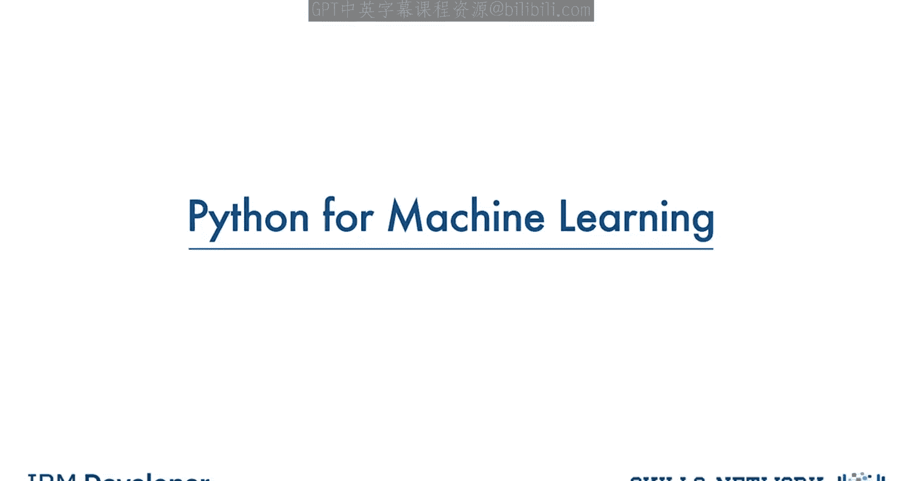
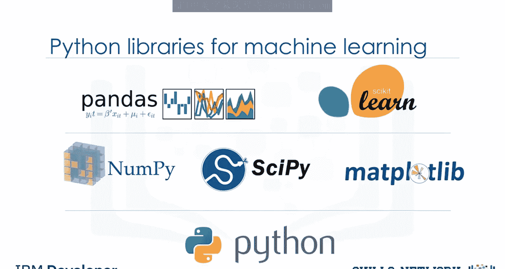
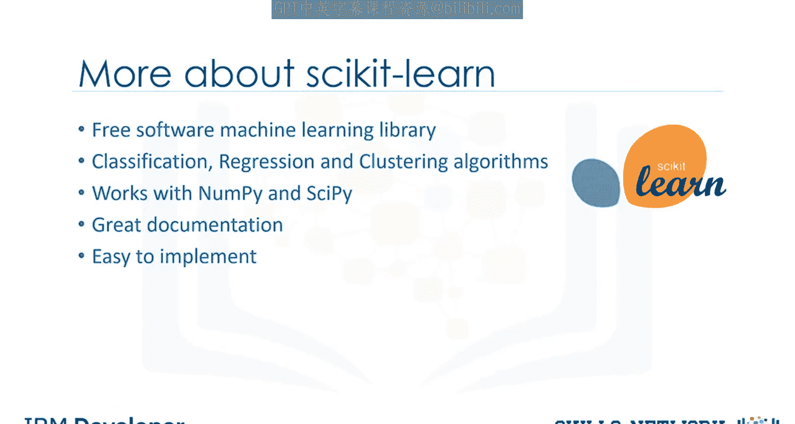
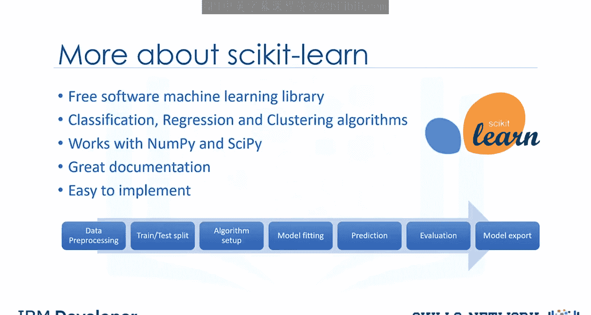
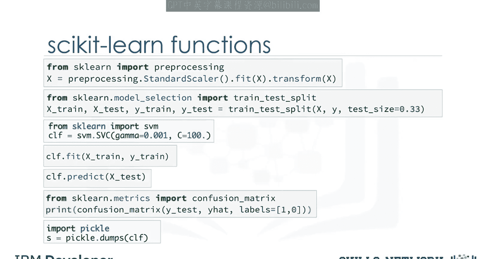

# 生成式人工智能工程：061：Python与机器学习



在本节课中，我们将要学习如何使用Python进行机器学习。Python因其强大的功能和丰富的库，已成为数据科学家的首选语言。我们将介绍几个核心的Python库，并重点讲解Scikit-learn库如何简化机器学习流程。

## Python在机器学习中的角色

Python是一种流行且强大的通用编程语言，近年来已成为数据科学家偏爱的语言。你可以使用Python编写机器学习算法，并且效果很好。然而，Python中已有大量现成的模块和库，可以极大地简化你的工作。

本课程将尝试介绍这些Python包，并在实验中使用它们，以提供更好的动手实践体验。

## 核心Python库介绍

以下是数据科学家在处理现实世界问题时需要了解的三个基础库，它们构建于Python之上。

*   **NumPy**：这是一个用于在Python中处理n维数组的数学库。它能让你高效地进行计算。由于其出色的能力，例如在处理数组、字典、函数、数据类型和图像方面，它比常规Python更优。
*   **SciPy**：这是一个数值算法和特定领域工具箱的集合，包括信号处理、优化、统计等。SciPy是进行科学计算和高性能计算的良好库。
*   **Matplotlib**：这是一个非常流行的绘图包，提供2D和3D绘图功能。

如果你不熟悉这些包，建议你先学习“使用Python进行数据分析”课程，该课程涵盖了这些包中的大部分有用主题。

## 数据处理与机器学习库

除了基础库，还有两个专门用于数据处理和机器学习的库至关重要。

*   **Pandas**：这是一个非常高级的Python库，提供了高性能、易用的数据结构。它拥有许多用于数据导入、操作和分析的函数。特别是，它提供了用于操作数值表和时间序列的数据结构和操作。
*   **Scikit-learn**：这是一个机器学习算法和工具的集合，也是我们本课程的重点，你将学习在课程中使用它。

## 深入Scikit-learn



由于我们将在实验中大量使用Scikit-learn，让我进一步解释它，并展示它为何在数据科学家中如此受欢迎。

Scikit-learn是Python编程语言的免费机器学习库。它包含了大多数分类、回归和聚类算法，并且设计用于与Python数值和科学库NumPy和SciPy协同工作。此外，它包含了非常完善的文档。最重要的是，使用Scikit-learn实现机器学习模型只需几行Python代码，非常简单。

## Scikit-learn的完整流程



机器学习管道中需要完成的大多数任务都已经在Scikit-learn中实现。

以下是Scikit-learn可以处理的主要任务步骤：
1.  **数据预处理**：包括特征缩放、处理异常值等。
2.  **特征选择与提取**：从数据中选择或构建最有用的特征。
3.  **训练集/测试集划分**：将数据分割以分别进行模型训练和评估。
4.  **算法定义**：选择并初始化机器学习算法（称为“估计器”）。
5.  **模型拟合**：使用训练数据训练模型。
6.  **参数调优**：调整模型参数以优化性能。
7.  **预测**：使用训练好的模型对新数据进行预测。
8.  **评估**：使用各种指标评估模型性能。
9.  **模型导出**：保存训练好的模型以供后续使用。



## 代码示例：Scikit-learn工作流

让我展示一个使用Scikit-learn库的示例。你现在不需要理解代码，只需看看如何用几行代码轻松构建一个模型。

```python
# 1. 数据预处理：标准化数据集
from sklearn import preprocessing
scaler = preprocessing.StandardScaler().fit(X_train)
X_train_scaled = scaler.transform(X_train)

# 2. 划分训练集和测试集
from sklearn.model_selection import train_test_split
X_train, X_test, y_train, y_test = train_test_split(X, y, test_size=0.2)

# 3. 设置算法（例如支持向量机分类器）
from sklearn import svm
clf = svm.SVC()

# 4. 使用训练集训练模型
clf.fit(X_train_scaled, y_train)

# 5. 使用测试集进行预测
X_test_scaled = scaler.transform(X_test)
predicted = clf.predict(X_test_scaled)

# 6. 评估模型（例如使用混淆矩阵）
from sklearn.metrics import confusion_matrix
print(confusion_matrix(y_test, predicted))

# 7. 保存模型（例如使用joblib）
from joblib import dump
dump(clf, 'model.joblib')
```

**基本流程说明**：
机器学习算法受益于数据集的标准化。如果数据集中存在一些异常值或不同尺度的字段，必须处理它们。Scikit-learn的预处理包提供了几个常见的实用函数和转换器类，将原始特征向量更改为适合建模的向量形式。
你必须将数据拆分为训练集和测试集，以分别训练模型和测试模型准确性。Scikit-learn可以用一行代码为你将数组或矩阵随机拆分为训练子集和测试子集。
然后你可以设置算法。例如，你可以使用支持向量分类算法构建分类器。我们称我们的估计器实例为`clf`并进行参数初始化。
现在，你可以通过将训练集传递给`fit`方法来用训练集训练模型，`clf`模型学习对未知案例进行分类。然后我们可以使用测试集运行预测。
结果告诉我们每个未知值的类别是什么。此外，你可以使用不同的指标来评估模型准确性，例如使用混淆矩阵来显示结果。最后，保存你的模型。

你可能会觉得所有这些或部分机器学习术语令人困惑，但别担心。我们将在接下来的视频中讨论所有这些主题。
要记住的最重要一点是，使用Scikit-learn，整个机器学习任务的过程只需几行代码即可简单完成。
请注意，虽然使用NumPy或SciPy包也可以完成这些任务，但不会那么容易，当然，如果使用纯Python编程来实现所有这些任务，则需要更多的编码。

## 总结



本节课中我们一起学习了Python在机器学习中的核心地位。我们介绍了NumPy、SciPy、Matplotlib、Pandas等基础库，并重点深入讲解了Scikit-learn库。我们看到，Scikit-learn通过封装数据预处理、模型训练、评估和预测等完整流程，使得实现复杂的机器学习任务变得异常简单，通常只需寥寥数行代码。这大大降低了机器学习的入门门槛和应用复杂度。