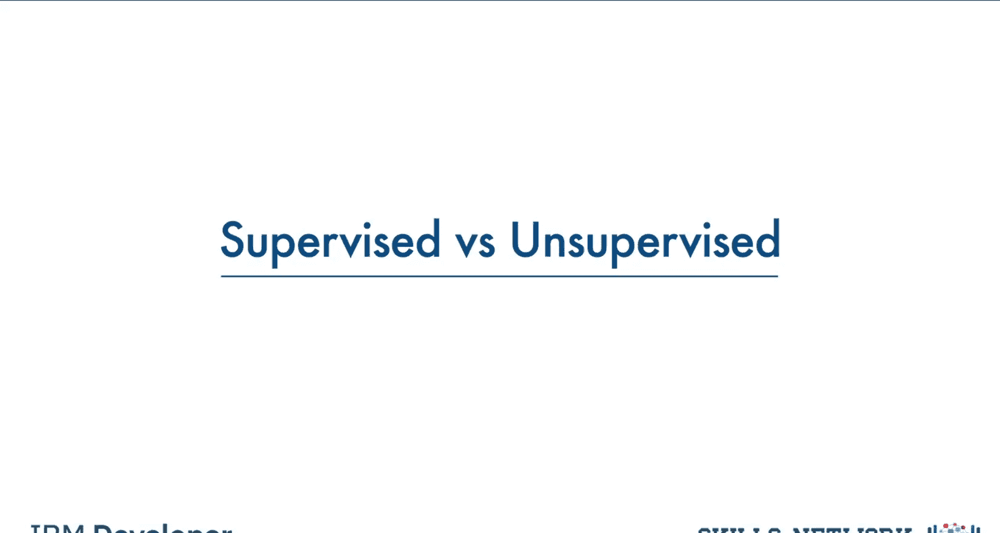
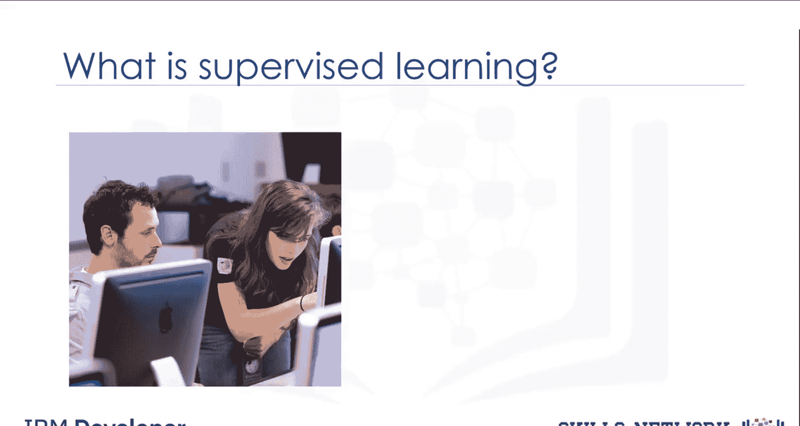
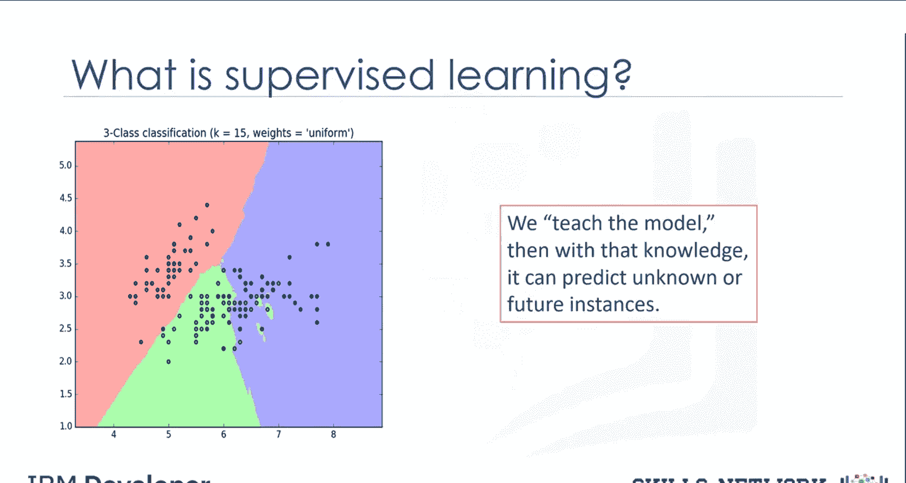
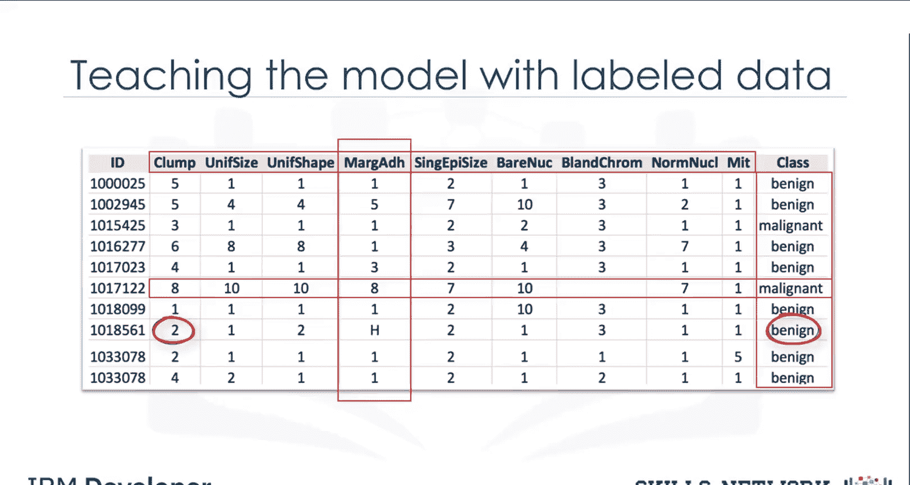
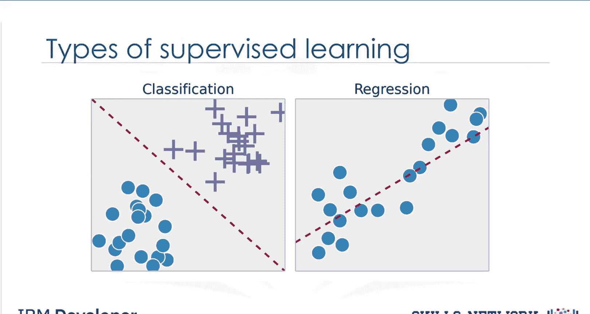
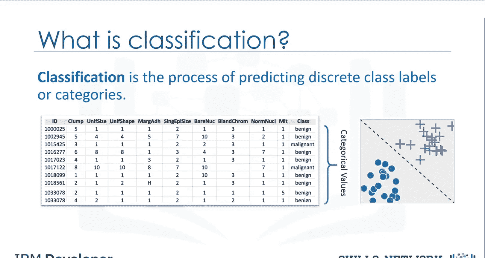
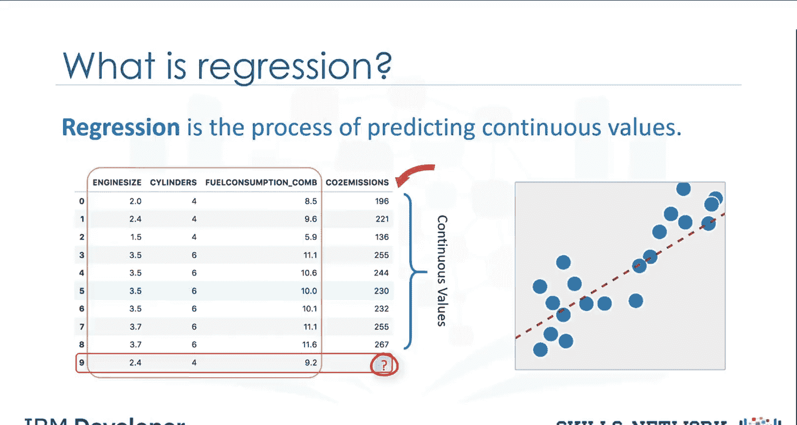
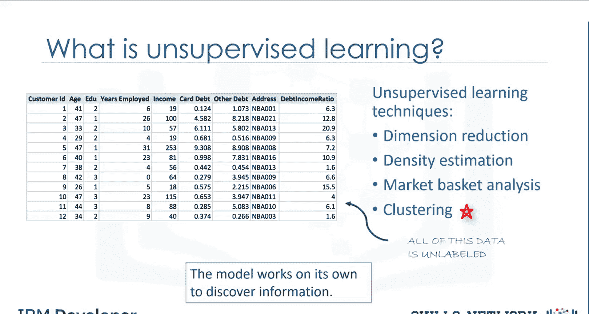
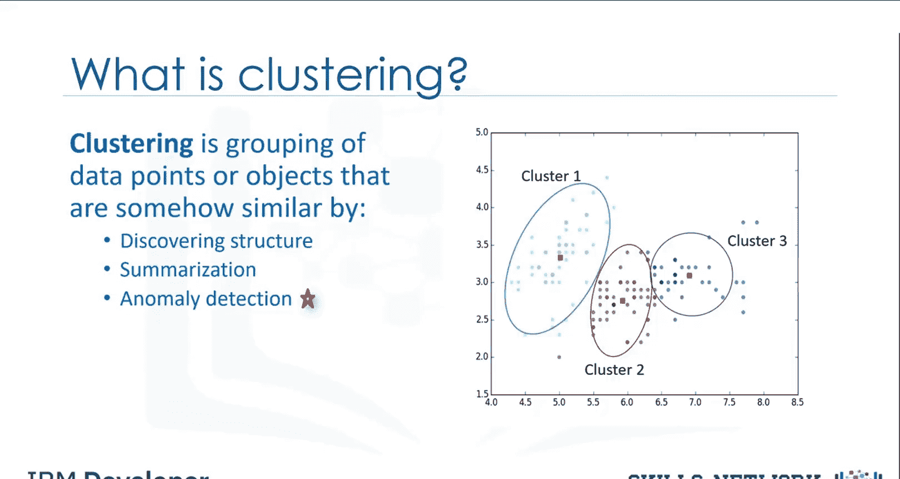
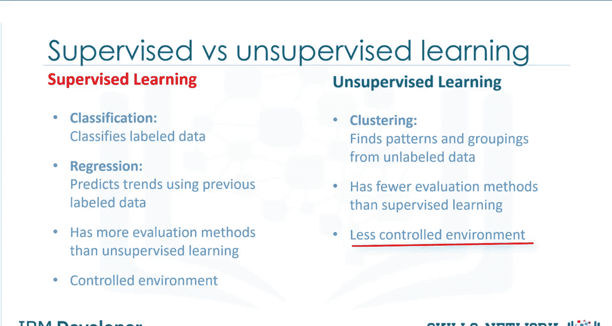

# 生成式人工智能工程：062：监督学习与无监督学习 🧠

在本节课中，我们将学习机器学习中两种核心范式：监督学习与无监督学习。我们将了解它们的基本概念、区别以及各自的应用场景。

理解监督学习概念的一个简单方法是直接分析其构成词汇。“监督”意味着观察并指导一项任务、项目或活动的执行。

当然，我们并非要监督一个人。相反，我们将监督一个机器学习模型，该模型能够生成类似我们在此处看到的分类区域。

那么，我们如何监督一个机器学习模型？我们通过**教导模型**来实现，即为模型加载知识，使其能够预测未来的实例。

但这引出了下一个问题：我们究竟如何教导一个模型？

我们通过使用来自**带标签数据集**的一些数据来训练模型，从而教导它。需要注意的是，数据是**带标签的**。一个带标签的数据集是什么样子？它可能类似于这样。这个例子取自癌症数据集。如你所见，我们有一些患者的历史数据，并且我们已经知道每一行的类别。

让我们先介绍这个表格的一些组成部分。此处显示的名称，如“肿块厚度”、“细胞大小均匀性”、“细胞形状均匀性”、“边缘粘附”等，被称为**属性**。列被称为**特征**，其中包含数据。如果你绘制这些数据并查看图表上的单个数据点，它将拥有所有这些属性。这构成了图表上的一行，也称为一个**观测值**。直接查看数据的值，可以分为两种类型。第一种是**数值型**。在机器学习中，最常用的数据是数值型的。第二种是**分类型**。即，它是非数值的，因为它包含字符而非数字。在本例中，它是分类型的，因为该数据集是为分类任务构建的。

监督学习技术主要有两种类型：**分类**和**回归**。

**分类**是预测一个离散的类别标签或分类的过程。

**回归**是预测一个连续值的过程，这与分类中预测一个分类值不同。看这个数据集。它与不同汽车的二氧化碳排放量有关。它包括各种汽车型号的发动机尺寸、气缸数、油耗和二氧化碳排放量。给定这个数据集，你可以使用回归，通过其他字段（如发动机尺寸或气缸数）来预测一辆新车的二氧化碳排放量。

既然我们知道了监督学习的含义，你认为无监督学习是什么意思？是的，无监督学习正如其名。我们**不监督模型**，而是让模型自行工作，以发现人眼可能无法看到的信息。

这意味着无监督算法在数据集上进行训练，并对**未标记的数据**得出结论。一般来说，无监督学习比监督学习拥有更复杂的算法，因为我们对数据或预期结果知之甚少。

以下是几种广泛使用的无监督机器学习技术：
*   **降维**：通过减少冗余特征使分类更容易，降维和/或特征选择在其中扮演重要角色。
*   **市场篮子分析**：这是一种建模技术，基于这样的理论：如果你购买某一组商品，你更有可能购买另一组商品。
*   **密度估计**：这是一个非常简单的概念，主要用于探索数据以发现其中的某些结构。
*   **聚类**。

**聚类**被认为是最流行的无监督机器学习技术之一，用于对以某种方式相似的数据点或对象进行分组。聚类分析在不同领域有许多应用，无论是银行希望根据某些特征细分其客户，还是帮助个人组织并分组他或她最喜欢的音乐类型。不过，一般来说，聚类主要用于发现结构、总结和异常检测。

上一节我们介绍了无监督学习的主要技术，现在我们来总结一下两者的核心区别。

总而言之，监督学习和无监督学习之间最大的区别在于，**监督学习处理带标签的数据，而无监督学习处理未标记的数据**。在监督学习中，我们有用于分类和回归的机器学习算法。在无监督学习中，我们有诸如聚类等方法。与监督学习相比，无监督学习可用的模型和评估方法更少，以确保模型结果的准确性。因此，无监督学习创造了一个可控性较低的环境，因为机器在为我们创造结果。

本节课中，我们一起学习了监督学习与无监督学习的核心概念。我们明确了监督学习通过带标签数据训练模型进行预测，主要包括分类和回归任务；而无监督学习则处理未标记数据，让模型自主发现模式，常用技术包括聚类、降维等。理解这两种范式是构建更复杂人工智能应用的基础。