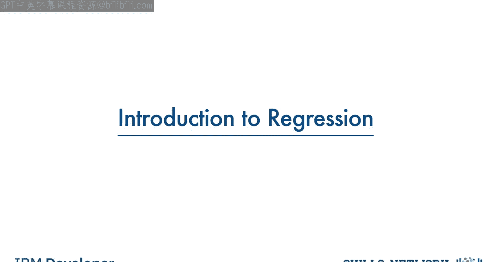
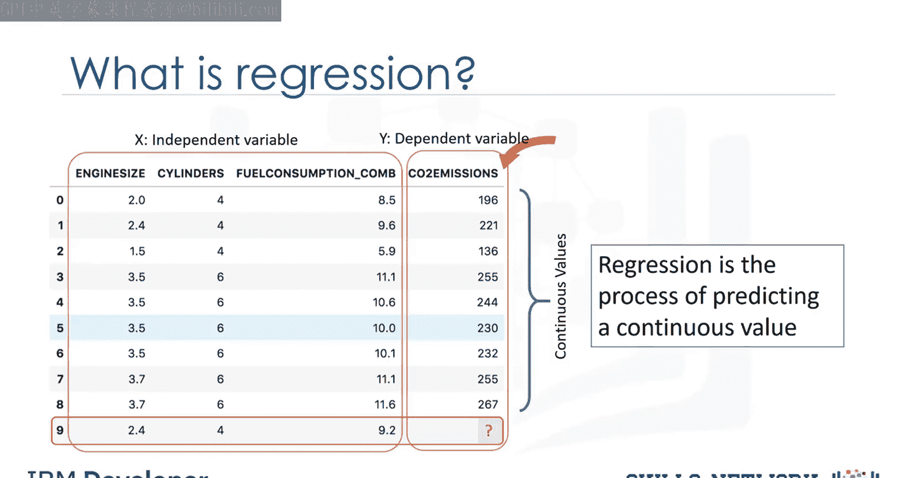
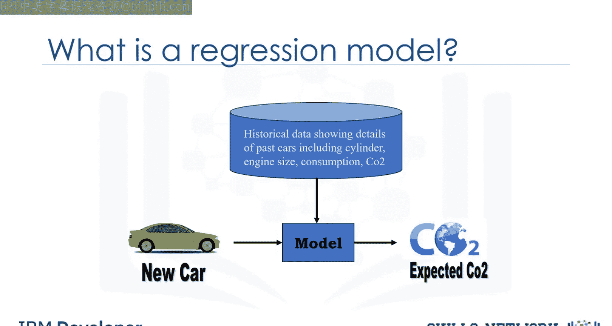
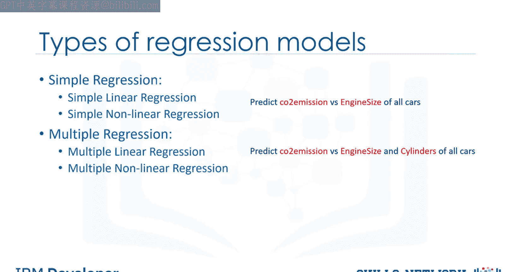
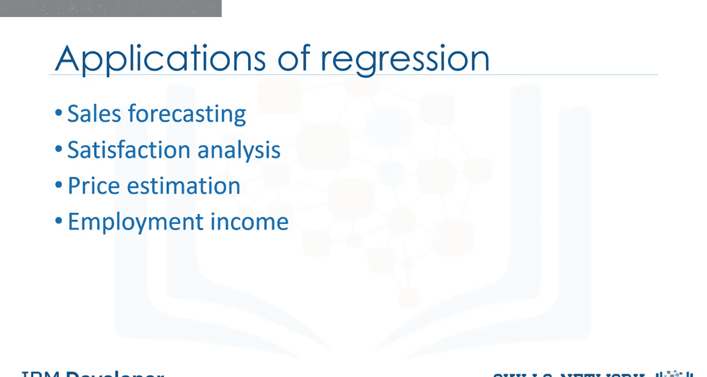
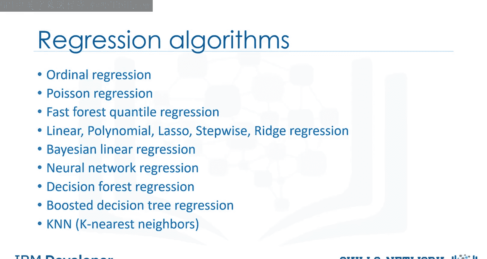

生成式人工智能工程：063：回归简介

在本节课中，我们将对回归分析进行简要介绍。回归是预测连续值的过程，在数据分析与机器学习中应用广泛。

## 概述

回归分析旨在根据一个或多个自变量来预测一个连续的因变量。我们将通过一个汽车二氧化碳排放量的预测案例来理解其基本概念与应用场景。

## 数据集与问题定义

观察以下数据集，它包含了不同汽车的发动机大小、气缸数量、油耗以及二氧化碳排放量等信息。

核心问题是：能否利用如发动机大小或气缸数等其他字段，来预测一辆汽车的二氧化碳排放量？

假设我们拥有一些汽车的历史数据，而数据集中第9行所示的汽车尚未生产。我们希望在它生产后估算其大致的二氧化碳排放量。这可以通过回归方法实现。

## 什么是回归？

回归是预测连续值（如二氧化碳排放量）的过程。在回归分析中，涉及两种类型的变量：
*   **因变量**：这是我们研究和试图预测的状态、目标或最终结果，通常用 **`y`** 表示。
*   **自变量**：这些是导致上述状态的原因，也称为解释变量，通常用 **`X`** 表示。

回归模型建立了因变量 **`y`** 与自变量 **`X`** 的函数关系。关键在于，因变量必须是连续值，而不能是离散值。自变量则既可以是分类变量，也可以是连续变量。

## 回归建模流程

我们的目标是利用一些汽车的历史数据及其特征，构建一个回归估计模型。

该模型随后可用于预测新的或未知汽车的预期二氧化碳排放量。

## 回归模型的类型

基本上，回归模型分为两种主要类型：简单回归和多元回归。

*   **简单回归**：使用一个自变量来估计因变量。根据因变量与自变量之间关系的性质，它可以是线性的或非线性的。
    *   **示例**：使用发动机大小变量预测二氧化碳排放量。
*   **多元回归**：当存在多个自变量时，该过程称为多元线性回归。同样，根据关系的性质，它也可以是线性或非线性的。
    *   **示例**：使用发动机大小和气缸数量来预测给定汽车的二氧化碳排放量。

## 回归的应用场景

本质上，当我们需要估计一个连续值时，就会使用回归分析。以下是几个应用示例：

以下是回归分析的一些典型应用领域：

*   **销售预测**：尝试根据年龄、教育程度和工作年限等自变量来预测销售人员的年度总销售额。
*   **心理学研究**：例如，根据人口统计和心理因素确定个人满意度。
*   **房价预测**：基于房屋面积、卧室数量等因素预测某个区域的房价。
*   **收入预测**：根据工作时间、教育程度、职业、性别、年龄和工作经验等自变量预测就业收入。

实际上，在金融、医疗保健、零售等众多领域，都能找到回归分析的应用实例。

## 回归算法简介

存在许多回归算法，每种算法都有其重要性，并有最适合其应用的具体条件。

本课程仅涵盖其中一部分，但这将为您打下足够的基础知识，以便您未来探索不同的回归技术。

## 总结

本节课我们一起学习了回归分析的基本概念。我们了解到回归是用于预测连续因变量的过程，区分了因变量与自变量，并介绍了简单回归与多元回归两种主要类型。最后，我们探讨了回归在销售、心理学、房地产等多个领域的实际应用，为后续深入学习具体的回归算法奠定了基础。