# 生成式人工智能工程：064：简单线性回归 📈

在本节课中，我们将要学习线性回归的基本概念。线性回归是一种用于预测连续值的统计方法，它通过建立自变量与因变量之间的线性关系模型来实现预测。理解线性回归不需要线性代数知识，本教程将通过一个简单的例子帮助你掌握其核心思想。

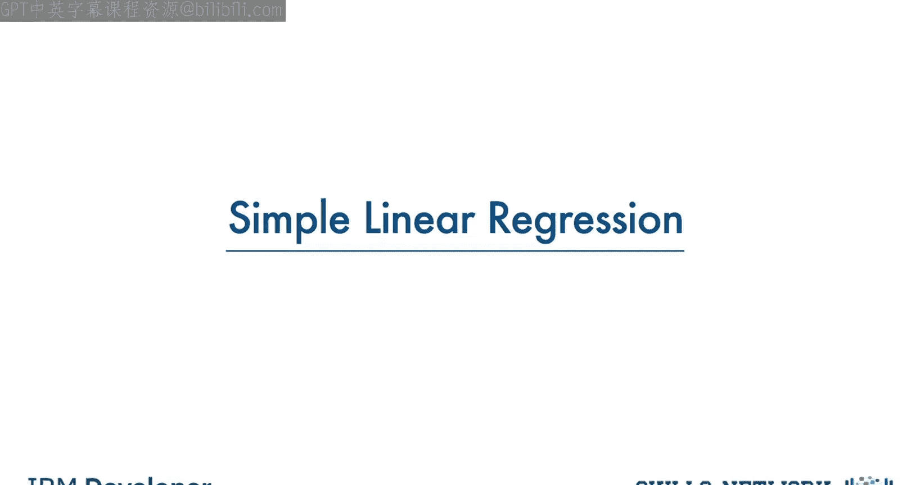

## 数据集介绍

我们使用一个与汽车二氧化碳排放相关的数据集。该数据集包含不同车型的发动机排量、气缸数、油耗和二氧化碳排放量。

我们的目标是：能否使用一个字段（例如发动机排量）来预测汽车的二氧化碳排放量？答案是肯定的，我们可以使用线性回归来预测连续值，如二氧化碳排放量。

## 什么是线性回归？

线性回归是一种用于描述两个或多个变量之间关系的线性模型近似方法。

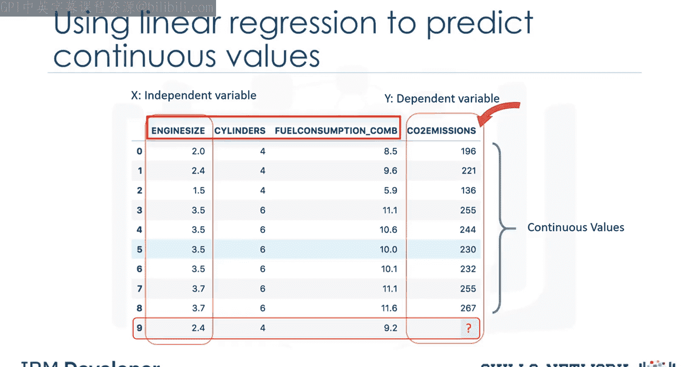

在简单线性回归中，涉及两个变量：一个因变量和一个自变量。关键点在于，因变量必须是连续值，而不能是离散值。自变量则可以是分类变量或连续变量。

线性回归模型主要分为两种类型：
*   **简单线性回归**：使用一个自变量来估计因变量。例如，使用发动机排量预测二氧化碳排放量。
*   **多元线性回归**：使用多个自变量来估计因变量。例如，使用发动机排量和气缸数预测二氧化碳排放量。

本节课我们重点讨论简单线性回归。

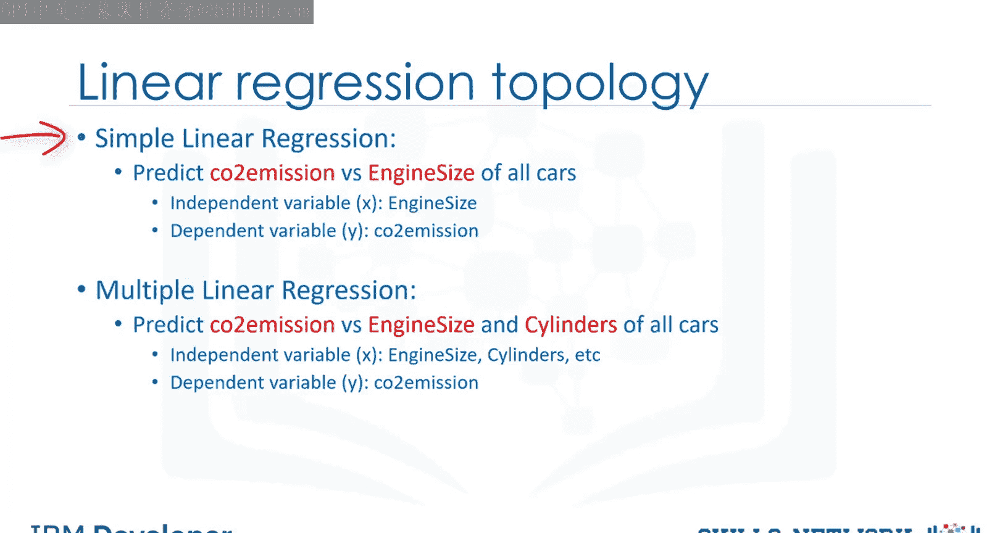

## 线性回归如何工作？

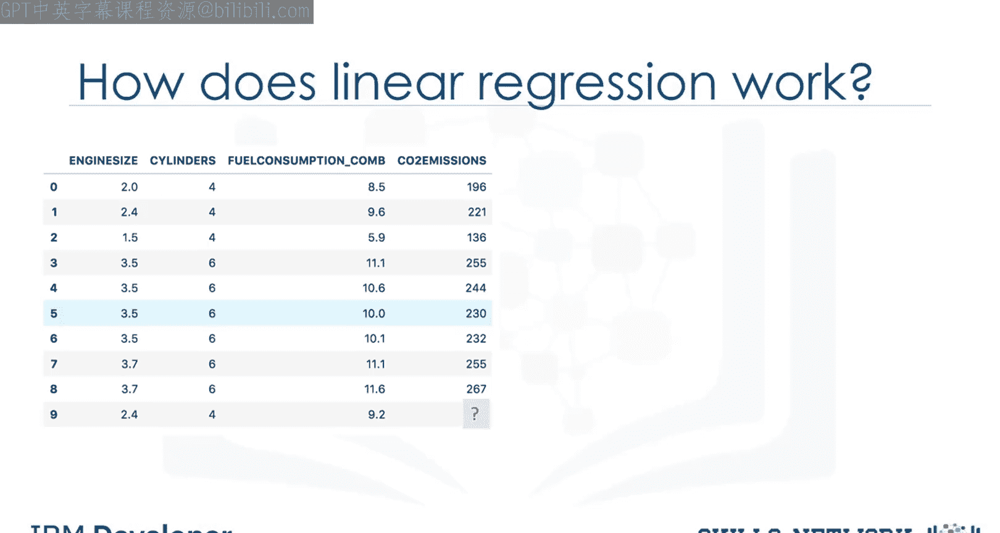

为了理解线性回归，我们首先将变量绘制在散点图上。我们将发动机排量作为自变量（X轴），将排放量作为我们想要预测的目标值（Y轴）。

散点图可以清晰地展示变量之间的关系，表明一个变量的变化如何解释或导致另一个变量的变化。从图中可以看出，这些变量呈线性相关。

通过线性回归，我们可以找到一条穿过这些数据点的最佳拟合直线。例如，随着发动机排量增加，排放量也相应增加。一个好的模型可以用来预测每辆汽车的大致排放量。

那么，我们如何使用这条线进行预测呢？假设这条线是数据的良好拟合，我们可以用它来预测未知汽车的排放量。例如，对于一台发动机排量为2.4的样本汽车，我们可以找到其预测排放量为214。

## 拟合线是什么？

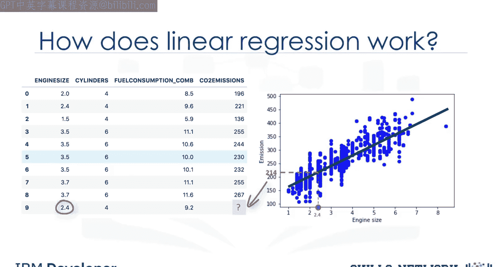

我们将使用自变量（发动机排量，用 **x1** 表示）来预测目标值 **Y**。

在简单回归问题中，拟合线传统上表示为一个多项式。对于单个X，模型的形式为：

**Y_hat = θ₀ + θ₁ * x₁**

在这个方程中：
*   **Y_hat** 是因变量或预测值。
*   **x₁** 是自变量。
*   **θ₀** 和 **θ₁** 是直线的参数，我们需要进行调整。
    *   **θ₁** 被称为直线的**斜率**或**梯度**。
    *   **θ₀** 被称为**截距**。
    *   θ₀ 和 θ₁ 也被称为线性方程的**系数**。

这个方程可以解释为 **Y_hat** 是 **x₁** 的函数。

现在的问题是：如何绘制一条穿过这些点的线？如何确定哪条线拟合得最好？线性回归通过估计直线的系数来回答这个问题，即我们必须计算 **θ₀** 和 **θ₁** 以找到拟合数据的最佳直线，从而最好地估计未知数据点的排放量。

## 如何找到最佳拟合线？

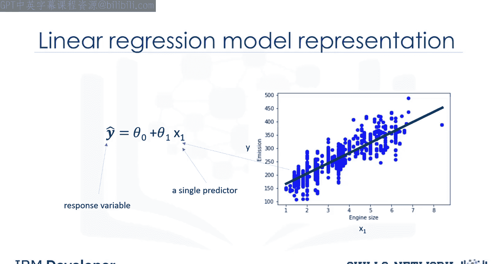

假设我们已经找到了数据的最佳拟合线。现在，我们检查所有数据点与该直线的对齐程度。

“最佳拟合”意味着，例如，对于一台发动机排量 **x₁ = 5.4**、实际CO₂排放量 **y = 250** 的汽车，基于历史数据，其CO₂预测值应非常接近实际值250。但如果我们使用拟合线（即使用已知参数的多项式）来预测CO₂排放量，可能会得到 **Y_hat = 340**。

比较汽车排放的实际值与模型预测值，我们会发现存在90个单位的误差。这意味着我们的预测线不准确。这个误差也称为**残差**，即数据点到拟合回归线的距离。

所有残差误差的平均值显示了直线与整个数据集的拟合程度。在数学上，这可以用**均方误差**方程表示，记作 **MSE**。

我们的目标是找到一条使所有这些误差的平均值最小化的直线。换句话说，使用拟合线进行预测的平均误差应最小化。

更技术性地表述：线性回归的目标是最小化这个MSE方程。为了最小化它，我们必须找到最佳参数 **θ₀** 和 **θ₁**。

那么，如何找到能最小化误差的 **θ₀** 和 **θ₁** 呢？我们有两种选择：
1.  使用数学方法。
2.  使用优化方法。

## 使用数学公式计算参数

如前所述，在简单线性回归中，**θ₀** 和 **θ₁** 是拟合线的系数。我们可以使用一个简单的方程来估计这些系数。由于这是只有两个参数的简单线性回归，并且知道 **θ₀** 和 **θ₁** 分别是直线的截距和斜率，我们可以直接从数据中估计它们。这要求我们计算数据集中自变量列和因变量（目标）列的平均值。

可以证明，截距和斜率可以使用以下方程计算：

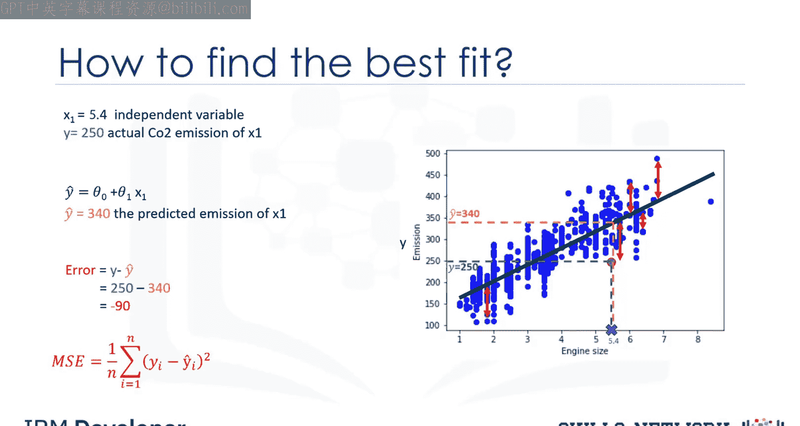

**θ₁ = Σ((x_i - x̄) * (y_i - ȳ)) / Σ((x_i - x̄)²)**
**θ₀ = ȳ - θ₁ * x̄**

我们可以从估计 **θ₁** 的值开始，这是基于数据找到直线斜率的方法。**x̄** 是我们数据集中发动机排量的平均值。

假设我们有9行数据（行0到8）。首先，我们计算 **x₁** 的平均值和 **y** 的平均值。

然后将其代入斜率方程以找到 **θ₁**。方程中的 **x_i** 和 **y_i** 指的是我们需要对数据集中的所有值重复这些计算，**i** 指的是X或Y的第i个值。应用所有值后，我们得到 **θ₁ = 39**。

现在我们有了第二个参数，用它来计算第一个参数，即直线的截距。将 **θ₁** 代入直线方程可以找到 **θ₀**。很容易计算出 **θ₀ = 125.74**。

因此，直线的两个参数是：**θ₀ = 125.74**， **θ₁ = 39**。其中，**θ₀** 也称为偏置系数，**θ₁** 是CO₂排放列的系数。

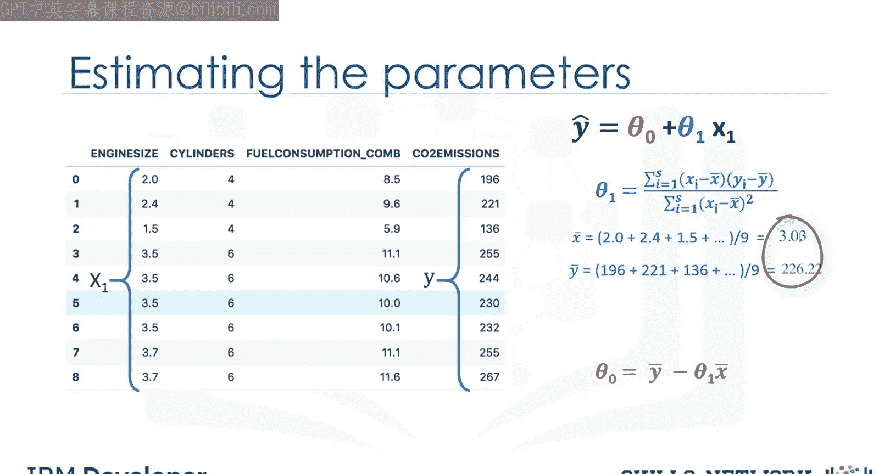

需要注意的是，你不需要记住这些计算公式，因为Python、R和Scala中用于机器学习的大多数库都可以轻松为你找到这些参数。但理解其工作原理总是有益的。

现在我们可以写出直线的多项式方程。

## 使用模型进行预测

在找到线性方程的参数后，进行预测就像为特定输入集解方程一样简单。

想象我们正在为数据集中第9行的汽车，根据发动机排量 **X** 预测CO₂排放量 **Y**。我们对此问题的线性回归模型表示为：

**Y_hat = θ₀ + θ₁ * x₁**

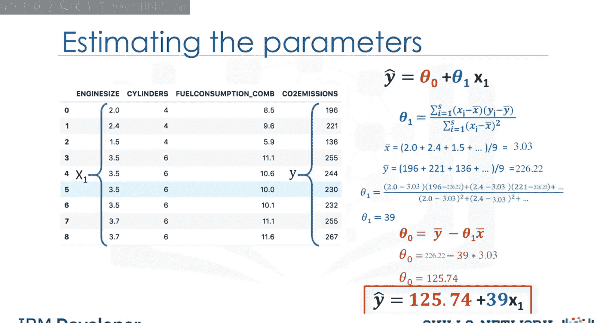

或者映射到我们的数据集，即：
**CO₂排放量 = θ₀ + θ₁ * 发动机排量**

如前所述，我们可以使用刚才讨论的方程找到 **θ₀** 和 **θ₁**。一旦找到，我们就可以代入线性模型的方程。例如，使用 **θ₀ = 125**， **θ₁ = 39**，我们可以将线性模型重写为：

**CO₂排放量 = 125 + 39 * 发动机排量**

现在，让我们插入数据集的第9行，计算发动机排量为2.4的汽车的CO₂排放量：
**CO₂排放量 = 125 + 39 * 2.4 = 218.6**

因此，我们可以预测这辆特定汽车的CO₂排放量约为218.6。

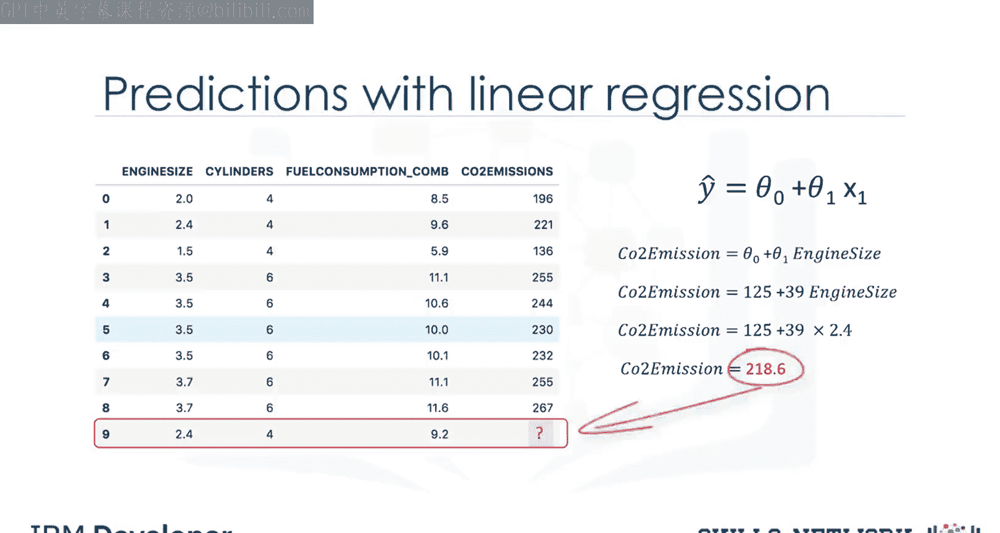

## 线性回归的优势

最后，我们来谈谈线性回归为何如此有用。很简单，它是最基本、最易于使用和理解的回归方法。

线性回归的主要优势包括：
*   **速度快**：计算效率高。
*   **无需调参**：不像K近邻中的K参数或神经网络中的学习率那样需要调整。
*   **易于理解和解释**：模型直观，结果容易解释。

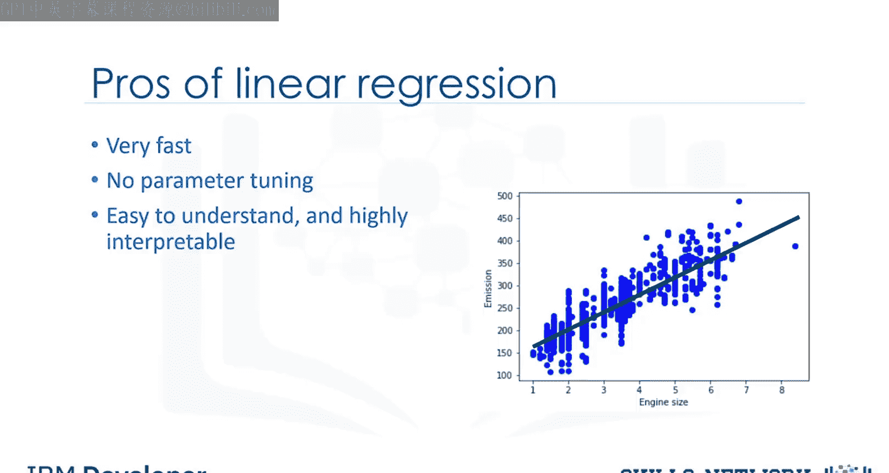

本节课中我们一起学习了简单线性回归的核心概念，包括其定义、工作原理、如何通过数学方法计算最佳拟合线的参数，以及如何使用得到的模型进行预测。线性回归是机器学习中最基础且强大的工具之一，为理解更复杂的模型奠定了坚实的基础。