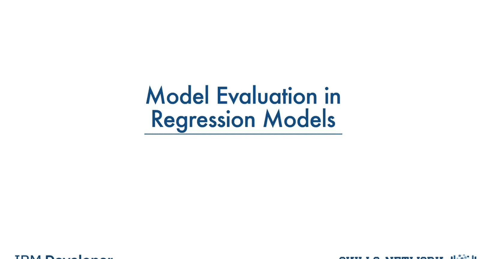
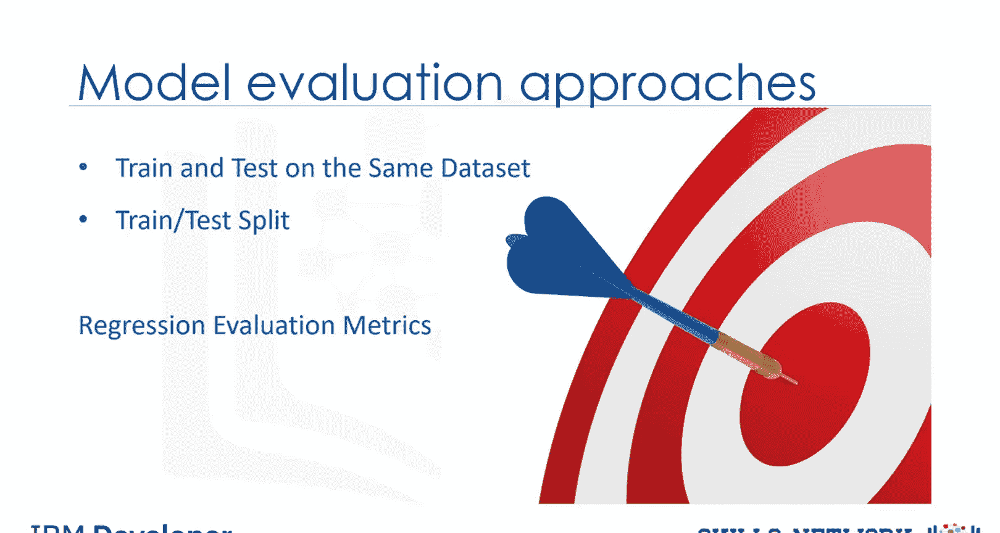
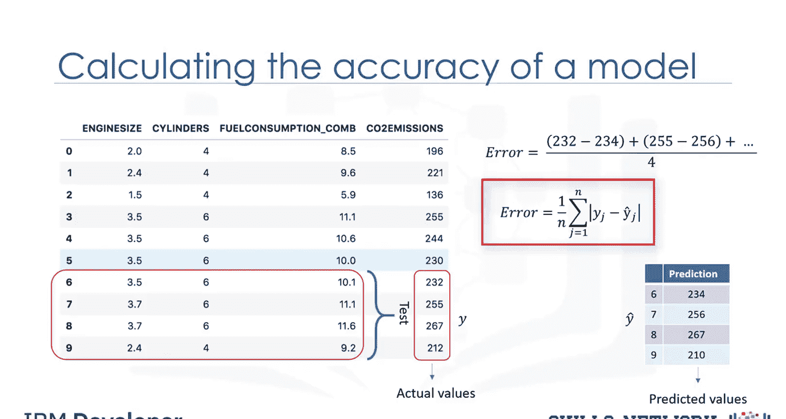
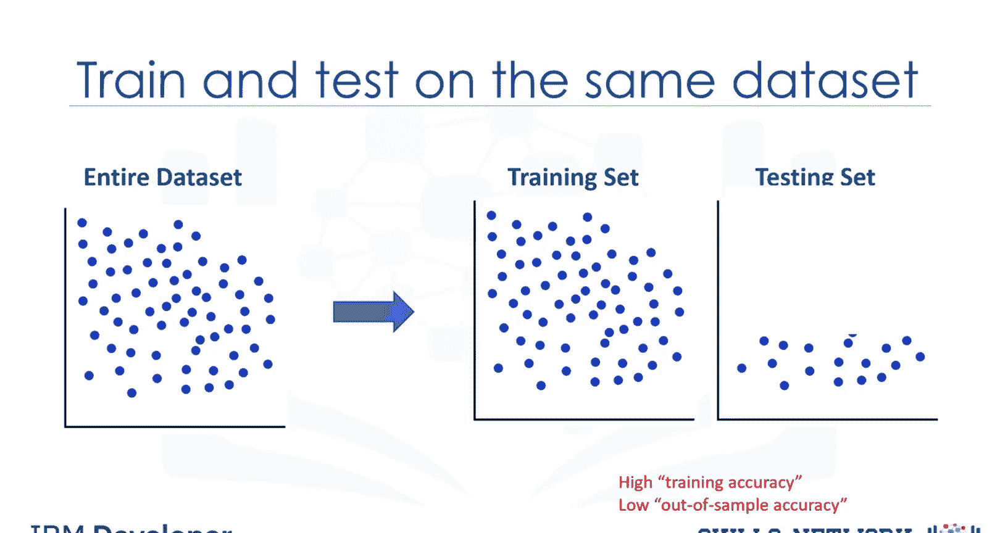
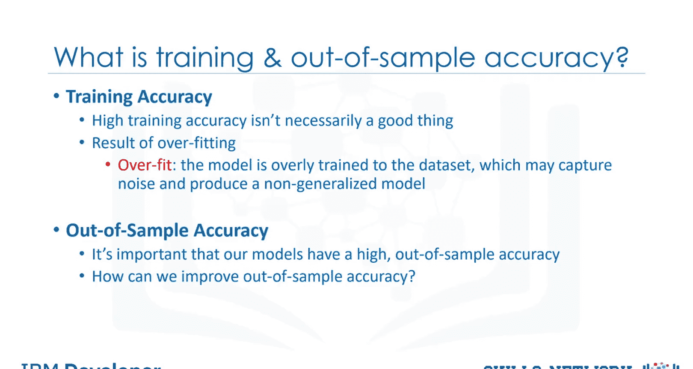
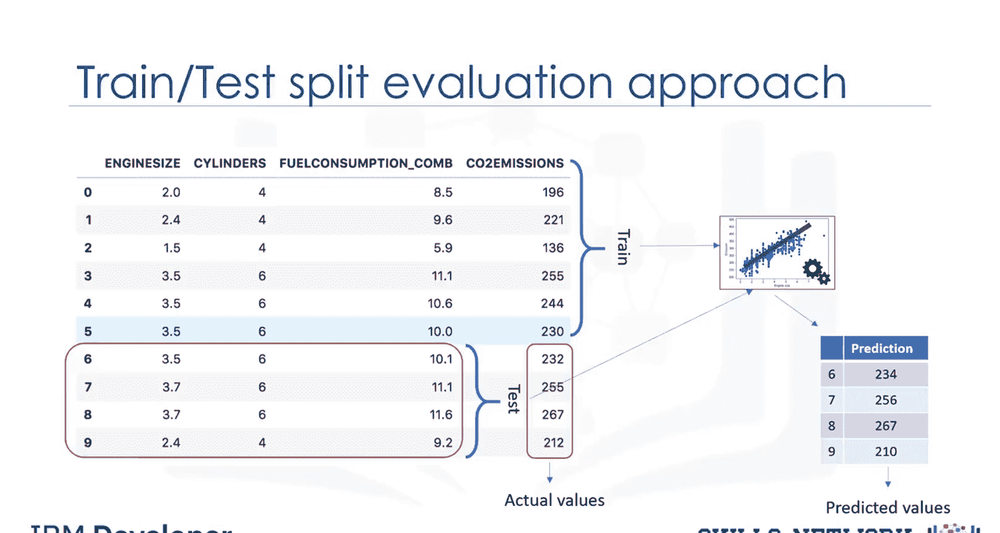
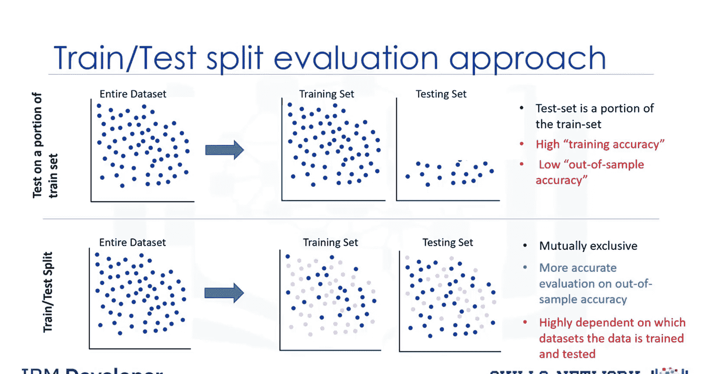
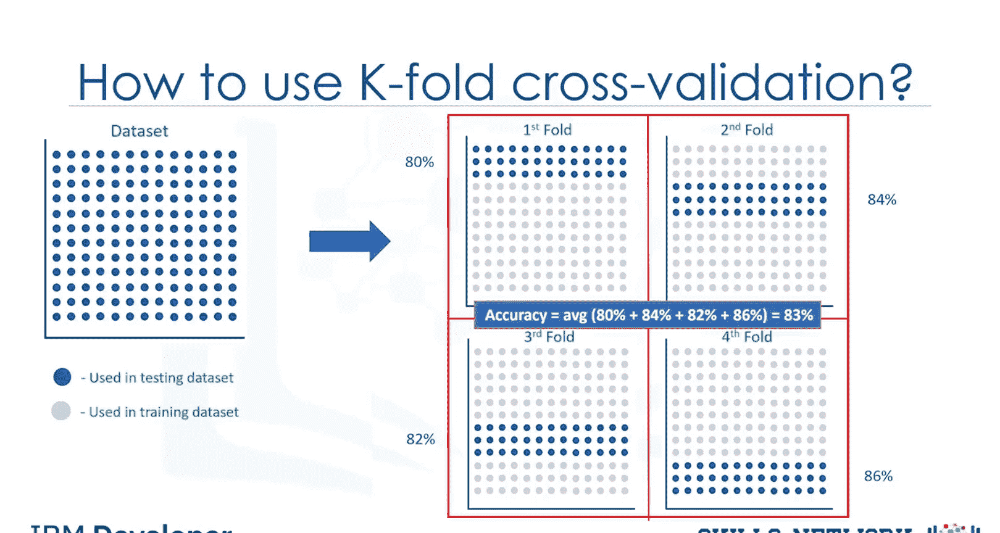

# 生成式人工智能工程：065：回归模型中的模型评估 📊

在本节课中，我们将要学习回归模型的评估方法。模型评估是判断模型预测准确性的关键步骤，它帮助我们了解模型在未知数据上的表现。我们将介绍两种主要的评估方法，并讨论各自的优缺点，同时也会介绍一些用于衡量回归模型准确性的指标。

## 评估方法概述

上一节我们介绍了模型评估的目标，本节中我们来看看具体的评估方法。回归的目标是构建一个能够准确预测未知案例的模型。为此，在构建模型后，我们必须进行回归评估。本视频将介绍并讨论两种可用于实现此目标的评估方法。这两种方法是：**在同一数据集上训练和测试** 与 **训练测试集划分**。

我们将讨论每种方法是什么，以及使用每种模型的优缺点。同时，我们还将介绍一些用于评估回归模型准确性的指标。

## 方法一：在同一数据集上训练和测试

首先，让我们看看第一种方法。在考虑评估模型时，我们显然希望选择能提供最准确结果的方法。那么问题来了，我们如何计算模型的准确性？换句话说，在使用给定数据集并构建了线性回归等模型后，我们能在多大程度上信任该模型对未知样本的预测？

解决方案之一是选择数据集的一部分用于测试。例如，假设我们的数据集中有10条记录。我们使用整个数据集进行训练，并利用这个训练集构建一个模型。现在，我们选择数据集的一小部分，例如第6到第9行，但不包含标签。这个集合称为测试集，它包含标签，但这些标签不用于预测，仅作为真实值使用。这些标签被称为测试集的**实际值**。

现在，我们将测试部分的特征集传递给已构建的模型，并预测目标值。最后，我们将模型的预测值与测试集中的实际值进行比较。这表明了我们的模型实际上有多准确。报告模型准确性的指标有多种，但大多数通常基于预测值和实际值的相似性来计算。

以下是计算回归模型准确性最简单的一个指标。

如前所述，我们只需比较实际值 **Y** 与预测值 **Ŷ**（对于测试集）。模型的误差计算为所有行的预测值与实际值之间的平均差值。我们可以将此误差写成一个公式。

**误差公式：**
`误差 = (1/n) * Σ |Y_i - Ŷ_i|`
其中，`n` 是测试样本的数量，`Y_i` 是实际值，`Ŷ_i` 是预测值。

我们刚刚讨论的第一个评估方法是最简单的，即**在同一数据集上训练和测试**。

本质上，这种方法的名称说明了一切：你在整个数据集上训练模型，然后使用同一数据集的一部分对其进行测试。一般来说，当你使用一个已知每个数据点目标值的数据集进行测试时，你能够获得模型准确预测的百分比。

这种评估方法很可能具有较高的**训练精度**和较低的**样本外精度**，因为模型从训练中已经了解了所有测试数据点。

## 理解训练精度与样本外精度

我们提到，在同一数据集上进行训练和测试会产生较高的训练精度，但训练精度究竟是什么？**训练精度**是模型使用测试数据集时做出正确预测的百分比。

然而，高训练精度不一定是一件好事。例如，高训练精度可能导致**过拟合**。这意味着模型对数据集的训练过度，可能捕捉到噪声并产生一个非泛化的模型。

**样本外精度**是模型在未训练过的数据上做出正确预测的百分比。由于可能过拟合，在同一数据集上进行训练和测试很可能具有较低的样本外精度。

我们的模型具有高样本外精度非常重要，因为模型的目的是对未知数据做出正确预测。那么，我们如何提高样本外精度？一种方法是使用另一种称为**训练测试集划分**的评估方法。

## 方法二：训练测试集划分

在这种方法中，我们选择数据集的一部分进行训练，例如第0到第5行，其余部分用于测试，例如第6到第9行。模型在训练集上构建。

然后将测试特征集传递给模型进行预测。最后，将测试集的预测值与测试集的实际值进行比较。

这第二种评估方法称为**训练测试集划分**。

训练测试集划分涉及将数据集分别拆分为训练集和测试集，它们是互斥的。之后，你用训练集进行训练，用测试集进行测试。这将为样本外精度提供更准确的评估，因为测试数据集不是用于训练数据的数据集的一部分。对于现实世界的问题来说，这更真实。

这意味着我们知道数据集中每个数据点的结果，非常适合进行测试。并且由于这些数据未被用于训练模型，模型对这些数据点的结果一无所知，因此本质上，这是真正的样本外测试。但是，请确保之后使用测试集训练你的模型，因为你不想丢失潜在的有价值数据。

训练测试集划分的问题在于，它高度依赖于训练和测试所依据的数据集。这种变化使得训练测试集划分比在同一数据集上训练和测试具有更好的样本外预测能力，但由于这种依赖性，它仍然存在一些问题。

另一种称为 **K折交叉验证** 的评估模型解决了大部分这些问题。

## 方法三：K折交叉验证简介

如何解决由依赖性导致的高方差问题？答案是进行平均。

让我解释一下K折交叉验证的基本概念，看看我们如何解决这个问题。整个数据集由左上角图像中的点表示。

如果我们设置K等于4折，那么我们将数据集拆分如下所示。例如，在第一折中，我们使用数据集的前25%进行测试，其余部分用于训练。使用训练集构建模型，并使用测试集进行评估。

然后在下一轮或第二折中，数据集的第二个25%用于测试，其余部分用于训练模型，再次计算模型的准确性。我们继续所有折。最后，对所有四次评估的结果进行平均；即每折的准确性被平均，请注意每折都是不同的，其中一折中的训练数据不会在另一折中使用。

最简单形式的K折交叉验证使用同一数据集执行多次训练测试划分，每次划分都不同。然后对结果进行平均，以产生更一致的样本外精度。

我们想向你展示一个评估模型，它解决了我们在先前方法中描述的一些问题。然而，深入探讨K折交叉验证模型超出了本课程的范围。

## 总结

本节课中我们一起学习了回归模型的评估方法。我们介绍了三种主要的评估方法：在同一数据集上训练和测试、训练测试集划分以及K折交叉验证的基本概念。每种方法都有其适用场景和优缺点。关键在于理解训练精度与样本外精度的区别，并选择合适的方法来获得对模型泛化能力的可靠估计，从而确保模型在未知数据上也能做出准确的预测。