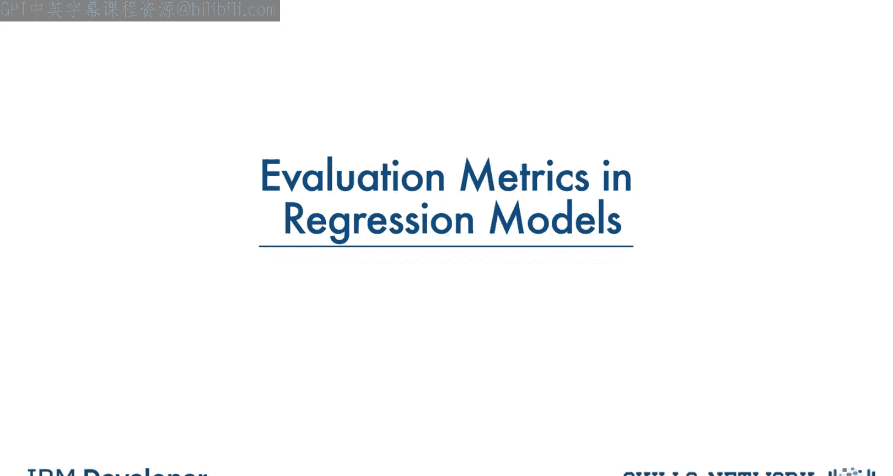
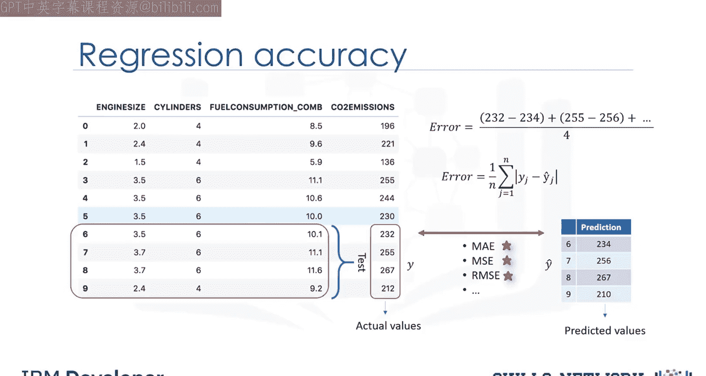
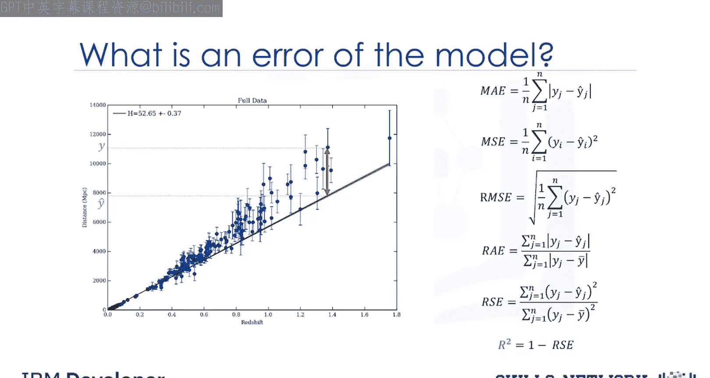

# 生成式人工智能工程：066：回归模型评估指标 🎯

在本节课中，我们将学习如何评估回归模型的性能。我们将介绍几种关键的评估指标，它们通过比较模型预测值与实际值之间的差异来衡量模型的准确性。理解这些指标对于改进模型至关重要。

## 什么是评估指标？ 📊

评估指标用于解释模型的性能。

具体到回归模型，我们可以通过比较实际值和预测值来计算其准确性。评估指标在模型开发中起着关键作用，它能揭示需要改进的领域。

我们将回顾几种模型评估指标，包括平均绝对误差、均方误差和均方根误差。但在定义这些指标之前，我们需要先明确“误差”是什么。

## 理解误差 📈

在回归的语境中，模型的误差是数据点与算法生成的趋势线之间的差值。

由于存在多个数据点，可以通过多种方式确定误差。

## 核心评估指标详解

以下是几种常用的回归模型评估指标。

### 平均绝对误差

平均绝对误差是误差绝对值的平均值。这是最容易理解的指标，因为它就是平均误差。

**公式**：
`MAE = (1/n) * Σ|y_i - ŷ_i|`
其中，`y_i`是实际值，`ŷ_i`是预测值，`n`是样本数量。

### 均方误差

均方误差是误差平方的平均值。它比平均绝对误差更常用，因为它更侧重于较大的误差。这是由于平方项会以指数方式放大较大误差相对于较小误差的影响。

**公式**：
`MSE = (1/n) * Σ(y_i - ŷ_i)^2`

### 均方根误差

均方根误差是均方误差的平方根。这是最流行的评估指标之一，因为均方根误差可以解释为与响应向量或Y轴单位相同的单位，这使得其信息易于关联。

**公式**：
`RMSE = sqrt(MSE)`

### 相对绝对误差

相对绝对误差，也称为残差平方和，其中`ȳ`是y的平均值。它计算总绝对误差，并通过除以简单预测器的总绝对误差对其进行归一化。

**公式**：
`RAE = Σ|y_i - ŷ_i| / Σ|y_i - ȳ|`

### 相对平方误差

相对平方误差与相对绝对误差非常相似，但被数据科学界广泛采用，因为它用于计算R平方。

**公式**：
`RSE = Σ(y_i - ŷ_i)^2 / Σ(y_i - ȳ)^2`

### R平方

R平方本身并非误差，而是衡量模型准确性的流行指标。它表示数据值有多接近拟合的回归线，R平方越高，模型对数据的拟合度越好。

**公式**：
`R² = 1 - RSE`

## 如何选择指标？ 🤔

以上每种指标都可用于量化你的预测。指标的选择完全取决于模型的类型、你的数据类型和知识领域。遗憾的是，进一步的探讨超出了本课程的范围。

## 总结 📝

本节课我们一起学习了回归模型的核心评估指标。我们明确了“误差”的定义，并详细介绍了平均绝对误差、均方误差、均方根误差、相对绝对误差、相对平方误差以及R平方。理解这些指标的计算方式和含义，是评估和优化回归模型性能的基础。记住，根据具体问题和数据特点选择合适的评估指标至关重要。