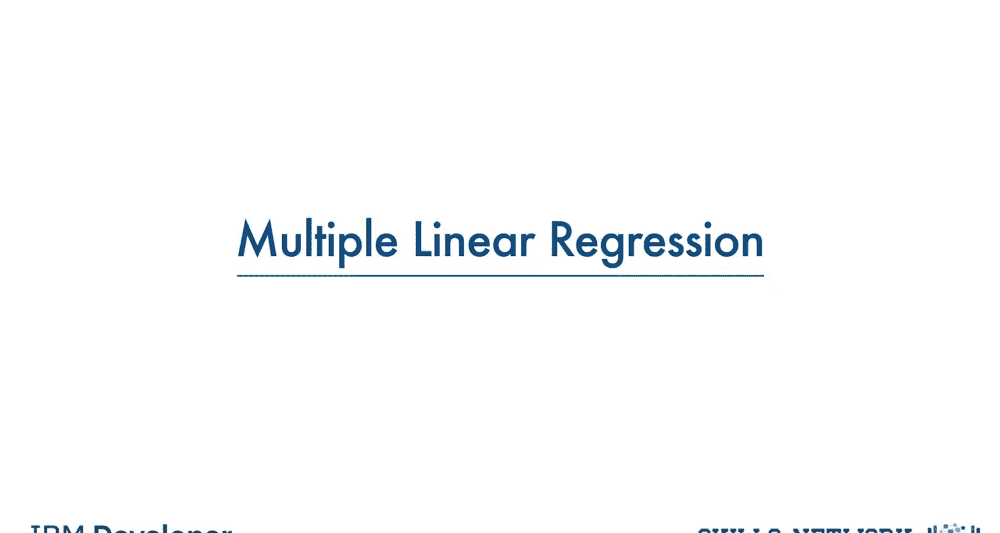
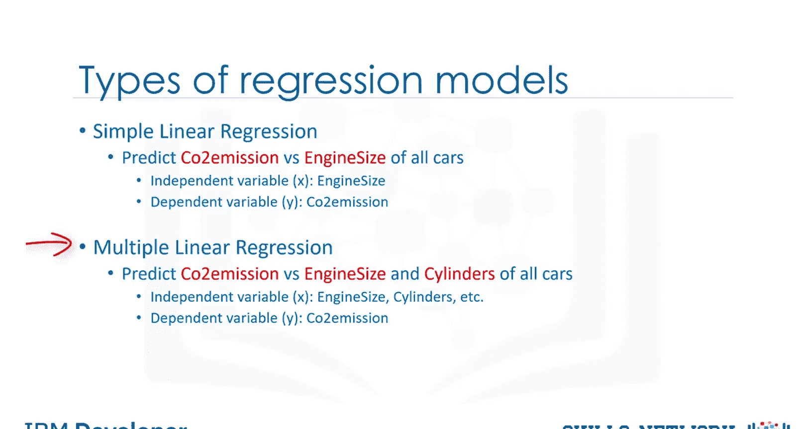
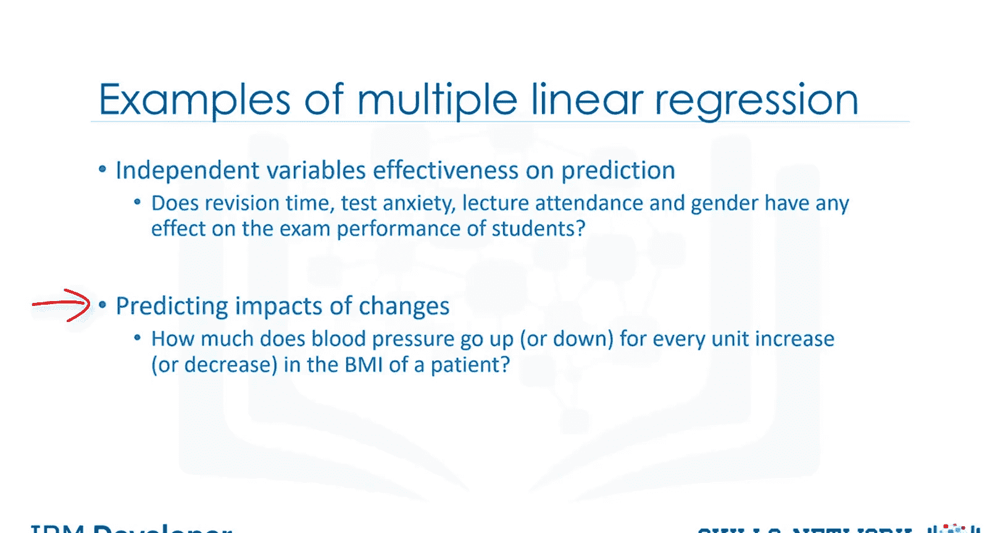
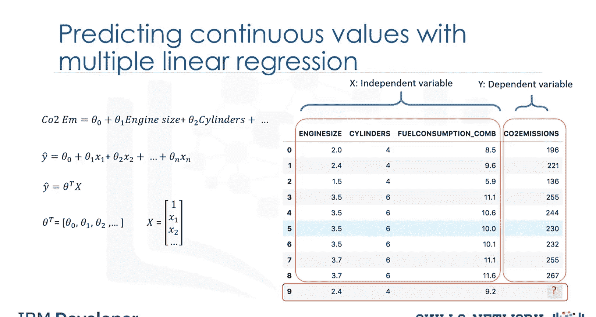
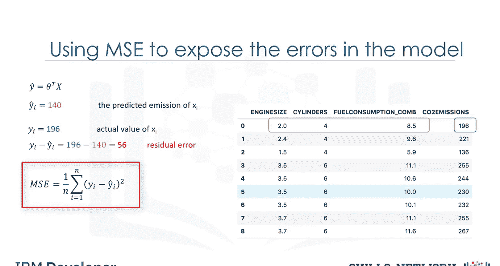
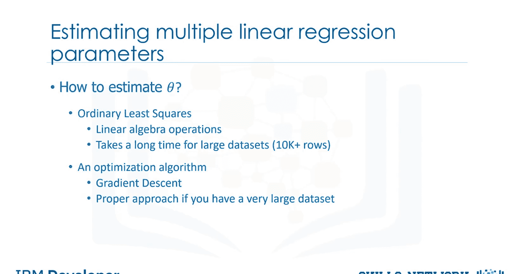
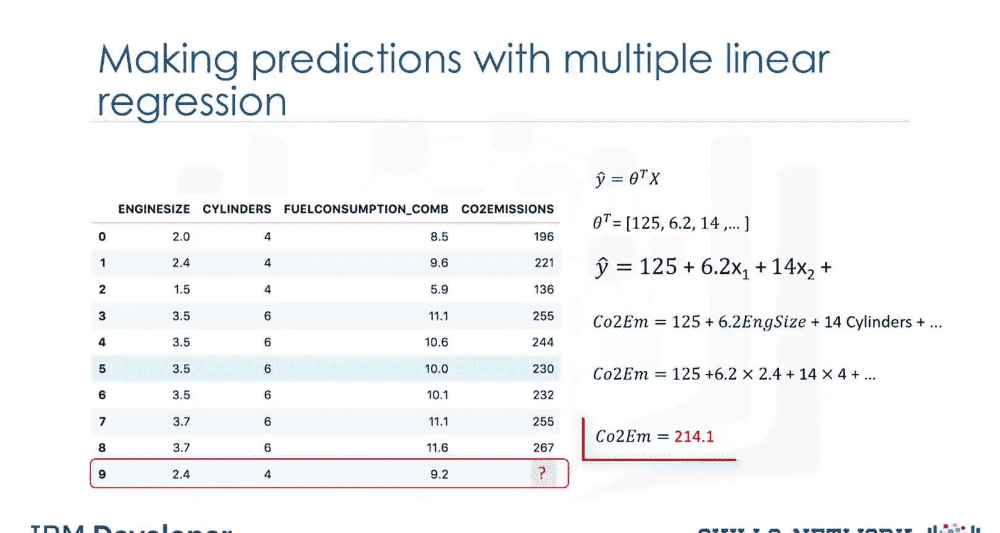
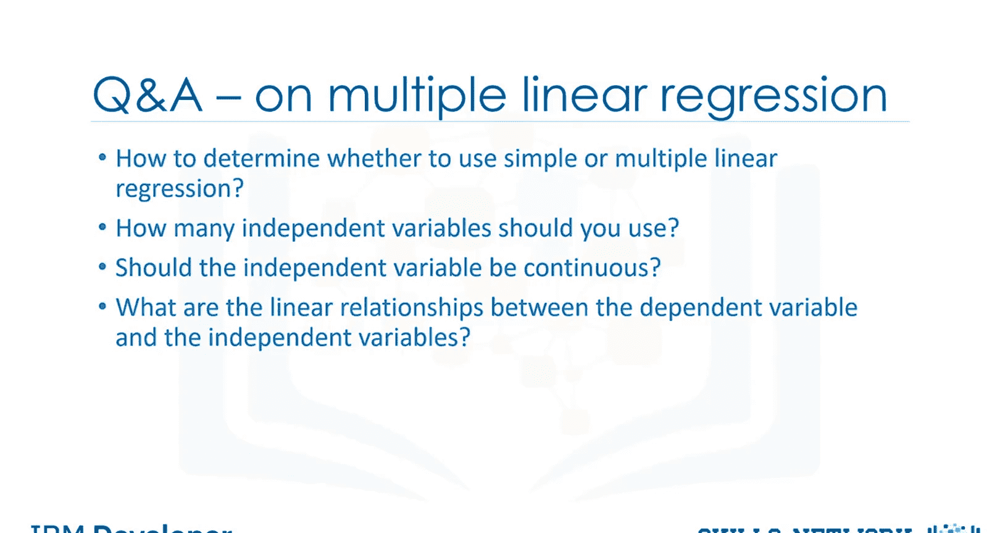

# 生成式人工智能工程：067：多元线性回归 📈

在本节课中，我们将要学习多元线性回归。这是一种用于预测连续变量的统计方法，它使用多个自变量来预测一个因变量。我们将探讨其基本概念、应用场景、模型构建方法以及注意事项。

## 什么是多元线性回归？🤔

上一节我们介绍了线性回归的基本概念，本节中我们来看看多元线性回归。

简单线性回归使用一个自变量来估计因变量。例如，使用发动机大小来预测二氧化碳排放量。然而在现实中，预测二氧化碳排放量通常涉及多个变量。当存在多个自变量时，这个过程就称为多元线性回归。例如，使用发动机大小和气缸数量来预测汽车的二氧化碳排放量。

多元线性回归是简单线性回归模型的扩展。因此，建议您先学习简单线性回归。

## 多元线性回归的应用场景 🎯

在深入探讨样本数据集和多元线性回归的工作原理之前，我们先了解它能解决哪些问题、何时使用它，以及具体能回答哪些问题。

多元线性回归主要有两个应用方向：

1.  **识别自变量对因变量的影响强度**。例如，复习时间、考试焦虑、课堂出勤率和性别是否对学生的考试成绩有影响？
2.  **预测变化的影响**。即理解当自变量改变时，因变量如何变化。例如，在分析一个人的健康数据时，多元线性回归可以告诉我们，在保持其他因素不变的情况下，患者的体重指数每增加或减少一个单位，其血压会相应上升或下降多少。

## 多元线性回归模型 🧮

与简单线性回归一样，多元线性回归是一种预测连续变量的方法。它使用多个称为自变量或预测变量的变量，来最佳地预测目标变量（也称为因变量）的值。

在多元线性回归中，目标值 **Y** 是自变量 **X** 的线性组合。例如，您可以根据汽车的发动机大小、气缸数量和油耗等自变量来预测其二氧化碳排放量。

多元线性回归非常有用，因为您可以检查哪些变量是结果变量的显著预测因子，并了解每个特征如何影响结果变量。同样，如果您成功构建了这样的回归模型，就可以用它来预测未知案例（例如第9条记录）的排放量。

通常，模型的形式为：
**ŷ = θ₀ + θ₁x₁ + θ₂x₂ + ... + θₙxₙ**

从数学上讲，我们也可以用向量形式表示。这意味着它可以表示为两个向量——参数向量和特征集向量的点积。通常，我们可以将多维空间的方程表示为 **θᵀx**，其中 **θ** 是 **n×1** 的未知参数向量，**x** 是特征集的向量。

**θ** 也称为回归方程的参数或权重向量，这两个术语可以互换使用。**X** 是特征集，代表一个样本（例如一辆汽车），**x₁** 代表发动机大小，**x₂** 代表气缸数，依此类推。特征集的第一个元素通常设为1，这样 **θ₀** 就变成了截距或偏置参数。

请注意，在一维空间中，**θᵀX** 是一条直线的方程，也就是我们在简单线性回归中使用的。在更高维度（当我们有多个输入或 **X** 时），这条“线”被称为平面或超平面，这就是我们用于多元线性回归的。因此，核心思想是为我们的数据找到最佳拟合的超平面。为此，与线性回归一样，我们需要估计能最佳预测每行目标字段值的 **θ** 向量值。

为了实现这个目标，我们必须最小化预测误差。现在的问题是，我们如何找到最优化的参数？

## 如何找到最优参数？🔍

要找到模型的最优参数，我们首先需要理解什么是最优参数，然后找到优化参数的方法。简而言之，最优参数是能导致模型误差最少的参数。

假设我们已经找到了模型的参数向量，即我们已经知道了 **θ** 向量的值。现在我们可以使用模型和数据集中第一行的特征集来预测第一辆汽车的二氧化碳排放量。如果我们将特征集的值代入模型方程，会得到预测值 **ŷ**。例如，假设它返回140作为该特定行的预测值。实际值 **y** 是196。预测值与实际值196的差异有多大？我们可以简单地计算为196减去140，等于56。这就是我们模型仅针对一行（本例中为一辆汽车）的误差。

与线性回归一样，这里的误差可以看作是数据点到拟合回归模型的距离。所有残差误差的平均值显示了模型代表数据集的糟糕程度，这被称为均方误差（MSE）。从数学上讲，MSE可以用一个方程表示。虽然这不是展示多元线性回归模型误差的唯一方法，但却是最流行的方法之一。我们数据集的最佳模型是所有预测值误差最小的模型。因此，多元线性回归的目标是最小化MSE方程。为了最小化它，我们需要找到最佳的参数 **θ**。但是，如何找呢？

## 参数估计方法 ⚙️

我们如何找到多元线性回归的参数或系数？估计这些系数值的方法有很多。然而，最常见的方法是最小二乘法和优化方法。

**普通最小二乘法**试图通过最小化均方误差来估计系数的值。这种方法将数据视为矩阵，并使用线性代数运算来估计 **θ** 的最优值。这种技术的问题在于计算矩阵运算的时间复杂度很高，可能需要很长时间才能完成。当数据集中的行数少于10,000时，可以考虑使用这种技术；但对于更大的数值，应尝试其他更快的方法。

**第二种选择是使用优化算法来寻找最佳参数**。即，您可以通过迭代最小化模型在训练数据上的误差来优化系数的值。例如，您可以使用梯度下降法，它从每个系数的随机值开始优化，然后计算误差，并尝试通过多次迭代中明智地改变系数来最小化误差。如果您有一个大型数据集，梯度下降是一个合适的方法。但请注意，还有其他方法可以估计多元线性回归的参数，您可以自行探索。

找到模型的最佳参数后，您就可以进入预测阶段。

## 进行预测 📊

找到线性方程的参数后，进行预测就像为特定输入集解方程一样简单。

想象一下，我们正在根据其他变量预测记录中第9辆汽车的二氧化碳排放量 **Y**。这个问题的线性回归模型表示为 **ŷ = θᵀx**。一旦我们找到参数，就可以将它们代入线性模型的方程中。例如，假设 **θ₀ = 125**，**θ₁ = 6.2**，**θ₂ = 14**，依此类推。

如果将其映射到我们的数据集，可以将线性模型重写为：
**二氧化碳排放量 = 125 + 6.2 × 发动机大小 + 14 × 气缸数 + ...**

如您所见，多元线性回归估计了预测因子的相对重要性。例如，它显示与发动机大小相比，气缸数对二氧化碳排放量的影响更大。现在，让我们插入数据的第九行，计算发动机大小为2.4的汽车的二氧化碳排放量：
**二氧化碳排放量 = 125 + 6.2 × 2.4 + 14 × 4 + ...**
我们可以预测这辆特定汽车的二氧化碳排放量将是214.1。

## 注意事项与常见问题 ❗

现在，让我解答一些您可能对多元线性回归已有的疑问。

正如您所看到的，您可以在多元线性回归中使用多个自变量来预测目标值。与仅使用一个自变量来预测因变量的简单线性回归相比，这有时会产生更好的模型。现在的问题是，我们应该使用多少个自变量进行预测？我们应该使用数据集中的所有字段吗？向多元线性回归模型添加自变量是否总是会提高模型的准确性？

基本上，在没有理论依据的情况下添加过多的自变量可能会导致模型**过拟合**。过拟合模型是一个真正的问题，因为它对于您的数据集来说过于复杂，并且不够通用，无法用于预测。因此，建议避免使用过多变量进行预测。在回归中有不同的方法来避免模型过拟合，但这超出了本视频的范围。

下一个问题是，自变量必须是连续的吗？基本上，可以通过将分类自变量转换为数值变量，将其纳入回归模型。例如，对于一个二元变量（如汽车类型），可以编码为：手动挡为0，自动挡为1。

最后一点，请记住多元线性回归是线性回归的一种特定类型。因此，因变量与每个自变量之间需要存在线性关系。有多种方法可以检查线性关系。例如，您可以使用散点图，然后目视检查线性。如果散点图中显示的关系不是线性的，那么您需要使用非线性回归方法。

本节课中我们一起学习了多元线性回归的基本原理、模型构建、参数估计方法以及实际应用中的关键注意事项。理解这些概念是构建有效预测模型的基础。