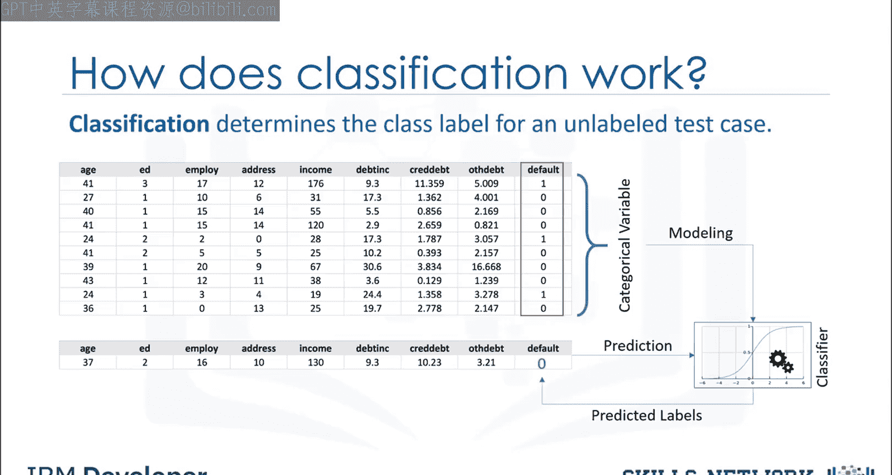
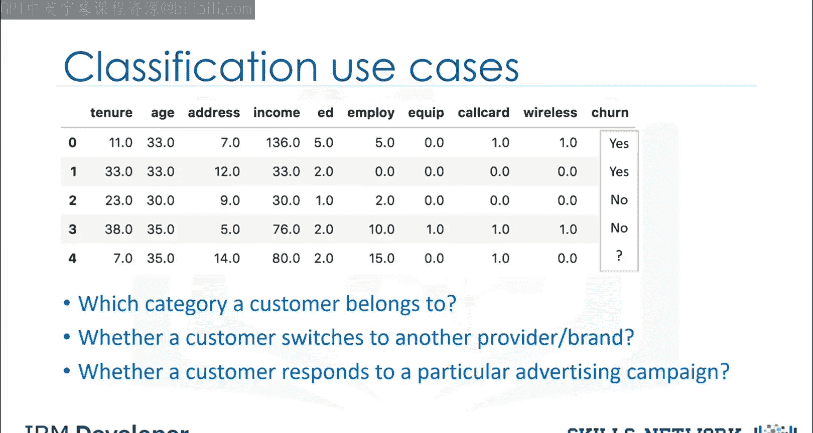
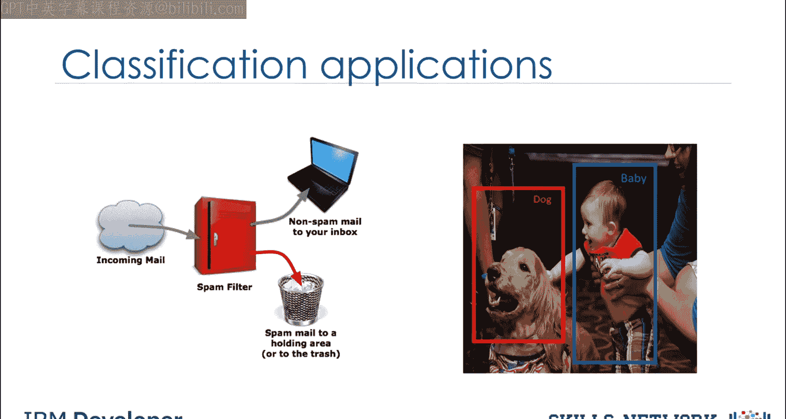
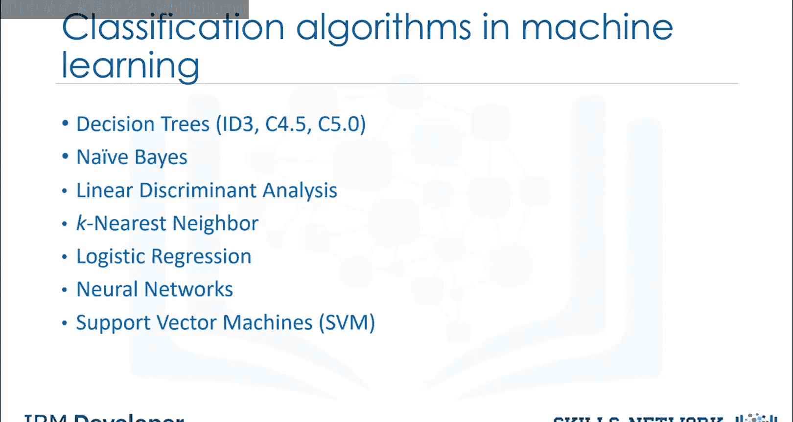

# 生成式人工智能工程：068：分类简介 📊

在本节课中，我们将学习机器学习中的分类任务。分类是一种监督学习方法，用于将未知项目归类到离散的类别中。我们将探讨分类的基本概念、工作原理、应用场景以及常见的算法类型。

## 什么是分类？

上一节我们介绍了本课的主题。本节中，我们来看看分类的具体定义。

在机器学习中，分类是一种监督学习方法。它可以被视为将一些未知项目归类到一个离散类别集合中的手段。分类试图学习一组特征变量与一个目标变量之间的关系。分类中的目标属性是一个分类变量，其值为离散值。

## 分类器如何工作？

了解了分类的定义后，本节我们来看看分类器的工作原理。

给定一组带有目标标签的训练数据点，分类的任务是为一个未标记的测试用例确定其类别标签。我们可以通过一个例子来解释。

以下是贷款违约预测的例子：
假设一家银行担心贷款可能无法收回。如果可以利用历史贷款违约数据来预测哪些客户可能难以偿还贷款，那么这些高风险客户的贷款申请可以被拒绝，或者向他们提供替代产品。贷款违约预测器的目标是使用现有的贷款违约数据（即关于客户的信息，如年龄、收入、教育程度等）来构建一个分类器。将一个新客户或潜在的未来违约者数据输入模型，然后将其标记为“违约者”或“非违约者”，例如用0或1表示。这就是分类器预测未标记测试用例的方式。

请注意，这个具体例子是关于具有两个值的**二元分类器**。我们也可以为二元分类和多类别分类构建分类器模型。

## 多类别分类示例

上一节我们以二元分类为例。本节中我们来看看多类别分类。

例如，假设您收集了一组患有相同疾病的患者数据。在治疗过程中，每位患者对三种药物中的一种产生了反应。您可以使用这个带有标签的数据集和分类算法来构建一个分类模型。然后，您可以用它来找出哪种药物可能适合未来患有相同疾病的患者。正如您所见，这是一个多类别分类的示例。

## 分类的商业应用

分类不仅限于技术示例，在商业中也有广泛用途。以下是分类的一些商业用例：

*   **客户类别预测**：预测客户所属的类别。
*   **客户流失检测**：预测客户是否会转向其他提供商或品牌。
*   **广告活动响应预测**：预测客户是否会对特定的广告活动做出响应。

## 分类的广泛应用

除了商业领域，数据分类在许多行业都有应用。本质上，许多问题都可以表示为特征变量和目标变量之间的关联，尤其是在有标签数据可用时。这为分类提供了广泛的适用性。

以下是分类的一些应用场景：
*   电子邮件过滤
*   语音识别
*   手写识别
*   生物特征识别
*   文档分类

## 分类算法类型

机器学习中有多种类型的分类算法。本课程中我们仅会介绍其中几种。

以下是主要的分类算法类型：
*   决策树
*   朴素贝叶斯
*   线性判别分析
*   K最近邻
*   逻辑回归
*   神经网络
*   支持向量机

---

本节课中我们一起学习了机器学习分类的基础知识。我们明确了分类是一种监督学习任务，用于将数据点分配到离散的类别中。我们通过贷款预测和药物选择的例子理解了分类器的工作原理，区分了二元分类与多类别分类。此外，我们还探讨了分类在客户分析、生物识别等多个领域的商业应用和广泛用途，并列举了决策树、逻辑回归等常见的分类算法类型。