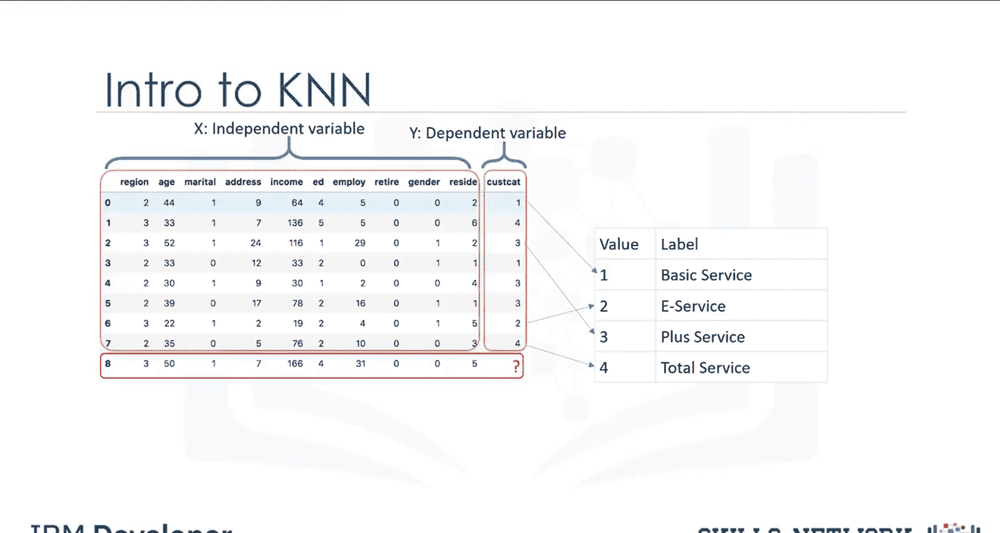
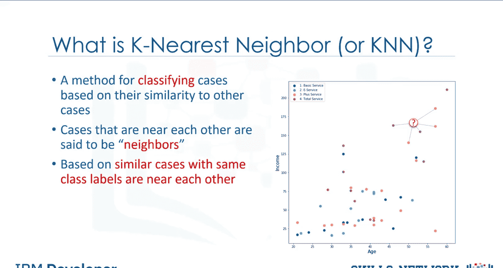
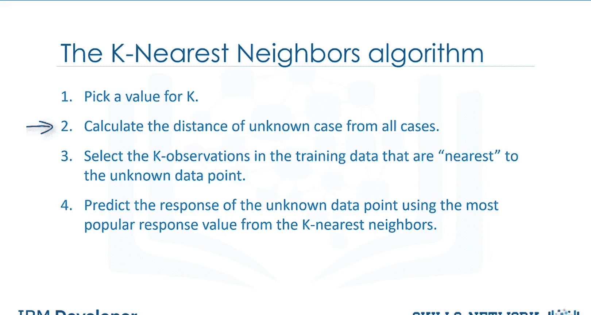
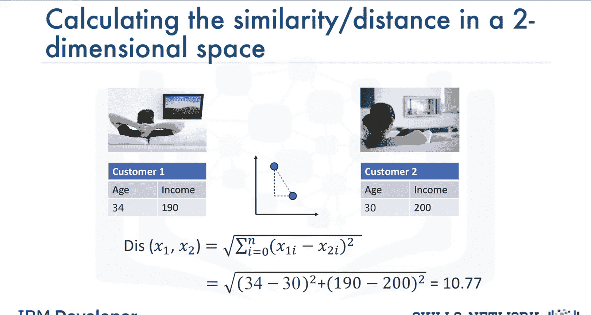
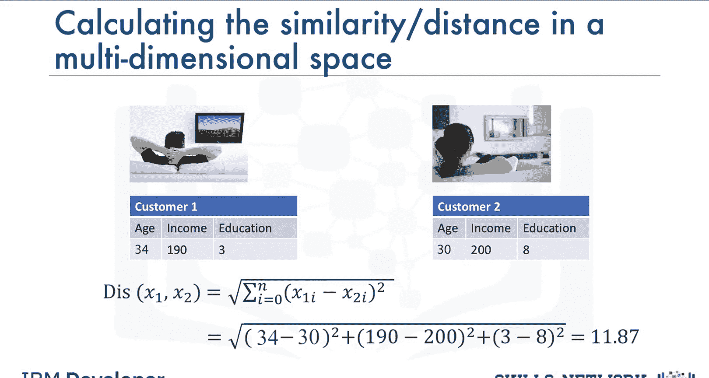
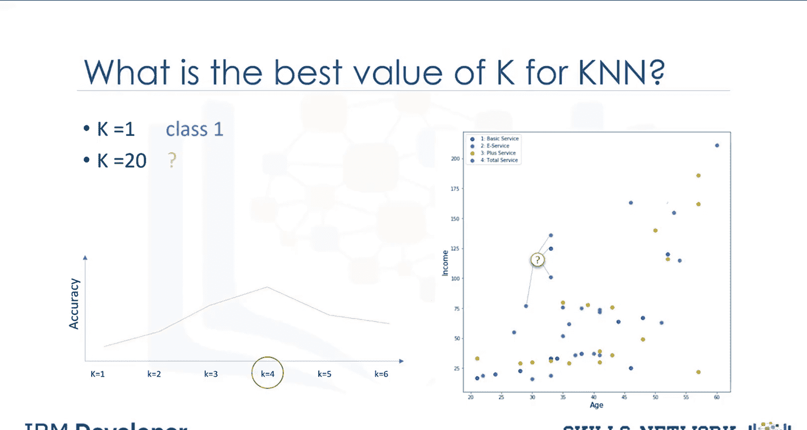
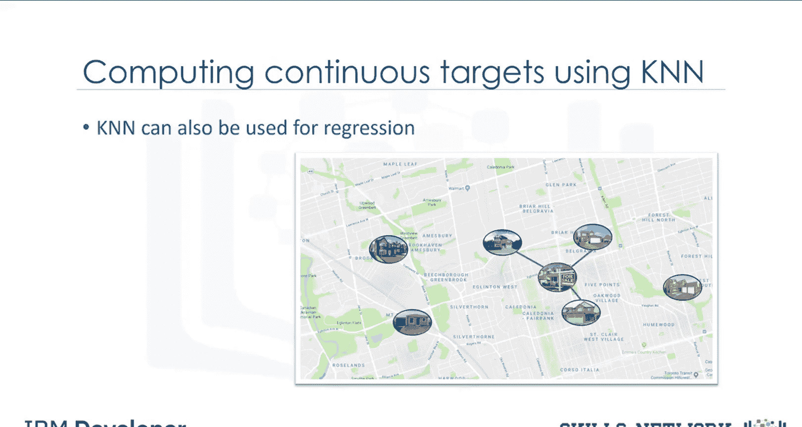

# 生成式人工智能工程：069：K近邻算法详解 📊

在本节课中，我们将要学习K近邻算法。这是一种简单但功能强大的分类算法，也可用于回归任务。我们将通过一个电信客户分组的实际案例，逐步理解其工作原理、核心概念和应用步骤。

## 概述

K近邻算法是一种基于实例的学习方法。其核心思想是：相似的数据点具有相似的标签。给定一个带有预定义标签的数据集，该算法通过计算新数据点与已知数据点的“距离”或“相似度”，并参考其K个“最近邻居”的标签来预测新数据点的类别。

## 算法应用场景：客户分组预测

想象一下，一家电信公司根据服务使用模式将其客户群分为四组。如果能够利用人口统计数据（如地区、年龄、婚姻状况）来预测新客户所属的组别，公司就可以为潜在客户定制服务方案。这是一个典型的分类问题。

我们的目标是构建一个分类器。例如，使用数据集中第0到第7行的已知数据，来预测第8行新客户的类别。我们将使用K近邻算法来完成这个任务。

为了演示方便，我们仅使用两个特征作为预测变量：年龄和收入，并根据客户的组别绘制散点图。

## K近邻算法直观理解

假设我们有一个新客户（例如记录8），已知其年龄和收入。如何确定他的类别？

一个直接的想法是找到距离他最近的一个已知客户，并将该客户的类别标签分配给他。例如，如果最近邻居属于“总服务”组，我们是否可以说新客户也最可能属于该组？是的，我们可以，这是基于“第一最近邻”的判断。

然而，仅依赖一个最近邻居的判断可能并不可靠，尤其是当这个邻居本身是一个特殊案例或异常值时。

现在，让我们再看一下散点图。如果不只选择一个，而是选择五个最近的邻居，并通过多数投票来决定新客户的类别呢？在这种情况下，五个邻居中有三个属于“增强服务”组。这是否更合理？是的，确实如此。在这个例子中，K近邻算法中的K值就是5。

这个例子揭示了K近邻算法的基本直觉：通过考察多个最近邻居来做出更稳健的决策。

## 算法定义与核心概念

K近邻算法是一种分类算法，它利用一组已标记的数据点来学习如何标记其他点。该算法根据数据点之间的相似性对案例进行分类。

在K近邻中，彼此接近的数据点被称为“邻居”。相似且具有相同类别标签的案例会彼此靠近。因此，两个案例之间的距离是衡量它们**不相似性**的指标。

计算两个数据点之间相似度（或距离/不相似度）的方法有多种，例如可以使用**欧几里得距离**。

**欧几里得距离公式（二维）**：
`distance = sqrt((x2 - x1)^2 + (y2 - y1)^2)`

对于多维向量，我们可以使用相同的距离公式，但必须对特征集进行**归一化**处理，以获得准确的不相似性度量。当然，根据数据类型和应用领域的不同，也可以使用其他距离度量方法。

## K近邻算法工作流程

在分类问题中，K近邻算法的工作流程如下：

以下是具体步骤：

1.  **选择K值**：确定要考察的最近邻居的数量K。
2.  **计算距离**：计算新数据点（待预测点）与数据集中每个已知数据点之间的距离。
3.  **寻找K个最近邻**：在训练数据中搜索距离未知数据点最近的K个观测值。
4.  **进行预测**：使用这K个最近邻居中最常见的类别标签，作为未知数据点的预测结果。

这个算法中有两个关键点可能令人困惑：第一，如何选择正确的K值；第二，如何计算案例之间的相似度。我们先来解决第二个问题。

## 如何计算数据点间的相似度

假设有两个客户：客户1和客户2。暂时假设他们只有一个特征：年龄。我们可以很容易地使用**闵可夫斯基距离**的一种特定形式——即**欧几里得距离**——来计算他们的距离。

**距离计算示例（一维）**：
`distance = sqrt((34 - 30)^2) = 4`

如果我们有更多特征，例如年龄和收入，我们仍然可以使用相同的公式，但这次是在二维空间中计算。

**距离计算示例（二维）**：
`distance = sqrt((age2 - age1)^2 + (income2 - income1)^2)`

对于更高维度的向量，可以使用相同的距离矩阵进行计算。

## 如何选择K值

K值代表要考察的最近邻居的数量，需要由用户指定。那么，如何选择正确的K值呢？

假设我们想预测图表中标记为问号的客户的类别。

如果我们选择一个非常小的K值，例如K=1。第一个最近的点是蓝色的（类别1）。这将是一个糟糕的预测，因为它周围更多的点是品红色的（类别4）。实际上，由于它的最近邻居是蓝色的，我们可能捕捉到了数据中的噪声或异常值。**过小的K值会导致模型过于复杂，可能引起过拟合**。这意味着预测过程不够泛化，无法用于样本外数据。

另一方面，如果我们选择一个非常大的K值，例如K=20，那么模型会变得**过度泛化**。

那么，如何找到最佳的K值呢？通用的解决方案是预留一部分数据用于测试模型的准确性。具体步骤如下：

以下是选择最佳K值的步骤：

1.  将数据集分为训练集和测试集。
2.  从K=1开始，使用训练集建立模型。
3.  用该模型预测测试集中所有样本的类别，并计算准确率。
4.  逐渐增加K值，重复步骤2和3。
5.  比较不同K值下的预测准确率，选择准确率最高的K值。例如，在我们的案例中，K=4可能会给出最佳准确率。

## K近邻在回归问题中的应用

最近邻分析也可用于预测连续型目标变量的值。在这种情况下，使用最近邻居目标值的**平均值**或**中位数**来获得新案例的预测值。

例如，假设您要根据房屋的特征集（如房间数量、平方英尺、建造年份等）来预测其价格。您可以轻松找到三个最近的邻居房屋（当然，不仅是基于距离，而是基于所有属性的综合相似度），然后将该房屋的价格预测为这些邻居价格的中位数。

## 总结

本节课我们一起学习了K近邻算法。我们从电信客户分组的实际案例出发，理解了算法的核心思想：通过考察数据点的K个最近邻居来进行分类或回归预测。我们详细介绍了算法的工作流程，包括计算距离、选择K值以及进行预测的步骤。同时，我们也探讨了K值选择的重要性，过小会导致过拟合，过大则会导致欠拟合，并通过交叉验证的方法来寻找最佳K值。最后，我们了解到K近邻不仅可用于分类，也可用于回归任务。这是一种直观且强大的基础算法，是机器学习工具箱中的重要组成部分。