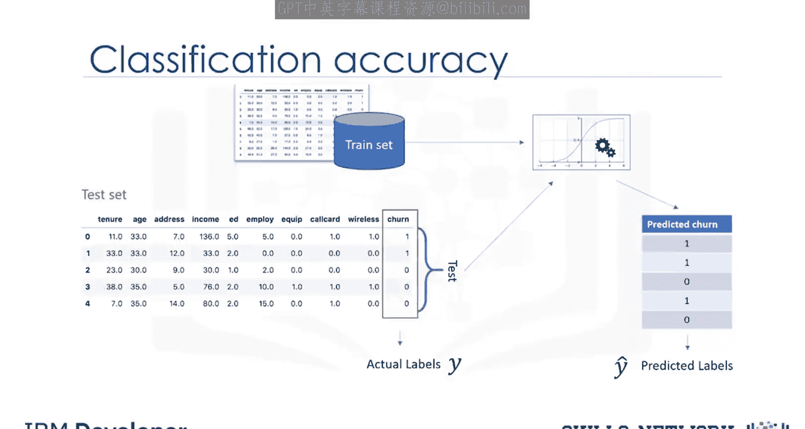
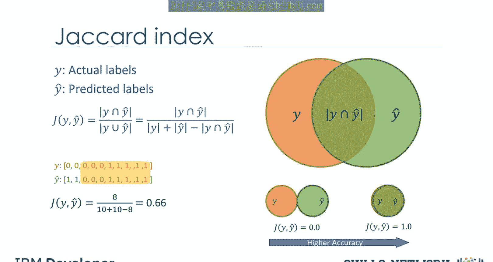
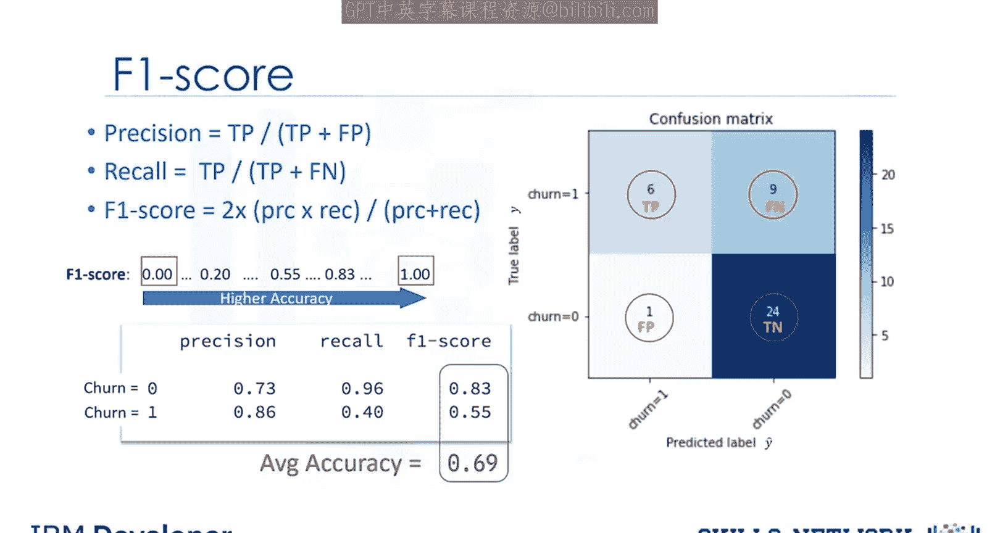
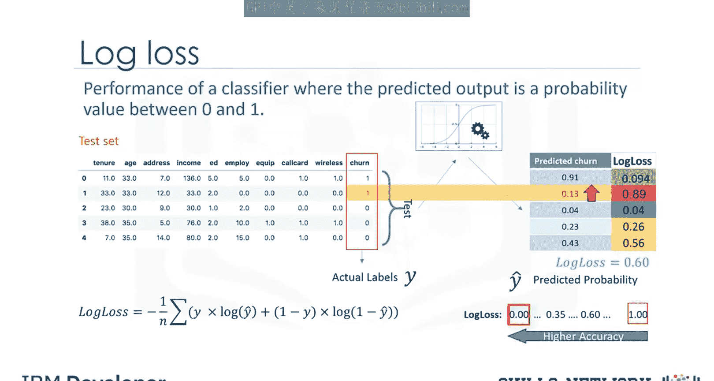

# 生成式人工智能工程：070：分类中的评估指标 📊

在本节课中，我们将学习用于评估分类模型性能的几种核心指标。理解这些指标对于衡量模型效果、发现改进方向至关重要。

## 概述

评估指标用于解释模型的性能。当我们训练好一个分类模型后，需要一套标准方法来量化其预测的准确性。本节将重点介绍三种常用的分类评估指标：杰卡德指数、F1分数和对数损失。

---

## 杰卡德指数

首先，我们来看一种最简单的准确性度量方法——杰卡德指数，也称为杰卡德相似系数。

假设 **Y** 代表数据集中真实的标签，**Ŷ** 代表分类器预测的标签。杰卡德指数可以定义为两个标签集合的交集大小除以并集大小。

其公式表示为：
**J(Y, Ŷ) = |Y ∩ Ŷ| / |Y ∪ Ŷ|**

例如，对于一个大小为10的测试集，如果有8个预测是正确的（即交集大小为8），那么根据杰卡德指数计算的准确率将是0.66。如果预测标签集与真实标签集完全匹配，则子集准确率为1.0，否则为0.0。

---

## 混淆矩阵与F1分数

另一种评估分类器准确性的方法是观察混淆矩阵。

假设我们的测试集只有40行数据。混淆矩阵以表格形式对比了预测标签与实际标签，清晰地展示了正确和错误的预测。

混淆矩阵的每一行代表测试集中真实的标签，每一列代表分类器预测的标签。以第一行为例，它对应着测试集中实际流失值为1的客户。可以看到，在40个客户中，有15个的实际流失值是1。在这15个客户中，分类器正确预测了6个为1，但错误地将9个预测为0。

对于实际流失值为0的客户（第二行），共有25人。分类器正确预测了其中24个为0，仅错误预测了1个为1。这表明模型在预测未流失客户方面表现良好。

混淆矩阵的优点在于它能直观展示模型正确预测或区分各类别的能力。在二元分类器的特定情况下，我们可以将这些数字解释为：

*   **真正例**：实际为1，预测也为1。
*   **假负例**：实际为1，预测为0。
*   **真负例**：实际为0，预测也为0。
*   **假正例**：实际为0，预测为1。

基于以上四个部分的计数，我们可以计算每个标签的精确率和召回率。

*   **精确率**：衡量在预测为某个类别的样本中，预测正确的比例。
    **公式：精确率 = 真正例 / (真正例 + 假正例)**
*   **召回率**：衡量在实际为某个类别的样本中，被正确预测出来的比例。
    **公式：召回率 = 真正例 / (真正例 + 假负例)**

现在，我们可以根据每个标签的精确率和召回率来计算其F1分数。

F1分数是精确率和召回率的调和平均数。F1分数的最佳值为1（代表完美的精确率和召回率），最差值为0。它是一个很好的指标，能同时反映分类器在召回率和精确率上的表现。

其计算公式为：
**F1分数 = 2 * (精确率 * 召回率) / (精确率 + 召回率)**

例如，对于“流失=0”这个类别，F1分数可能是0.83；对于“流失=1”这个类别，F1分数可能是0.55。最后，我们可以说这个分类器的平均准确率是这两个标签F1分数的平均值，在本例中为0.69。

请注意，杰卡德指数和F1分数同样适用于多类分类器，但这超出了本课程的范围。

---

## 对数损失

现在，让我们看看分类器的另一种准确性度量指标。

有时，分类器的输出是某个类别的概率值，而不是直接的类别标签。例如，在逻辑回归中，输出可以是客户流失的概率（即“是”或等于1的概率）。这个概率是一个介于0和1之间的值。

对数损失，也称为Log Loss，用于衡量那些输出为0到1之间概率值的分类器的性能。例如，当实际标签是1时，预测出0.13的概率会很糟糕，并导致很高的对数损失。

我们可以使用对数损失公式为每一行数据计算损失值，该公式衡量每个预测概率与实际标签的差距。然后，我们计算测试集所有行的平均对数损失。

显然，理想的分类器具有越来越小的对数损失值。因此，对数损失更低的分类器具有更好的准确性。

对数损失公式（对于单个样本）为：
**Log Loss = -[y * log(p) + (1 - y) * log(1 - p)]**
其中，`y`是真实标签（0或1），`p`是预测为正例的概率。

---

## 总结

本节课我们一起学习了三种重要的分类模型评估指标。

1.  **杰卡德指数**：通过计算预测集与真实集的交集与并集之比来衡量整体匹配度。
2.  **F1分数**：基于混淆矩阵导出的精确率和召回率计算得出，是衡量模型综合性能的调和平均数。
3.  **对数损失**：适用于输出为概率的分类器，通过衡量预测概率与真实标签的差异来评估模型性能，值越小越好。

理解并恰当运用这些指标，能够帮助我们客观评估分类模型，并指导后续的模型优化工作。