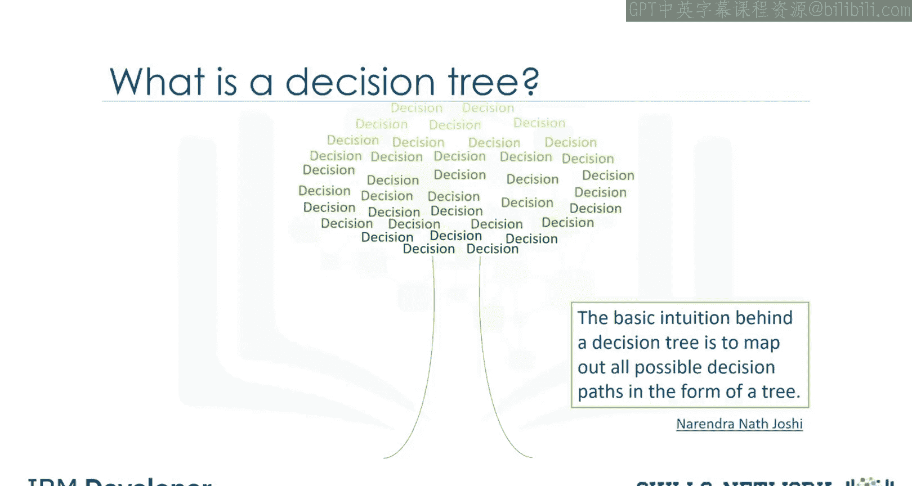
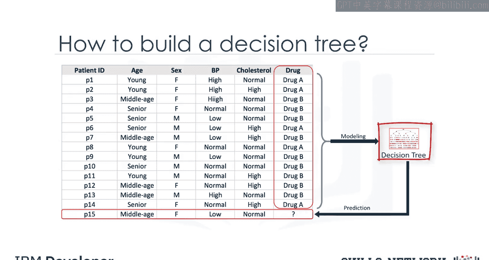
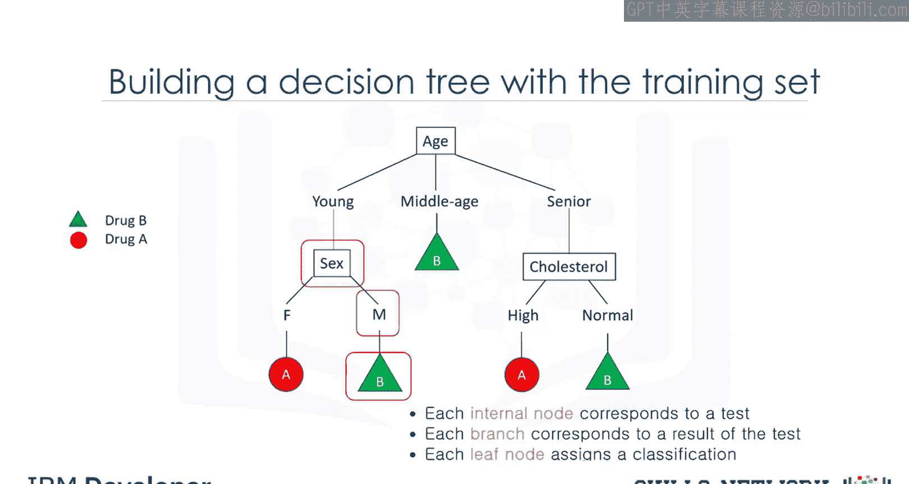
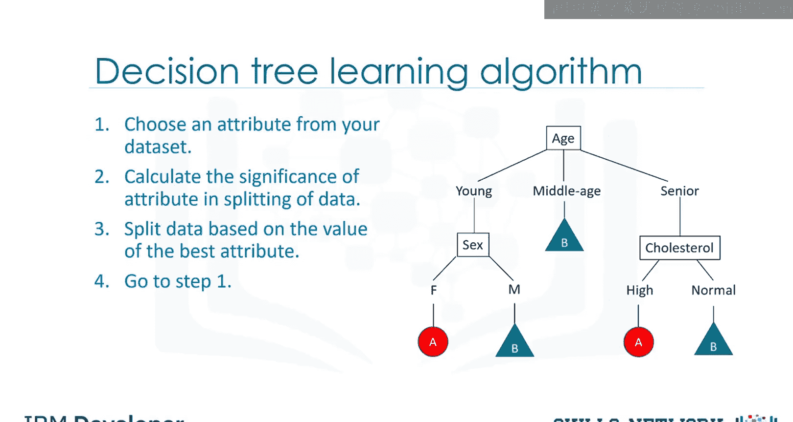

# 生成式人工智能工程：071：决策树简介 🌳

在本节课中，我们将要学习决策树的基本概念。决策树是一种用于分类和预测的机器学习模型，它通过一系列规则对数据进行划分，最终做出决策。我们将通过一个医疗研究的例子，了解决策树如何构建以及如何应用。

---

## 什么是决策树？

决策树是一种树状结构模型，用于基于数据特征进行分类或回归预测。它通过测试数据的不同属性，并根据测试结果进行分支，最终在叶子节点给出预测结果。

---

## 一个医疗研究的例子

上一节我们介绍了决策树的基本概念，本节中我们来看看一个具体的应用场景。

想象你是一名医学研究员，正在为一项研究收集数据。你已经收集了一组患有相同疾病的患者数据。在治疗过程中，每位患者对两种药物（药物A和药物B）中的一种产生了反应。你的任务是构建一个模型，以确定未来患有相同疾病的患者应使用哪种药物。

该数据集的特征包括患者的年龄、性别、血压和胆固醇水平。目标是每位患者产生反应的药物。这是一个二分类问题，你可以使用数据集的训练部分构建决策树，然后用它来预测未知患者的类别，从而决定为新患者开具哪种药物。

---

## 决策树如何构建？

在了解了应用场景后，我们来看看决策树是如何构建的。

决策树通过将训练集划分为不同的节点来构建，其中一个节点包含全部或大部分同一类别的数据。

观察下图，这是一个患者分类器。我们想为新患者开具药物，但选择药物A或B的决定将受到患者具体情况的影响。

我们首先考虑年龄，年龄可分为年轻、中年或老年。如果患者是中年，则明确选择药物B。另一方面，如果患者是年轻或老年，则需要更多细节来确定应开具哪种药物。

额外的决策变量可以是胆固醇水平、性别或血压等因素。例如，如果患者是女性，则推荐药物A；如果是男性，则选择药物B。

决策树的核心在于测试属性，并根据测试结果对情况进行分支。每个内部节点对应一个测试，每个分支对应测试的一个结果，每个叶子节点将患者分配到一个类别。

---

## 构建决策树的步骤

现在的问题是，我们如何构建这样的决策树？以下是构建决策树的方法。

决策树可以通过逐一考虑属性来构建。

以下是构建决策树的关键步骤：

1.  从数据中选择一个属性。
2.  计算该属性在数据划分中的重要性（在下一个视频中，我们将解释如何计算属性的重要性，以判断它是否是一个有效的属性）。
3.  根据最佳属性的值拆分数据。
4.  然后进入每个分支，对其余属性重复此过程。

构建此树后，你可以使用它来预测未知案例的类别，或者在我们的例子中，根据新患者的特征预测其适用的药物。

---

## 总结

本节课中我们一起学习了决策树的基本原理。我们了解到决策树是一种通过测试属性并分支来对数据进行分类的模型。我们通过一个医疗处方预测的例子，看到了决策树如何从根节点开始，根据年龄、性别等特征一步步做出决策，最终在叶子节点给出推荐药物。我们还简要了解了构建决策树的基本步骤：选择属性、计算重要性、拆分数据并递归进行。在接下来的课程中，我们将深入探讨如何计算属性的重要性。