# 生成式人工智能工程：072：构建决策树 🌳

在本节课中，我们将学习决策树的构建过程。决策树是一种常用的机器学习算法，它通过一系列规则对数据进行分类或预测。我们将从基本概念开始，逐步讲解如何选择最佳特征进行数据分割，以及如何通过计算信息增益来构建高效的决策树。

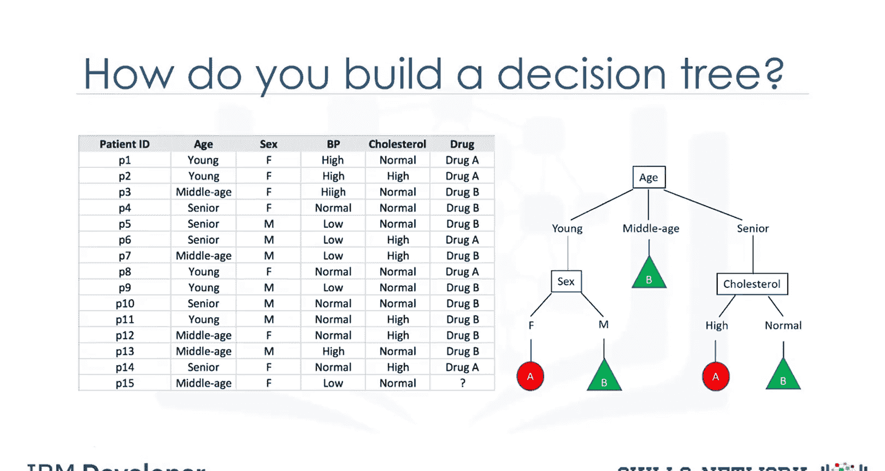

---

## 数据分割与特征选择

上一节我们介绍了决策树的基本概念，本节中我们来看看如何基于数据构建决策树。

考虑一个药物数据集。问题是如何基于该数据构建决策树。

决策树通过递归分区来分类数据。假设我们的数据中有14名患者。算法选择最具预测性的特征来分割数据。

构建决策树时，重要的是确定哪个属性最适合或最具预测性来基于特征分割数据。

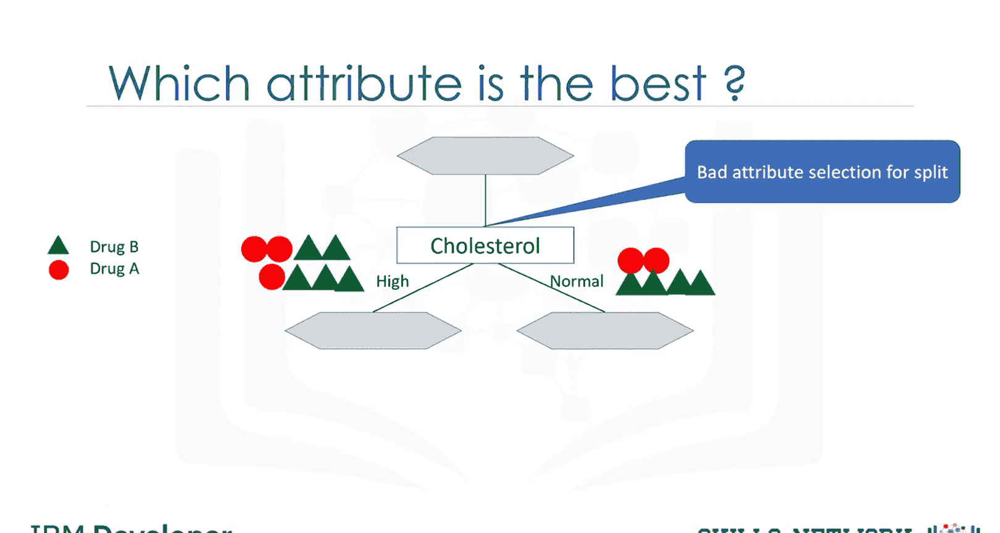

假设我们选择胆固醇作为第一个分割属性。它将把数据分成两个分支。如果患者的胆固醇高，我们不能高度确信药物B可能适合他。如果患者的胆固醇正常，我们仍然没有足够的证据或信息来确定药物A或药物B是否确实适合。

这是一个不良属性选择的示例，因此我们尝试另一个属性。

---

## 评估特征的重要性

再次，我们有14个案例。这次，我们选择了患者的性别属性。它将把数据分成两个分支：男性和女性。如果患者是女性，我们可以高度确定地说药物B可能适合她。但如果患者是男性，我们没有足够的证据或信息来确定药物A或药物B是否适合。

然而，与胆固醇属性相比，这仍然是一个更好的选择，因为节点中的结果更纯净。这意味着节点主要是药物A或药物B。

因此，我们可以说性别属性比胆固醇更显著，或者换句话说，它比其他属性更具预测性。实际上，预测性基于节点不纯度的减少。

我们寻找最佳特征，以在基于该特征分割后减少叶子节点中患者的不纯度。因此，在以下情况下，性别特征是一个好的候选，因为它几乎找到了纯净的患者。

让我们更进一步。对于男性患者分支，我们再次测试其他属性来分割子集。我们在这里再次测试胆固醇。它导致更纯净的叶子。因此，我们可以轻松做出决策。例如，如果患者是男性且胆固醇高，我们肯定可以开药物A；但如果胆固醇正常，我们可以高度确信地开药物B。

正如你可能注意到的，选择分割数据的属性非常重要，这完全取决于分割后叶子的纯度。

如果节点在100%的情况下属于目标字段的特定类别，则该节点被认为是纯净的。实际上，该方法使用递归分区，通过最小化每个步骤的不纯度，将训练记录分割成段。

节点的不纯度通过节点中数据的熵计算，那么什么是熵？

---

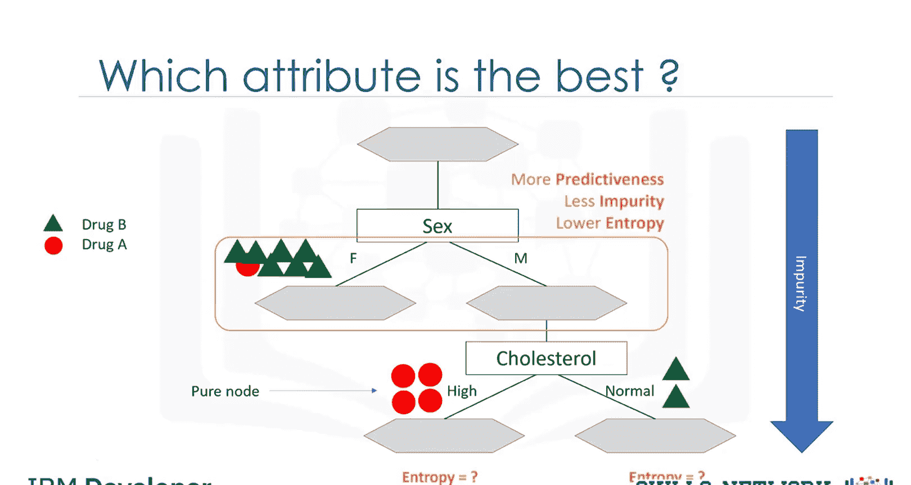

## 熵的概念与计算

熵是信息混乱的量或数据中的随机性量。节点中的熵取决于该节点中有多少随机数据，并为每个节点计算。

在决策树中，我们寻找节点中熵最小的树。熵用于计算该节点中样本的同质性。

如果样本完全同质，熵为0；如果样本均等分割，熵为1。这意味着如果节点中的所有数据要么是药物A，要么是药物B，那么熵为0；但如果一半数据是药物A，另一半是药物B，那么熵为1。

你可以使用属性的频率表通过熵公式轻松计算节点的熵，其中P是类别的比例或比率，例如药物A或B。但请记住，你不必计算这些，因为使用的库或包会轻松计算。

---

## 计算示例

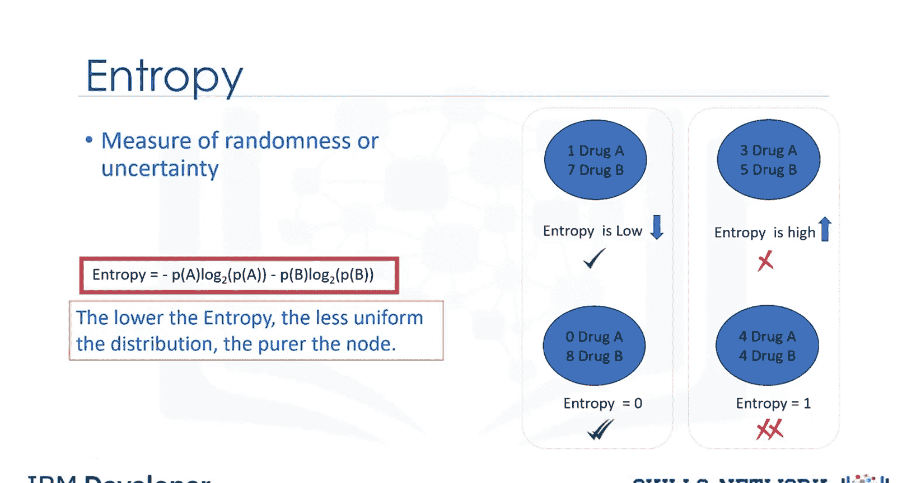

作为示例，让我们计算分割前数据集的熵。我们有9个药物B的出现和5个药物A的出现。

你可以将这些数字嵌入熵公式中，以计算分割前目标属性的不纯度。在这种情况下，它是0.94。那么分割后的熵是多少？

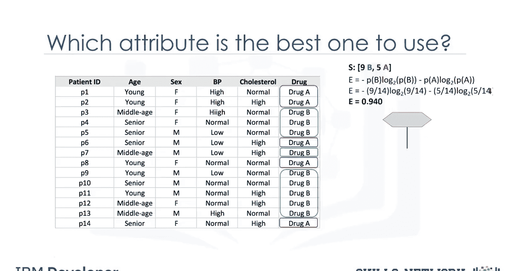

---

## 测试不同属性

现在我们可以测试不同的属性，以找到最具预测性的属性，从而产生两个更纯净的分支。首先选择患者的胆固醇，看看数据如何基于其值分割。

例如，当胆固醇正常时，我们有6个药物B和2个药物A。我们可以基于药物A和B的分布计算该节点的熵，在这种情况下是0.8。但当胆固醇高时，数据被分割成3个药物B和3个药物A。计算熵，我们可以看到它是1.0。

我们应该遍历所有属性，计算分割后的熵，然后选择最佳属性。

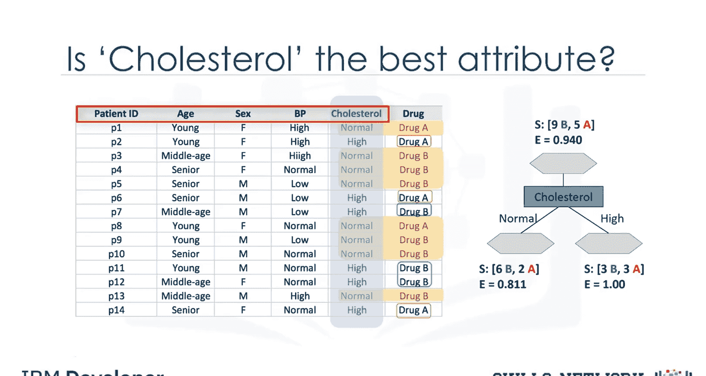

---

## 比较属性

好的，让我们尝试另一个字段。选择性别属性进行下一次检查。当我们使用性别属性分割数据时，当值为女性时，我们有3名患者对药物B有反应，4名患者对药物A有反应。该节点的熵是0.98，这不太有希望。然而，在分支的另一侧，当性别属性的值为男性时，结果更纯净，有6个药物B和只有1个药物A。该组的熵是0.59。

现在，问题是胆固醇和性别属性之间，哪个是更好的选择？哪个更适合作为第一个属性将数据集分成两个分支？或者，换句话说，哪个属性为我们的药物产生更纯净的节点？或者在哪棵树中，分割后的熵比分割前更小？

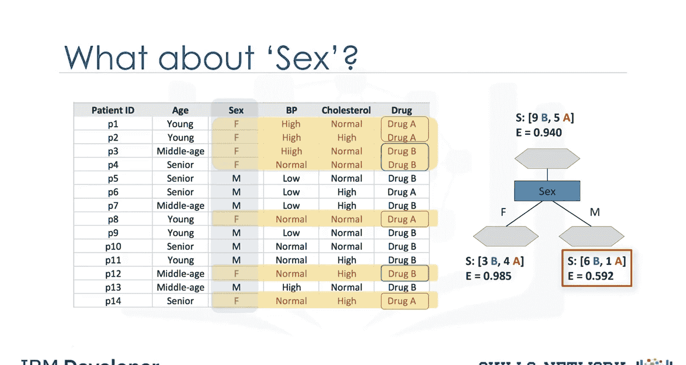

性别属性的熵为0.98和0.59，或胆固醇属性的熵为0.81和1.0。答案是分割后信息增益更高的树。

---

## 信息增益

那么什么是信息增益？信息增益是分割后可以增加确定性水平的信息。它是分割前树的熵减去按属性分割后的加权熵。

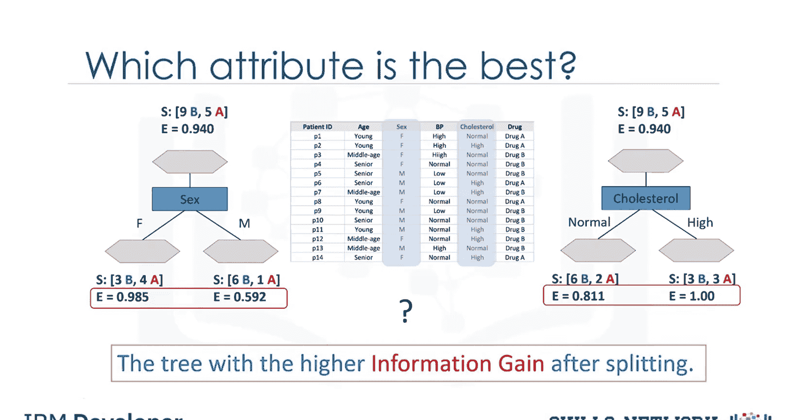

我们可以将信息增益和熵视为相反的概念。随着熵或随机性量的减少，信息增益或确定性量增加，反之亦然。

因此，构建决策树就是找到返回最高信息增益的属性。

---

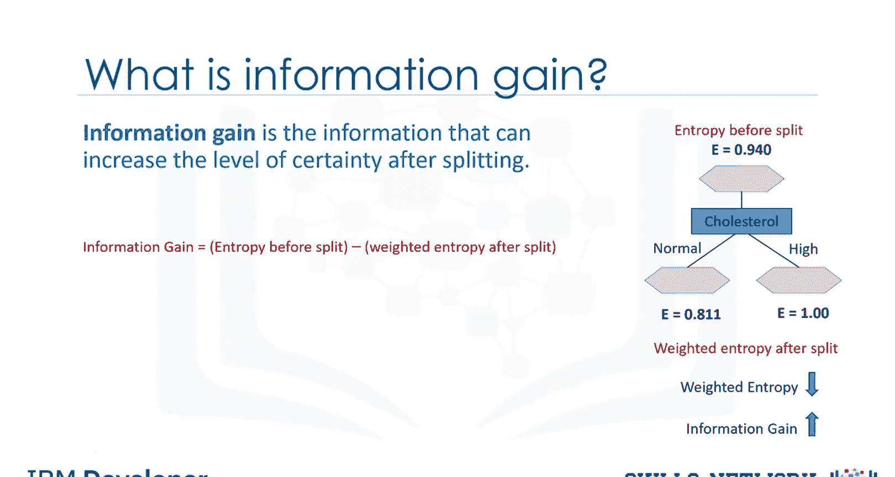

## 计算信息增益

让我们看看如何计算性别属性的信息增益。信息增益是分割前树的熵减去分割后的加权熵。

分割前树的熵是0.94。女性患者的比例是7/14，其熵是0.985。男性患者的比例是7/14，男性节点的熵是0.592。方括号中的结果是分割后的加权熵。

因此，如果我们使用性别属性分割数据集，树的信息增益是0.151。我们将考虑每个叶子节点下样本分布的熵，并取该熵的加权平均值，权重为落在该叶子下的样本比例。

我们也可以计算如果我们使用胆固醇，树的信息增益是0.48。现在，问题是哪个属性更合适？正如提到的，分割后信息增益更高的树。这意味着性别属性。

---

## 构建决策树

因此，我们选择性别属性作为第一个分割器。现在，按性别属性分支后，下一个属性是什么？正如你可能猜到的，我们应该为每个分支重复这个过程，并测试其他每个属性，以继续达到最纯净的叶子。这就是构建决策树的方式。

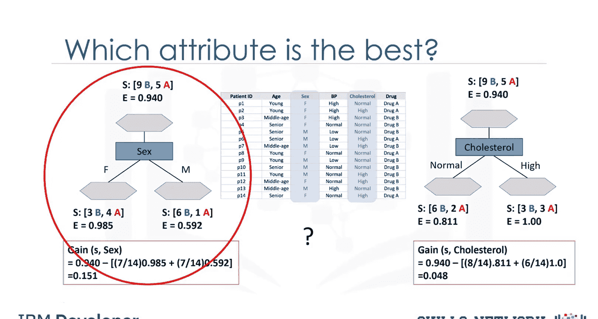

---

## 总结

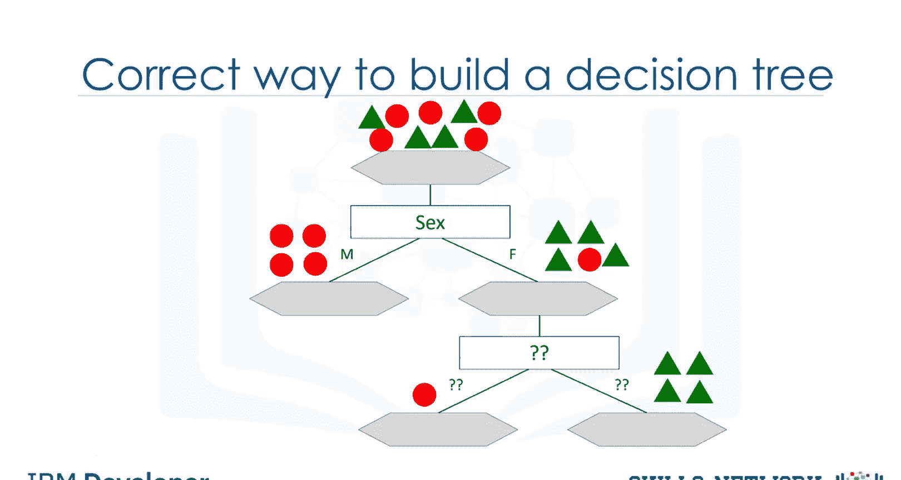

本节课中我们一起学习了决策树的构建过程。我们从数据分割和特征选择开始，介绍了熵的概念及其计算方法。通过比较不同属性的信息增益，我们学会了如何选择最佳特征来构建高效的决策树。决策树通过递归分区和最小化不纯度，能够有效地对数据进行分类和预测。