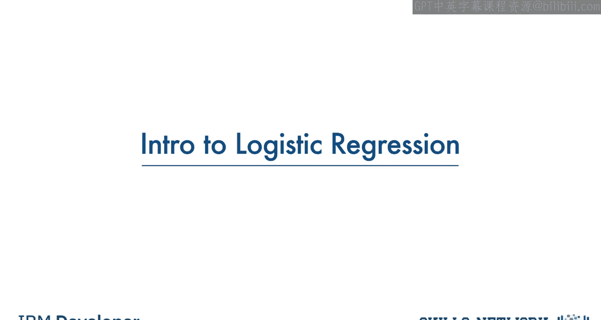
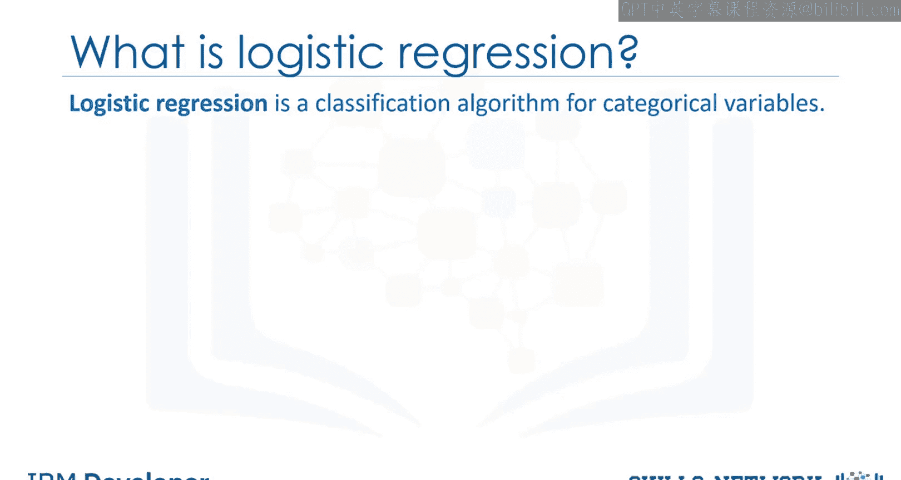
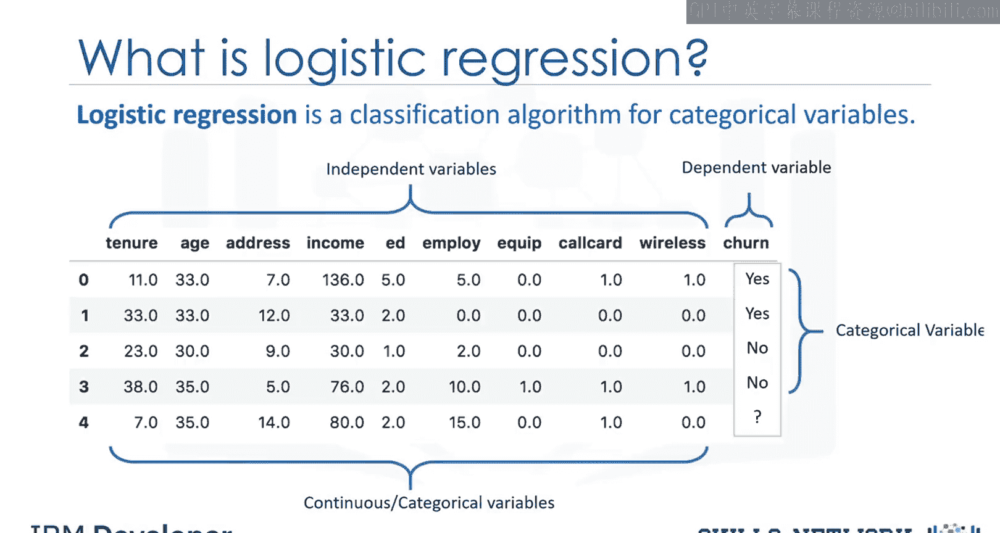
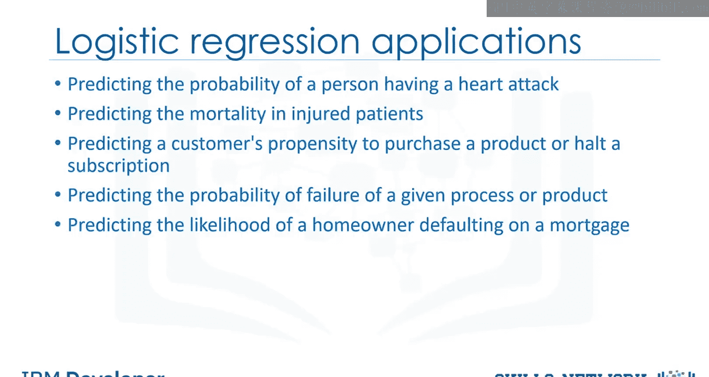
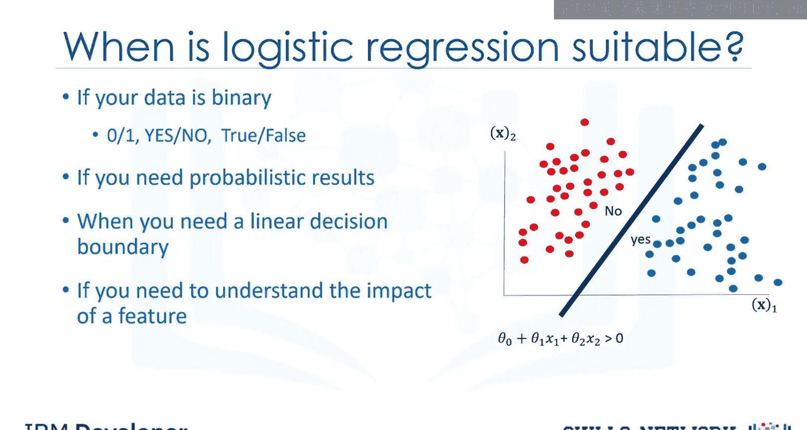
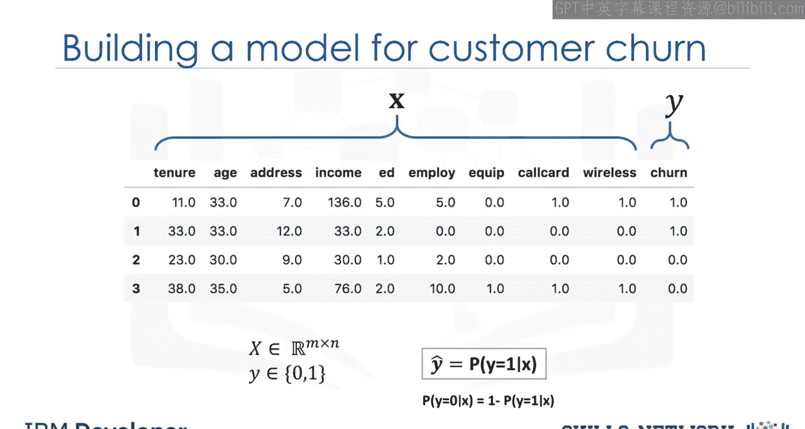

# 生成式人工智能工程：073：逻辑回归简介 📊

在本节课中，我们将学习一种名为逻辑回归的机器学习方法。逻辑回归用于分类任务。我们将通过回答以下三个问题来深入理解这个方法：什么是逻辑回归？逻辑回归能解决什么样的问题？以及在哪些情况下我们应该使用逻辑回归？

## 什么是逻辑回归？🤔

逻辑回归是一种用于基于输入字段值对数据集记录进行分类的统计和机器学习技术。

假设我们有一个电信数据集，我们希望通过分析它来了解哪些客户可能在下个月流失。这是一个历史客户数据，其中每一行代表一个客户。想象一下，你是这家公司的分析师，你需要找出谁将离开以及原因。你将使用该数据集基于历史记录构建一个模型，并用它来预测客户群体中未来的流失情况。

数据包括每个客户已注册的服务信息、客户账户信息、客户的人口统计信息（如性别和年龄范围），以及上个月离开公司的客户信息。这个列被称为“流失”。

我们可以使用逻辑回归，利用给定的特征构建一个预测客户流失的模型。在逻辑回归中，我们使用一个或多个自变量（如任期、年龄和收入）来预测一个结果（如流失），我们称之为因变量，代表客户是否会停止使用服务。

逻辑回归类似于线性回归，但它试图预测一个分类或离散的目标字段，而不是一个数值。在线性回归中，我们可能试图预测一个连续变量，如房屋价格、患者血压或汽车油耗。但在逻辑回归中，我们预测一个二元变量，如是/否、真/假、成功/不成功、怀孕/未怀孕等，所有这些都可以编码为0或1。

在逻辑回归中，自变量应该是连续的。如果是分类变量，则应进行虚拟或指示编码。这意味着我们必须将它们转换为某个连续值。

请注意，逻辑回归既可用于二元分类，也可用于多类分类，但为了简单起见，在本视频中我们将重点讨论二元分类。

## 逻辑回归的应用场景 🎯

在解释其工作原理之前，我们先来看看逻辑回归的一些应用。如前所述，逻辑回归是一种分类算法，因此可以用于不同的情况。

以下是逻辑回归可以解决的一些问题示例：
*   预测一个人在特定时间段内心脏病发作的概率，基于其年龄、性别和身体质量指数等信息。
*   预测受伤患者的死亡几率。
*   预测患者是否患有某种疾病（如糖尿病），基于观察到的患者特征，如体重、身高、血压和各种血液检查结果等。
*   在营销环境中，我们可以用它来预测客户购买产品或停止订阅的可能性，正如我们在流失示例中所做的那样。
*   预测给定流程、系统或产品发生故障的概率。
*   预测房主拖欠抵押贷款的可能性。

请注意，在所有这些示例中，我们不仅预测每个案例的类别，还衡量案例属于特定类别的概率。

## 何时使用逻辑回归？✅

有多种机器学习算法可以对变量进行分类或估计。问题是，我们何时应该使用逻辑回归？

以下是逻辑回归是合适选择的四种情况：
*   **目标字段是分类变量，特别是二元变量**：例如0/1、是/否、流失/未流失、阳性/阴性等。
*   **需要预测的概率**：例如，如果你想知道客户购买产品的概率是多少。逻辑回归会为给定的数据样本返回一个介于0和1之间的概率分数。实际上，逻辑回归预测的是该样本的概率，我们根据该概率将案例映射到一个离散的类别。
*   **数据是线性可分的**：逻辑回归的决策边界是一条线、一个平面或一个超平面。分类器会将决策边界一侧的所有点归为一个类别，另一侧的所有点归为另一个类别。例如，如果我们只有两个特征且不应用任何多项式处理，我们可以得到一个不等式，如 `θ₀ + θ₁x₁ + θ₂x₂ > 0`，这是一个易于绘制的半平面。请注意，在使用逻辑回归时，我们也可以通过多项式处理实现复杂的决策边界，但这超出了本课范围。当你理解逻辑回归的工作原理后，你会对决策边界有更深入的了解。
*   **需要理解特征的影响**：你可以基于逻辑回归模型系数或参数的统计显著性来选择最佳特征。也就是说，在找到最优参数后，权重 `θ₁` 接近0的特征 `x` 对预测的影响小于具有较大绝对值 `θ₁` 的特征。实际上，它允许我们在控制其他自变量的同时，理解一个自变量对因变量的影响。

## 形式化定义与目标 🎯

让我们再次查看我们的数据集。我们将自变量定义为 `X`，因变量定义为 `y`。请注意，为了简单起见，我们可以将目标或因变量的值编码为0或1。

逻辑回归的目标是构建一个模型来预测每个样本（在本例中是客户）的类别，以及每个样本属于某个类别的概率。

基于此，让我们开始形式化这个问题。`X` 是我们的数据集，属于实数空间 `ℝ^(m×n)`，即具有 `m` 个维度（特征）和 `n` 条记录。`y` 是我们想要预测的类别，可以是0或1。

理想情况下，一个逻辑回归模型（称为 `ŷ`）可以预测给定其特征 `X` 的客户的类别为1。同样可以很容易地证明，客户属于类别0的概率可以计算为 `1` 减去客户类别为1的概率。

---

**本节课总结**

在本节课中，我们一起学习了逻辑回归的基础知识。我们了解到逻辑回归是一种用于二元分类的机器学习算法，它不仅能预测类别，还能输出属于该类别的概率。我们探讨了逻辑回归的应用场景，例如预测客户流失、疾病诊断等。最后，我们明确了适合使用逻辑回归的四种情况：目标变量是二元的、需要概率输出、数据线性可分以及需要理解特征重要性。在下一节中，我们将深入探讨逻辑回归的数学模型和工作原理。