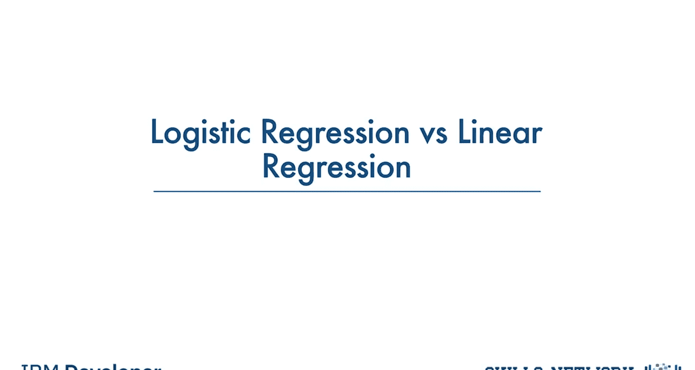
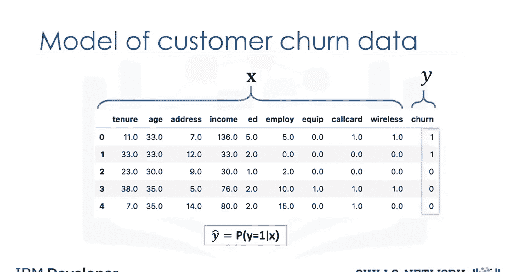
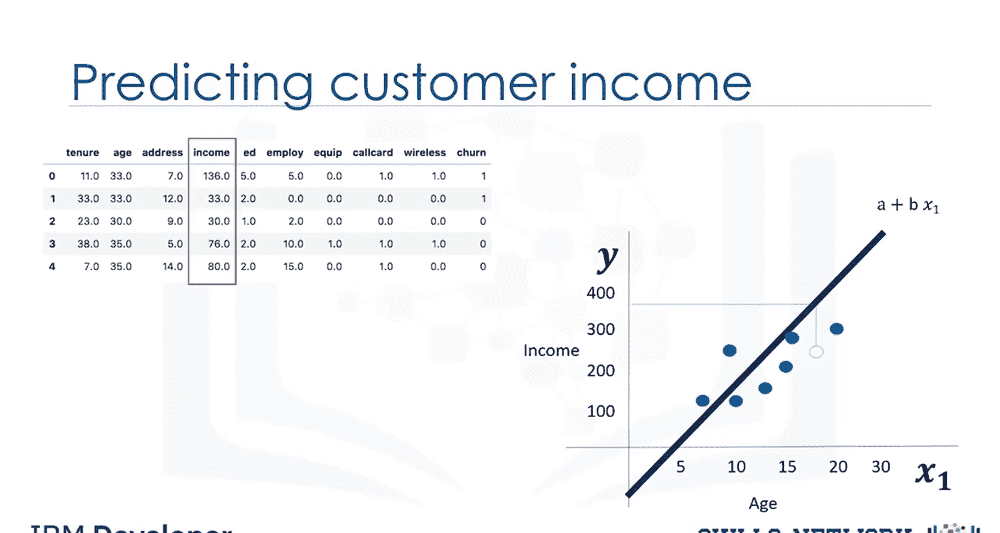
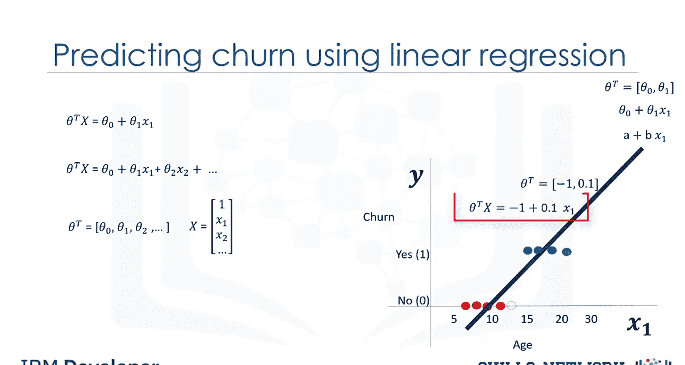
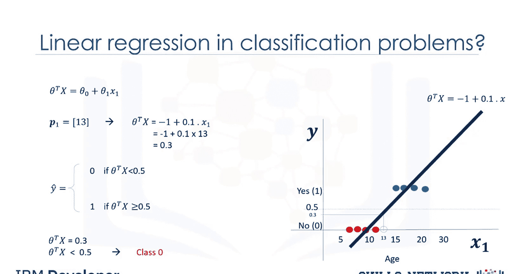
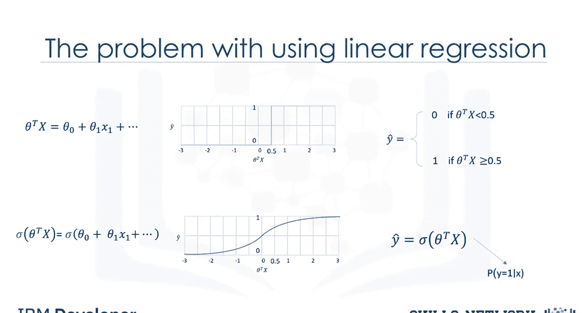
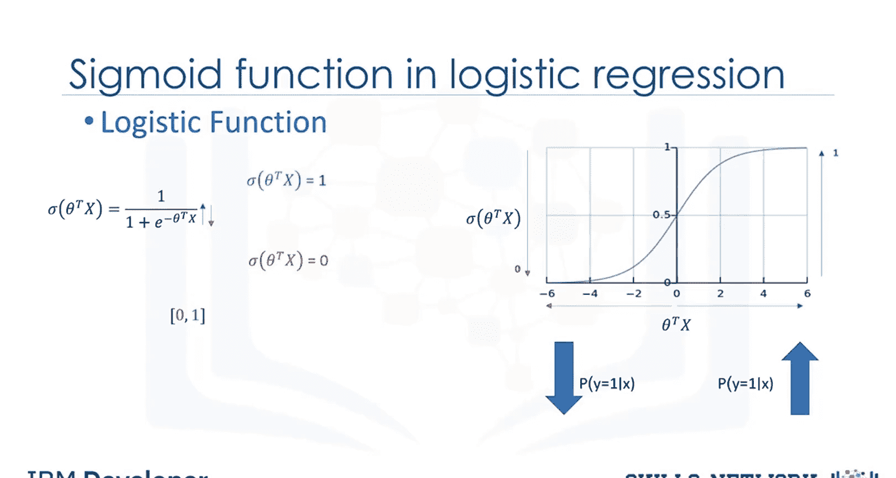
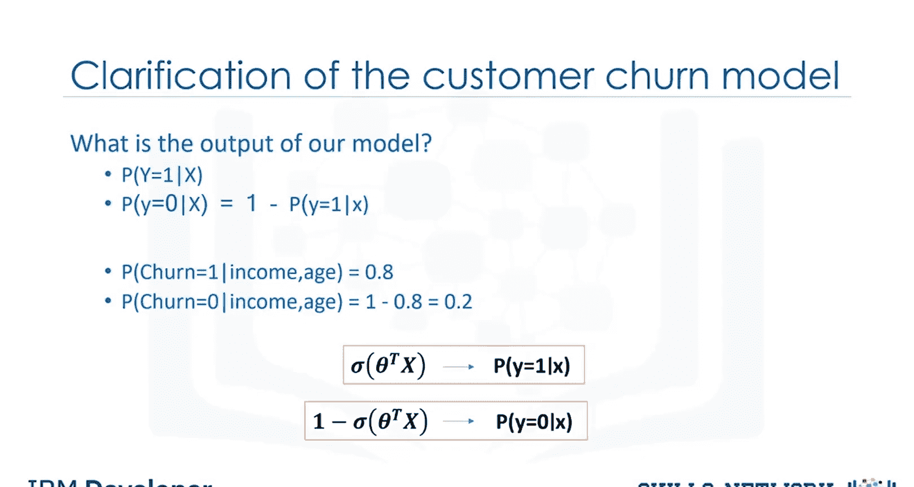
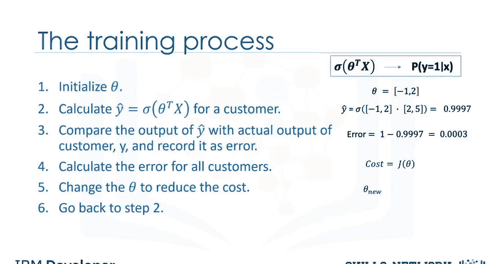

# 生成式人工智能工程：074：逻辑回归与线性回归 📊

在本节课中，我们将学习线性回归与逻辑回归之间的区别。我们将回顾线性回归，并探讨为何它不适用于某些二元分类问题。同时，我们将介绍逻辑回归的核心——Sigmoid函数。

---

## 线性回归回顾

上一节我们介绍了课程目标，本节中我们来看看线性回归的基本原理。

首先，让我们回顾线性回归的工作原理，以便更好地理解逻辑回归。暂时忘记客户流失预测问题，假设我们的目标是预测数据集中客户的收入。这意味着我们不再预测分类值“流失”，而是预测连续值“收入”。

我们可以选择一个自变量（如客户年龄）来预测因变量（如收入）。为了简化，我们只使用一个特征。我们可以绘制散点图，将年龄作为自变量，收入作为我们希望通过线性回归预测的目标值。

通过线性回归，你可以拟合一条直线或多项式穿过数据点。我们可以通过训练模型或基于样本集进行数学计算来找到这条线。这条线的方程通常表示为 `A + B * X1`。现在，我们可以使用这条线来预测连续值 `Y`，即基于客户的年龄预测其收入。

---

## 线性回归用于分类的局限性

上一节我们回顾了线性回归，本节中我们来看看它为何不适用于分类问题。

如果我们想预测“流失”这个分类字段，能否使用相同的技术？让我们看看。假设我们获得了客户流失数据，这次的目标是基于客户年龄预测其流失情况。我们有一个特征“年龄”（记为 `x1`）和一个具有两个类别的分类特征“流失”（“是”和“否”）。我们可以将“是”和“否”映射为整数值 0 和 1。

在图形上，我们可以用散点图表示数据，但这次 y 轴只有两个值。我们的目标是基于现有数据建立一个模型，以预测新客户属于哪个类别。

我们尝试在此处使用线性回归技术，看看是否能解决像“流失”这样的分类属性问题。通过线性回归，你同样可以拟合一条多项式曲线穿过数据，传统上表示为 `A + Bx`，或更正式地表示为 `θ0 + θ1 * x1`。这条线有两个参数，用向量 `θ` 表示。我们也可以将这条线的方程正式表示为 `θ^T * x`。在多维空间中，方程可表示为 `θ^T * x`，其中 `θ` 是二维空间中直线的参数，或是三维空间中平面的参数，依此类推。

给定一个数据集，所有特征集 `x` 和 `θ` 参数可以通过优化算法或数学计算得出，从而得到拟合线的方程。例如，这条线的参数是 -1 和 0.1，方程是 `-1 + 0.1 * x1`。

现在，我们可以使用这条回归线来预测新客户的流失情况。例如，对于一个年龄 `x=13` 的数据点，我们可以将该值代入直线公式，计算出 `Y` 值。根据我们的模型，如果 `θ^T * x` 的值小于阈值（例如 0.5），则类别为 0；否则，类别为 1。然而，这里存在一个问题：该客户属于类别 0 的概率是多少？正如你所见，这并不是解决此问题的最佳模型。此外，还有其他一些问题证实了线性回归并非分类问题的合适方法。

---

## 从阶跃函数到Sigmoid函数

上一节我们指出了线性回归的局限性，本节中我们来看看更科学的解决方案。

如果我们使用回归线计算一个点的类别，它总是返回一个数字，如 3 或 -2 等。然后我们需要使用一个阈值（例如 0.5）将该点分配给类别 0 或 1。这个阈值就像一个阶跃函数，无论输入值是大是小、是正是负，输出都是 0 或 1。在阶跃函数中，无论值有多大，只要大于 0.5，输出就等于 1；反之，无论值有多小，只要小于 0.5，输出就等于 0。换句话说，对于值为 1 或 1000 的客户，结果没有区别，输出都是 1。

与其使用这种阶跃函数，我们是否可以使用一条更平滑的曲线，将这些值映射到 0 和 1 之间？现有的方法并不能真正给出客户属于某个类别的概率，而这正是我们非常需要的。我们需要一种能够同时给出属于某个类别概率的方法。

那么，科学的解决方案是什么？如果我们不使用 `θ^T * X` 直接计算，而是使用一个特定的函数——Sigmoid 函数，那么 `sigmoid(θ^T * X)` 将给出一个点属于某个类别的概率，而不是直接给出 `Y` 值。Sigmoid 函数总是返回一个介于 0 和 1 之间的值，具体取决于 `θ^T * x` 的实际大小。

现在，我们的模型是 `sigmoid(θ^T * X)`，它表示给定 `x` 时输出为 1 的概率。那么，Sigmoid 函数是什么？

---

## Sigmoid函数详解

上一节我们引入了Sigmoid函数的概念，本节中我们来详细了解它。

Sigmoid 函数，也称为逻辑函数，类似于阶跃函数，在逻辑回归中由以下表达式使用：

**公式：**
`σ(z) = 1 / (1 + e^{-z})`，其中 `z = θ^T * x`

Sigmoid 函数初看起来有点复杂，但不必担心记住这个方程。在使用它之后，你会理解其意义。

注意，在 Sigmoid 方程中，当 `θ^T * x` 变得非常大时，分母中的 `e^{-θ^T * x}` 几乎变为 0，Sigmoid 函数的值接近 1。如果 `θ^T * x` 非常小，Sigmoid 函数的值接近 0。在 Sigmoid 函数图上描绘时，当 `θ^T * x` 变大，Sigmoid 函数的值接近 1；同样，如果 `θ^T * x` 非常小，Sigmoid 函数的值接近 0。因此，Sigmoid 函数的输出始终在 0 和 1 之间，这使得它适合将结果解释为概率。

显然，当 Sigmoid 函数的输出接近 1 时，给定 `x` 条件下 `y=1` 的概率上升；相反，当 Sigmoid 值接近 0 时，给定 `x` 条件下 `y=1` 的概率非常小。

---

## 逻辑回归模型的输出

上一节我们解释了Sigmoid函数，本节中我们来看看逻辑回归模型的输出是什么。

在逻辑回归中，我们对输入 `x` 属于默认类别 `y=1` 的概率进行建模，我们可以将其正式写为 `P(y=1|x)`。

我们也可以写出 `y` 属于类别 0 的概率，给定 `x`，为 `1 - P(y=1|x)`。例如，客户留在公司的概率可以表示为 `P(流失=1|客户的收入, 年龄)`，例如可能是 0.8。而同一客户流失概率为 0 的情况，给定客户的收入和年龄，可以计算为 `1 - 0.8 = 0.2`。

因此，我们的任务是训练模型，设置其参数值，使得我们的模型能够很好地估计 `P(y=1|x)`。事实上，这就是一个由逻辑回归构建的良好分类器模型应该为我们做的事情。同时，它也应该能很好地估计 `P(y=0|x)`，可以表示为 `1 - σ(θ^T * x)`。那么，问题是我们如何实现这一点？

---

## 模型的训练过程

上一节我们明确了模型的目标，本节中我们来看看如何通过训练达到这个目标。

我们可以通过训练过程找到 `θ`，让我们看看训练过程是什么。

以下是训练逻辑回归模型的基本步骤：

**步骤 1：初始化参数**
将 `θ` 向量初始化为随机值，就像大多数机器学习算法一样。例如，-1 或 2。

**步骤 2：计算模型输出**
对于训练集中的一个样本客户，计算模型输出 `σ(θ^T * X)`。`X` 是特征向量值（例如，客户的年龄和收入），`θ` 是你在上一步设置的权重。这个方程的输出是预测值，即客户属于类别 1 的概率。

**步骤 3：比较与计算误差**
将我们模型的输出 `ŷ`（例如，可能是 0.9997）与客户的实际标签（例如，对于流失客户是 1）进行比较。然后记录差异作为模型对该客户的误差。例如，`1 - 0.9997 = 0.0003`。这只是训练集中所有客户中的一个客户的误差。

**步骤 4：计算总成本**
按照前几步的方法计算所有客户的误差，并将这些误差相加。总误差就是模型的成本，由模型的成本函数计算。成本函数基本上代表了如何计算模型的误差（即实际值与模型预测值之间的差异）。因此，成本显示了模型在估计客户标签方面的表现有多差；成本越低，模型正确估计客户标签的能力越好。所以，我们希望做的是尝试最小化这个成本。

**步骤 5：更新参数**
由于 `θ` 的初始值是随机选择的，成本函数很可能非常高。因此，我们改变 `θ`，以期降低总成本。

**步骤 6：迭代**
改变 `θ` 的值后，我们回到步骤 2，开始另一次迭代，再次计算模型的成本，并不断重复这些步骤，每次改变 `θ` 的值，直到成本足够低。

这就引出了两个问题：第一，我们如何改变 `θ` 的值，以便在迭代过程中降低成本？第二，我们应该何时停止迭代？改变 `θ` 值有不同的方法，但最流行的方法之一是梯度下降。同样，停止迭代也有各种方法，但本质上，你通过计算模型的准确性来停止训练，并在达到满意程度时停止。

---

## 总结

在本节课中，我们一起学习了线性回归与逻辑回归的核心区别。我们了解到线性回归适用于预测连续值，但在处理二元分类问题时存在局限性，因为它无法直接输出概率且对异常值敏感。逻辑回归通过引入 **Sigmoid函数** `σ(z) = 1 / (1 + e^{-z})`，将线性组合 `θ^T * x` 的输出映射到 (0, 1) 区间，从而可以解释为样本属于正类的概率 `P(y=1|x)`。我们还概述了逻辑回归模型的训练过程，其核心是通过迭代优化参数 `θ` 以最小化成本函数。理解这两种回归的本质差异，是构建有效分类模型的重要基础。