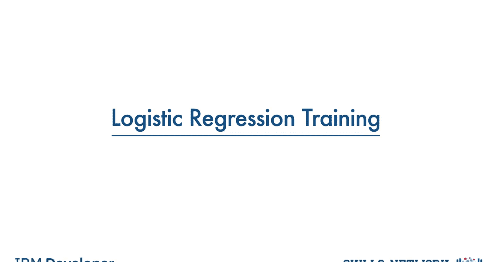
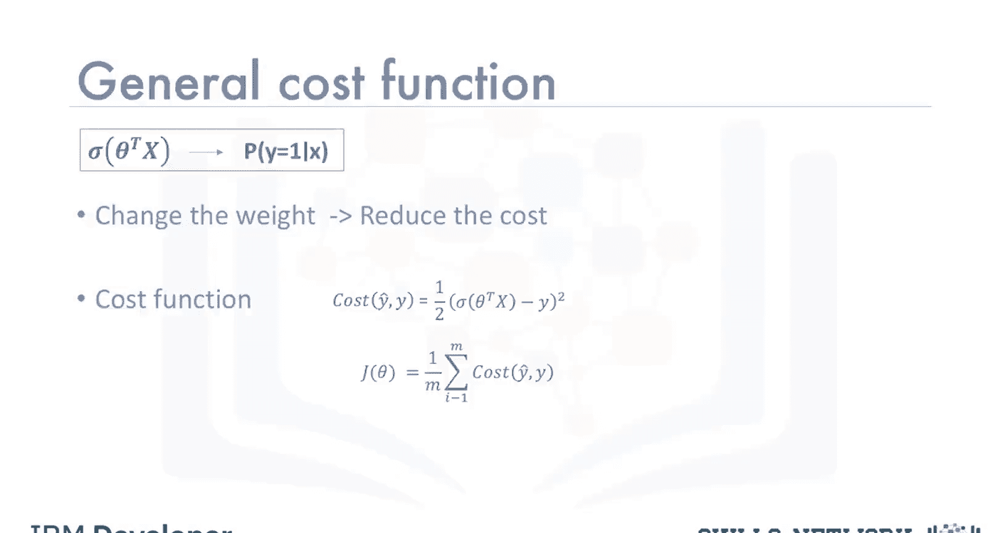
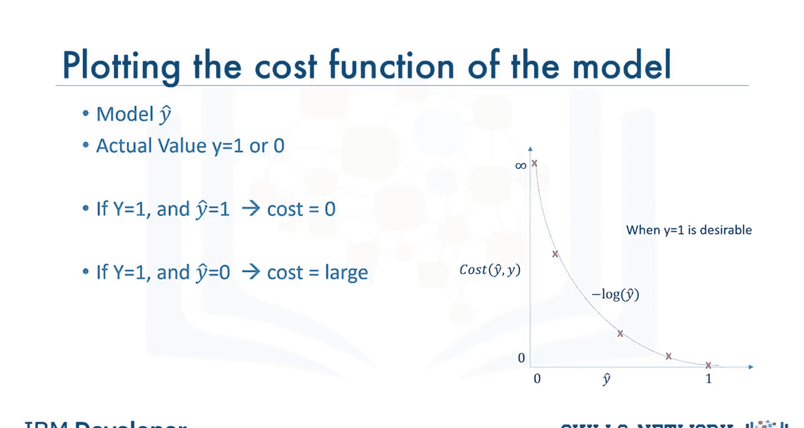
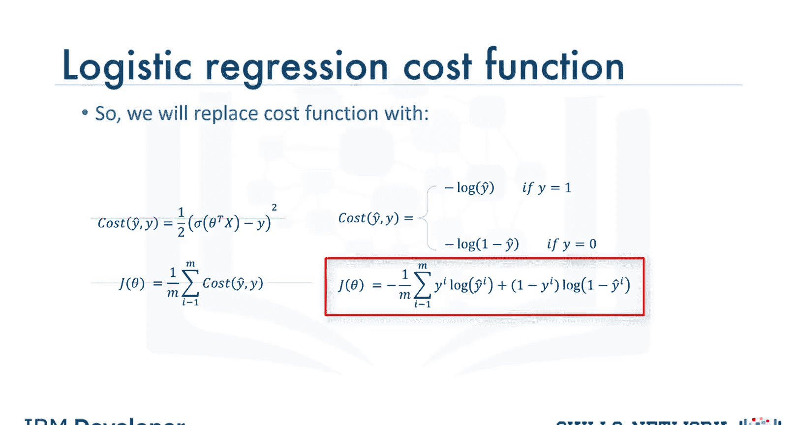
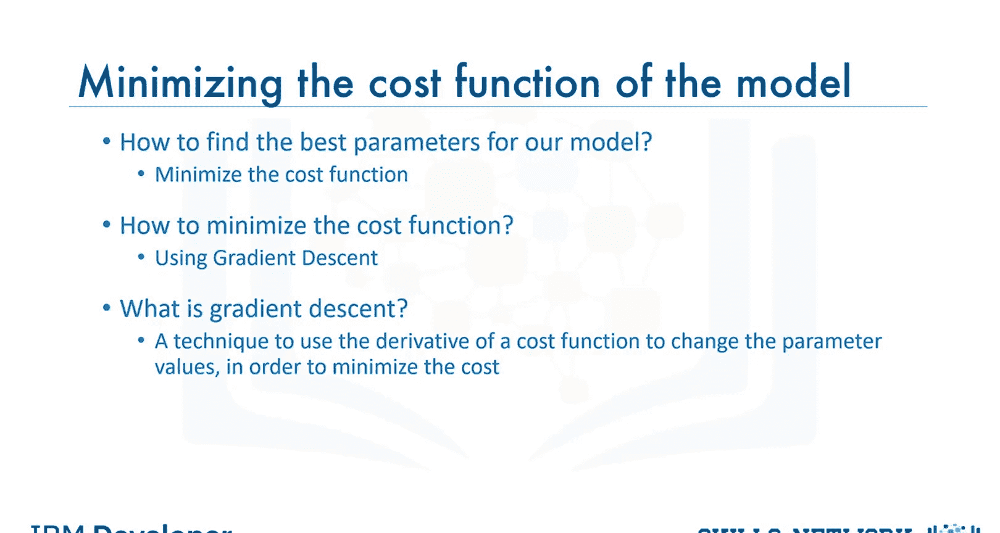
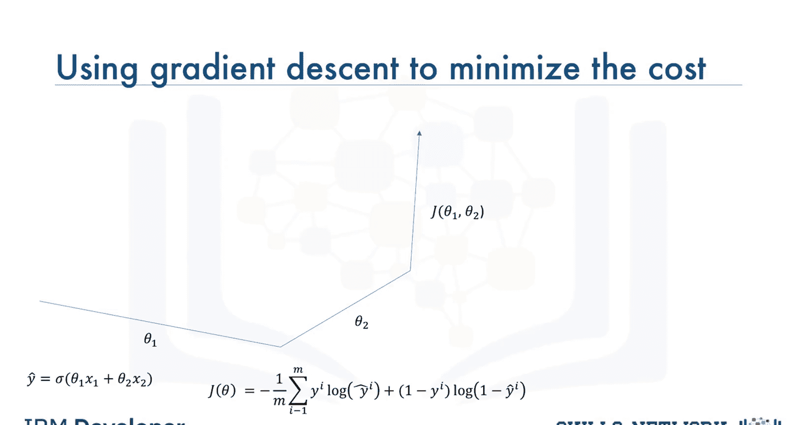
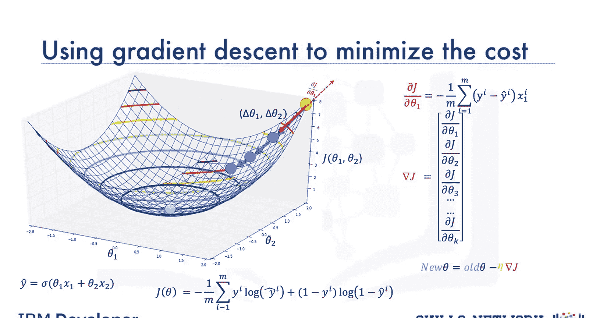
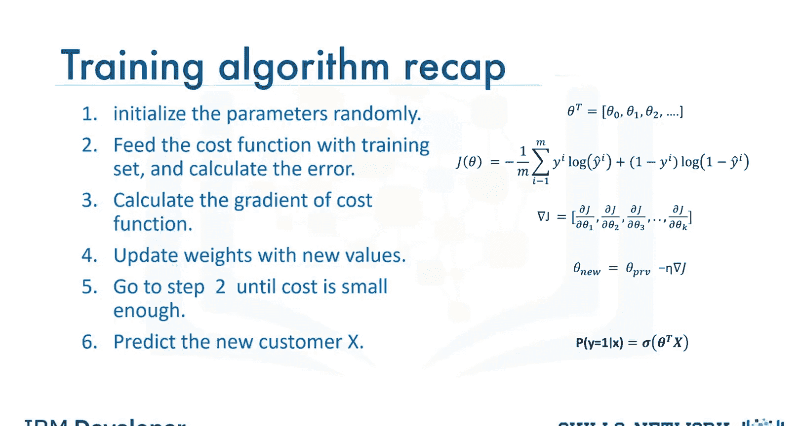

# 生成式人工智能工程：075：逻辑回归训练 🧠

在本节课中，我们将学习如何训练一个逻辑回归模型。我们将讨论如何调整模型参数以更好地预测结果，并深入探讨逻辑回归中的成本函数和梯度下降法，这是优化模型的核心方法。

## 概述

逻辑回归训练的主要目标是调整模型参数，使其能对数据集中的样本标签做出最佳估计。例如，在客户流失预测问题中，我们希望模型能准确判断客户是否会流失。为了实现这一目标，我们需要理解成本函数与参数之间的关系，并利用梯度下降法来最小化成本。

---

## 成本函数的定义与演变

上一节我们介绍了训练的目标，本节中我们来看看如何量化模型的“错误”，即定义成本函数。

逻辑回归模型的输出是 **Ŷ**，即预测概率。实际标签是 **y**，其值为 0 或 1。成本函数衡量的是预测值 **Ŷ** 与实际值 **y** 之间的差异。

对于单个样本，一个通用的成本计算思路是预测值与实际值的差：
`成本 = Ŷ - y`

为了避免负值并简化求导过程，通常使用其平方的一半作为成本函数：
`成本 = (1/2) * (Ŷ - y)²`

对于整个训练集（例如所有客户），我们需要计算所有样本成本的平均值，这被称为**均方误差**。由于它是参数向量 **θ** 的函数，我们将其表示为 **J(θ)**。

然而，均方误差函数在逻辑回归中难以找到全局最小值点。因此，我们需要一个行为相似但更易于优化的替代成本函数。

以下是理想成本函数应具备的特性：
*   当实际值 **y=1** 时，如果模型预测 **Ŷ** 也接近 1，成本应接近 0；如果 **Ŷ** 接近 0，成本应非常大。
*   当实际值 **y=0** 时，如果模型预测 **Ŷ** 也接近 0，成本应接近 0；如果 **Ŷ** 接近 1，成本应非常大。

**负对数函数** 恰好能满足这些要求。我们可以证明：
*   当 **y=1** 时，成本 = **-log(Ŷ)**
*   当 **y=0** 时，成本 = **-log(1 - Ŷ)**

将两者结合，得到逻辑回归的**交叉熵成本函数**：
`J(θ) = - (1/m) * Σ [ y⁽ⁱ⁾ * log(Ŷ⁽ⁱ⁾) + (1 - y⁽ⁱ⁾) * log(1 - Ŷ⁽ⁱ⁾) ]`
其中，**m** 是样本数量，**Ŷ⁽ⁱ⁾ = σ(θᵀX⁽ⁱ⁾)** 是第 i 个样本的预测概率（σ 是 Sigmoid 函数）。

这个函数会对模型将类别 0 预测为高概率，或将类别 1 预测为低概率的情况进行严厉惩罚。

---

## 梯度下降法：寻找最优参数

我们已经定义了需要最小化的成本函数 **J(θ)**。现在的问题是：如何找到使 **J(θ)** 最小的参数 **θ**？答案是使用**优化算法**，其中最著名有效的方法之一就是**梯度下降法**。

梯度下降法是一种通过迭代寻找函数最小值的通用方法。具体到我们的场景，它是一种利用成本函数的导数来调整参数值、从而最小化成本或误差的技术。

我们可以将模型的参数（例如 **θ₁** 代表“年龄”的权重，**θ₂** 代表“收入”的权重）想象在一个二维平面上。成本 **J** 是这两个参数的函数，因此我们可以将其值绘制在第三维，形成一个类似碗状的曲面，称为**误差曲面**或**误差碗**。我们的目标就是找到这个碗的底部（最低点）。

梯度下降的过程就像蒙眼下山：
1.  **随机起点**：从参数空间的某个随机点（碗壁上的一个点）开始。
2.  **查看坡度**：计算当前点成本函数 **J(θ)** 的**梯度**。梯度是一个向量，其方向指向该点处函数值上升最快的方向，其大小（模长）代表了该方向的陡峭程度。
3.  **向反方向走**：为了下山（减小成本），我们沿着梯度**相反**的方向移动。移动的步长与梯度的大小和另一个超参数**学习率（α）** 有关。
4.  **迭代更新**：用公式表示参数更新规则为：
    `θⱼ := θⱼ - α * (∂J(θ) / ∂θⱼ)`
    对所有参数 **j** 同时进行此操作。学习率 **α** 控制了每一步的步长。
5.  **重复直至收敛**：重复步骤 2-4，每一步都向碗底靠近。随着接近底部（最小值点），坡度变缓，梯度变小，步长也随之自动减小，最终在最小值点附近徘徊。

对于逻辑回归的成本函数，其偏导数 **∂J(θ)/∂θⱼ** 有具体的数学表达式。虽然推导需要微积分知识，但其结果形式简洁，便于计算。在实践中，我们通常直接使用这个公式，而无需每次都重新推导。

---

## 训练算法步骤总结

本节课中我们一起学习了逻辑回归训练的核心思想。最后，让我们通过完整的训练算法步骤来回顾整个过程：

以下是逻辑回归模型梯度下降训练的具体步骤：
1.  **初始化参数**：将参数向量 **θ** 初始化为随机值（或零）。
2.  **计算成本**：使用当前参数 **θ** 和整个训练集数据，通过前向传播计算预测值 **Ŷ**，并代入成本函数公式 **J(θ)** 计算总成本。由于参数是随机的，初始成本通常会很高。
3.  **计算梯度**：计算成本函数 **J(θ)** 关于每个参数 **θⱼ** 的偏导数，得到梯度向量。这一步需要用到所有训练数据。
4.  **更新参数**：使用梯度下降公式 `θⱼ := θⱼ - α * (∂J(θ) / ∂θⱼ)` 更新所有参数。学习率 **α** 需要预先设定。
5.  **迭代循环**：重复步骤 2 到 4。每次迭代后，由于参数朝着减少成本的方向更新，我们期望成本 **J(θ)** 逐渐降低。
6.  **终止训练**：当成本值下降到可接受的阈值，或者达到预设的迭代次数时，停止循环。此时得到的参数 **θ** 就是训练好的模型，可用于对新样本（如新客户）进行流失概率预测。

通过这一系列步骤，逻辑回归模型便从数据中学习到了规律，并能够做出预测。