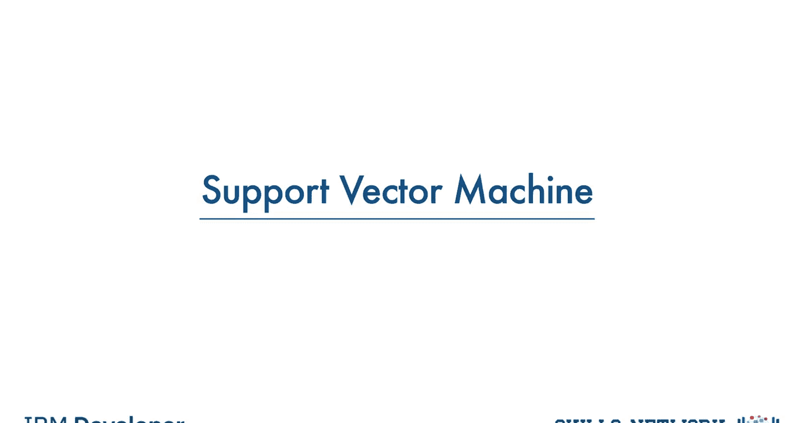
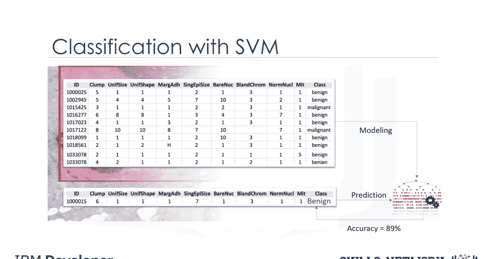
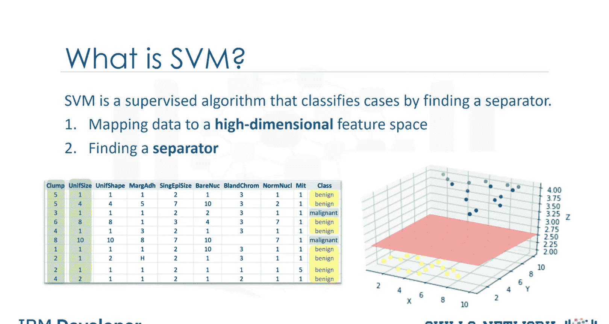
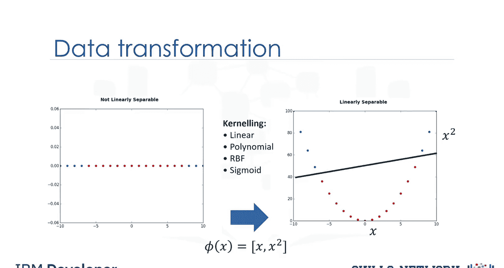
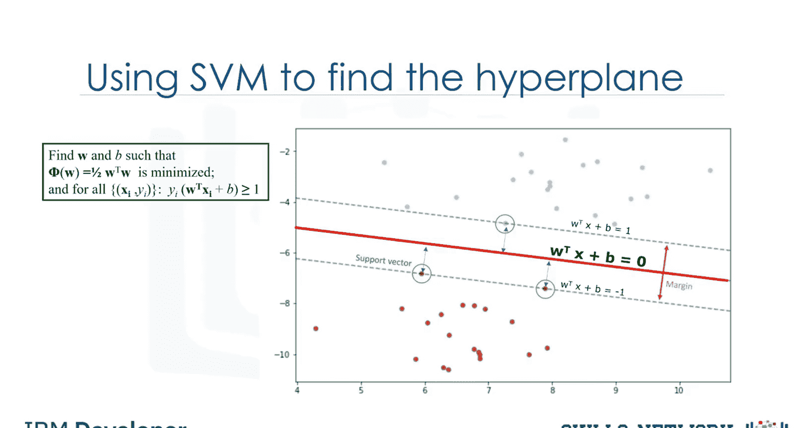
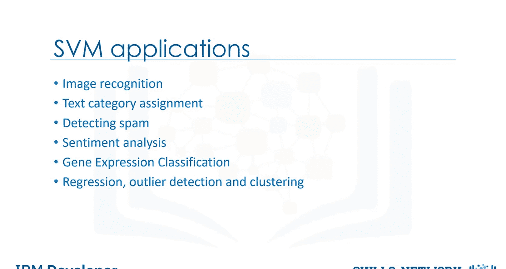

# 生成式人工智能工程：076：支持向量机 📊

在本节课中，我们将学习一种名为支持向量机的机器学习方法，它主要用于分类任务。

## 概述

支持向量机是一种监督学习算法，它通过寻找一个最优分隔超平面来对数据进行分类。即使数据在原始空间中不是线性可分的，SVM也能通过将其映射到高维特征空间来实现有效分类。接下来，我们将详细探讨SVM的工作原理、核心概念及其应用场景。

## 什么是支持向量机？

上一节我们介绍了SVM的基本概念，本节中我们来看看其正式定义。

支持向量机是一种监督算法，它通过寻找一个分隔器来对案例进行分类。SVM首先将数据映射到一个高维特征空间，使得数据点能够被分类，即使数据本身不是线性可分的。然后，算法会为数据估计一个分隔器。

数据应以某种方式转换，使得分隔器可以绘制为一个超平面。例如，考虑下图，它展示了一小组细胞仅基于其单位大小和团块厚度的分布情况。

如图所示，数据点落入两个不同的类别。它代表了一个线性不可分的数据集。这两个类别可以用一条曲线分隔，但不能用一条直线分隔。也就是说，它代表了大多数现实世界数据集中常见的线性不可分情况。

我们可以将这些数据转换到更高维的空间，例如，将其映射到三维空间。转换后，两个类别之间的边界可以由一个超平面来定义。由于我们现在处于三维空间，分隔器显示为一个平面。这个平面可用于分类新的或未知的案例。

因此，SVM算法输出一个最优超平面，用于对新样本进行分类。

## 核心挑战与解决方案

现在，有两个具有挑战性的问题需要考虑。第一，我们如何转换数据，使得分隔器可以绘制为超平面？第二，转换后，我们如何找到最佳或最优化的超平面分隔器？

### 1. 数据转换（核函数）

首先，我们来看看数据转换是如何工作的。为了简化，假设我们的数据集是一维数据；这意味着我们只有一个特征X。如图所示，它不是线性可分的。那么我们能做什么呢？

我们可以将其转换到二维空间。例如，你可以通过使用一个输出为x和x²的函数将x映射到一个新空间，从而增加数据的维度。

现在，数据是线性可分的，对吗？请注意，由于我们处于二维空间，超平面是一条将平面分成两部分的直线，每个类别位于其中一侧。现在我们可以用这条线来分类新案例。

基本上，将数据映射到高维空间的过程称为核化。用于转换的数学函数称为核函数，可以有不同类型，例如线性、多项式、径向基函数和Sigmoid函数。

以下是核函数的主要类型：
*   **线性核**：适用于线性可分数据。
*   **多项式核**：适用于数据分布更复杂的情况。
*   **径向基函数核**：一种非常强大和常用的核，适用于各种非线性问题。
*   **Sigmoid核**：在某些特定情况下使用，如神经网络。

每个函数都有其自身特点、优缺点和方程，但好消息是你不需要深入了解它们，因为大多数函数已在数据科学编程语言的库中实现。此外，由于没有简单的方法知道哪个函数对任何给定数据集表现最好，我们通常会依次选择不同的函数并比较结果。

### 2. 寻找最优超平面

现在我们来看另一个问题，特别是在转换后，我们如何找到正确或最优的分隔器？

基本上，SVM基于寻找一个能最好地将数据集分成两类的最佳超平面的思想，如下图所示。

由于我们处于二维空间，你可以将超平面视为一条线性分隔蓝点和红点的线。作为最佳超平面的一个合理选择是代表两个类别之间最大分离或边界的那个。

因此，目标是选择一个具有尽可能大边界的超平面。最接近超平面的样本称为支持向量。直观地说，只有支持向量对实现我们的目标很重要，因此可以忽略其他训练样本。我们试图以这样的方式找到超平面，使其到支持向量的距离最大。

请注意，超平面和决策边界线都有自己的方程。因此，寻找最优超平面可以使用一个方程来形式化，这涉及更多的数学知识，此处不详细展开。也就是说，超平面是通过使用最大化边界的优化过程从训练数据中学习得到的。与许多其他问题一样，这个优化问题也可以通过梯度下降法解决，这超出了本视频的范围。

因此，算法的输出是直线方程 `y = Wx + b` 中的W和B值。你可以使用这个估计的直线方程进行分类。只需将输入值代入直线方程，然后计算未知点是在直线上方还是下方。如果方程返回值大于0，则该点属于第一类（直线上方），反之亦然。

## 支持向量机的优缺点

了解了SVM如何工作后，我们来总结其优缺点。

支持向量机的两个主要优点是：在高维空间中准确，并且在决策函数中使用了称为支持向量的训练点子集，因此也具有内存效率。

支持向量机的缺点包括：如果特征数量远大于样本数量，该算法容易过拟合。此外，SVM不直接提供概率估计，而这在大多数分类问题中是需要的。最后，如果你的数据集非常大（例如超过1000行），SVM在计算上效率不高。

## 应用场景

最后的问题是，在什么情况下应该使用SVM？

SVM适用于图像分析任务，如图像分类和手写数字识别。SVM在文本挖掘任务中也非常有效，特别是因为它能有效处理高维数据，例如用于检测垃圾邮件、文本分类分配和情感分析。SVM的另一个应用是基因表达数据分类，同样是因为其在处理高维数据分类方面的强大能力。SVM也可用于其他类型的机器学习问题，如回归、异常检测和聚类。关于这些特定问题的更多探索，留给你自己去研究。

## 总结

本节课中我们一起学习了支持向量机。我们了解到SVM是一种强大的分类算法，它通过核函数将数据映射到高维空间，并寻找具有最大边界的最优超平面来分隔不同类别的数据。我们探讨了其核心概念、工作原理、优缺点以及典型的应用场景。掌握SVM是理解现代机器学习分类技术的重要一步。

