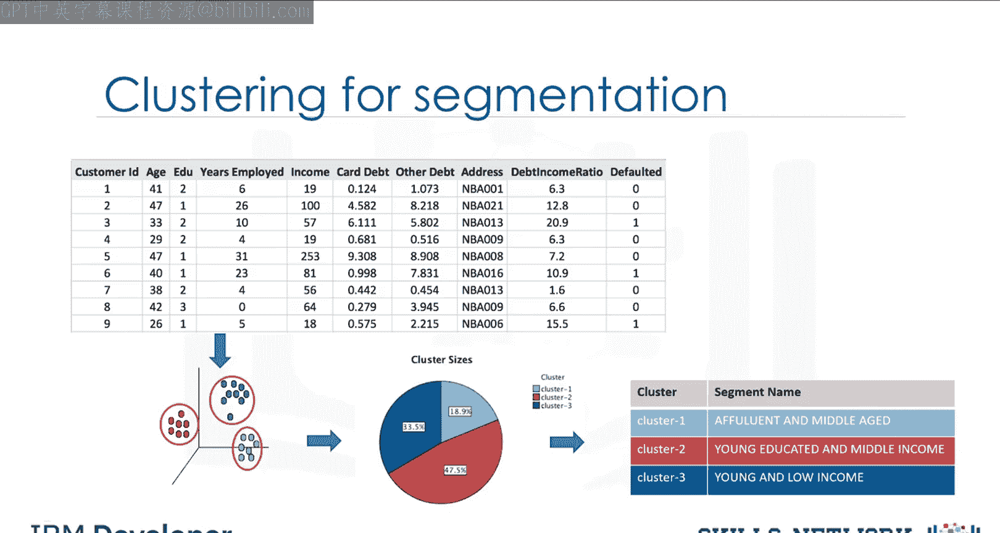
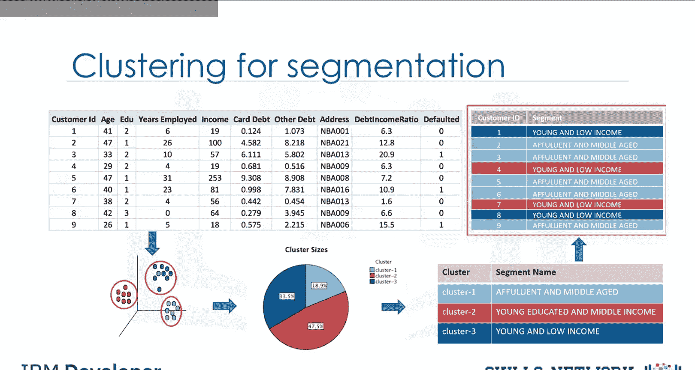
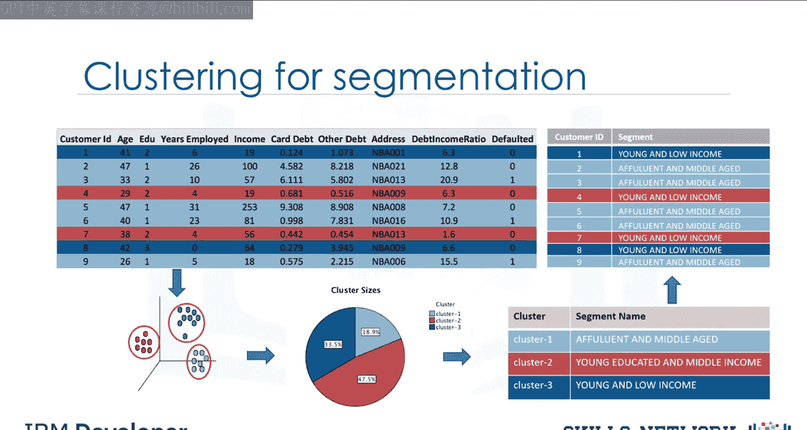
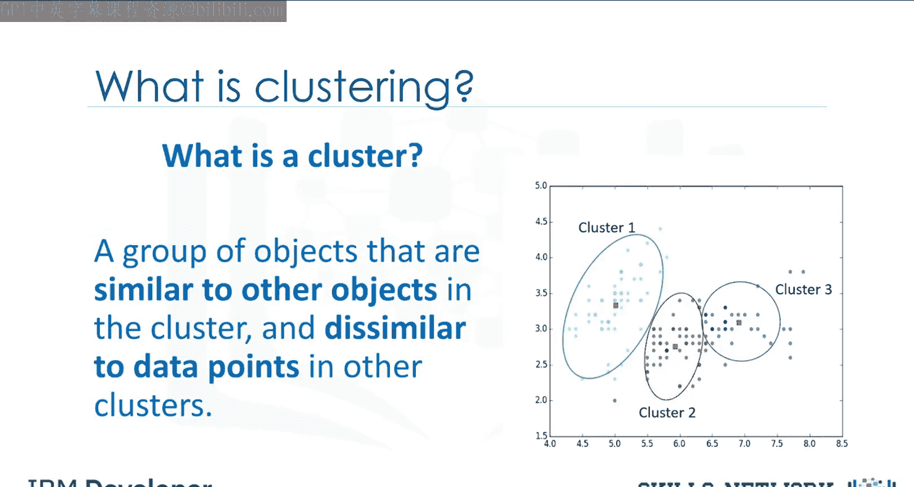
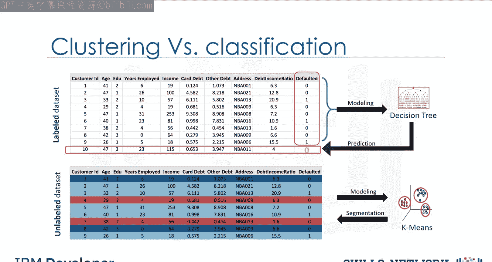
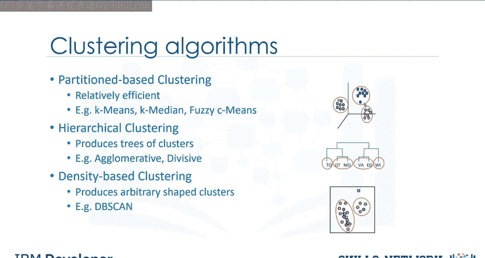

# 生成式人工智能工程：077：聚类简介 🧩

在本节课中，我们将对聚类分析进行一个高层次的介绍，涵盖其基本概念、应用场景以及不同类型的聚类算法。

## 概述

想象一下，你有一个客户数据集，需要基于这些历史数据进行客户细分。客户细分是根据相似特征将客户群体划分为不同组别的实践。这是一项重要的商业策略，因为它允许企业针对特定客户群体，从而更有效地分配营销资源。

## 什么是客户细分？

客户细分的过程通常不适用于处理大量且多样的数据。因此，需要一种分析方法来从大型数据集中推导出细分群体。

以下是客户细分的几个关键点：
*   客户可以根据年龄、性别、兴趣、消费习惯等多个因素进行分组。
*   核心要求是利用现有数据来理解和识别客户之间的相似性。

## 如何使用聚类进行细分？

让我们学习如何根据客户共享的特征将他们划分为不同的类别。用于客户细分最常用的方法之一是聚类。

聚类可以**无监督地**根据客户之间的相似性对数据进行分组。它会将你的客户划分为互斥的组别，例如三个簇。每个簇内的客户在人口统计特征上彼此相似。

现在，我们可以根据每个簇的共同特征为其创建画像。例如：
*   第一组由富裕且中年的客户组成。
*   第二组由年轻、受过教育且中等收入的客户组成。
*   第三组包括年轻且低收入的客户。

最后，我们可以将数据集中的每个个体分配到这些客户组或细分市场中的一个。

现在，想象一下将这个细分后的数据集与客户从你公司购买产品或服务的数据集进行交叉连接。这些信息将极大地帮助理解和预测不同产品之间，个体客户偏好和购买行为的差异。

实际上，掌握这些信息将使你的公司能够为每个细分市场开发高度个性化的体验。

## 聚类的定义与应用

客户细分是聚类的一个流行应用。聚类分析在不同领域还有许多其他应用。

所以，让我们先定义聚类，然后再看看其他应用。

聚类意味着在数据集中**无监督地**寻找簇。那么，什么是簇？一个簇是数据集中一组数据点或对象，它们与组内的其他对象相似，而与其他簇中的数据点不同。

现在的问题是，聚类和分类有什么区别？让我们再看一下客户数据集。

分类算法预测的是**类别标签**。

这意味着将实例分配到预定义的类别中，例如“违约”或“非违约”。举例来说，如果分析师想分析客户数据以了解哪些客户可能违约付款，她会使用带标签的数据集作为训练数据，并应用决策树、支持向量机或逻辑回归等分类方法来预测新客户或已知客户的违约情况。

一般来说，分类是一种**监督学习**，其中每个训练数据实例都属于一个特定的类别。

然而，在聚类中，数据是**无标签**的，过程是**无监督**的。例如，我们可以使用K均值等聚类算法，根据客户是否共享年龄、教育程度等相似属性，将相似客户分组并分配到不同的簇中。

## 聚类的行业应用

虽然我会给出一些不同行业的例子，但希望你能思考更多聚类的应用场景。

以下是聚类在不同领域的应用：
*   **零售业**：用于根据客户人口统计特征发现客户之间的关联，并利用该信息识别不同客户群体的购买模式。此外，也可用于推荐系统中，寻找相似物品或相似用户群，并利用协同过滤向客户推荐书籍或电影等。
*   **银行业**：分析师通过发现正常交易的簇来寻找信用卡欺诈使用的模式。同时，他们也使用聚类来识别客户群，例如区分忠诚客户与流失客户。
*   **保险业**：用于理赔分析中的欺诈检测，或根据客户细分评估特定客户的保险风险。
*   **出版传媒业**：用于根据新闻内容自动分类或标记新闻，然后进行聚类，以便向读者推荐相似的新闻文章。
*   **医学**：可用于根据相似特征描述患者行为，从而为不同疾病识别成功的医疗方案。
*   **生物学**：用于对具有相似表达模式的基因进行分组，或对遗传标记进行聚类以识别亲缘关系。

环顾四周，你可以发现聚类的许多其他应用。但总的来说，聚类可用于以下目的之一：
*   **探索性数据分析**。
*   **摘要生成或规模缩减**。
*   **异常值检测**，尤其用于欺诈检测或噪声去除。
*   **在数据集中查找重复项**。
*   作为**预测、其他数据挖掘任务**的预处理步骤，或作为复杂系统的一部分。

## 聚类算法类型

让我们简要了解一下不同的聚类算法及其特点。

上一节我们介绍了聚类的广泛应用，本节中我们来看看实现这些应用的不同技术路径。

以下是主要的聚类算法类型：
*   **基于划分的聚类**：这类算法产生类似球形的簇，例如 **K均值**、K中值或模糊C均值。这些算法相对高效，适用于中型和大型数据库。
*   **层次聚类**：这类算法产生簇的树状结构，例如凝聚型和分裂型算法。这类算法非常直观，通常适用于小规模数据集。
*   **基于密度的聚类**：这类算法产生任意形状的簇。在处理空间聚类或数据集中存在噪声时尤其有效，例如 **DBSCAN** 算法。

## 总结

本节课中，我们一起学习了聚类分析的基础知识。我们首先通过客户细分的例子理解了聚类的核心概念，即无监督地将相似数据点分组。我们明确了聚类与分类的区别：分类是监督学习，预测预定义标签；聚类是无监督学习，发现数据内在结构。接着，我们探讨了聚类在零售、金融、医疗等多个行业的实际应用。最后，我们简要介绍了基于划分、层次和基于密度等不同类型的聚类算法及其适用场景。掌握这些基础知识是进一步学习和应用更高级聚类技术的第一步。

