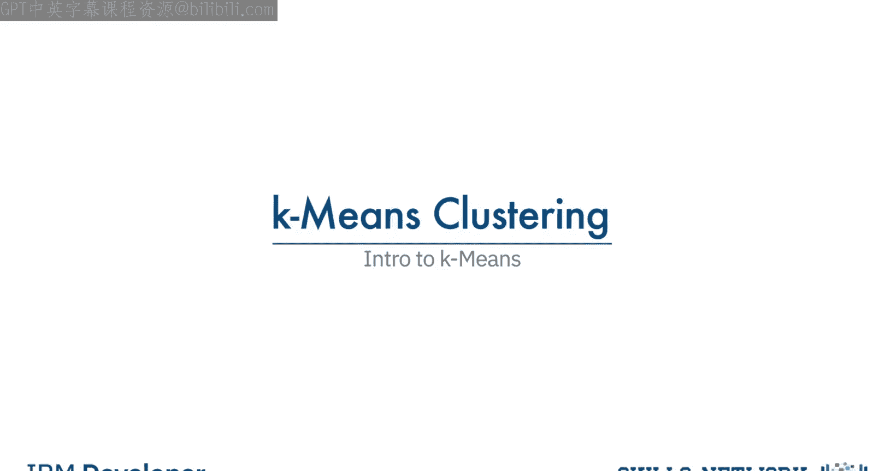
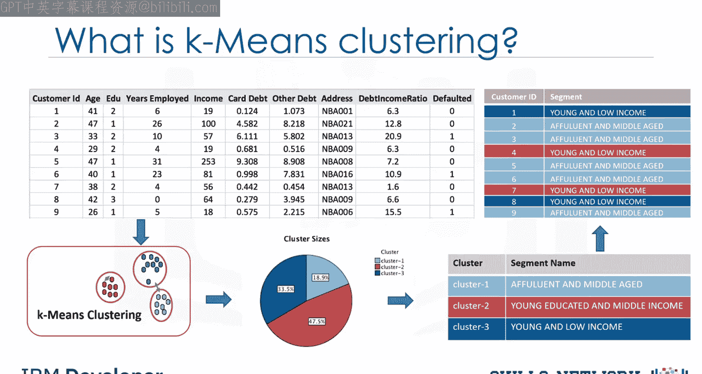
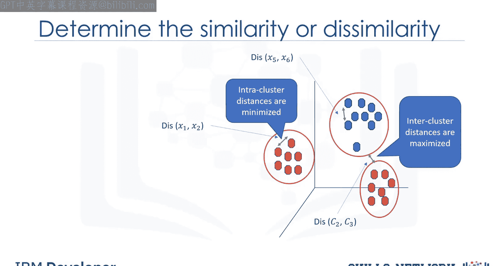
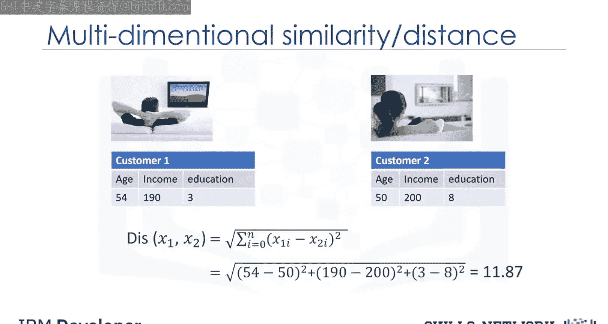
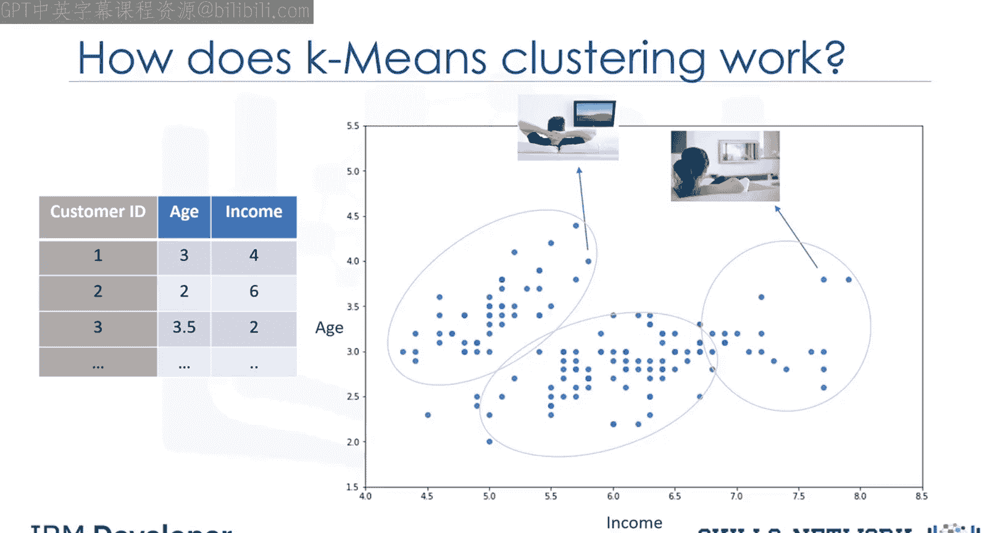
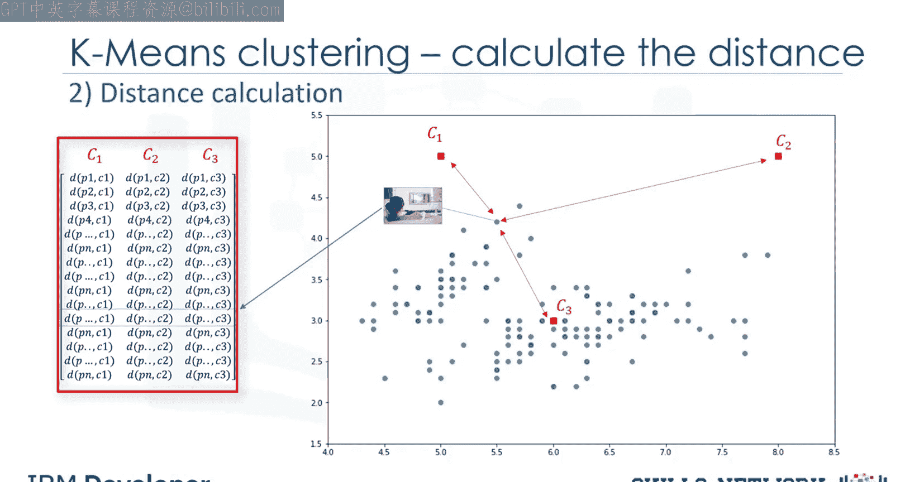
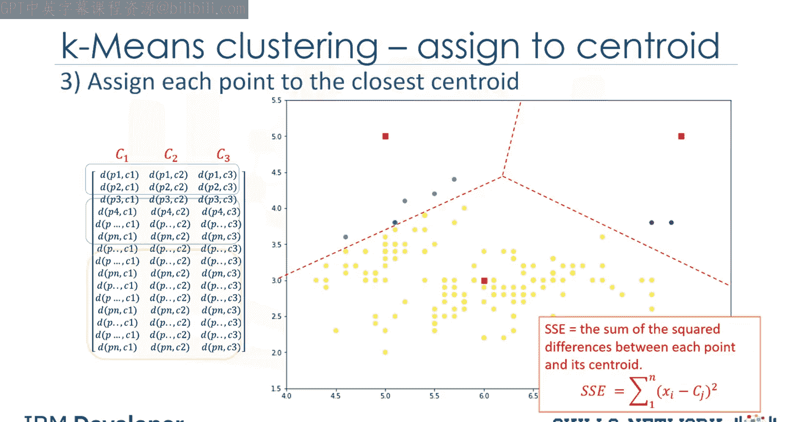
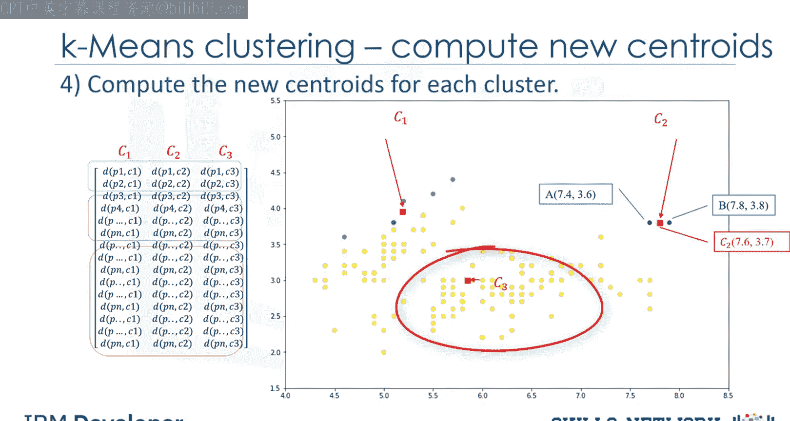
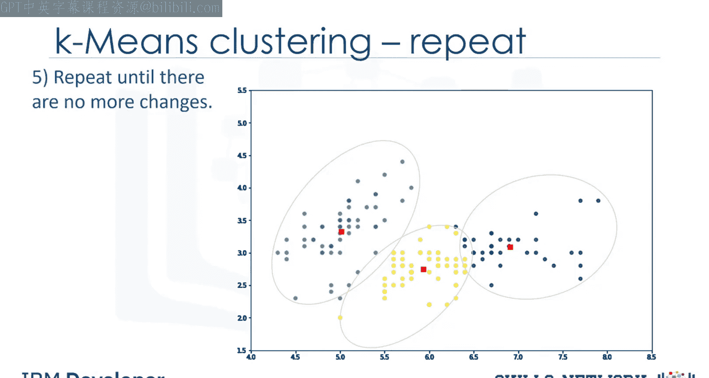

# 生成式人工智能工程：078：K均值聚类简介 🎯

在本节课中，我们将要学习K均值聚类算法。这是一种无监督学习技术，常用于客户细分等任务，能够根据数据点的相似性将其分组。

---

## 什么是K均值聚类？🤔

想象你有一个客户数据集，需要基于这些历史数据进行客户细分。客户细分是指将客户群划分为具有相似特征的个体组。K均值聚类就是可用于此目的的算法之一。

K均值能够以无监督的方式，仅根据客户之间的相似性对数据进行分组。

让我们更正式地定义这项技术。

---

## 聚类算法的类型与K均值的定位 📊

聚类算法有多种类型，例如划分式、层次式或基于密度的聚类。K均值属于**划分式聚类**。这意味着它将数据划分为K个**非重叠**的子集或簇，且这些簇没有内部结构或标签。这表明它是一种**无监督算法**。

一个簇内的对象非常相似，而不同簇间的对象则非常不同或不相似。可以看到，使用K均值需要找到相似的样本，例如相似的客户。

现在我们面临几个关键问题：首先，在聚类中如何找到样本的相似性？其次，如何衡量两个客户在人口统计特征上的相似程度？

---

## 相似性与距离度量 📏

虽然K均值的目标是形成这样的簇：相似样本进入同一个簇，不相似样本落入不同簇。但可以证明，我们可以使用**不相似性度量**来代替相似性度量。换句话说，传统上使用样本彼此间的**距离**来塑造簇。

因此可以说，K均值试图**最小化簇内距离**，并**最大化簇间距离**。现在的问题是，如何计算两个样本（例如两个客户）之间的不相似性或距离？

假设我们有两个客户，称为客户1和客户2。再假设每个客户只有一个特征，即年龄。我们可以轻松地使用一种特定的闵可夫斯基距离来计算这两个客户的距离，即**欧几里得距离**。

**公式：**
对于一维特征（如年龄），两点 `x1` 和 `x2` 的欧几里得距离为：
`distance = |x1 - x2|`

如果特征不止一个呢？例如，同时有年龄和收入。我们仍然可以使用相同的公式，但这次是在二维空间中。同样，我们可以将相同的距离公式用于多维向量。当然，我们必须对特征集进行**归一化**，以获得准确的不相似性度量。

还有其他不相似性度量也可用于此目的，但这高度依赖于**数据类型**以及进行聚类的**领域**。例如，你可以使用欧几里得距离、余弦相似度、平均距离等。

实际上，相似性度量高度控制着簇的形成方式，因此建议理解数据的领域知识和特征的数据类型，然后选择有意义的距离度量。

---

## K均值聚类的工作原理 🔄

现在，让我们看看K均值聚类是如何工作的。为了简单起见，假设我们的数据只有两个特征：客户的年龄和收入，这意味着它是一个二维空间。我们可以使用散点图显示客户的分布，Y轴表示年龄，X轴表示收入。

我们尝试基于这两个维度将客户数据聚类到不同的组或簇中。

以下是K均值算法的核心步骤：

### 第一步：确定簇的数量（K值）并初始化质心

K均值算法的核心概念是，它为每个簇随机选取一个中心点。这意味着我们必须初始化 **K**，它代表簇的数量。本质上，在数据集中确定簇的数量或K值是K均值中的一个难题，我们稍后会讨论。现在，让我们为我们的样本数据集设 K=3。这就像我们有三个代表簇的点。

这三个数据点称为簇的**质心**，其维度应与客户特征集的特征数量相同。

选择这些质心有两种方法：
1.  我们可以从数据中随机选择三个观测值，并将这些观测值作为初始均值。
2.  我们可以创建三个随机点作为簇的质心，这是我们的选择，在图中用红色显示。

### 第二步：将每个点分配到最近的质心

在初始化步骤（即定义每个簇的质心）之后，我们必须将每个客户分配到最近的中心。为此，我们必须计算每个数据点（在我们的例子中是每个客户）到质心点的距离。如前所述，根据数据的性质和聚类使用的目的，可以使用不同的距离度量来将项目分配到簇中。因此，你将形成一个矩阵，其中每一行代表一个客户到每个质心的距离，这称为**距离矩阵**。

K均值聚类的主要目标是**最小化数据点与其所属簇质心的距离**，并**最大化与其他簇质心的距离**。所以在这一步，我们必须找到每个数据点最近的质心。我们可以使用距离矩阵来找到数据点最近的质心。找到每个数据点最近的质心后，我们将每个数据点分配到该簇；换句话说，所有客户将根据它们与质心的距离落入一个簇。

我们可以轻易地说，这不会产生好的簇，因为质心一开始是随机选择的。实际上，模型会有很高的**误差**。这里的误差是每个点与其质心的总距离。它可以表示为**簇内平方和误差**。直观上，我们试图减少这个误差。这意味着我们应该以这样的方式塑造簇：一个簇的所有成员与其质心的总距离最小化。

### 第三步：重新计算质心位置

那么，如何将其转变为误差更小的更好簇呢？我们移动质心。在下一步中，每个簇中心将更新为其簇内数据点的**均值**。实际上，每个质心根据其簇成员移动。换句话说，三个簇中每个簇的质心成为新的均值。

**示例：**
如果点A的坐标是 (7.4, 3.6)，点B的特征是 (7.8, 3.8)，那么这个包含2个点的簇的新质心将是它们的平均值，即 (7.6, 3.7)。

### 第四步：迭代直至收敛

现在我们有了新的质心。正如你所猜测的，我们将再次计算所有点到新质心的距离。点被重新分配，质心再次移动。这个过程一直持续到质心不再移动为止。请注意，每当质心移动时，都需要重新测量每个点到质心的距离。

---

## 算法特性与注意事项 ⚠️

是的，K均值是一种**迭代算法**，我们必须重复步骤2到4，直到算法**收敛**。在每次迭代中，它将移动质心，计算到新质心的距离，并将数据点分配到最近的质心；这会产生误差最小或最密集的簇。

然而，由于它是一种**启发式算法**，不能保证它会收敛到**全局最优解**，结果可能依赖于初始簇。这意味着该算法保证会收敛到一个结果，但该结果可能是一个**局部最优解**，即不一定是可能的最佳结果。

为了解决这个问题，通常的做法是使用不同的起始条件（即随机化的起始质心）多次运行整个过程。这可能会产生更好的结果。由于该算法通常非常快，多次运行不会有任何问题。

---

## 总结 📝

本节课中，我们一起学习了K均值聚类算法。我们了解到它是一种无监督的划分式聚类方法，通过迭代优化质心位置来最小化簇内距离。其核心步骤包括：确定K值并初始化质心、分配点到最近质心、重新计算质心位置以及迭代直至收敛。同时，我们也认识到该算法可能收敛于局部最优解，因此实践中常通过多次随机初始化来寻求更好的聚类结果。