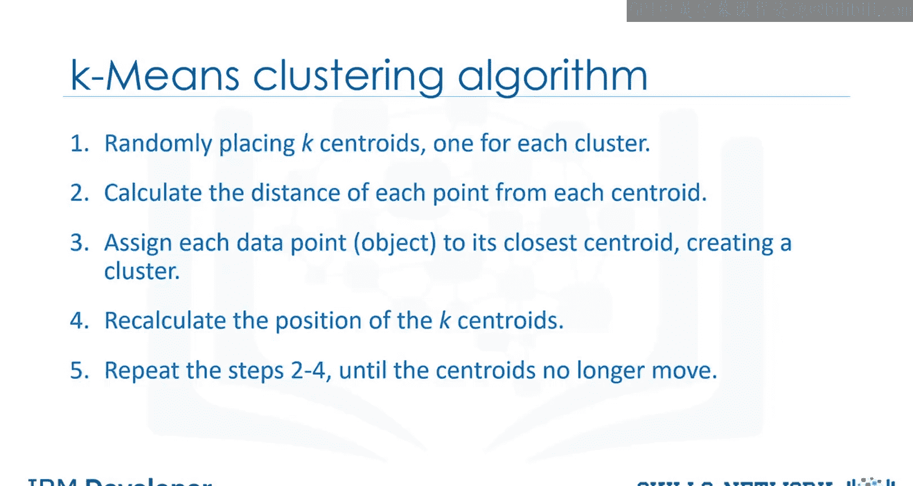
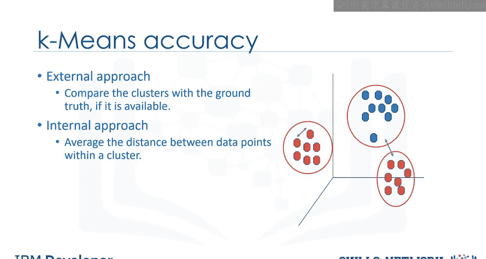
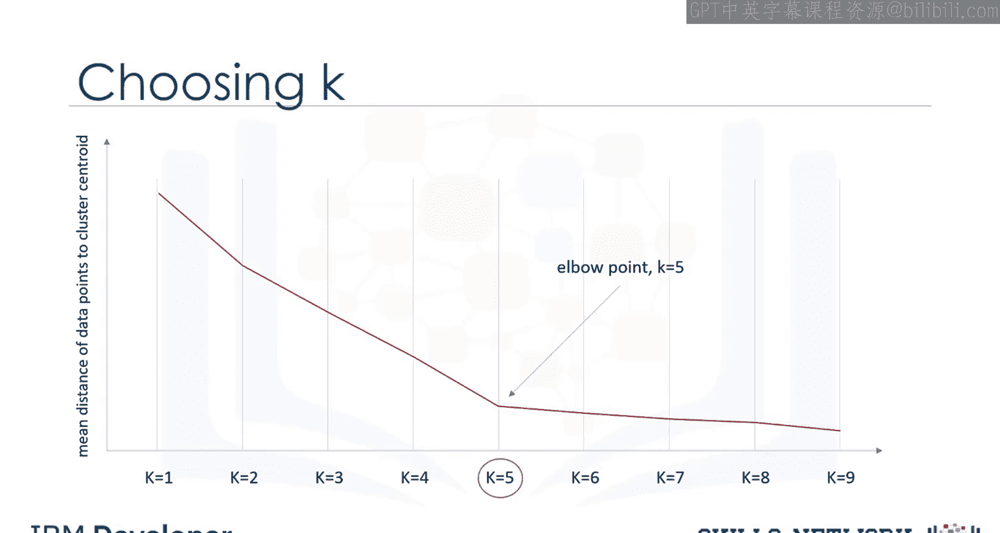
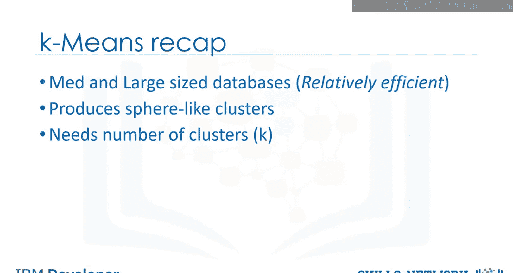

# 生成式人工智能工程：079：更多关于K均值 🎯

在本节课中，我们将深入探讨K均值聚类算法的准确性评估方法及其核心特性。我们将学习如何定义算法步骤、评估聚类效果，并解决确定最佳聚类数K这一关键问题。

---

## 算法步骤详解

上一节我们介绍了K均值的基本概念，本节中我们来看看其具体的工作步骤。

K均值算法通过以下步骤运行：
1.  随机放置K个质心，每个质心代表一个簇。质心初始位置相距越远越好。
2.  计算每个数据点到各个质心的距离。通常使用**欧几里得距离**（Euclidean distance）进行度量，其公式为：
    `distance = sqrt((x2 - x1)^2 + (y2 - y1)^2)`
    需要注意的是，也可以使用其他类型的距离度量方式，而不仅仅是欧几里得距离。欧几里得距离因其普遍性而被广泛采用。
3.  将每个数据点分配给距离它最近的质心，从而形成初始分组。
4.  在所有数据点都被分类到某个组后，重新计算K个质心的位置。新质心的位置由其所在组内所有点的**均值**决定。
5.  重复步骤2到4，直到质心的位置不再发生变化。

---

## 如何评估聚类效果

了解了算法如何运行后，我们面临一个问题：如何评估K均值形成的聚类质量？换句话说，如何计算K均值聚类的准确性？

一种方法是在有真实标签（ground truth）的情况下，将聚类结果与真实标签进行比较。然而，由于K均值是一种无监督算法，在现实问题中通常没有可用的真实标签。

尽管如此，我们仍然可以基于K均值算法的目标来衡量每个簇的“坏”程度。常用的评估指标是**簇内平均距离**，即一个簇内所有数据点之间的平均距离。此外，数据点到其所属簇质心的平均距离也可以作为聚类算法的误差度量。

---

## 确定最佳聚类数K

在数据聚类中，确定数据集中的簇数量（即K均值中的K值）是一个常见难题。K的正确选择通常是模糊的，因为它高度依赖于数据集中点的分布形状和尺度。

有一些方法可以解决这个问题，其中一种常用技术是：针对不同的K值运行聚类算法，并观察聚类的准确性指标。这个指标可以是数据点与其簇质心之间的平均距离，它反映了簇的密集程度，或者说我们最小化聚类误差的程度。

通过观察该指标随K值变化的情况，我们可以找到最佳的K值。但问题是，随着簇数量K的增加，质心到数据点的距离总会减小。这意味着增加K总会降低误差值。

因此，我们将该指标的值作为K的函数绘制成图，并确定**肘点**——即下降速率发生急剧变化的拐点。这个肘点对应的K值就是聚类的合适数量。这种方法被称为**肘部法则**。

---

## 总结与回顾

本节课中我们一起学习了K均值聚类的更多细节。让我们来回顾一下K均值的关键特性：
*   K均值是一种基于划分的聚类算法，对中型和大型数据集具有相对较高的效率。
*   它倾向于产生类球形的簇，因为簇是围绕质心形成的。
*   它的一个缺点是必须预先指定簇的数量K，而这并非易事。

通过掌握算法步骤、评估方法和确定K值的技巧，你将能更有效地应用K均值算法解决实际问题。