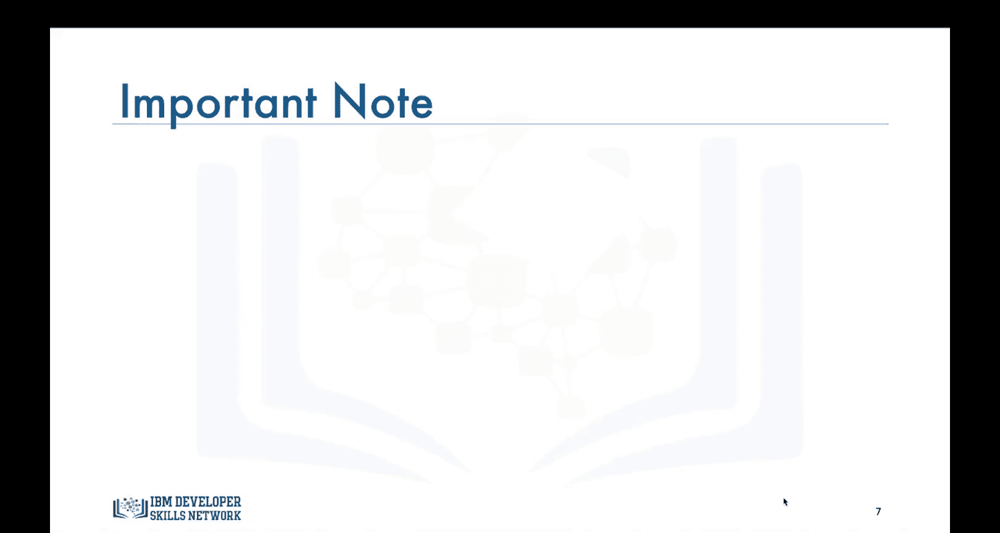
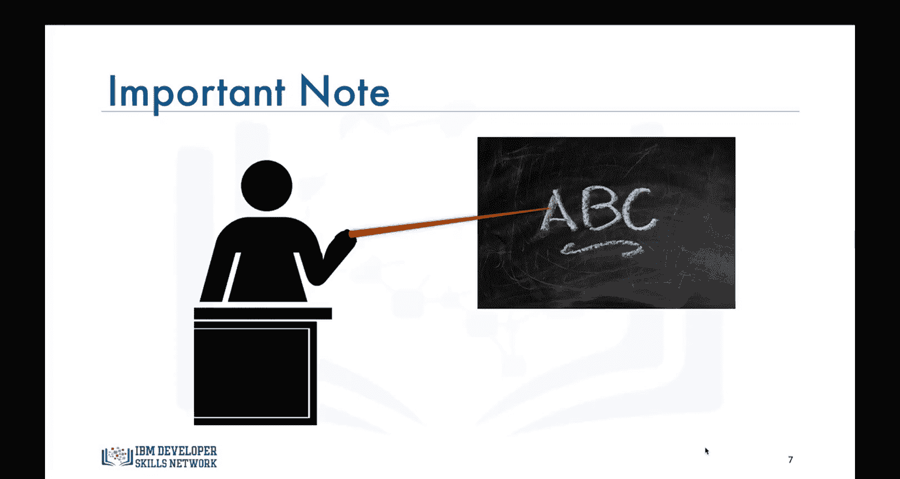
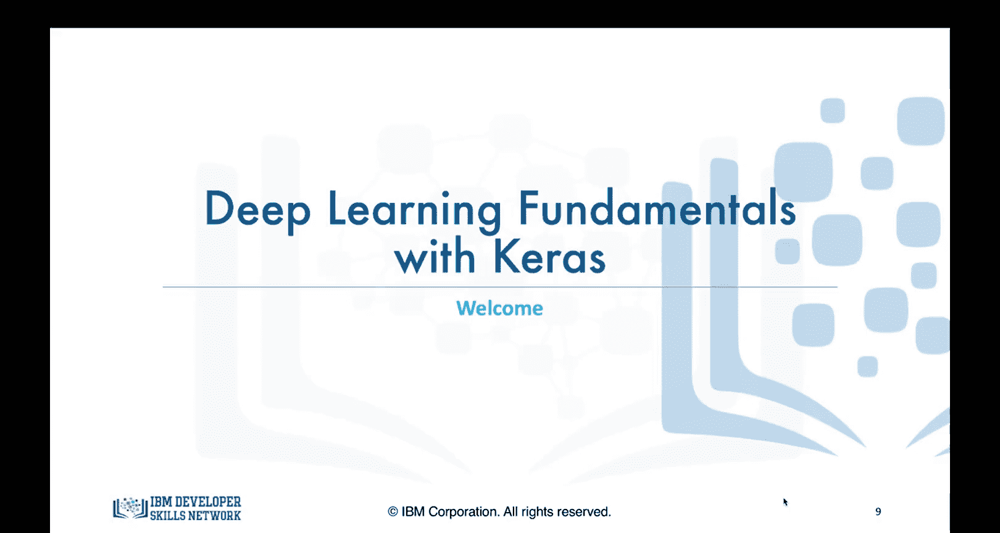

# 深度学习基础：第0章：欢迎与课程概述 🎉

在本节课中，我们将要学习这门深度学习基础课程的总体安排、核心模块以及学习目标。课程旨在为零基础的学员提供清晰的入门路径。

大家好，欢迎来到CAS Co.的深度学习基础课程。我是Alex Eelson，本课程的讲师。在这门入门课程中，我将尝试教授数据科学领域最热门的话题之一——深度学习的基础知识。本课程包含四个模块，预计可在四周内完成。

## 课程模块概览

以下是本课程四个核心模块的简要介绍。

*   **模块一：动机与基础**
    我们将探讨深度学习令人兴奋的应用，以激发学习兴趣。同时，我们将简要介绍大脑中的神经元与神经网络，理解它们如何启发人工神经网络。本模块的重点是学习人工神经网络的前向传播过程。

*   **模块二：神经网络如何学习**
    我们将继续学习人工神经网络，并聚焦于其学习机制。核心内容包括理解梯度下降算法以及各种激活函数的作用。

*   **模块三：深度学习库入门**
    我们将学习一些最流行的深度学习库，即Keras、PyTorch和TensorFlow。重点是学习如何使用Keras库为回归和分类问题构建模型。

*   **模块四：监督与非监督网络**
    我们将学习监督式和非监督式深度神经网络，主要包括卷积神经网络、循环神经网络和自编码器。我们还将学习如何使用Keras库构建一个卷积神经网络。

## 重要说明与课程定位

在结束本视频前，我想做一个重要说明。

> 在本课程中，我决定专注于深度学习的基础知识。深度学习如今是一个广阔的领域，并且正在快速持续地发展。因此，这个领域对许多人来说可能令人生畏。所以，我为本课程设定的对象是那些对深度学习或神经网络真正一无所知的人。

如果你已经大量使用过人工神经网络和深度学习模型，那么这门课程可能不适合你。你仍然可以将其作为复习课程，但可能不会学到太多新知识。虽然我会向你介绍深度学习中的一些高级主题，但我只会提供它们的简化版本。我在此澄清这一点，是为了在课程一开始就设定正确的期望。

现在，再次欢迎大家，让我们开始学习吧。