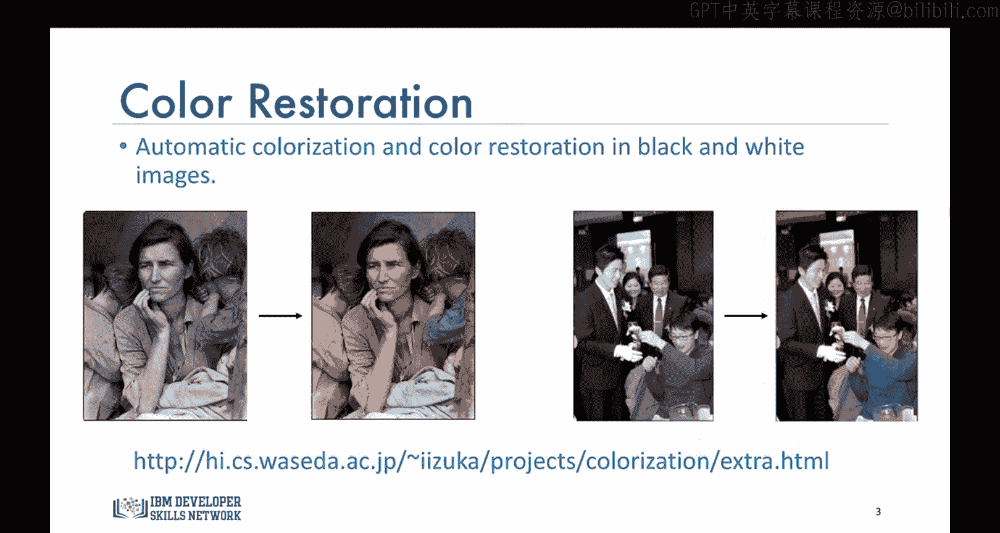
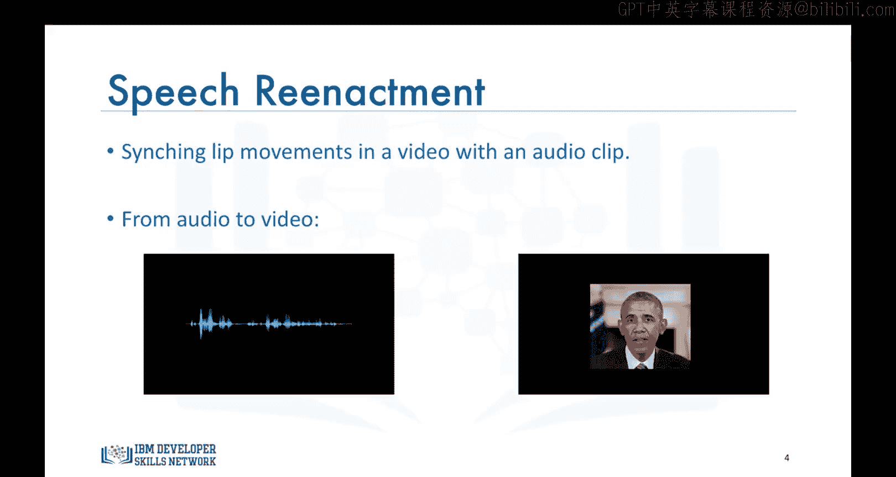
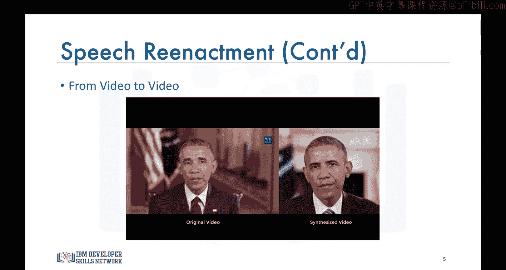
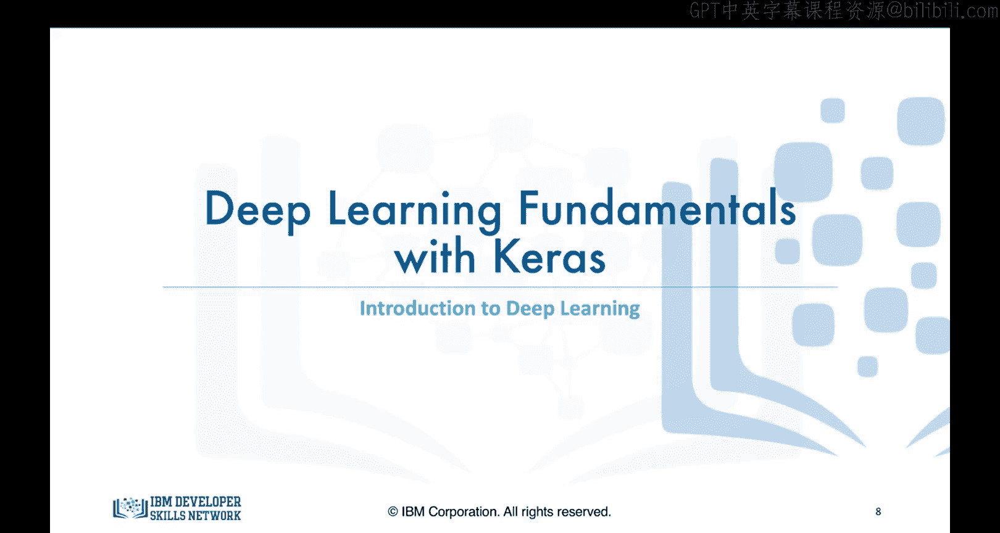

# 生成式人工智能工程：081：深度学习简介

在本节课中，我们将开始探讨深度学习，并了解该领域的最新进展如何催生出令人惊叹的应用。

深度学习无疑是数据科学中最热门的话题之一。尤其是在深度学习的帮助下，涌现出大量令人着迷的项目，其中许多在十多年前还被认为是几乎不可能实现的。因此，深度学习领域充满了巨大的热情。本节中，我将分享一些近期令人惊叹的深度学习应用，希望能进一步激发你对深度学习的兴趣和动力。

以下是几个具体的应用示例：

*   **图像着色**：该应用能将给定的灰度图像自动转换为彩色图像。日本的一组研究人员利用**卷积神经网络**构建了一个系统，可以处理如下的灰度图像，并通过着色为其注入生机。你可以在视频下方的链接中找到更多精彩案例。
    

*   **语音驱动口型合成**：这是一个非常酷但也令人不安的应用。它能将一段音频与视频合成，并使视频中人物的口型与音频中的声音和单词同步。过去有许多构建此类系统的尝试，但大多效果不佳。最近，华盛顿大学的一组研究人员通过在一个人的大量视频数据上训练**循环神经网络**，构建了首个能生成逼真结果的系统。他们的案例研究对象是美国前总统巴拉克·奥巴马。让我们看一个例子：这是一段奥巴马演讲的音频片段。
    > “It's been less than a week since the deadliest mass shooting in American history.”
    这段音频被合成到了他另一段演讲的视频中，他的口型与音频中的词语和声音同步。观看视频时，我们几乎无法分辨视频是合成的。
    
    不仅如此，他们的系统还能从一段视频中提取音频，并将另一段视频中的口型与这段提取的音频同步。让我们看一个这样的例子。
    > “Especially our friends who were lesbian, gay, bisexual or transgender. I visited with the families of many of the victims on Thursday, and one thing I told them is that they're not alone.”
    

*   **自动手写生成**：多伦多大学的Alex Graves使用**循环神经网络**设计了一种算法，能够以高度逼真、风格多样的草书笔迹重写给定的信息。你可以输入一些文本，然后选择生成的手写风格，或者让算法随机为你选择。

除了上述应用，深度学习还有许多其他引人入胜的应用场景：

*   **自动机器翻译**：使用**卷积神经网络**实时翻译图像中的文字。
*   **为无声电影自动添加音效**：深度学习模型利用预录制的声音数据库，选择与场景内容最匹配的声音进行播放。
*   **图像中的物体分类**以及**自动驾驶汽车**等流行应用。

在几乎所有上述应用中，你都反复听到了“神经网络”这个词。你可能会问：神经网络不是已经存在很长时间了吗？为什么它们突然开始流行起来，并催生出无穷无尽的应用？

为了回答这个问题，让我们开始学习神经网络和深度学习的具体内容。

本节课中，我们一起了解了深度学习如何通过**卷积神经网络**和**循环神经网络**等模型，在图像着色、语音合成、手写生成等多个领域创造出突破性的应用。这些成就解释了为何深度学习在当下如此备受瞩目。